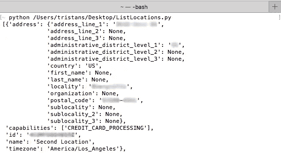

# 使用 Python 列出您的位置

> 原文：<https://medium.com/square-corner-blog/listing-your-locations-with-python-fe1a74dcf303?source=collection_archive---------0----------------------->

## 获取您的位置信息应该是集成中最简单的部分。

> 注意，我们已经行动了！如果您想继续了解 Square 的最新技术内容，请访问我们在 https://developer.squareup.com/blog[的新家](https://developer.squareup.com/blog)

以编程方式列出您的位置对于管理大公司甚至多个公司的应用程序非常重要。以下是如何使用我们的 Python SDK 获得您的位置列表。

## 准备

你需要做的第一件事是确保你有 python 并且安装 [Square 的 Python SDK](https://github.com/square/connect-python-sdk) 。你可以在这里找到安装说明:[https://github.com/square/connect-python-sdk#installation-用法](https://github.com/square/connect-python-sdk#installation--usage)

## 代码

你必须从你的 [Square 开发者门户](https://connect.squareup.com/apps/)用你的访问令牌替换`XXXXXXXXX`。但是您应该能够将上面的代码保存到文件`ListLocations.py`中，然后使用以下命令运行该文件:

```
python ListLocations.py
```

然后，您的位置应打印在此屏幕上:



希望你觉得这篇关于地点列表的帖子有用！请记住，您现在也可以从开发者门户获取您的位置 ID。