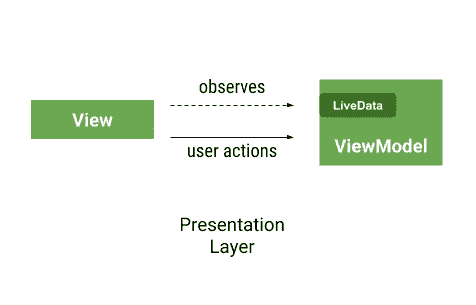
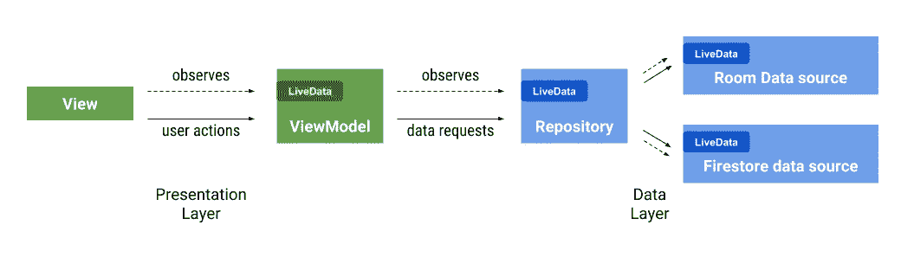
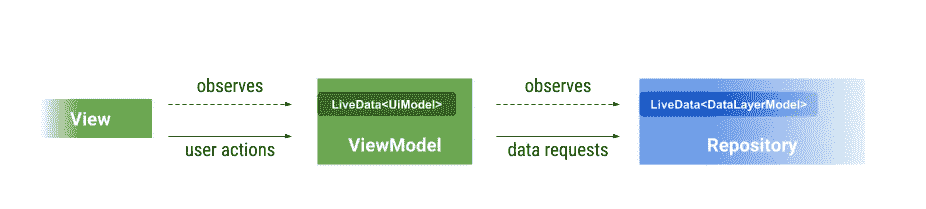
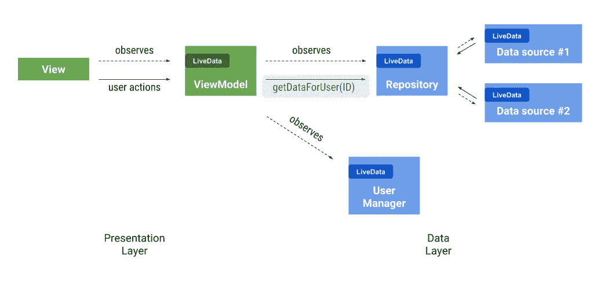
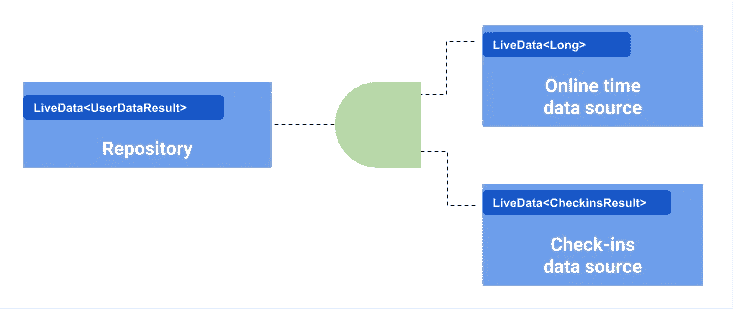
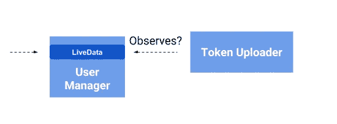
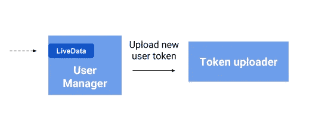

# 视图模型之外的实时数据—使用转换和中介的反应模式实时数据

> 原文：<https://medium.com/androiddevelopers/livedata-beyond-the-viewmodel-reactive-patterns-using-transformations-and-mediatorlivedata-fda520ba00b7?source=collection_archive---------0----------------------->

反应式架构多年来一直是 Android 的热门话题。这一直是 Android 会议的主题，通常用 RxJava 例子来说明(见底部的 Rx 部分)。反应式编程是一种关注数据如何流动和变化传播的范式，它可以简化构建应用程序和显示来自异步操作的数据。

实现一些反应概念的一个工具是 [LiveData](https://developer.android.com/topic/libraries/architecture/livedata) 。这是一个简单的观察，它知道观察者的生命周期。从您的数据源或存储库中公开 LiveData 是使您的架构更具反应性的一种简单方法，但是存在一些潜在的陷阱。

这篇博文将帮助您避免陷阱，并使用一些模式来帮助您使用 LiveData 构建一个更具反应性的架构。

# LiveData 的目的

在 Android 中，活动、片段和视图几乎可以在任何时候被销毁，因此对这些组件之一的任何引用都可能导致泄漏或`NullPointerException`。

LiveData 旨在实现观察者模式，允许视图控制器(活动、片段等)之间的通信。)和 UI 数据的来源(通常是 ViewModel)。使用 LiveData，这种通信更加安全:由于它的生命周期意识，只有在视图处于活动状态时，它才会接收数据。

简而言之，这样做的好处是不需要手动取消 View 和 ViewModel 之间的订阅。

*View-ViewModel interactions*

# 视图模型之外的 LiveData

可观察范式在视图控制器和视图模型之间工作得非常好，因此您可以使用它来观察应用程序的其他组件，并利用生命周期意识。例如:

*   观察[共享优先级](https://developer.android.com/reference/android/content/SharedPreferences.OnSharedPreferenceChangeListener)的变化
*   观察 [Firestore](https://firebase.google.com/docs/firestore/) 中的文档或收藏
*   使用类似 [FirebaseAuth](https://firebase.google.com/docs/auth/) 的身份验证 SDK 观察当前用户
*   观察[房间](https://developer.android.com/topic/libraries/architecture/room)中的一个查询(它支持开箱即用的 LiveData)

这种模式的优点是，因为所有东西都连接在一起，所以当数据发生变化时，UI 会自动更新。

缺点是 LiveData 不像 Rx 那样有一个组合数据流或管理线程的工具包。

在典型应用程序的每一层中使用 LiveData 看起来像这样:

*Typical app architecture using LiveData*

为了在组件之间传递数据，我们需要一种映射和组合的方式。MediatorLiveData 与 Transformations 类中的帮助器一起用于此目的:

*   [转换.地图](https://developer.android.com/reference/android/arch/lifecycle/Transformations.html#map(android.arch.lifecycle.LiveData%3CX%3E,%20android.arch.core.util.Function%3CX,%20Y%3E))
*   [transformations . switch map](https://developer.android.com/reference/android/arch/lifecycle/Transformations.html#switchMap(android.arch.lifecycle.LiveData%3CX%3E,%20android.arch.core.util.Function%3CX,%20android.arch.lifecycle.LiveData%3CY%3E%3E))

> 请注意，当您的视图被销毁时，您不需要拆除这些订阅，因为视图的生命周期会向下游传播到后续的订阅。

# **图案**

## **一对一静态转换—映射**

*The ViewModel observes one type of data and exposes a different one*

在上面的例子中，ViewModel 只是将数据从存储库转发到视图中，并将其转换为 UI 模型。每当存储库有新数据时，ViewModel 只需`map`它:

这个转化很简单。但是，如果用户会发生变化，您需要 switchMap:

## 一对一动态转换—切换图

考虑这个例子:您正在观察一个公开用户的用户管理器，您需要等待他们的 ID，然后才能开始观察存储库。

*The user manager provides the user ID which the repository needs before exposing a result*

您不能在 ViewModel 初始化时连接它，因为用户 ID 不会立即可用。

你可以用一个`switchMap`来实现它。

`switchMap`在内部使用 MediatorLiveData，所以熟悉它很重要，因为当您想要组合多个 LiveData 源时需要使用它:

## 一对多依赖关系— MediatorLiveData

MediatorLiveData 允许您将一个或多个数据源添加到单个 LiveData 可观察对象中。

这个来自[文档](https://developer.android.com/reference/android/arch/lifecycle/MediatorLiveData)的例子，当任何源改变时更新结果。**注意数据不是为你组合的**。MediatorLiveData 只负责通知。

为了在我们的示例应用程序中实现转换，我们需要将两个不同的 LiveDatas 合并为一个:

*MediatorLiveData is used to combine two data sources*

使用 MediatorLiveData 组合数据的一种方法是添加源并以不同的方法设置值:

数据的实际组合在`combineLatestData`方法中完成。

它检查数值是否准备好或正确，并发出结果(*加载*、*错误*或*成功*)

参见下面的奖励部分，了解如何用 Kotlin 的扩展函数来清理这个问题。

# 何时不使用 LiveData

即使你想“变得被动”,你也需要在到处添加 LiveData 之前了解其优势。如果你的应用程序的一个组件没有连接到用户界面，它可能不需要 LiveData。

例如，您的应用程序中的用户管理器监听您的身份验证提供者(如 Firebase Auth)中的更改，并将唯一的令牌上传到您的服务器。

*Should the interaction between the token uploader and user manager be reactive?*

令牌上传者可以观察用户管理器，但是使用谁的生命周期？该操作与视图完全无关。此外，如果视图被破坏，用户令牌可能永远不会被上传。

另一种选择是使用令牌上传器中的[observer forever](https://developer.android.com/reference/android/arch/lifecycle/LiveData#observeforever)()并以某种方式挂钩到用户管理器的生命周期中，以便在完成后删除订阅。

然而，你不需要让一切都是可观察的。让用户管理器直接调用令牌上传器(或者在您的架构中有意义的任何东西)。

*An action that is not UI-related doesn’t need to use LiveData*

> 如果你的应用程序的一部分不影响用户界面，你可能不需要 LiveData。

# 反模式:共享 LiveData 的实例

当一个类向其他类公开一个 LiveData 时，要仔细考虑是要公开同一个 LiveData 实例还是不同的实例。

如果这个类在你的应用程序中是单例的(只有一个实例)，你总是可以返回相同的 LiveData，对吗？不一定:这个类可能有多个消费者。

例如，考虑这个:

第二个消费者也使用它:

第一个消费者将收到属于用户“2”的数据的更新。

即使您认为您只是在使用一个消费者的这个类，您也可能会在使用这个模式时遇到错误。例如，当从活动的一个实例导航到另一个实例时，**新实例可能会暂时接收来自前一个实例的数据**。请记住，LiveData 会将最新的值发送给新的观察者。此外，Lollipop 中引入了活动转换，它们带来了一个有趣的边缘情况:**两个活动处于活动状态**。这意味着 LiveData 的唯一消费者可能有两个实例，其中一个可能会显示错误的数据。

这个问题的解决方案就是为每个消费者返回一个新的 LiveData。

> 在消费者之间共享 LiveData 实例之前，请仔细考虑。

# MediatorLiveData 气味:在初始化之外添加源

使用观察者模式比持有对视图的引用(在 MVP 架构中通常会这样做)更安全。然而，这并不意味着您可以忘记泄漏！

考虑以下数据源:

它只是在 500 毫秒后返回一个带有随机值的新 LiveData。没什么不好。

在 ViewModel 中，我们需要公开一个从生成器获取数字的`randomNumber`属性。为此使用 MediatorLiveData 并不理想，因为每次需要新的数字时都需要添加源:

如果每次用户点击按钮时，我们都向 MediatorLiveData 添加一个源，应用程序就会按预期工作。然而，我们正在泄漏所有以前的 LiveDatas，这些 live datas 将不再发送更新，所以这是一种浪费。

您可以存储对源的引用，然后在添加新的引用之前删除它。(剧透:这就是`Transformations.switchMap`的作用！参见下面的解决方案。)

不要使用 MediatorLiveData，让我们尝试用`Transformation.map`来解决这个问题(但失败了):

# 转换气味:初始化之外的转换

使用前面的示例，这是行不通的:

这里有一个需要理解的重要问题:转换在被调用时会创建一个新的 LiveData(包括`map`和`switchMap`)。在这个例子中,`randomNumber`暴露在视图中，但是每次用户点击按钮时它都会被重新分配。很容易忽略的一点是**观察者只会在订阅时收到分配给 var 的 LiveData 的更新**。

这个订阅发生在`onCreate()`中，所以如果`viewmodel.randomNumber` LiveData 实例后来发生了变化，那么观察者将永远不会被再次调用。

换句话说:

> 不要在 var 中使用 Livedata。初始化时的连线转换。

# 解决方案:初始化期间的线变换

将公开的 LiveData 初始化为转换:

使用 LiveData 中的[事件](/google-developers/livedata-with-snackbar-navigation-and-other-events-the-singleliveevent-case-ac2622673150)来指示何时请求新号码:

如果你不熟悉这种模式，请看[这篇关于事件](/google-developers/livedata-with-snackbar-navigation-and-other-events-the-singleliveevent-case-ac2622673150)的文章。

# 奖金部分

## 和科特林一起整理

上面的 MediatorLiveData 示例显示了一些代码重复，因此我们可以利用 Kotlin 的扩展函数:

存储库现在看起来干净多了:

## LiveData 和 RxJava

最后，让我们解决房间里的大象。LiveData 旨在允许视图观察视图模型。绝对用这个！即使您已经使用 Rx，您也可以使用[livedatareact vestreams](https://developer.android.com/reference/android/arch/lifecycle/LiveDataReactiveStreams)*与二者进行通信。

如果您想在表示层之外使用 LiveData，您可能会发现 MediatorLiveData 没有像 RxJava 提供的工具包来组合和操作数据流。然而，Rx 有一个陡峭的学习曲线。LiveData 转换(和 Kotlin magic)的组合可能对您的情况足够了，但是如果您(和您的团队)已经投资学习 RxJava，您可能不需要 LiveData。

*如果使用[自动处置](https://github.com/uber/AutoDispose)，使用 LiveData 将是多余的。