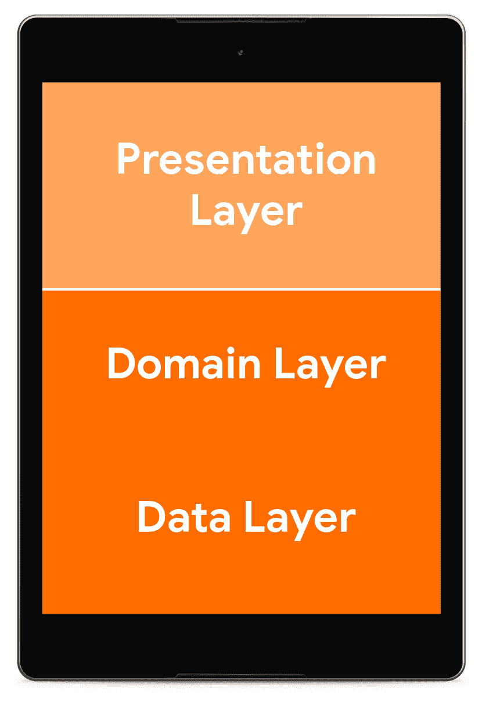
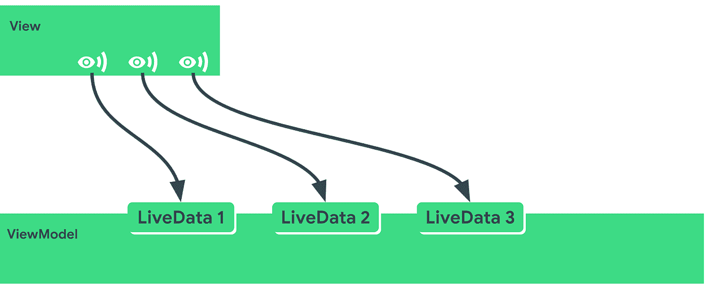
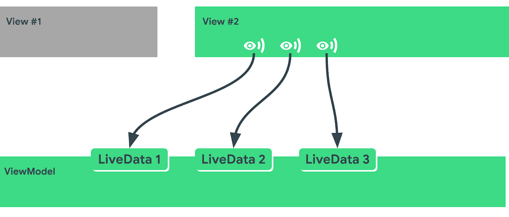
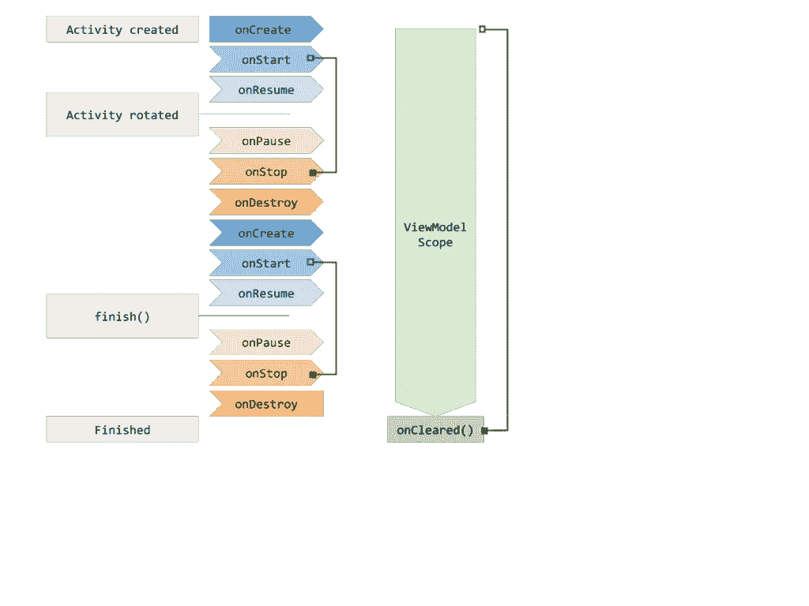
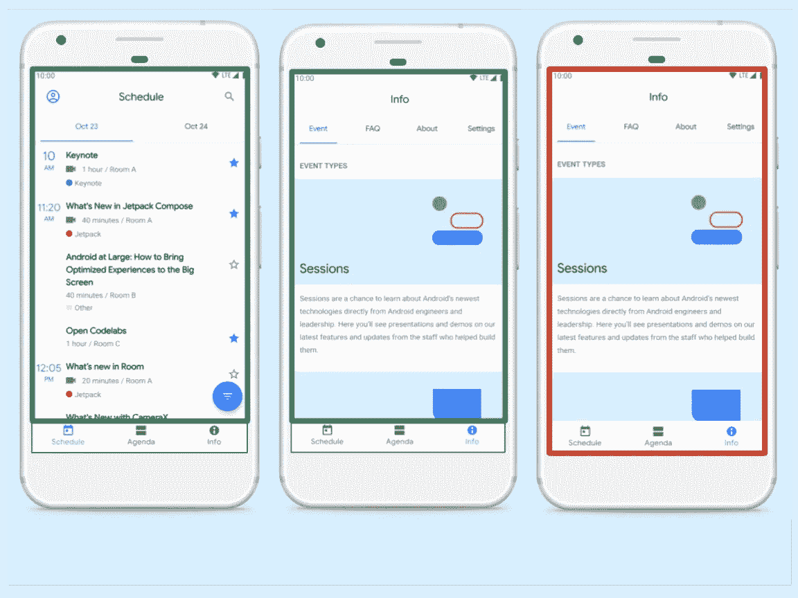

# 带有协程和流的 LiveData 第一部分:反应式用户界面

> 原文：<https://medium.com/androiddevelopers/livedata-with-coroutines-and-flow-part-i-reactive-uis-b20f676d25d7?source=collection_archive---------2----------------------->

本文是我在 2019 年 Android Dev 峰会上与 Yigit Boyar 的谈话摘要。

LiveData with Coroutines and Flow (ADS 2019)

第一部分:反应式用户界面

[第二部分:使用架构组件启动协程](/p/337909f37ae7)

[第三部分:LiveData 和协程模式](/p/592485a4a85a)

# 第一部分:反应式用户界面

自 Android 早期以来，我们很快就了解到 [Android 生命周期](/androiddevelopers/the-android-lifecycle-cheat-sheet-part-i-single-activities-e49fd3d202ab)很难理解，充满了边缘案例，保持理智的最佳方式是尽可能避免它们。

为此，我们[推荐](https://developer.android.com/jetpack/docs/guide#recommended-app-arch)一个分层架构，这样我们就可以编写独立于 UI 的代码，而不用过多考虑生命周期。例如，我们可以添加一个包含业务逻辑(你的应用程序实际上做什么)的域层和一个数据层。

此外，我们了解到表示层可以划分为不同的组件，承担不同的职责:

*   **视图** —处理生命周期回调、用户事件和导航的活动或片段，以及
*   一个**展示者**或一个**视图模型**——向视图提供数据，而*大部分*不知道视图中正在进行的生命周期聚会。这意味着在重新创建视图时没有中断，也不需要清理。

抛开命名不谈，有两种机制可以将数据从 ViewModel/Presenter 发送到视图:

*   引用视图并直接调用它。通常与主持人的工作方式有关。
*   向观察者展示可观察的数据。通常与视图模型的工作方式有关。

这是一个在 Android 社区中建立得相当好的惯例，但是你会发现不同意的文章。有数百篇博客文章以不同的方式定义了演讲者、视图模型、MVP 和 MVVM。我建议你关注你的表示层的特性，并且使用 [Android 架构组件视图模型](https://developer.android.com/topic/libraries/architecture/viewmodel)，它:

*   经受住配置变化，如旋转、区域设置变化、窗口大小调整、黑暗模式切换等。
*   具有非常简单的生命周期。它有一个生命周期回调函数， [onCleared](https://developer.android.com/reference/androidx/lifecycle/ViewModel#onCleared()) ，一旦它的生命周期所有者结束，这个函数就会被调用。

ViewModel 旨在使用观察者模式:

*   它不应该有对视图的引用。
*   它将数据暴露给观察者，而不知道这些观察者是什么。你可以用[的 LiveData](https://developer.android.com/topic/libraries/architecture/livedata) 来做这个。

当一个视图(一个活动、片段或任何生命周期所有者)被创建时，视图模型被获取，并开始通过一个或多个视图订阅的 LiveDatas 公开数据。

ViewModel exposing data through LiveData, observed by the View.

该订阅可以通过 [LiveData.observe](https://developer.android.com/topic/libraries/architecture/livedata#observe_livedata_objects) 设置，也可以通过[数据绑定库](https://developer.android.com/topic/libraries/data-binding)自动设置。

现在，如果旋转设备，视图将被销毁(#1)，并创建一个新实例(#2):

*View #1 is destroyed, so it stops observing automatically. View #2 starts observing.*

如果我们在 ViewModel 中有一个对活动的引用，我们需要确保:

*   当视图被破坏时清除它
*   如果视图处于过渡状态，请避免访问。

但是有了 ViewModel+LiveData，我们就再也不用处理这个问题了。这就是为什么我们在[应用架构指南](https://developer.android.com/jetpack/docs/guide)中推荐这种方法。

# 领域

由于活动和片段的生命周期等于或短于视图模型，我们可以开始讨论**操作范围**。

一个*操作*是你需要在你的应用中做的任何事情，比如从网络上获取数据，过滤结果或者计算一些文本的排列。

对于您创建的任何操作，您都需要考虑它的范围:从启动到取消之间的时间长度。让我们看两个例子:

*   您在活动的`onStart`中开始一项操作，并在`onStop`中停止它。
*   你在视图模型的`init`块中开始一个操作，然后在`onCleared()`中停止它。

Activity lifecycle on rotation and finish vs ViewModel lifecycle

查看图表，我们可以找到每个操作有意义的地方。

*   **在活动范围内的操作中获取数据**将迫使我们在轮换后再次获取数据，因此应该改为在视图模型范围内获取数据。
*   **排列文本**在 ViewModel 范围内的操作中没有意义，因为在旋转之后，你的文本容器可能已经改变了形状。

显然，真实世界的应用程序可以有比这些更多的范围。例如，在 Android Dev Summit 应用中，我们可以使用:

*   片段范围，每个屏幕多个
*   片段视图模型范围，每个屏幕一个
*   主要活动范围
*   主活动视图模型范围
*   适用范围

Schedule screen, Info screen, MainActivity

这会产生十几个不同的作用域，因此管理所有的作用域会变得非常困难。我们需要一种方法来构建这种并发性！

一个非常方便的解决方案是 **Kotlin 协程**。

我们喜欢在 Android 中使用协程有很多原因。其中一些是:

*   **很容易脱离主线**。Android 应用程序不断地在线程间切换以实现平滑的 UX，协程让这变得超级简单。
*   **有最少的样板文件**。协程被嵌入到语言中，所以使用像挂起函数这样的东西是轻而易举的。
*   **结构化并发**。这意味着您被迫定义您的操作的范围，并且您可以享受一些去除大量样板文件的保证，例如清理代码。把结构化并发想象成“自动取消”。

如果你想了解协程，可以查看 Android 的[介绍](https://developer.android.com/kotlin/coroutines)和 Kotlin 的[官方文档](https://kotlinlang.org/docs/reference/coroutines-overview.html)。

继续[第二部分:使用架构组件启动协程](/p/337909f37ae7)