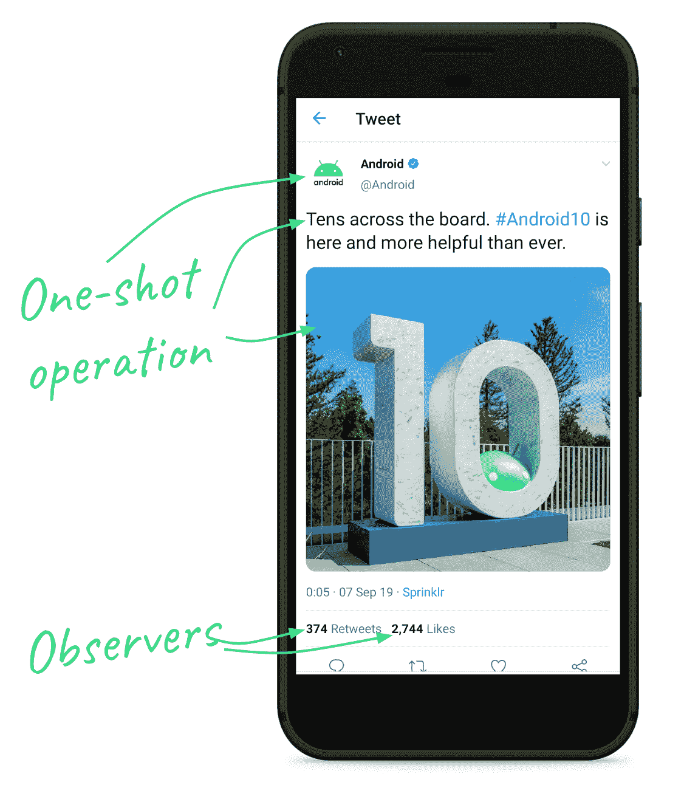
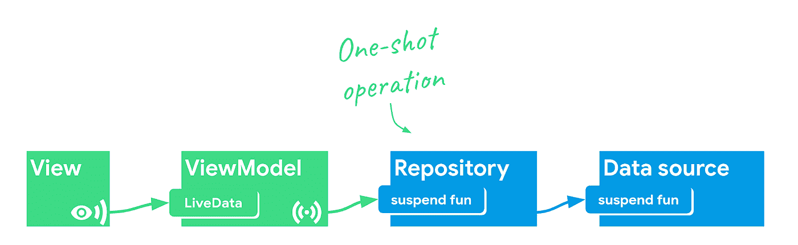
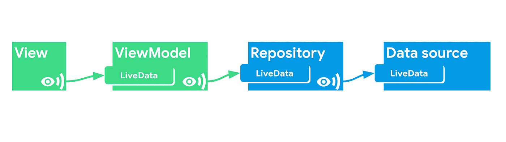

# 带有协同程序和流程的 LiveData 第二部分:使用架构组件启动协同程序

> 原文：<https://medium.com/androiddevelopers/livedata-with-coroutines-and-flow-part-ii-launching-coroutines-with-architecture-components-337909f37ae7?source=collection_archive---------1----------------------->

本文是我在 2019 年 Android Dev 峰会上与 Yigit Boyar 的谈话摘要的第二部分。

LiveData with Coroutines and Flow (ADS 2019)

[第一部分:反应式用户界面](/p/b20f676d25d7)

第二部分:用架构组件启动协程(这篇文章)

[第三部分:LiveData 和协程模式](/p/592485a4a85a)

**Jetpack 的架构组件提供了一堆快捷方式**所以你不用担心作业和取消。您只需选择您的运营范围:

# 视图模型范围

这是启动协程最常见的方式之一，因为大多数数据操作都是从视图模型开始的。使用 [viewModelScope](https://developer.android.com/topic/libraries/architecture/coroutines#viewmodelscope) 扩展，当 ViewModel 被清除时，作业被自动取消。使用`viewModelScope.launch`启动协程。

# 活动和片段范围

类似地，如果您使用`[lifecycleScope](https://developer.android.com/reference/kotlin/androidx/lifecycle/LifecycleCoroutineScope).launch`，您可以将操作的范围限定到一个视图的特定实例。

如果您使用`[launchWhenResumed](https://developer.android.com/reference/kotlin/androidx/lifecycle/LifecycleCoroutineScope)`、`[launchWhenStarted](https://developer.android.com/reference/kotlin/androidx/lifecycle/LifecycleCoroutineScope)`或`[launchWhenCreated](https://developer.android.com/reference/kotlin/androidx/lifecycle/LifecycleCoroutineScope)`将操作限制在某个生命周期状态，您甚至可以缩小范围。

# 适用范围

对于应用程序范围来说，有一些很好的用例(在这里阅读全部内容)但是，首先，如果您的作业最终必须执行，您应该考虑使用[工作管理器](https://developer.android.com/topic/libraries/architecture/workmanager)。

# ViewModel + LiveData

到目前为止，我们已经看到了如何启动一个协程，但是还没有看到如何从中获得结果。您可以像这样使用`MutableLiveData`:

但是，因为您将向视图公开这个结果，所以您可以通过使用`[liveData](https://developer.android.com/topic/libraries/architecture/coroutines#livedata)` [协程生成器](https://developer.android.com/topic/libraries/architecture/coroutines#livedata)来节省一些输入，协程生成器会启动一个协程并允许您通过不可变的 LiveData 公开结果。您使用`emit()`向它发送更新。

# 带有开关映射的 LiveData 协同程序构建器

在某些情况下，每当 LiveData 的值发生变化时，您都希望启动一个协程。例如，在开始数据加载操作之前，您需要一个 ID。使用[转换有一个方便的模式。](https://developer.android.com/reference/android/arch/lifecycle/Transformations#switchMap(android.arch.lifecycle.LiveData%3CX%3E,%20android.arch.core.util.Function%3CX,%20android.arch.lifecycle.LiveData%3CY%3E%3E))

`result`是一个不可变的 LiveData，每当`itemId`有一个新值时，它就会用调用`fetchItem` suspend 函数的结果来更新。

# 从另一个 LiveData 发出所有项目

这个特性不太常见，但是也可以保存一些样板文件:您可以使用`emitSource`传递一个 LiveData 源。当您想先发出一个初始值，然后再发出一系列值时，这很有用。

# 取消协程

如果您使用上述**中的任何模式，您不必明确取消作业**。然而，有一件重要的事情需要记住:*协程取消是协同的*。

这意味着如果调用的协程被取消，您必须帮助 Kotlin 停止一个作业。假设你有一个挂起函数，它启动了一个无限循环。Kotlin 没有办法为您停止这个循环，所以您需要*配合*，定期检查作业是否处于活动状态。您可以通过检查`isActive`属性来做到这一点。

顺便说一下，如果你使用`kotlinx.coroutines`中的任何功能(像`delay`，你应该知道它们都是*可取消的*，这意味着它们会为你做检查。

尽管如此，我还是建议您添加检查，因为将来可能会有人删除延迟调用，从而在您的代码中引入一个微妙的 bug。

# 单次值与多次值

为了理解协程(以及反应式 ui ),我们需要对以下两者进行重要的区分:

*   一次性操作:它们运行一次，可以返回一个结果
*   返回多个值的操作:对可以随时间发出多个值的数据源的订阅。

Twitter app showing parts of the UI requiring different types of operations. Retweets and likes update over time.

# 使用协程的单次操作

使用挂起函数并用`viewModelScope`或`liveData{}`调用它们是运行非阻塞操作的一种非常方便的方式。

然而，当我们听到变化时，事情变得有点复杂。

# 使用 LiveData 接收多个值

我在[LiveData beyond the ViewModel](/androiddevelopers/livedata-beyond-the-viewmodel-reactive-patterns-using-transformations-and-mediatorlivedata-fda520ba00b7)(2018)中谈到了这个主题，在那里我谈到了可以用来解决 LiveData 从未被设计为全功能流构建器这一事实的模式。

An app’s presentation layer (green) and data layer (blue) using LiveData for communication

如今，更好的方法是使用科特林的[流](https://kotlinlang.org/docs/reference/coroutines/flow.html)(警告:一些部分仍在实验中)。流类似于 RxJava 中的反应流特性。

然而，虽然协程使得非阻塞的一次性操作更加容易，但是对于流来说情况就不一样了。溪流还是很难把握。尽管如此，如果你想创建快速和可靠的反应式用户界面，我会说这是值得的时间投资。由于它是语言的一部分和一个小的依赖，许多库开始添加流支持([比如 Room](/androiddevelopers/room-flow-273acffe5b57) )。

因此，我们可以公开来自数据源和存储库的流，而不是 LiveData，但是 ViewModel 仍然公开 LiveData，因为它是生命周期感知的。

Using Flow for communication instead of LiveData in the data layer

继续阅读[第三部分:LiveData 和协程模式](/p/592485a4a85a)