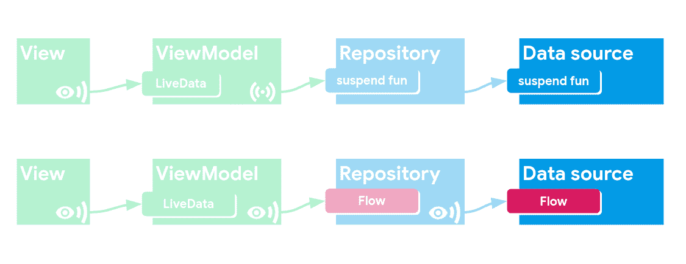

# 带有协程和流程的 LiveData——第三部分:LiveData 和协程模式

> 原文：<https://medium.com/androiddevelopers/livedata-with-coroutines-and-flow-part-iii-livedata-and-coroutines-patterns-592485a4a85a?source=collection_archive---------0----------------------->

本文是我在 2019 年 Android Dev 峰会上与 Yigit Boyar 的谈话摘要的第三部分。

LiveData with Coroutines and Flow (ADS 2019)

[第一部分:反应式用户界面](/p/b20f676d25d7)

[第二部分:使用架构组件启动协程](/p/337909f37ae7)

第三部分:LiveData 和协程模式(本文)

# 视图模型模式

让我们来看一些可以在视图模型中使用的模式，比较 LiveData 和流的使用情况:

## LiveData:发出 N 个值作为 LiveData

如果我们不做任何转换，我们可以简单地将一个分配给另一个。

## 流:将 N 个值作为 LiveData 发出

我们*可以*结合使用`liveData`协程构建器和**收集流上的**(这是一个接收每个发出值的终端操作符):

但是因为有很多样板文件，我们添加了`[Flow.asLiveData()](https://developer.android.com/reference/kotlin/androidx/lifecycle/package-summary#(kotlinx.coroutines.flow.Flow).asLiveData(kotlin.coroutines.CoroutineContext,%20kotlin.Long))`扩展函数，它在一行中做了同样的事情:

## LiveData:从数据源发出 1 个初始值+ N 个值

如果数据源公开了一个 LiveData，我们可以使用 emitSource 在用 emit 发出一个初始值后通过管道进行更新:

## 流程:从数据源发出 1 个初始值+ N 个值

同样，我们可以天真地这样做:

但是，如果我们利用 Flow 自己的 API，事情看起来要整洁得多:

`onStart`设置初始值，这样我们只需要转换到 LiveData 一次。

## LiveData:暂停转换

假设您想要转换来自数据源的东西，但是它可能占用大量 CPU 资源，所以它在一个挂起函数中。

您可以在数据源的 LiveData 上使用`switchMap`,然后用`liveData`构建器创建协程。现在，您可以对收到的每个结果调用 emit。

## 流程:暂停转换

与 LiveData 相比，这是 Flow 真正闪光的地方。同样，我们可以使用 Flow 的 API 来更优雅地做事情。在这种情况下，我们使用`[Flow.map](https://kotlin.github.io/kotlinx.coroutines/kotlinx-coroutines-core/kotlinx.coroutines.flow/map.html)`在每次更新时应用转换。这一次，因为我们已经在协程上下文中，我们可以直接调用它:

# 存储库模式

关于存储库就不多说了，就好像您正在消费一个流并公开一个流，您只需使用[流 API](https://kotlinlang.org/docs/reference/coroutines/flow.html) 来转换和组合数据:

# 数据源模式

同样，让我们区分一下一次性操作和流程。

## 数据源中的一次性操作

如果你正在使用一个支持挂起功能的库，比如 Room 或 retrieve，你可以简单地从你的挂起功能中使用它们！

然而，一些工具和库还不支持协程，并且是基于回调的。

在这种情况下，您可以使用`[suspendCoroutine](https://kotlinlang.org/api/latest/jvm/stdlib/kotlin.coroutines.experimental/suspend-coroutine.html)`或`[suspendCancellableCoroutine](https://kotlin.github.io/kotlinx.coroutines/kotlinx-coroutines-core/kotlinx.coroutines/suspend-cancellable-coroutine.html)`。

(我不知道你为什么想要使用不可取消的版本，请在评论中告诉我！)

当你调用它时，你得到一个`continuation`。在这个例子中，我们使用一个 API，让我们设置一个*完成*监听器和一个*失败*监听器，所以在它们的回调中，当我们收到数据或错误时，我们调用`continuation.resume`或`continuation.resumeWithException`。

重要的是要注意，如果这个协程被取消，`resume`将被忽略，所以如果你的请求花费了很长时间，协程将是活动的，直到其中一个回调被执行。

## 公开数据源中的流

**流程构建器**

如果你需要创建一个数据源的伪实现，或者你只是需要一些简单的东西，你可以使用`flow`构造函数，做一些像这样的事情:

该代码每两秒钟发出一次天气状况。

**基于回调的 API**

如果想将基于回调的 API 转换成流，可以使用`callbackFlow`。

这看起来令人生畏，但如果你把它拆开，你会发现它很有意义。

*   当我们有新的价值时，我们称之为报价
*   我们称之为亲密(因为？)当我们想停止发送更新时
*   我们使用 awaitClose 来定义当流关闭时需要执行什么，这对于取消注册回调来说是完美的。

总之，协程和流已经存在了！但它们并不能在任何地方取代 LiveData。即使有非常有前途的 [StateFlow](https://kotlin.github.io/kotlinx.coroutines/kotlinx-coroutines-core/kotlinx.coroutines.flow/-state-flow/) (目前是实验性的)我们仍然有 Java 编程语言和数据绑定的用户来支持，所以暂时不会被弃用:)

如果您想了解更多信息，请点击以下链接:

*   [Sean 的协程系列文章](/androiddevelopers/coroutines-on-android-part-i-getting-the-background-3e0e54d20bb)
*   [Manu 的经验教训](/androiddevelopers/lessons-learnt-using-coroutines-flow-4a6b285c0d06)将 Android 开发峰会迁移到协同程序(包括 Flow)

我关于 LiveData 的其他博客文章

*   [https://medium . com/Android developers/unit-testing-livedata-and-other-common-observability-problems-bb 477262 EB 04](/androiddevelopers/unit-testing-livedata-and-other-common-observability-problems-bb477262eb04)
*   [https://medium . com/Android developers/livedata-beyond-the-view model-reactive-patterns-using-transformations-and-mediatorlivedata-FDA 520 ba 00 b 7](/androiddevelopers/livedata-beyond-the-viewmodel-reactive-patterns-using-transformations-and-mediatorlivedata-fda520ba00b7)
*   [https://medium . com/Android developers/livedata-with-snack bar-navigation-and-other-events-the-singliveevent-case-AC 2622673150](/androiddevelopers/livedata-with-snackbar-navigation-and-other-events-the-singleliveevent-case-ac2622673150)
*   [https://medium . com/Android developers/view models-and-livedata-patterns-anti patterns-21 efaef 74 a 54](/androiddevelopers/viewmodels-and-livedata-patterns-antipatterns-21efaef74a54)