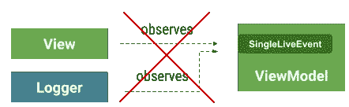

# 带有 SnackBar、导航和其他事件的 LiveData(单个 LiveEvent 案例)

> 原文：<https://medium.com/androiddevelopers/livedata-with-snackbar-navigation-and-other-events-the-singleliveevent-case-ac2622673150?source=collection_archive---------0----------------------->

**2021 年更新:该指南被*弃用*，取而代之的是** [**官方指南**](https://developer.android.com/jetpack/guide/ui-layer/events) **。**

视图(活动或片段)与视图模型通信的一种便捷方式是使用`[LiveData](https://developer.android.com/topic/libraries/architecture/livedata)` observables。视图订阅 LiveData 中的更改并对其做出反应。这对于连续显示在屏幕上的数据非常有用。

**但是，有些数据应该只使用一次，**比如 Snackbar 消息、导航事件或对话框触发器。

与其试图用库或架构组件的扩展来解决这个问题，不如把它当作一个设计问题来面对。**我们建议你将自己的活动视为状态的一部分**。在本文中，我们展示了一些常见的错误和推荐的方法。

# ❌坏:1。将 LiveData 用于事件

这种方法将 Snackbar 消息或导航信号直接保存在 LiveData 对象中。尽管原则上看起来常规的 LiveData 对象可以用于此目的，但它存在一些问题。

在列表/详细信息应用程序中，列表的视图模型如下:

在视图(活动或片段)中:

这种方法的问题是`_navigateToDetails`中的值长时间保持为真，不可能回到第一个屏幕。循序渐进:

1.  用户单击按钮，细节活动开始
2.  用户按 back，返回到列表活动
3.  观察器在活动处于后台堆栈时处于非活动状态，之后再次变为活动状态
4.  值仍然是`true`,所以 Details 活动再次错误地启动

一种解决方案是从 ViewModel 启动导航，并立即将标志设置为 false:

然而，要记住的一件重要事情是，LiveData 保存值，但不保证发出它接收的每一个值。例如:可以在没有观察器处于活动状态时设置一个值，因此一个新的值将会替换它。此外，从不同的线程设置值可能会导致竞争情况，这种情况只会生成一个对观察器的调用。

但是这种方法的主要问题是**很难理解，而且很难看**。我们如何确保在导航事件发生后重置该值？

# **❌更好:2。将 LiveData 用于事件，重置观察者中的事件值**

使用这种方法，您可以添加一种方式，从视图中表明您已经处理了该事件，并且应该对其进行重置。

## 使用

对我们的观察者做一个小小的改变，我们可能会有一个解决方案:

在视图模型中添加新方法，如下所示:

## 问题

这种方法的问题是有一些样板文件(在每个事件的视图模型中有一个新方法),并且容易出错；很容易忘记观察者对视图模型的调用。

# **✔️ OK:使用 singliveevent**

[SingleLiveEvent](https://github.com/googlesamples/android-architecture/blob/dev-todo-mvvm-live/todoapp/app/src/main/java/com/example/android/architecture/blueprints/todoapp/SingleLiveEvent.java) 类是为一个示例创建的，作为适用于特定场景的解决方案。它是一个只发送一次更新的 LiveData。

## 使用

## 问题

SingleLiveEvent 的问题是它仅限于一个观察者。如果您无意中添加了多个，那么只会调用一个，并且不能保证是哪个。

# ✔️建议:使用事件包装器

在这种方法中，您可以明确地管理事件是否已被处理，从而减少错误。

## 使用

这种方法的优点是用户需要通过使用`getContentIfNotHandled()`或`peekContent()`来指定意图。这种方法将事件建模为状态的一部分:它们现在只是一条已经被消费或没有被消费的消息。

With an Event wrapper, you can add multiple observers to a single-use event

总之:**设计事件作为你状态的一部分**。在 LiveData observables 中使用您自己的[事件](https://gist.github.com/JoseAlcerreca/5b661f1800e1e654f07cc54fe87441af)包装器，并根据您的需求进行定制。

奖金！如果你有很多事件，使用这个 [EventObserver](https://gist.github.com/JoseAlcerreca/e0bba240d9b3cffa258777f12e5c0ae9) 删除一些重复的代码。