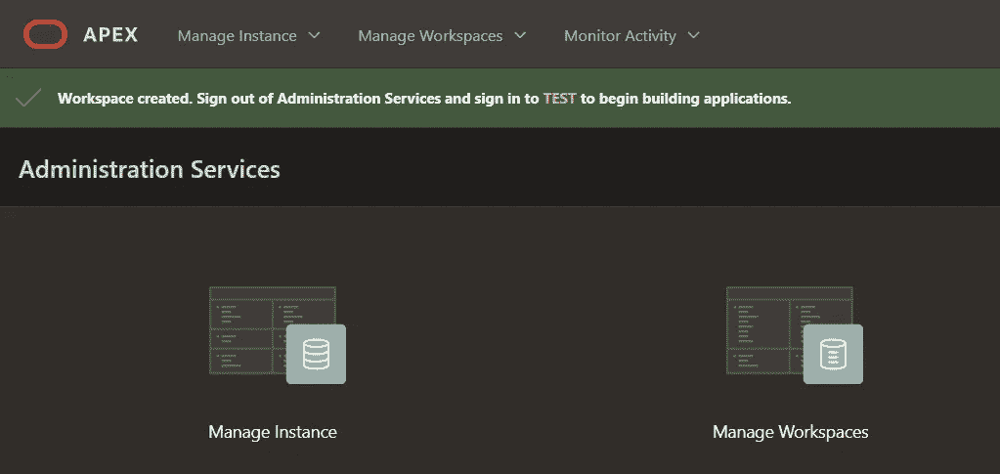

# Livin' La Vida 低码

> 原文：<https://medium.com/oracledevs/livin-la-vida-low-code-27b19588a814?source=collection_archive---------1----------------------->

Oracle Application Express 是一个领先的开发平台。

> Oracle Application Express (APEX)是一个低代码开发平台，使您能够构建可扩展的、安全的企业应用程序，这些应用程序具有世界一流的特性，可以部署在任何地方。

开始使用 Oracle Application Express 非常简单。

有多种方法可以创建驻留在内部和云中的 APEX 应用程序。

 [## 入门指南

### Oracle APEX 应用程序开发服务提供了一个预配置、完全受管且安全的环境…

apex.oracle.com](https://apex.oracle.com/en/learn/getting-started/) 

这些方法包括:

*   在数据库应用程序开发虚拟设备中运行 APEX。即 Oracle 数据库、Oracle SQL Developer 和 Oracle Application Express。
*   在本地下载并安装 Oracle APEX。
*   在自治数据库上使用 Oracle APEX。
*   下载 APEX 并将其安装到其他 Oracle 云服务中。

但是，对于原型和 Oracle 云中的免费评估，有两种方法:

1.  自由 APEX 工作空间
2.  永远免费的 APEX 服务

让我们来看看如何使用这些方法进行设置。

## 自由 APEX 工作空间

对于没有 OCI 帐户的人来说，评估 Oracle APEX 最简单快捷的方法是申请一个托管在 apex.oracle.com 上的免费工作空间。

点击按钮申请一个免费的工作空间。

您的电子邮件地址将成为您的用户名，您的密码将在稍后设置。

完成提示的其余部分，然后继续您需要检查您的电子邮件的过程。

该电子邮件将有一个按钮，带您到浏览器创建您的新工作区。

下一个屏幕将允许您为您的帐户设置密码，然后您就可以登录了。

登录后，您将能够看到 APEX 仪表盘。

## 永远免费的 APEX 服务

如果您已经有一个 OCI 帐户，那么设置 APEX 实例也同样简单。

> Oracle APEX 应用程序开发(APEX 服务)在 OCI 提供 APEX 应用程序的低代码开发和部署，包括自治数据库。

在 OCI 仪表板中，选择开发人员服务，然后选择 APEX 实例。

在下一个屏幕中，您将能够创建 APEX 服务。

在以下屏幕中，选择默认值，然后选择管理员密码。

在页面下方，您可以选择 APEX 应用程序的网络访问。

现在您已经准备好创建服务了。

单击按钮，将显示 APEX 实例的仪表板。

当 APEX 实例准备就绪时，您将能够启动它。

首次创建 APEX 服务时，您可能会收到以下电子邮件。

> 祝贺您，您新的始终免费 APEX 服务已成功创建，现已推出。这将消耗 Oracle 自治数据库类别中 2 个允许的始终空闲实例中的 1 个。

登录后，您可以使用之前设置的管理员密码。

在下一个屏幕中，您将能够为非管理员用户创建一个工作区。

指定非管理员用户以及符合以下规则的用户密码:

> 密码长度必须在 12 到 30 个字符之间，并且必须包括至少一个大写字母、一个小写字母和一个数字字符。
> 
> 密码不能包含用户名。
> 
> 密码不能是同一用户名使用的最后四个密码之一。
> 
> 密码不能包含双引号(")字符。
> 
> 该密码不得与 24 小时前设置的密码相同。

您可以指定新用户和密码。并且工作区的名称将默认为用户的名称。

然后，您将能够创建一个工作区。

因此，接下来您应该会看到 APEX 仪表板。

请注意顶部的消息:

> 工作区已创建。注销 Administration Services，然后登录测试以开始构建应用程序。

让我们开始吧。

现在以非管理员身份登录。我们将指定名为 Test 的用户。

现在我们回到 APEX 仪表板，但这次是作为测试用户。

现在，我们可以从这里创建一个应用程序。

Paul Guerin 是一名专注于 Oracle 数据库的国际顾问。此外，他还出席了一些世界领先的甲骨文会议，包括甲骨文 2013 年世界开放大会。自 2015 年以来，他的工作一直是 IOUG 最佳实践技巧小册子以及 AUSOUG、Oracle Technology Network、Quest 和 Oracle Developers (Medium)出版物的主题。2019 年，他被授予 My Oracle 支持社区最有价值贡献者。他是一名 DBA OCP，并将继续参与 Oracle ACE 计划。