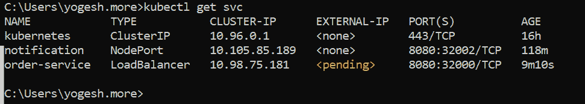

# 使用 Kubernetes Minikube 的负载平衡微服务

> 原文：<https://medium.com/globant/load-balance-microservices-using-kubernetes-minikube-88b78dae4796?source=collection_archive---------0----------------------->

## 了解如何使用 Minikube 部署和平衡应用程序


Photo by [Chun Kit Soo](https://unsplash.com/@soochunkit?utm_source=medium&utm_medium=referral) on [Unsplash](https://unsplash.com?utm_source=medium&utm_medium=referral)

在本文中，我将带您了解如何使用 Minikube(本地 Kubernetes 环境)部署和负载平衡 Spring Boot 应用程序。

对于这项工作，您需要以下内容:

*   Spring Boot 版本:2.7.3
*   Minikube 版本:v1.25.1
*   Kubectl: v1.22.5
*   斯卡福德:1.39.1 版

# 让我们开始吧…

我们将使用 Spring Boot 创建一个示例微服务，并将其部署在本地 Kubernetes 集群上。要启动本地 Kubernetes 集群，首先使用以下命令启动 Minikube。

```
minikube start
```

现在让我们创建一个简单的 Spring Boot 应用程序，它有一个 REST GET 端点，将返回“Hello + Pod Name”。pod 名称将在这里指示哪个实例正在为请求提供服务。

使用 Spring start.io，创建一个项目，并将其命名为“order-service”。

将以下端点代码添加到订单服务项目中。

```
@SpringBootApplication
@RestController
public class OrderServiceApplication {
  @Autowired
  Environment env; @GetMapping(**"/**status**"**)
  public String status() { return "Status - returned by Pod - "+ env.getProperty(**"**HOSTNAME**"**)  ; 
  //HOSTNAME => POD name serving request
 }
}
```

现在让我们创建一个名为“docker file”的 docker 文件来创建容器。

```
**FROM** openjdk:11.0.7-jre-slim
**VOLUME** /tmp
**ADD** target/order-*.jar app.jar
**ENV** JAVA_OPTS=**""
ENTRYPOINT** [ "sh", "-c", "java $JAVA_OPTS -Djava.security.egd=file:/dev/./urandom -jar /app.jar" ]
```

接下来，创建包含服务负载平衡器服务定义的部署文件“order-service.yaml ”,如下所示:

```
**apiVersion**: "v1" **kind**: "List" **items**:
  - **apiVersion**: "v1" **kind**: "Service" **metadata**:
      **annotations**: {}
      **labels**: {}
      **name**: "order-service" **spec**:
      **selector**:
        **app**: "order-service**"
      type**: LoadBalancer**ports**:
        - **name**: http
          **port**: 8080
          **targetPort**: 8080
          **nodePort**: 32000
          **protocol**: TCP
  - **apiVersion**: "apps/v1" **kind**: "Deployment" **metadata**:
      **labels**:
        **app**: "order-service" **version**: "1.0.0" **name**: "order-service" **spec**:
      **replicas**: 3
      **selector**:
        **matchLabels**:
          **app**: "order-service" **version**: "1.0.0" **template**:
        **metadata**:
          **labels**:
            **app**: "order-service" **version**: "1.0.0" **spec**:
          **containers**:
            - **image**: "order-service:1.0.0" **imagePullPolicy**: "Never" **name**: "order-service" **resources**:
                **limits**:
                  **cpu**: 500m
                **requests**:
                  **cpu**: 200m
              **ports**:
                - **protocol**: TCP
                  **containerPort**: 8080
```

您可以使用`kubectl apply -f order-service.yaml`命令直接部署，或者创建一个 Skaffold 文件“skaffold.yaml ”,如下所示:

```
**apiVersion**: skaffold/v2beta11
**kind**: Config
**metadata**:
  **name**: order-service
**build**:
  **artifacts**:
  - **image**: order-service
**deploy**:
  **kubectl**:
    **manifests**:
    - k8s/order-service.yaml
**portForward**:
- **resourceType**: deployment
  **resourceName**: order-service
  **port**: 8080
  **localPort**: 8080 **manifests**:
    - k8s/order-service.yaml
**portForward**:
- **resourceType**: deployment
  **resourceName**: order-service
  **port**: 8080
  **localPort**: 8080
```

打开命令提示符，导航到项目目录，然后运行以下命令。

```
skaffold run
```

在成功运行时，验证三个`order-service`实例正在运行。


POD status

检查新创建的服务的状态:



service status

正如我们所看到的，服务“order-service”属于负载平衡器类型，它的外部 IP 分配正在进行中。要访问和分配外部 IP，我们需要使用隧道命令在 Minikube 和我们的机器之间创建一个桥。

打开一个新的命令提示符，运行`minikube tunnel`命令。


Tunnel command to bridge local and Minikube network

注意:为了保持桥梁畅通，不要关闭隧道窗口。

现在，重新运行 get services 命令(`kubectl get svc`)并验证是否分配了 IP:


Load Balancer Service IP Assignment

现在打开 Postman，创建一个 GET 端点并更改 keep-alive 配置，如下所示。

点击标题→隐藏:


Toggle hidden headers

取消选中连接字段，如下图所示。这将确保每次建立新连接时，我们都会看到负载平衡的效果。(K8s 负载均衡器采用随机分配算法；因此，有时您可能会看到同一个 pod 正在为请求提供服务。)


Change Keep-alive

**重要**:对于浏览器来说，默认的保活是 60 秒(使用浏览器的网络选项卡，可以验证报头)；因此，如果您使用浏览器进行测试，那么在这段时间之后点击结束点以查看负载平衡的效果。

现在，让我们到达如下所示的终点，验证负载平衡是否正常工作:


观察响应(最后一个字)部分。正如我们所看到的，不同的实例发送响应，负载平衡正在工作！

## 结论

我们已经成功地在 Minikube 上部署了一个微服务，并可以使用负载平衡器服务从不同的实例中获得响应。

# Minikube # Springboot #负载平衡器