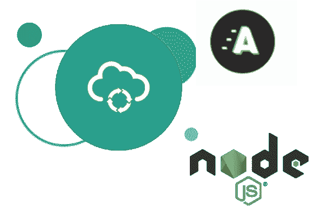
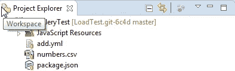
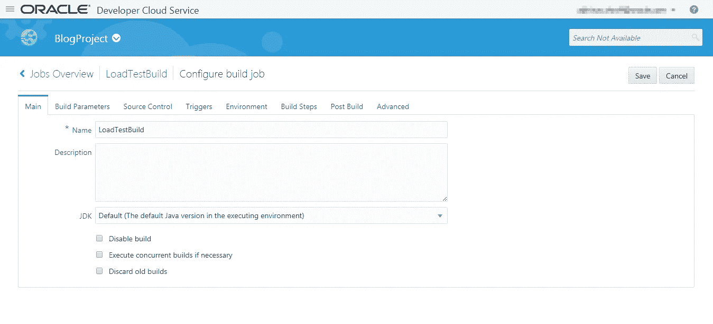
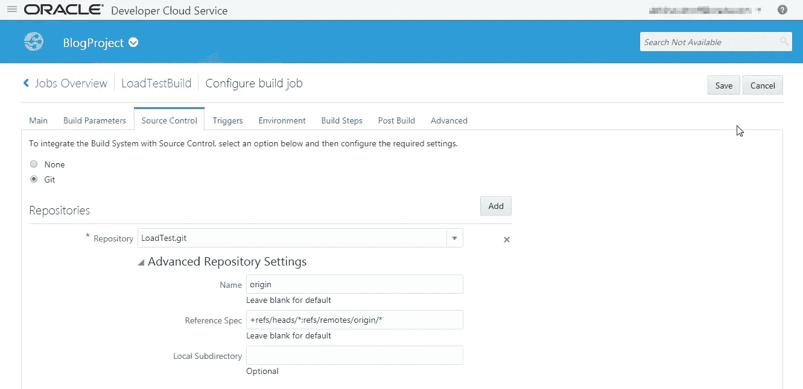
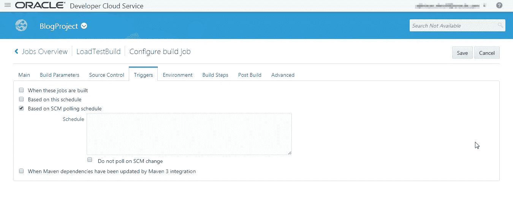
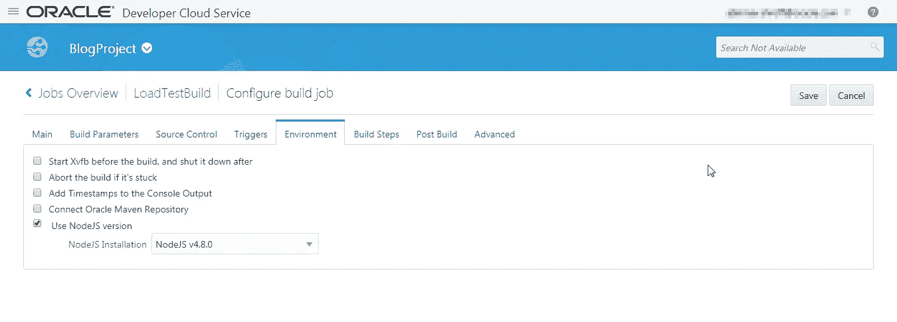
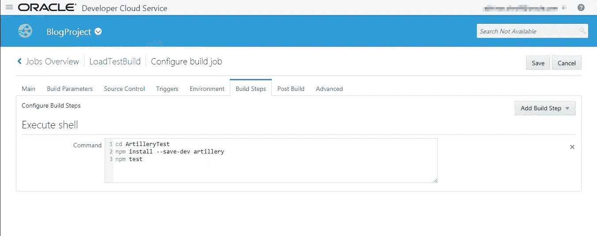
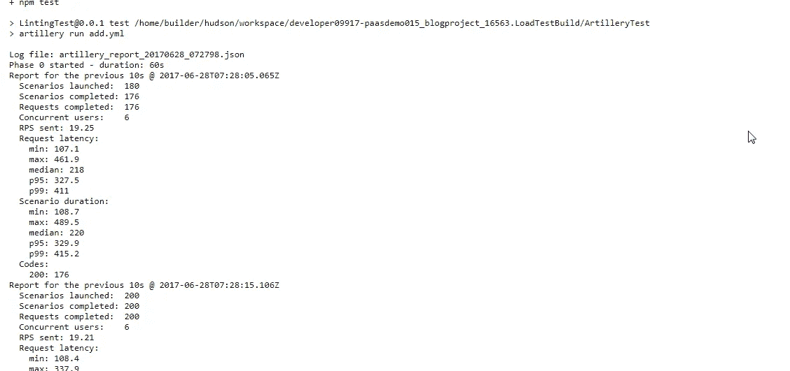
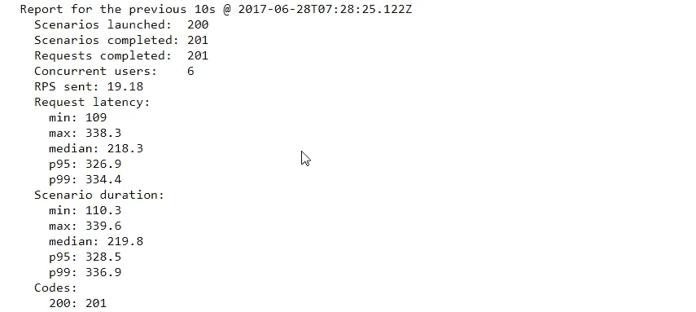
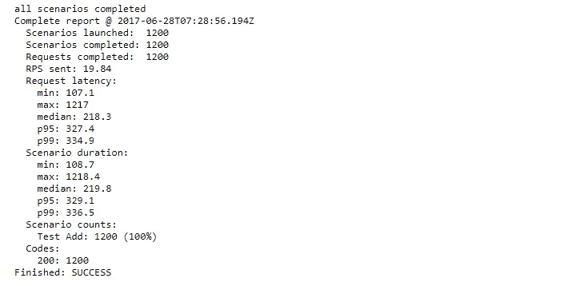

# 使用 cannon 在 Oracle 开发者云服务上实现负载测试自动化

> 原文：<https://medium.com/oracledevs/load-testing-automation-on-oracle-developer-cloud-service-using-artillery-55c9809614cd?source=collection_archive---------0----------------------->

这篇博客介绍了在 Oracle Developer Cloud Service 上使用一个名为 cannon 的负载测试框架对 REST 服务进行负载测试自动化。基于 Nodejs 的 REST 应用将部署在 Oracle 应用容器云服务上



**注:**关于如何使用开发者云服务在应用容器云上开发和部署基于 Nodejs 的 REST 服务应用的详细信息，请参见此处的博客链接[。](https://community.oracle.com/community/cloud_computing/platform-as-a-service-paas/oracle-developer-cloud-service/blog/2016/09/07/oracle-developer-cloud-to-build-and-deploy-nodejs-rest-project-on-application-container-cloud)

**使用的技术堆栈**

*   **Eclipse:** 火炮负载测试脚本和 Nodejs 开发的 IDE。
*   **测试框架:**火炮
*   **Oracle 开发人员云:**用于负载测试自动化
*   **Oracle 应用容器云:**部署基于 Nodejs 的 REST web 服务的云服务，在其上进行负载测试。

**关于火炮**

cannon 是一个简单但功能强大的负载测试工具包。它可以让您的应用程序在高负载下性能更好。火炮的测试结果，给了我们洞察力，使我们的应用程序更快，更可伸缩，更有弹性。更多关于火炮的信息，请访问—[https://artillery.io/](https://artillery.io/)

**为什么是火炮？**

**关于 Nodejs REST 应用**

Nodejs REST 应用程序有一个 get 和 post 函数。get 函数给出一个静态消息和错误属性为 false 的响应。而 post 函数“add”给出作为服务输入传递的两个数的和。Nodejs 模块 express 和 bodyPaser 用于创建 REST 服务。下面是 main.js 的代码片段，其中包含 REST web 服务代码。

```
var express = require("express");
var bodyParser = require("body-parser");
var app = express();
app.use(bodyParser.urlencoded());
app.use(bodyParser.json());
var router = express.Router();

router.get('/message',function(req,res){
  res.json({"error" : false, "message" : "Hello!"});
});

router.post('/add',function(req,res){
  res.json({"error" : false, "message" : "success", "data" : req.body.num1 + req.body.num2});
});

app.use('/',router);

app.listen(process.env.PORT || 3000,function(){
  console.log("I am listening at PORT 3000");
})
```

请参考我在 Mocha.js 测试自动化上的[博客](https://community.oracle.com/community/cloud_computing/platform-as-a-service-paas/oracle-developer-cloud-service/blog/2017/06/04/mochajs-for-test-automation-of-nodejs-rest-api-on-oracle-developer-cloud-service)，里面讲解了使用开发者云服务的 Node.js REST 服务开发和部署。此外，该服务将使用 Node.js 容器部署在 Oracle 应用容器云服务上。

**火炮载荷测试文件**



1.  **add.yml —** 这是使用 cannon 进行负载测试的配置文件。
2.  **number.csv —** 该文件充当负载测试数据的存储库。add.yml 文件包含
3.  **package.json —** 它由执行火炮载荷测试的依赖项和命令组成

**火炮载荷测试文件描述:**

**add.yml**

这是火炮框架的配置文件。在这个文件中，我们配置了需要测试的 REST 端点，在这种情况下是测试数据有效负载文件“numbers.csv ”,以及定义了 Post、Get 等函数类型的测试场景和要测试的方法的路径 URL。我们还在这个 YAML 文件中定义了测试阶段，如持续时间和请求到达率，其中持续时间意味着测试将持续 60 秒，有 20 个新的*虚拟用户*(平均每秒到达)。您可以给这个文件起一个自己选择的名称，但是要确保在 test 命令的 package.json 中配置相同的名称。

```
config:
  target: 'https://mochatest-paasdemo015.apaas.us6.oraclecloud.com'
  phases:
    - duration: 60
      arrivalRate: 20
  payload:
    path: "numbers.csv"
    fields:
      - "num1"
      - "num2"
    order: "sequence"  

scenarios:
  - 
    name: "Test Add"
    flow:
      - 
       post:
        url: "/add"
        json:
             num1: ${{ num1 }}
             num2: ${{ num1 }}
```

**package.json**

package.json 包含代码执行的依赖项。它还定义了命令“run add.yml ”,在 add.yml 文件中配置的端点上运行负载测试，该文件作为参数传递给命令执行。

```
{
  "name": "LintingTest",
  "version": "0.0.1",
  "scripts": {
    "test": "artillery run add.yml"
  },
  "dependencies": {
  },
  "devDependencies": {
    "artillery": "^1.6.0"
  }
}
```

**number.csv**

这是一个 CSV 文件，包含两个数字的列表，作为在 REST 端点的 add 函数上执行负载测试的测试数据。

```
1,2 2,3 3,4 4,5 5,6 6,7 7,8 8,9 9,10
```

**构建配置:**

下面是 **LoadTestBuild、**的构建作业配置截图，该构建作业将在 cannon 框架的帮助下，对部署在 Oracle 应用程序容器云上的基于 Nodejs 的 REST API 应用程序执行负载测试。

为构建作业选择一个名称。对于这个博客，我将其命名为“ **LoadTestBuild** ”。因为这是针对 Nodejs 应用程序的，所以可以将 JDK 保留为默认值。



选择已上载负载测试相关脚本和文件的存储库。

注意:您可以选择使用包含 Nodejs 应用程序相关代码的同一个项目来加载测试脚本。



这里我们将 SCM 轮询设置为触发器。这确保了每次我们上传代码到 Git 仓库时，都会触发**‘LoadTestBuild’**，如博客中的构建触发图所示。



将构建的 Nodejs 版本配置为 4.8.0，如下面的屏幕截图所示。



我们将使用执行 shell 构建步骤。作为构建步骤的一部分，首先我们将文件夹更改为项目文件夹**‘ArtilleryTest’**。我们将使用 npm 安装来安装所有的火炮模块，如下图所示。然后使用“npm test”命令在 YAML 文件中配置的 REST 端点上执行负载测试，如博客中所述。



在执行时，可以在构建控制台上看到负载测试结果，如下所示。



**解码上述结果:**

当测试运行时，将每 10 秒钟打印一次中间统计数据(默认)，并在测试结束时打印一份完整的报告。

**启动的场景** —是最近 10 秒内创建的虚拟用户数。

**完成的场景** —是在之前的 10 秒钟内(或在整个测试中)完成其场景的虚拟用户的数量。注意:这是完成的会话数，而不是在 10 秒间隔内启动和完成的会话数。

**Requests completed** —发送的 HTTP 请求和响应或 WebSocket 消息的数量

**RPS sent** —是在之前的 10 秒钟内(或在整个测试过程中)每秒完成的平均请求数

**请求延迟** **和场景持续时间** —以毫秒为单位，p95 和 p99 的值是第 95 和第 99 个百分位数的值(请求延迟 p99 的值为 400 毫秒意味着 100 个请求中有 99 个花费了 400 毫秒或更少的时间来完成)。如果您看到 NaN(“非数字”)被报告为一个值，这意味着没有收到足够的响应来计算百分比。

**代码—** 是 HTTP 响应代码的计数。

编码快乐！

* *本文表达的观点是我个人的观点，不一定代表甲骨文的观点

*原载于 2017 年 7 月 6 日 community.oracle.com**的* [*。*](https://community.oracle.com/community/cloud_computing/platform-as-a-service-paas/oracle-developer-cloud-service/blog/2017/07/06/load-testing-automation-on-oracle-developer-cloud-service-using-artillery)