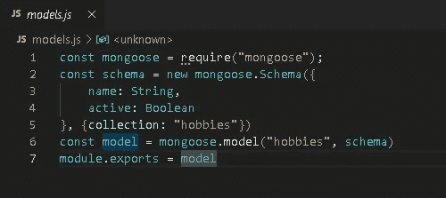
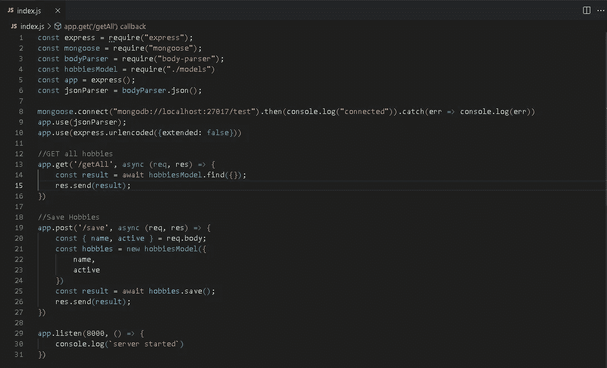
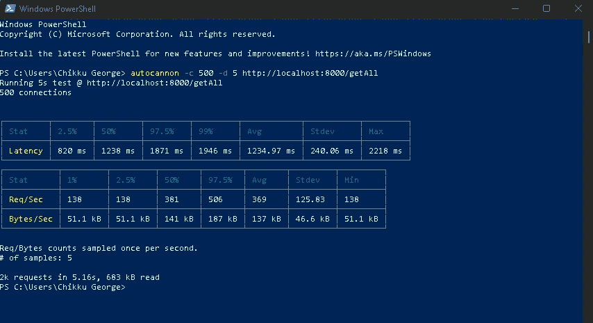
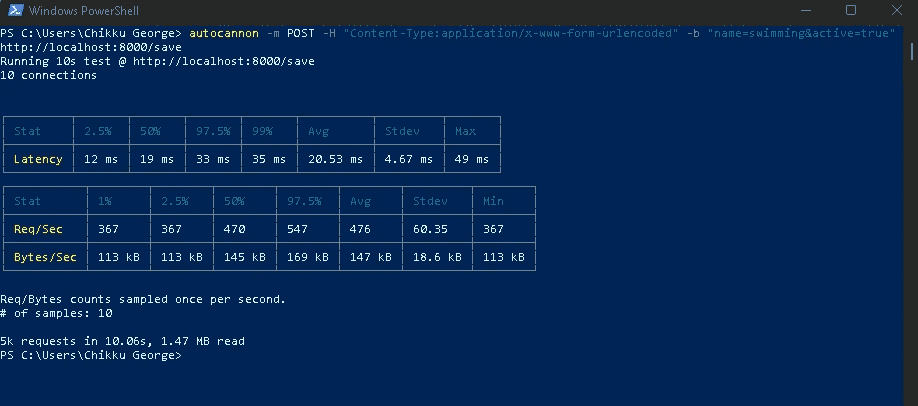
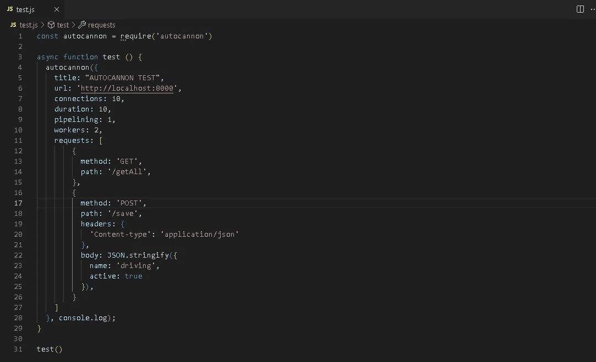
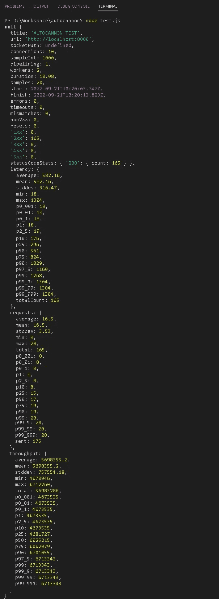
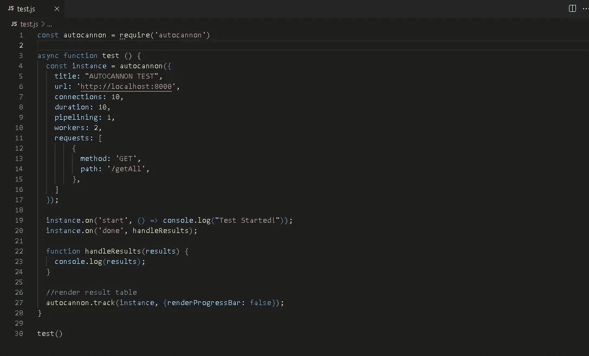

# 使用自动扫描加载测试节点 API

> 原文：<https://medium.com/globant/load-testing-nodejs-apis-with-autocannon-c3770478cb36?source=collection_archive---------1----------------------->

## NODEJS 系列

## 如何使用自动扫描加载测试节点 API 的指南


作为开发人员，我们总是担心 API 的响应时间，这样它就不会成为消费者的瓶颈。因此，我们需要确保响应时间不会影响应用程序的性能，即使多个用户同时使用它。

测试始终是应用程序不可或缺的一部分，以确保其顺利运行。我们如何测试我们的 API 来支持并发用户请求？— **Autocannon，一个负载测试包，可以在我们的应用中模拟高流量。**

## 自动扫描

[Autocannon](https://www.npmjs.com/package/autocannon) 是一个用 NodeJS 编写的 HTTP/1.1 基准测试工具，广泛用于衡量一个应用的性能。使用 autocannon，我们可以每秒模拟多个请求来对我们的应用程序进行负载测试。

## 装置

在项目中全局安装 autocannon。

```
npm install -g autocannon
```

## 测试命令

```
autocannon [opts] URL
```

## **可用选项**

更多选项你可以在这里找到[。](https://www.npmjs.com/package/autocannon)

```
**-c | --connections**
Number of concurrent connections to use
By default, its value is 10**-p | --pipeline**
Number of pipelined requests to use
By default, its value is 1**-d | --duration** Number of seconds to run the autocannon
By default, its value is 10**-w | --workers**
Number of worker threads to fire requests**-m | --method** HTTP method to use
By default, its value is 'GET'**-t | --timeout**
Number of seconds before timing out and resetting a connection
By default, its value is 10**-j | --json**
Print the output as newline delimited JSON
By default, its value is false**-f | --forever**
Run the benchmark forever
```

运行该命令时，如果遇到任何错误，如**运行系统**上禁用的脚本，请按如下方式设置执行策略:

```
Set-ExecutionPolicy -Scope CurrentUser -ExecutionPolicy Unrestricted
```

*我们来玩一些代码示例。*

我建立了一个示例项目，其中我的数据库只包含一个名为“爱好”的集合。



Hobbies Model



Get all Hobbies & Save new Hobbies

## 为我的 GET 请求自动调用命令

```
autocannon -c 500 -d 5 [http://localhost:8000/getAll](http://localhost:8000/getAll) // Running 500 connections in 5 seconds
```

## 试验结果



Credit: Author

## 我的发布请求的自动取消命令

```
autocannon -m POST -H “Content-Type:application/x-www-form-urlencoded” -b “name=swimming&active=true” [http://localhost:8000/save](http://localhost:8000/save)  // specify Header(-H) and Body (-b)
```

## 试验结果



Credit: Author

Autocannon 输出两个数据表:

1.  **请求延迟—** *显示请求时间为 2.5%(快)、50%(中)、97.5%(慢)、99%(最慢)以及平均时间。*
2.  **请求量—** *显示每秒发送的请求数和下载的字节数。*

除了从命令行运行测试命令，我们还可以通过编程来运行它们。

```
autocannon(opts[, cb])
```

***opts*** 是 autocannon 实例的配置选项，而 ***cb*** 是测试完成时调用的回调。



Autocannon GET & POST requests programmatically

## 试验结果



Credit: Author

如果你仔细观察上面的测试结果，你会发现很多事情如下所示:

```
**start**
Date object when test started**finish**
Date object when test ended**errors**
Number of connection errors**timeouts**
Number of connection timeouts**mismatches**
Number of requests with a mismatched body**non2xx**
Number of non-2xx response status codes received**requests**
Number of requests per second**latency**
Request time**throughput** Response data throughput per second
```

***请求*** 、 ***延迟*** 和 ***吞吐量*** 是百分位对象，具有以下值:

```
**min**
The lowest value.**max**
The highest value.**average**
The average (mean) value.**stddev**
The standard deviation.**p***
The percentile value. The percentile properties are: p2_5, p50, p75, p90, p97_5, p99, p99_9, p99_99, p99_999.
```

## 自动扫描事件

autocannon 实例是一个事件发射器。所以它会发出几个事件。下面给出一些。更多可以在这里找到。



Credit: Author

```
**start** Emitted when autocannon instance is setup and started**.****done** Emitted when the autocannon finishes a benchmark.**track** Track the progress of autocannon. 
Configuration options for tracking are: **1\. outputStream** The stream to output to. **2\. renderProgressBar** A boolean value indicating whether to display progress bar or    not. By default, it’s value is true. **3\. renderResultsTable** A boolean value indicating whether to display result table or not. By default, it’s value is true. **4\. renderLatencyTable** A boolean value indicating whether to display latency table. By default, it’s value is false. **5\. progressBarString** A string defining the format of the progress display output.
```

用 Autocannon 对你的 API 进行负载测试。谢谢:)