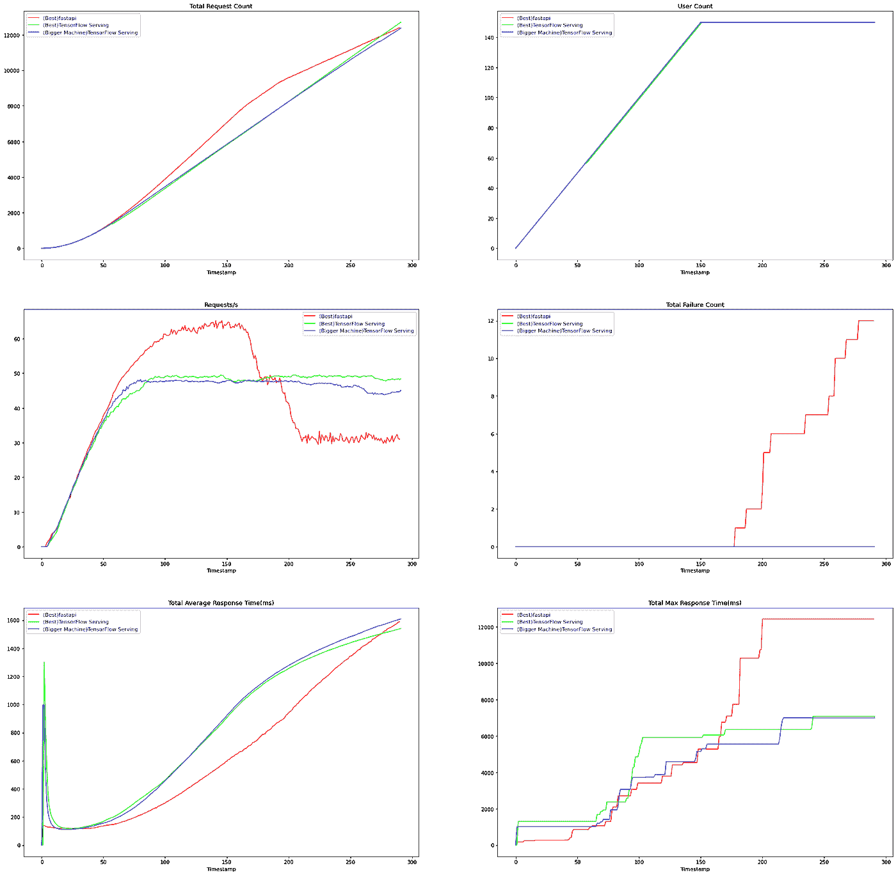
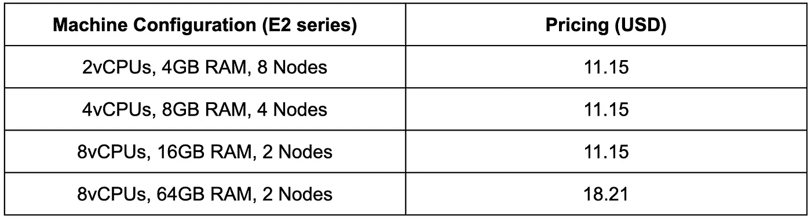

# 在 GKE 上对 TensorFlow 服务和 FastAPI 进行负载测试

> 原文：<https://medium.com/google-developer-experts/load-testing-tensorflow-serving-and-fastapi-on-gke-411bc14d96b2?source=collection_archive---------2----------------------->

*由* [*陈成*](https://github.com/deep-diver) *和* [*萨亚克*](https://github.com/sayakpaul) *(ML-GDEs)*

在这篇文章中，我们将分享在众多部署配置中对深度学习模型进行负载测试的经验和发现。这些配置涉及基于 REST 的部署，使用 [FastAPI](https://fastapi.tiangolo.com/) 和 [TensorFlow 服务](https://www.tensorflow.org/tfx/guide/serving)。通过这种方式，我们旨在让读者对两者之间的差异有一个全面的了解。

这篇文章不是关于代码，而是关于我们在执行部署时必须做出的架构决策。我们将首先概述我们的设置，包括技术规格。我们还将分享我们对一些关键设计选择及其影响的评论。

# 技术设置

如上所述，我们雇佣了两个有希望的候选人进行部署— [FastAPI](https://fastapi.tiangolo.com/) 和 [TensorFlow Serving](https://www.tensorflow.org/tfx/guide/serving) 。两者都具有丰富的功能，并在设计中嵌入了目标规格(稍后将详细介绍)。

为了执行我们的测试，我们使用了一个[预训练的 ResNet50 模型](https://arxiv.org/abs/1512.03385)，它可以将各种图像分为不同的类别。然后，我们在两种不同的设置中提供该模型——FastAPI 和 TensorFlow 服务，它们在设置中有一些共同点:

*   使环境集装箱化。
*   Kubernetes 为可伸缩性编排一个容器节点集群。我们使用 [Kubernetes 引擎](https://cloud.google.com/kubernetes-engine) (GKE)来管理这个。
*   [GitHub 动作](https://github.com/features/actions)在 GKE 上自动展开部署。

我们的部署平台(Kubernetes 集群上的节点)是基于 CPU 的。我们在流程的任何阶段都不使用 GPU。为了进一步优化 FastAPI 提供的模型的运行时，我们使用了 [ONNX](https://onnx.ai/) 。[这本笔记本](https://github.com/sayakpaul/ml-deployment-k8s-fastapi/blob/feat-locust/notebooks/TF_to_ONNX.ipynb)提供了 ONNX 模型和原始 TensorFlow 模型之间的延迟比较。TensorFlow 服务尚不允许我们为 ONNX 模型提供服务，但我们仍然可以构建一个 CPU 优化的 TensorFlow 服务映像，并利用其他一些选项来减少延迟并提高系统的整体吞吐量。我们将在后面的文章中讨论这些。

您可以在以下存储库中找到所有代码并了解部署是如何执行的:

 [## GitHub-sayak Paul/ml-deployment-k8s-fastapi:这个项目展示了如何服务于 ONNX 优化的…

### 这个项目展示了如何将 ONNX 优化的图像分类模型作为一个 web 服务提供给 FastAPI、Docker 和…

github.com](https://github.com/sayakpaul/ml-deployment-k8s-fastapi)  [## GitHub-deep-diver/ml-deployment-k8s-TF serving:这个项目展示了如何服务一个基于 TF 的映像…

### 这个项目展示了如何将一个基于 TF 的图像分类模型作为一个 web 服务使用 TFServing、Docker 和…

github.com](https://github.com/deep-diver/ml-deployment-k8s-tfserving) 

在资源库中，您可以找到示例笔记本和详细的代码设置说明。因此，我们不会逐行讨论代码，而是在必要时揭示最重要的部分。

在本文的其余部分，我们将讨论 FastAPI 和 TensorFlow 服务部署实验的关键考虑因素，包括它们的动机、限制和我们的实验结果。

*随着*[*Vertex AI*](https://cloud.google.com/vertex-ai)*等无服务器产品的出现，部署机器学习(ML)模型并安全可靠地扩展它们变得前所未有的简单。这些服务有助于极大地缩短上市时间，并提高开发人员的整体工作效率。也就是说，在某些情况下，您可能希望对事情进行更精细的控制。这是我们最初想做这些实验的原因之一。*

# 考虑

FastAPI 和 TensorFlow 服务有自己的约束和设计选择，它们会影响部署。在本节中，我们将简要概述这些考虑事项。

**框架选择:** FastAPI 已经迅速成为部署 REST APIs 的好工具。此外，它利用了一个基于 C++的事件系统，该系统已在 Node.js 中得到验证。另一方面，TensorFlow Serving 是一个生产就绪框架，可部署标准 TensorFlow 模型，同时支持基于 REST 和 gRPC 的接口。由于 FastAPI 不是一个经过实战检验的 ML 部署框架，但许多组织将它用于此目的，我们希望比较它和 TensorFlow 服务之间的性能。

**部署基础设施:**我们选择 GKE 是因为 Kubernetes 是现代 IT 行业事实上的部署平台(当使用 GCP 时)，而 GKE 让我们专注于 ML 部分而不用担心基础设施，因为它是一个完全托管的谷歌云平台(GCP)服务。我们的主要兴趣是如何为基于 CPU 的环境部署模型，因此我们为 FastAPI 服务器准备了一个 CPU 优化的 ONNX 模型和一个 CPU 优化的 TensorFlow 服务映像。

**更多或更少服务器之间的权衡:**我们开始对 FastAPI 和 TensorFlow 服务设置进行实验，使用尽可能简单的配备 2vCPU 和 4GB RAM 的虚拟机，然后我们逐渐将规格升级到 8vCPU 和 64GB RAM。另一方面，我们将 Kubernetes 集群中的节点数量从 8 个减少到 2 个，因为这是部署更便宜的服务器与部署更便宜的服务器之间的权衡。

**有利于多核环境的选项:**我们希望了解高端虚拟机是否能够超越简单虚拟机，即使节点较少也能利用多核环境。为此，我们对使用`uvicorn`和`gunicorn`进行 FastAPI 部署的不同工作人员进行了试验，根据 CPU 核心的数量设置 TensorFlow 服务部署的`[inter_op_parallelism](https://www.tensorflow.org/api_docs/python/tf/config/threading/set_inter_op_parallelism_threads)`和`[intra_op_parallelism](https://www.tensorflow.org/api_docs/python/tf/config/threading/set_intra_op_parallelism_threads)`线程的数量。

**动态批处理和其他考虑:**tensor flow Serving 等现代 ML 框架通常支持动态批处理、初始模型预热、不同模型的多个版本的多个部署等开箱即用。出于在线预测的目的，我们没有仔细测试这些功能。但是，根据官方文件，动态批处理能力也值得探索，以增强性能。我们已经看到，默认的批处理配置可以减少一点延迟，尽管结果没有包括在这篇博文中。

*自己在 FastAPI 服务器中实现这些特性并不简单，因此使用 TensorFlow 服务而不是 FastAPI 之类的纯 REST API 服务器框架是一个优势。*

# 实验

我们准备了以下环境。我们在最小的 2vCPU 和 4GB RAM 的机器上使用了一个`uvicorn` worker，但是在更大的机器上我们选择了`gunicorn`而不是`uvicorn`。建议在 Kubernetes 环境中使用`uvicorn`，但是根据[官方 FastAPI 的文档](https://fastapi.tiangolo.com/deployment/server-workers/?h=gunicorn#uvicorn-with-workers)，在某些情况下更倾向于使用`gunicorn`，所以我们想要探索这两者。

根据 FastAPI 的官方指导原则，使用公式[**(2 x $ num _ cores)+1**](https://docs.gunicorn.org/en/stable/design.html#how-many-workers)设置`gunicorn`工人的数量。在 TensorFlow 服务中，`intra_op_parallelism_threads`的数量被设置为等于 CPU 内核的数量，而`inter_op_parallelism_threads`的数量被设置为 2 到 8，用于实验目的，因为它控制线程的数量，以并行执行独立的操作。下面我们详细介绍了我们对每个 Kubernetes 集群的 vCPUs 数量、RAM 大小和节点数量进行的调整。请注意，vCPUs 的数量和 RAM 大小分别适用于集群节点。

使用 [Locust](https://locust.io/) 进行负载测试。我们已经运行每个负载测试 5 分钟了。我们每秒钟都会产生请求，以清楚地了解 TensorFlow 服务如何随着客户端数量的增加而变化。因此，您可以假设每秒请求数并没有反映真实世界中客户端试图随时发送请求的情况。

**2 颗 CPU，4GB 内存，8 个节点:**

我们使用 1、2 和 4 个`uvicorn`工作人员对 FastAPI 部署进行了负载测试，对于 TensorFlow 服务负载测试，`inter_op_parallelism_threads`的数量被设置为 2、4 和 8。

**4 个虚拟 CPU，8GB 内存，4 个节点:**

根据公式，对于 FastAPI 部署，`gunicorn`工作人员的数量被设置为 7，对于 TensorFlow 服务负载测试，`inter_op_parallelism_threads`的数量被设置为 2、4 和 8。

**8 个虚拟 CPU，16GB 内存，2 个节点:**

根据公式，对于 FastAPI 部署，`gunicorn`工作人员的数量被设置为 17，对于 TensorFlow 服务负载测试，`inter_op_parallelism_threads`的数量被设置为 2、4 和 8。

**8 个虚拟 CPU，64GB 内存，2 个节点:**

根据公式，对于 FastAPI 部署，`gunicorn`工作线程的数量被设置为 7，对于 TensorFlow 服务负载测试，`inter_op_parallelism_threads`的数量被设置为 2、4 和 8。

您可以在上述存储库中找到试验这些不同配置的代码。每个实验的部署通过 [Kustomize](https://kustomize.io/) 提供以覆盖基本配置，基于文件的配置通过 [ConfigMap](https://kubernetes.io/docs/concepts/configuration/configmap/) 注入。

# 结果

各种配置上的所有负载测试的结果可以在上面提到的存储库中找到。本节仅包括 FastAPI 和 TensorFlow 服务的最佳结果。图 1 显示了这样的结果。以下是我们发现的分别适用于 FastAPI 和 TensorFlow 服务的最佳配置:

*   **FastAPI** : 8 个节点，2 个`uvicorn`工人，2 个 CPU，4GB 内存
*   **TensorFlow** 服务:2 个节点，8 个`intra_op_parallelism_threads`，8 个`inter_op_parallelism_threads`，8 个 8vCPUs，16GB RAM

硬件基于 GCP 提供的 E2 系列虚拟机。

下面我们展示了这两种配置的各种结果。我们还提供了额外的结果，以显示 TensorFlow 服务在配备了更高 RAM 容量的虚拟机上在延迟和吞吐量方面的表现。

F**igure 1:** Comparison between FastAPI and TensorFlow Serving ([original](https://i.ibb.co/6JVRqyS/download-3.png)).

通过选择最佳选项，我们分别观察了两种部署的以下方面。

*   FastAPI 在部署在更多、更小(CPU 和 RAM 更少)的机器上时往往表现更好，而且在 Kubernetes 环境中，`uvicorn` workers 似乎比`gunicorn` workers 工作得更好。
*   TensorFlow 服务在更少、更大(更多 CPU 和 RAM)的机器上部署时效率更高。通过实验找到合适的`inter_op_parallelism_threads`数量很重要。数字越大，即使节点配备了高容量硬件，也不一定能保证性能越好。

对于两种部署的比较，TensorFlow 服务更注重可靠性，而不是吞吐量性能。如图 1 所示，TensorFlow 服务的**请求/秒**略低于 ONNX 优化的 FastAPI 部署。我们认为它牺牲了一些吞吐量性能来实现可靠性。这是 TensorFlow 发球的预期行为，如[官方文件](https://www.tensorflow.org/tfx/serving/performance#objectives)所述。另一方面，与 TensorFlow 服务相比，FastAPI 似乎更有能力处理更多的请求，但延迟并不稳定，因为一些请求的响应时间不规则地更长，随着请求数量的增加，甚至会出现一些故障。

尽管处理尽可能多的请求很重要，但在处理生产系统时，保持服务器尽可能可靠也非常重要。在性能和可靠性之间有一个权衡，所以你必须小心选择正确的。然而，TensorFlow 服务的吞吐量性能似乎足够接近 FastAPI。此外，由于我们已经在基于 CPU 的部署场景中测试了一个简单的图像分类模型，带有优化 ONNX 模型的 FastAPI 可能是一个不错的选择。然而，如果您想要考虑更丰富的功能，如动态批处理和在模型之间高效共享 GPU 资源，我们相信 TensorFlow 服务是正确的选择。

# 关于 gRPC 和张量流服务的注记

我们正在处理用于部署的图像分类模型，该模型的输入将包括图像。因此，根据图像分辨率和保真度，请求有效负载的大小可能会螺旋上升。因此，确保消息传输尽可能轻量级尤为重要。一般来说，gRPC 中的消息传输比 REST 快得多。[这篇文章](https://blog.dreamfactory.com/grpc-vs-rest-how-does-grpc-compare-with-traditional-rest-apis)很好地讨论了 REST 和 gRPC APIs 之间的主要区别。

TensorFlow 服务可以[无缝地为 gRPC](https://www.tensorflow.org/tfx/serving/docker) 的模型提供服务，但是比较 gRPC API 和 REST API 的性能并不容易。这就是为什么我们没有在这篇文章中提到它。感兴趣的读者可以看看[这个库](https://github.com/deep-diver/ml-deployment-k8s-tfserving)，它遵循了类似的设置，但是使用了 gRPC 服务器。

# 费用

为此，我们使用了 [GCP 成本估算器](https://cloud.google.com/products/calculator)。每个实验配置的定价假定每月 24 小时有效(这对我们的实验来说足够了)。

# 结论

在这篇文章中，我们讨论了从我们对标准图像分类模型进行负载测试的经验中获得的一些重要教训。我们考虑了两个向最终用户公开模型的行业级框架——FastAPI 和 TensorFlow 服务。虽然我们执行负载测试的设置可能不完全类似于在野外发生的情况，但我们希望我们的发现至少可以作为社区的一个良好起点。尽管这篇文章用一个图像分类模型展示了我们的方法，但是这些方法应该是与任务无关的。

为了简洁起见，我们没有在两个 API 中做太多工作来进一步提高模型的效率。借助现代 CPU、软件堆栈和操作系统级优化，可以改善模型的延迟和吞吐量。我们将感兴趣的读者重定向到以下可能相关的资源:

*   [在现代 CPU 上扩展类伯特模型推理—第一部分](https://huggingface.co/blog/bert-cpu-scaling-part-1)
*   [在现代 CPU 上扩展类伯特模型推理—第二部分](https://huggingface.co/blog/bert-cpu-scaling-part-2)
*   [负载测试和监控 AI 平台模型](https://cloud.google.com/architecture/load-testing-and-monitoring-aiplatform-models)
*   [机器学习的性能和成本优化最佳实践](https://cloud.google.com/architecture/best-practices-for-ml-performance-cost)

# 承认

我们感谢谷歌的 ML 开发者项目团队为我们的实验提供了 GCP 积分。我们也感谢[汉尼斯·哈普克](https://www.linkedin.com/in/hanneshapke)和[罗伯特·克罗](https://www.linkedin.com/in/robert-crowe)为我们提供了有益的反馈和指导。