# 使用 JMeter 进行负载测试——如何在 CMD 中执行测试？

> 原文：<https://medium.com/edureka/load-testing-using-jmeter-3da837c11a02?source=collection_archive---------0----------------------->

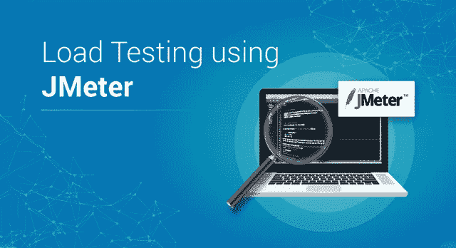

Load Testing using JMeter - Edureka

确保交付高质量的软件产品是很重要的。因此，参与产品测试的工程师采用不同的测试方法。需要确保应用程序运行时没有任何故障。本文将提供关于负载测试工具的深入知识，用于按以下顺序分析和测量性能:

*   什么是负载测试？
*   用于负载测试的工具
*   JMeter 是什么？
*   Jmeter 的优势
*   JMeter 的要素
*   使用 JMeter 进行负载测试(非 GUI 模式)
*   仪表板上的报告生成

# 什么是负载测试？

负载测试是一种性能测试，用于确定系统在真实条件下的性能。它检查系统在正常和高负载期间的行为，并确定系统、软件或计算设备是否能够在终端用户的高需求下处理高负载。


负载测试用于确定以下内容:

*   应用程序的最大运行能力
*   确定当前的基础架构是否足以运行应用程序
*   应用程序相对于峰值用户负载的可持续性
*   应用程序可以支持的并发用户数量，以及允许更多用户访问它的可伸缩性。

# 用于负载测试的工具

性能测试在实时中是非常重要的，尤其是从客户满意度的角度来看。有几种可用的性能测试工具，例如:

*   阿帕奇 JMeter
*   负载运行器
*   WebLOAD
*   装载机队
*   LoadView
*   新负载

Apache JMeter 是执行测试的最受欢迎的工具之一。让我们继续我们的文章，看看 JMeter 的所有优点。

# JMeter 是什么？

Apache JMeter 是一个测试工具，用于分析和测量不同软件服务和产品的性能。这是一个纯 Java 开源软件，用于测试 Web 应用程序或 FTP 应用程序。


它用于执行 web 应用程序的性能测试、负载测试和功能测试。JMeter 还可以通过为 web 服务器创建大量虚拟并发用户来模拟服务器上的重负载。

# JMeter 的优势

Apache JMeter 开源软件通过简化测试过程填补了一大空白。JMeter 的一些优势包括:


**开源**

JMeter 是一个开源软件。这意味着它可以免费下载。它也是一个 100%纯 Java 应用程序。开发人员可以使用它的源代码，可以根据他们的要求修改和定制它。


**人性化**

JMeter 有一个全面的 GUI，它有助于创建测试计划和配置元素。添加元素也很容易。你只需要右击树形场景，然后添加你需要做的事情。


**支持**

基本上，它是为性能测试而设计的，但也通过创建测试计划来支持其他非功能性测试，如压力测试、分布式测试、Web 服务测试等。


**综合文档**

这是需要强调的最重要的事情之一。由于其强大的文档，用户可以对每一个步骤有一个清晰的想法，从零开始，包括测试设置的安装和配置，并生成最终报告。


**录音**

JMeter 允许用户使用记录工具记录 HTTP/HTTPS 来创建测试计划。我们使用代理服务器，允许 JMeter 在您使用普通浏览器浏览 web 应用程序时观察和记录您的操作。


**报道**

JMeter 支持仪表板报告生成。通过 JMeter 生成大量的报告，帮助用户理解性能测试的执行结果。

# JMeter 的要素

JMeter 的不同组件被称为元素。每个元素都有特定的用途。一些主要因素是:

*   **线程组** —线程组是线程的集合。每个线程代表一个使用被测应用程序的用户。它模拟一个真实的用户对服务器的请求。线程组的控件还允许您设置每个组的线程数量。
*   **采样器** — JMeter 支持测试 HTTP、FTP、JDBC 和更多协议。线程组模拟用户对服务器的请求。采样器帮助线程组知道它需要发出哪种类型的请求。
*   **监听器** —监听器显示测试执行的结果。它们可以以不同的格式显示结果，如树、表、图或日志文件。
*   **配置** —配置元素用于设置缺省值和变量，供采样器稍后使用。

在使用 JMeter 的负载测试中，在非 GUI 模式下执行测试需要另一个新元素。

## 主张

JMeter 中的断言用于验证发送给服务器的请求的响应。断言是一个在运行时用请求的实际结果验证预期结果的过程。如果你需要在一个特定的采样器上应用断言，那么就把它作为这个采样器的子元素添加进去。

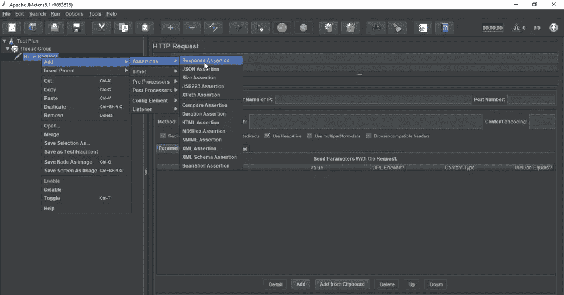

如果你需要在一个特定的采样器上应用断言，那么就把它作为这个采样器的子元素添加进去。您可以通过将“断言监听器”添加到线程组来查看断言结果。

*   **响应断言** —响应断言可用于添加模式字符串，并与服务器响应的一个或多个值进行比较。例如，当您向 URL:*[*https://www.google.com*](https://www.google.com)发送请求并获得服务器响应时，您可以使用响应断言来验证这一点。*

# *使用 JMeter 进行负载测试(非 GUI 模式)*

*在了解在非 GUI 模式下执行测试的步骤之前，让我们看看为什么我们更喜欢非 GUI 模式:*

*   *GUI 消耗更多的资源或内存*
*   *对于重负载测试，不推荐使用 GUI*
*   *命令行可以与其他系统集成*

*现在让我们看看使用 JMeter 和**命令提示符**进行负载测试的步骤。*

*   ***步骤 1** —首先您必须在 JMeter 的用户界面中创建一个测试计划。*

*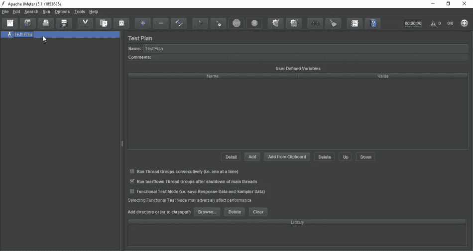*

*   ***第二步** —下一步是添加线程组，并指定线程或用户的数量以及循环计数。*

*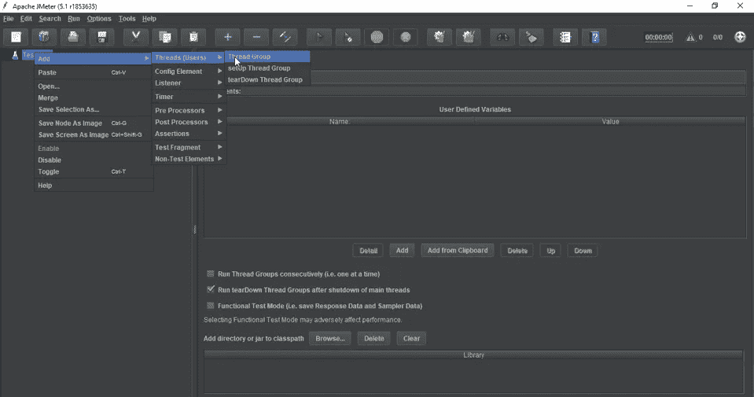*

*   ***步骤 3** —一旦创建了线程组，下一步就是添加 HTTP 请求并指定服务器名称和路径。现在将您的测试计划保存在任何文件夹中。*

*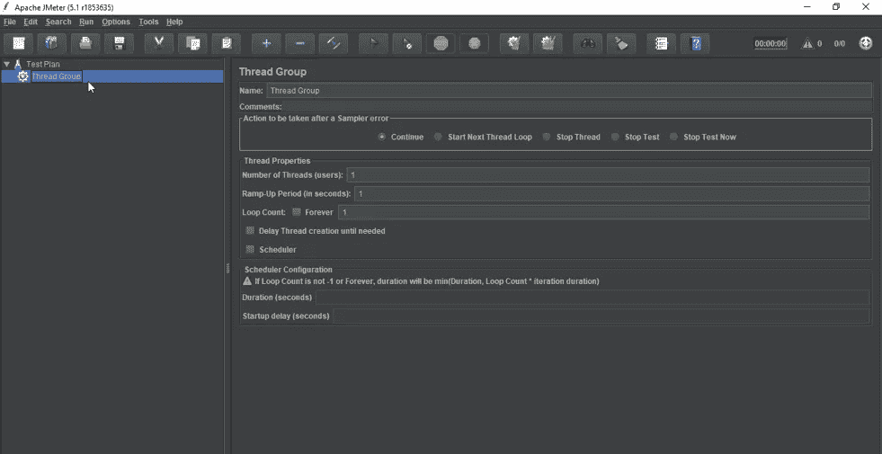*

*在命令提示符下运行测试计划的命令如下:*

```
*jmeter -n -t \Users\sundush_n\Downloads\apache-jmeter-5.1\bin\LoadTest\edureka.jmx -l \Users\sundush_n\Downloads\apache-jmeter-5.1\bin\LoadTest\loadtest.csv*
```

*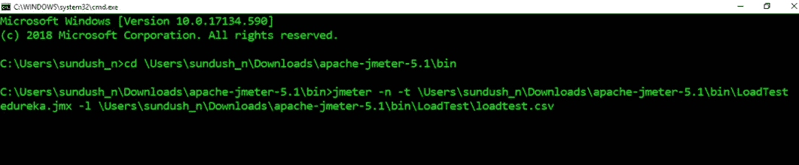*

*在哪里，*

***-n** - >非 GUI 模式
**-t**->jmeter 测试脚本的位置
**-l** - >结果文件的位置*

*   *现在，一旦您从命令提示符运行了测试，它会将结果存储在 **loadtest.csv** 文件中。*

*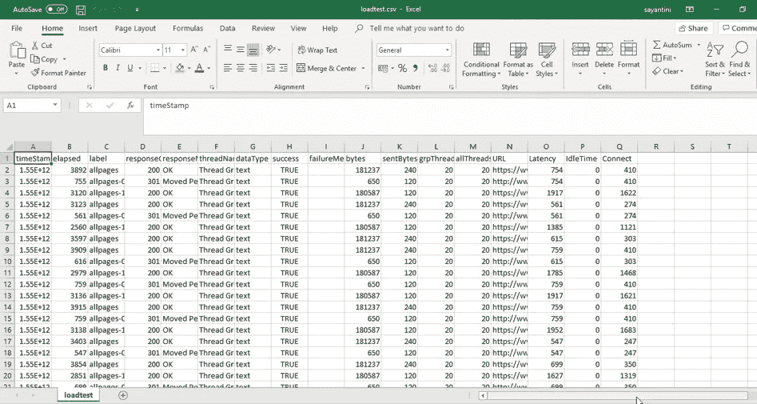*

*这些是通过命令提示符执行测试所涉及的**步骤**。现在让我们继续我们的文章，看看如何在 dashboard 上生成报告。*

# *仪表板上的报告生成*

*JMeter 支持仪表板报告生成，以从测试计划中获得图表和统计数据。仪表板生成器是 JMeter 的模块化扩展。它的默认行为是从 CSV 文件中读取和处理样本，以生成包含图形视图的 HTML 文件。它可以在负载测试结束时或根据需要生成报告。*

*在仪表板上生成报告的**命令**是:*

```
*jmeter -n -t \Users\sundush_n\Downloads\apache-jmeter-5.1\bin\LoadTest edureka.jmx -l \Users\sundush_n\Downloads\apache-jmeter-5.1\bin\LoadTest\loadtest.csv -e -o \Users\sundush_n\Downloads\apache-jmeter-5.1\bin\LoadTest\HTMLreport*
```

*在哪里，*

***-e** - >生成 HTML 报表
-**-o**->输出文件夹的位置*

*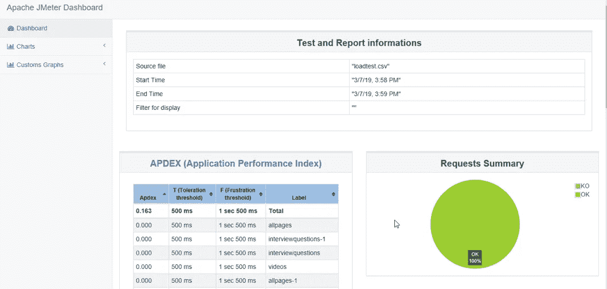*

*该报告提供了以下**指标**:*

*   ***APDEX** (应用程序性能指数)表根据可容忍和满足阈值的可配置值计算每个事务:*

*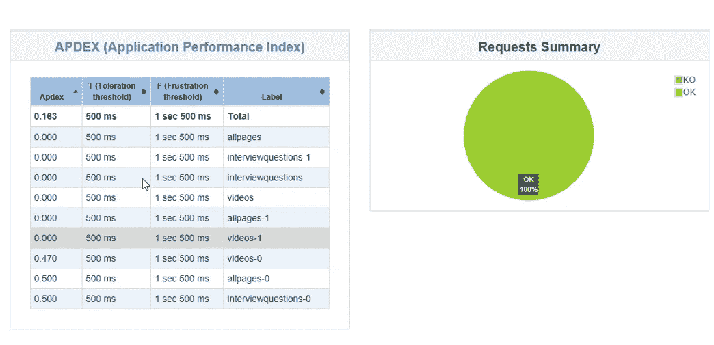*

*   ***统计表**在一个表格中提供每个交易的所有指标的汇总，包括 3 个可配置的百分点:*

*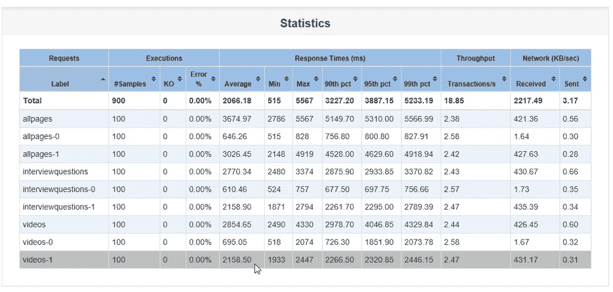*

*   ***一段时间内的响应时间**，包括交易控制器样本结果:*

*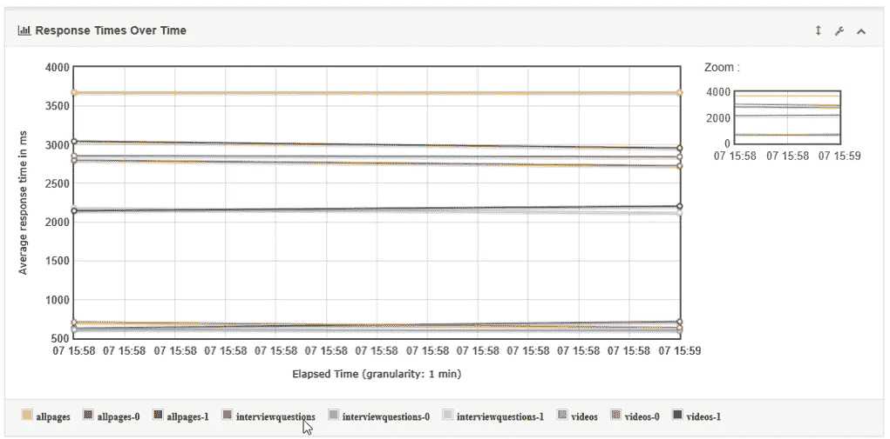*

*   ***一段时间内的响应时间百分比**，仅包括成功响应:*

*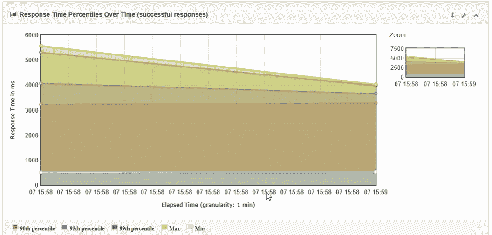*

*   ***一段时间内的活动线程**:*

*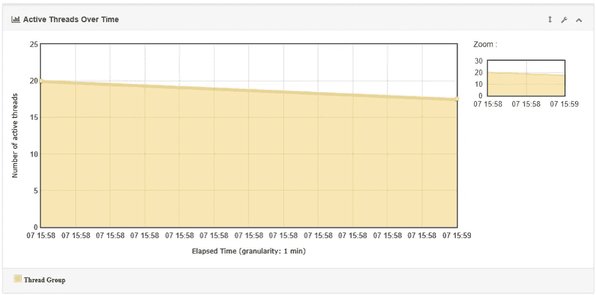*

*   ***一段时间内的延迟**:*

*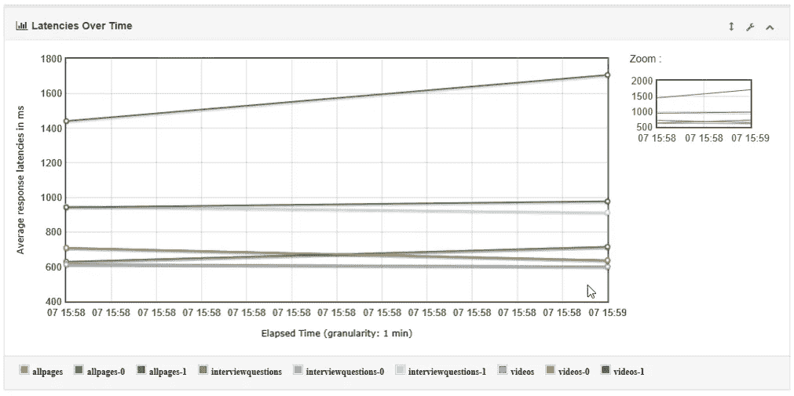*

*   ***响应时间百分位数**，包括交易控制器样本结果 **:***

*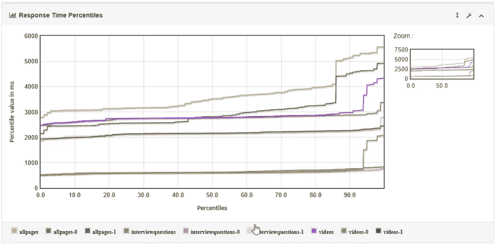*

*   ***响应时间概述**，不包括交易控制器样本结果:*

*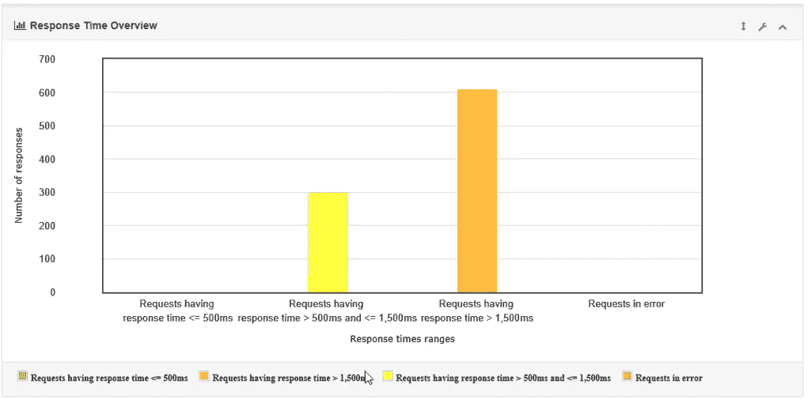*

*   ***时间 vs 线程**:*

*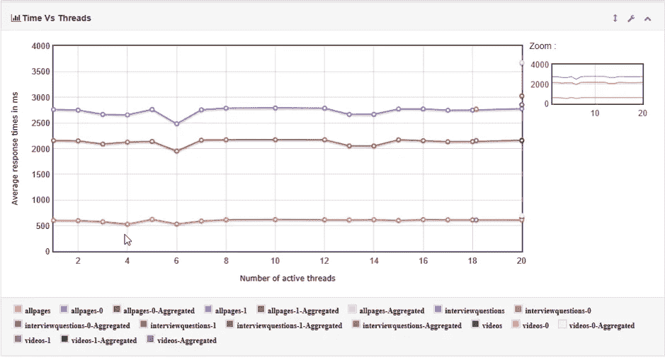*

*   ***响应时间分布**:*

**

*至此，我们结束了这篇使用 JMeter 进行负载测试的文章。如果你想查看更多关于 Python、DevOps、Ethical Hacking 等市场最热门技术的文章，那么你可以参考 [Edureka 的官方网站。](https://www.edureka.co/blog/?utm_source=medium&utm_medium=content-link&utm_campaign=load-testing-using-jmeter)*

*请留意本系列中的其他文章，它们将解释软件测试的各个方面。*

> *1.[移动应用测试](/edureka/mobile-application-testing-51140ebe4a87)*
> 
> *2.[软件测试工具](/edureka/software-testing-tools-ebd9ebac6f29)*
> 
> *3.[软件测试的类型](/edureka/types-of-software-testing-d7aa29090b5b)*
> 
> *4. [Appium 教程](/edureka/appium-tutorial-28e604aebeb)*
> 
> *5. [Appium 工作室教程](/edureka/appium-studio-tutorial-8a13ee9662d6)*
> 
> *6.[什么是功能测试？](/edureka/what-is-functional-testing-complete-guide-to-automation-tools-183e42ad517a)*
> 
> *7.[自动化测试教程](/edureka/automation-testing-tutorial-157d269e60db)*
> 
> *8.[功能测试与非功能测试](/edureka/functional-testing-vs-non-functional-testing-a08bc732fbdd)*
> 
> *9.JMeter vs LoadRunner*
> 
> *10.[回归测试](/edureka/regression-testing-b913b7064824)*
> 
> *11.[性能测试生命周期](/edureka/performance-testing-life-cycle-d4242d39a5aa)*
> 
> *12. [JMeter 插件](/edureka/jmeter-plugins-1bceec7f6226)*
> 
> *13. [Appium 建筑](/edureka/appium-architecture-505f70bf3484)*
> 
> *14.[如何在网站上使用 JMeter 进行压力测试？](/edureka/stress-testing-using-jmeter-e6b3c64299d0)*

**原载于 2019 年 3 月 11 日*[*www.edureka.co*](https://www.edureka.co/blog/load-testing-using-jmeter/)*。**