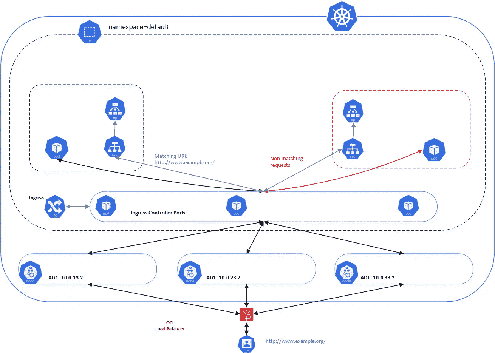
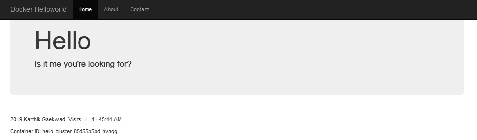
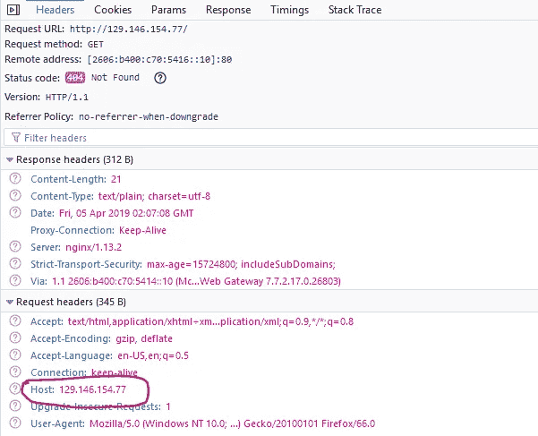

# 负载平衡器服务、Oracle 容器引擎(OKE)和 OCI DNS

> 原文：<https://medium.com/oracledevs/loadbalancer-service-oracle-container-engine-oke-and-oci-dns-d7b1f7b4f9bd?source=collection_archive---------0----------------------->

在 Kubernetes 中，有几种类型服务(ClusterIP、NodePort、LoadBalancer)。此外，还有入口和入口控制器。如果你仍然觉得这些令人困惑，我推荐 [Sandeep Dinesh](https://medium.com/u/bba63600816e?source=post_page-----d7b1f7b4f9bd--------------------------------) 的优秀[文章](/google-cloud/kubernetes-nodeport-vs-loadbalancer-vs-ingress-when-should-i-use-what-922f010849e0)。

让我们探索一下如何在 OKE 上部署一个公共可用服务，并确保它可以被 DNS 解析。

我假设您已经运行了一个 OKE 集群。如果没有，你可以跟随我之前的[帖子](/oracledevs/provisioning-oracle-container-engine-oke-using-terraform-41542fd15d1c)来创建一个。



## 创建应用程序服务

```
kubectl apply -f [https://raw.githubusercontent.com/hyder/okesamples/master/loadbalancer/hello-clusteripsvc.yaml](https://raw.githubusercontent.com/hyder/okesamples/master/loadbalancer/hello-clusteripsvc.yaml)deployment.apps/hello-cluster created                                                                                                                                       
service/hello-cluster-service created
```

验证它是否正常工作:

```
kubectl proxy — port=8080
```

使用浏览器访问以下 URL:[http://localhost:8080/API/v1/namespaces/default/services/hello-cluster-service:80/proxy/](http://localhost:8080/api/v1/namespaces/default/services/hello-cluster-service:80/proxy/)



## 创建默认后端、负载平衡器服务和 IngressController

```
kubectl apply -f [https://raw.githubusercontent.com/hyder/okesamples/master/loadbalancer/default-backend.yaml](https://raw.githubusercontent.com/hyder/okesamples/master/loadbalancer/default-backend.yaml)kubectl apply -f [https://raw.githubusercontent.com/hyder/okesamples/master/loadbalancer/hello-ingress.rbac.yaml](https://raw.githubusercontent.com/hyder/okesamples/master/loadbalancer/hello-ingress.rbac.yaml)kubectl apply -f [https://raw.githubusercontent.com/hyder/okesamples/master/loadbalancer/hello-ingresscontroller.yaml](https://raw.githubusercontent.com/hyder/okesamples/master/loadbalancer/hello-ingresscontroller.yaml)
```

## 创建入口

下载 hello-ingress.yaml:

```
curl -o hello-ingress.yaml [https://raw.githubusercontent.com/hyder/okesamples/master/loadbalancer/hello-ingress.yaml](https://raw.githubusercontent.com/hyder/okesamples/master/loadbalancer/hello-ingress.yaml)
```

编辑 hello-ingress.yaml:

```
spec:
  rules:
  # replace [www.](http://www.example.org)example.org with your FQDN
  - host: [www.](http://www.example.org)example.org
```

现在，您可以创建入口:

```
kubectl apply -f hello-ingress.yaml
```

## 测试入口

获取负载平衡器的公共 IP 地址，并尝试直接访问它:

公共 IP 地址将位于外部 IP 列下。在上面的例子中，负载平衡器的公共 IP 地址是 129.146.154.77

如果您尝试使用浏览器中的 IP 地址访问 hello 服务，将会返回“默认后端-404”。这是因为在我们创建的入口中，我们将规则指定为基于主机而不是基于 IP:

```
spec:
  rules:
  - host: [**www.example.org**](http://www.example.org)
```

浏览器中 HTTP 请求头中的主机值是没有规则的 IP 地址。由于没有匹配的规则，请求由默认的后端服务。



编辑本地主机文件并添加一个条目，确保主机与您在入口中输入的内容相匹配:

```
129.146.154.77 [www.example](http://www.example).org
```

现在使用您的浏览器访问主机，您应该能够看到 Helloworld 页面。

*警告:如果您在代理后面的网络中进行测试，这将不起作用。*

## 在 OCI 配置 DNS

1.  登录 OCI 控制台，导航至边缘服务> DNS 区域管理
2.  创建一个区域，并确保区域名称与您的域名相匹配，例如 example.com。
3.  创建完成后，单击该区域并记下该区域的名称服务器。
4.  登录您的 DNS 注册商，例如 Dyn、GoDaddy，并在步骤 3 中更改您的名称服务器以指向您的区域中的区域。这可能需要一段时间才能生效。
5.  返回 OCI 控制台，点击“添加记录”
6.  选择“A-IP v4 地址”
7.  添加 FQDN，例如:
    (***注意:*** 您只需要在名称字段中添加主机名)
8.  在地址字段中，添加负载平衡器的公共 IP 地址。
9.  添加 TTL 值，例如 3600
10.  点击“提交”,然后点击“发布更改”
11.  从您在上一步中添加的 hosts 文件中远程添加条目。
12.  一旦您的 DNS 提供商和其他网络所做的更改生效，您应该能够在浏览器中使用您的 FQDN 访问 Helloworld 页面。

对于 DNS 的快速介绍，你可以查看这些[幻灯片](https://www.slideshare.net/dyninc/intro-to-dns-101-dyn-chief-scientist-tom-daly)。

*注意——免费层用户可能会体验到其帐户所含服务的变化。*