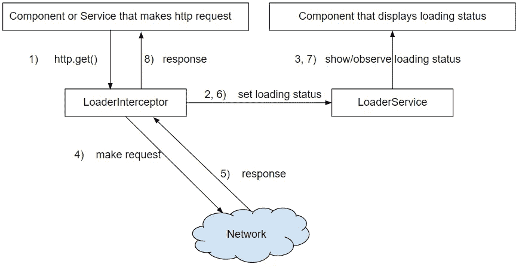

# 装载-角度状态正确

> 原文：<https://medium.com/compendium/loading-status-in-angular-done-right-aeed09cfbea6?source=collection_archive---------0----------------------->

*jrn Are hat lelid—前端技术负责人*

## **在你的 web 应用程序中拥有一个全局加载状态是有用的，但是不容易正确。**

挑战在于捕获所有的 HTTP API 请求，并在有服务器通信时显示加载栏、微调器或文本状态。

除了这篇博文，你还可以在 [Stackblitz](https://stackblitz.com/edit/angular-o3my4y) 找到一个工作实例。

[Angular](https://angular.io/) 4+有一个新的 [HttpClient](https://angular.io/api/common/http/HttpClient) ，它支持 [HttpInterceptor](https://angular.io/api/common/http/HttpInterceptor) 。

这允许您插入每当发出 HTTP 请求时都会运行的代码。这对于捕捉所有请求非常有用，但是我们还需要一个定制服务来共享我们是否有未决请求的信息。这是因为拦截器本身不应该被共享。



作为一个最小的例子，我们应该有:

HttpInterceptor 类“LoaderInterceptor”拦截所有 HTTP 请求，并告诉“LoaderService”我们是否有挂起的请求:

```
// There are a lot of missing pieces here, so bear with me for now
@Injectable() export class LoaderInterceptor implements HttpInterceptor {
   constructor(private loaderService: LoaderService) { } // This is the code that will run whenever an HttpRequest is made
   intercept(req: HttpRequest, next: HttpHandler): Observable<HttpEvent> {
       this.loaderService.isLoading.next(true);
       return next.handle(req).map(
           () => this.loaderService.isLoading.next(false)
       );
   }
}
```

包含“isLoading”流的“loader service ”, http interceptor 可以将状态推送到该流，哪些组件可以订阅该流以获取状态:

```
@Injectable()
export class LoaderService {
   // A BehaviorSubject is an Observable with a default value
   public isLoading = new BehaviorSubject(false);
   constructor() {}
}
```

连接“LoaderService”和模板的组件:

```
@Component({...})
export class MyComponent {
   constructor(public loaderService: LoaderService) {}
}
```

显示“正在加载”状态的 HTML/Angular 模板:

```
<div *ngIf="loaderService.isLoading | async; else notLoading">Loading!</div>
<ng-template #notLoading>Not Loading!</ng-template>
```

这看起来很简单，但是有一些陷阱。

首先，您可能注意到拦截器代码假设一次只有一个 HTTP 请求。

如果有两个请求，我们将在第一个响应返回后立即关闭加载程序。

让我们通过将所有挂起的请求保存在一个数组中来处理这个问题，并创建一个函数在需要时删除一个请求:

```
@Injectable()
export class LoaderInterceptor implements HttpInterceptor {
   // We need to store the pending requests
   private requests: HttpRequest[] = [];
   constructor(private loaderService: LoaderService) { } removeRequest(req: HttpRequest) {
       const i = this.requests.indexOf(req);
       if ( i >= 0) {
          this.requests.splice(i, 1); // This removes the request from our array
       }
       // Let's tell our service of the updated status
       this.loaderService.isLoading.next(this.requests.length > 0);
   } intercept(req: HttpRequest, next: HttpHandler): Observable<HttpEvent> {
       this.requests.push(req); // Let's store this request
       this.loaderService.isLoading.next(true);
       next.handle(req).map(() => { this.removeRequest(req); });
   }
}
```

需要注意的是，HttpRequest 的响应是短暂的，在响应、错误或超时后终止。这意味着您不必手动取消订阅。太好了！。

此外，如果可观察对象在响应返回之前被取消订阅，请求将被取消，两个处理程序都不会被处理。

因此，你可能会有一个“悬挂”的加载条，它永远不会消失。

如果您在应用程序中导航得太快，通常会发生这种情况，这会导致组件被破坏，订阅会自动取消。

为了解决最后一个问题，我们需要创建一个新的可观察对象来附加拆卸逻辑。拆除逻辑是当可观察对象被取消订阅时自动处理的代码。

然后我们返回这个新的可观测值，而不是原来的可观测值。由于它们没有连接，我们还需要转发事件、错误和关闭状态，这样作为开发人员的您根本不会注意到拦截器的存在。

那么，让我们来看看最后的 LoaderInterceptor 类:

```
@Injectable()
export class LoaderInterceptor implements HttpInterceptor {
 private requests: HttpRequest[] = []; constructor(private loaderService: LoaderService) { } removeRequest(req: HttpRequest) {
   const i = this.requests.indexOf(req);
   if (i >= 0) {
     this.requests.splice(i, 1);
   }
   this.loaderService.isLoading.next(this.requests.length > 0);
 } intercept(req: HttpRequest, next: HttpHandler): Observable<HttpEvent> {
   this.requests.push(req);
   this.loaderService.isLoading.next(true);
   // We create a new observable which we return instead of the original
   return Observable.create(observer => {
     // And subscribe to the original observable to ensure the HttpRequest is made
     const subscription = next.handle(req)
       .subscribe(
       event => {
         if (event instanceof HttpResponse) {
           this.removeRequest(req);
           observer.next(event);
         }
       },
       err => { this.removeRequest(req); observer.error(err); },
       () => { this.removeRequest(req); observer.complete(); });
     // return teardown logic in case of cancelled requests
     return () => {
       this.removeRequest(req);
       subscription.unsubscribe();
     };
   });
 }
}
```

我们的组件不需要改变。我们使用相同的 LoaderService 和异步操作符，我们甚至不需要订阅。

因为我们想要使用的源值来自服务，所以它作为可观察对象被共享(BehaviorSubject 继承自 Observable ),这样它就获得了使用它的渲染范围/区域。如果它只是一个值，它可能不会按照您的要求更新您的 GUI。

最后一步是为应用程序提供服务。我通常在“核心”目录中创建一个单独的模块，然后将它导入到 AppModule 中:

```
@NgModule({
   providers: [
     LoaderService,
     { provide: HTTP_INTERCEPTORS,
       useClass: LoaderInterceptor,
       multi: true
     }
   ]
})
export class LoaderModule { }
```

我们已经展示了如何在 Angular 应用程序中实现加载器状态。如果应用程序需要，还可以将挂起请求的数量推送到 LoaderService。

祝你好运，记得查看一下 [Stackblitz 示例](https://stackblitz.com/edit/angular-o3my4y)。

# 约恩是哈特利德

*jrn Are 是 Computas 的前端技术领导者，拥有 20 多年的网络经验。他使用 Angular 编码和交付项目已经将近 3 年了，在此之前是 AngularJS。可测试性和代码质量是他最关心的。*