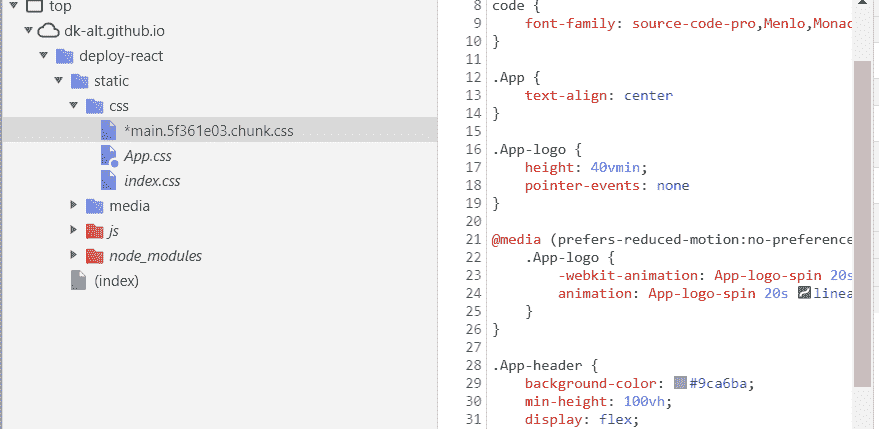

# 本地覆盖 chrome 的一个智能附件

> 原文：<https://medium.com/globant/local-overrides-a-smart-add-on-to-chrome-fee3f6993ea0?source=collection_archive---------0----------------------->

Chrome (65) DevTools 有一个很棒的特性叫做本地覆盖。一个不言自明的术语允许在任何实时站点上覆盖 CSS、JS 和 DOM。更改保存在本地文件中，并覆盖实时环境。

您一定在想为什么我们需要本地覆盖，因为我们可以检查元素、调整样式或修改标记，并立即看到结果。这有助于解决各种问题，以及试验潜在的变化。

但是检查和修改元素的缺点是，如果您转到不同的页面，或者刷新页面，您的更改不会持久。

因此，它的解决方案是本地覆盖。

让我们看看可以使用本地覆盖的用例。

**持续本地超控**

它允许您在本地持久化所做的更改。现在，您可以尝试一些东西，而不会在下次刷新或离开页面时丢失它们。

让我们开始吧。

> ***打开“来源”选项卡，并转到“覆盖”子选项卡。***

The **Overrides** tab

> ***点击“选择覆盖文件夹”并选择保存更改的目录。***

Local override folder is selected from the drive and checkbox is enabled

> 在视窗的顶部，点击“允许”赋予 DevTools 对该目录的读写权限。做出你的改变。

*   ***点击页面并选择相关的 CSS 文件。***

*   ***修改后，可以点击 override 标签页查看相关文件的修改。***

*   ***的修改也可以在修改页签中看到，如下图***

> 在所有的改变之后，你可以重新加载页面，它从本地拷贝而不是服务器加载文件。

# 性能工具

本地覆盖对与绩效相关的发展也有影响。

设置了本地覆盖后，您现在能够在非本地站点上对代码进行更改，然后查看这些更改会对性能产生什么样的影响。如果你在本地工作，这些新功能的价值可能有限。但是，如果你想在一个非本地的网站上进行试验，而且速度很快，这些新功能提供了很多可能性。

# 优势

这个特性的主要优点是，如果您在任何时候面临任何部署问题，您可以借助本地覆盖来测试您的组件，以检查它在更高的环境中的行为。

# 让我们来欣赏一下快速演示吧！！！

# 摘要

*"* ***本地覆盖*** *"为开发人员的调试功能提供附加功能，帮助调试有问题的功能，这些功能不会像在生产或试运行环境中一样在本地重现相同的问题。*

我希望在这篇文章上投入一点时间可以帮助您节省大量的调试时间。😊

> 直到我们再次见面快乐编码！！！