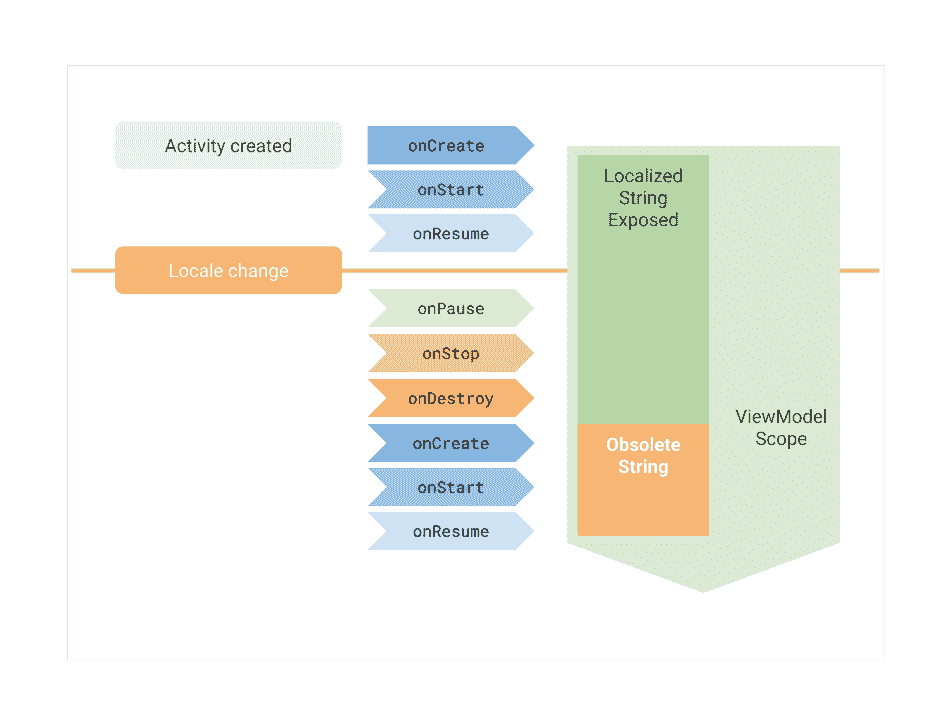

# 地区变更和 AndroidViewModel 反模式

> 原文：<https://medium.com/androiddevelopers/locale-changes-and-the-androidviewmodel-antipattern-84eb677660d9?source=collection_archive---------2----------------------->

> TL；DR:从视图模型中公开资源 id，以避免显示过时的数据。

在 ViewModel 中，如果你要公开来自资源的数据(字符串、可绘制图形、颜色……)，你必须考虑到 ViewModel 对象会忽略配置变化，比如**地区变化**。当用户更改他们的区域设置时，活动被重新创建，但是 ViewModel 对象没有。

*The localized string is not updated after a locale change*

`AndroidViewModel`是`ViewModel`的一个子类，它知道应用程序的上下文。然而，如果您没有观察上下文的生命周期或对其做出反应，那么访问上下文可能是危险的。**推荐的做法是避免在视图模型中处理具有生命周期的对象。**

让我们来看一个基于跟踪器中这个问题的例子: [*在系统区域设置改变时更新 ViewModel*](https://issuetracker.google.com/issues/111961971)*。*

问题是字符串在构造函数中只被解析一次。**如果语言环境发生了变化，ViewModel 将不会被重新创建**。这将导致我们的应用程序显示过时的数据，因此只有部分本地化。

正如 [Sergey](https://twitter.com/ZelenetS) 在针对该问题的[评论](https://issuetracker.google.com/issues/111961971#comment2)中指出的，推荐的方法是**公开您想要加载的资源的 ID，并在视图**中这样做。作为视图(活动、片段等。)是生命周期感知的，它将在配置更改后被重新创建，因此资源将被正确地重新加载。

即使您不打算本地化您的应用程序，它也会使测试变得更加容易，并清理您的 ViewModel 对象，因此没有理由不面向未来。

我们在 android 架构仓库的 [Java](https://github.com/googlesamples/android-architecture/pull/631) 和 [Kotlin](https://github.com/googlesamples/android-architecture/pull/635) 分支中修复了这个问题，我们将资源加载卸载到[数据绑定布局](https://github.com/googlesamples/android-architecture/pull/635/files#diff-7eb5d85ec3ea4e05ecddb7dc8ae20aa1R62)。