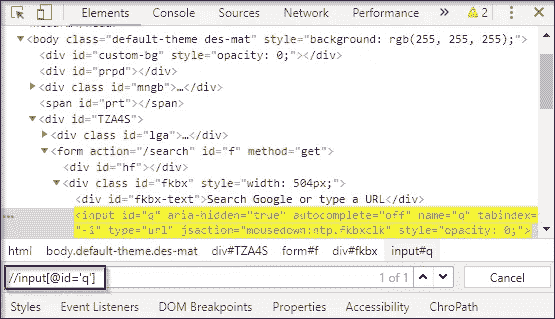

# 如何在 Selenium 中使用定位器定位网页上的元素？

> 原文：<https://medium.com/edureka/locators-in-selenium-f6e6b282aed8?source=collection_archive---------2----------------------->


Locators in Selenium — Edureka

如果你想学习在网页上定位元素的最简单的方法，那么你已经到达了完美的地方。定位元素的确是一场噩梦，因为在网页中找到 web 元素并使之自动化是一件非常复杂的事情。为了简化这个任务，我们在 Selenium 中使用了定位器。在本文中，我将简要介绍不同类型的定位器以及相关示例。

*   Selenium 中的定位器是什么？
*   定位器的类型

1.  Id 定位器
2.  名称定位器
3.  链接文本和部分链接文本
4.  CSS 选择器
5.  XPath

*   硒定位器的最佳实践

# Selenium 中的定位器是什么？

定位符被定义为在网页内唯一标识 web 元素的地址。这个命令告诉 Selenium IDE 它需要操作哪些 GUI 元素——文本框、按钮、复选框等等。找到正确的 GUI 元素是创建自动化脚本的先决条件，但是准确识别 GUI 元素比听起来要困难得多。有时，您甚至可能最终使用不正确的 GUI 元素或者根本没有元素！因此，使用正确的定位器可以确保测试更快、更可靠或者在发布时维护更少。


如果您足够幸运，能够使用惟一的 id 和类，那么您通常就万事俱备了。但有时选择正确的定位器会成为一场噩梦，因为在网页中查找 web 元素非常复杂。

理解了这一点，让我们更深入地了解 Selenium 中的各种类型的定位器。

# Selenium 中的定位器类型

有各种各样的 web 元素，如文本框、id、单选按钮等。它需要一种有效和准确的方法来识别这些元素。因此，您可以断言，随着 locator 有效性的增加，自动化脚本的稳定性也会增加。


为了准确无误地识别 web 元素，selenium 使用了不同类型的定位器。它们如下:

*   Id 定位器
*   名称定位器
*   链接文本和部分链接文本
*   CSS 选择器
*   XPath

## Id 定位器

识别 web 元素最流行的方法是使用 Id。Id 被认为是最安全和最快的定位器选项，即使有多种选择，也应该始终是首选。例如，员工编号或帐户将是唯一的。

现在，让我们借助一个例子来理解 ID 定位器的工作原理。我将启动谷歌浏览器，导航到 yahoo.com。这里，我将尝试使用 **ID 定位器**来定位*电子邮件文本框*。


在检查上面的 web 元素时，您可以看到它有一个输入标记和属性，如 class 和 id。现在，我将使用 Id locator 的值，即 **login-username** 来定位电子邮件文本框。


让我们看看如何自动化文本框，并使用 Id locator 向其发送值。

```
package Edureka;
import java.util.concurrent.TimeUnit;
import org.openqa.selenium.By;
import org.openqa.selenium.chrome.ChromeDriver;
public class Locators {
public static void main(String[] args) {
System.setProperty("webdriver.chrome.driver", "C:\\Selenium-java-edureka\\chromedriver_win32\\chromedriver.exe");
WebDriver driver = new ChromeDriver();
driver.manage().window().maximize();
driver.manage().deleteAllCookies();
driver.manage().timeouts().pageLoadTimeout(40, TimeUnit.SECONDS);
driver.manage().timeouts().implicitlyWait(30, TimeUnit.SECONDS);
driver.get("[https://login.yahoo.com/](https://login.yahoo.com/)");
driver.findElement(By.id("login-username")).sendKeys("[edureka@yahoo.com](mailto:edureka@yahoo.com)"); //id locator for text box
WebElement searchIcon = driver.findElement(By.id("login-signin"));//id locator for next button
searchIcon.click();
}
```

当你运行上面的 Java 程序， ***chrome 驱动*** 会启动谷歌 chrome，重定向到雅虎邮箱，输入邮箱地址，导航到下一页。您可以参考下面的输出图像:


我希望这能让您清楚地了解 Selenium 中的 Id locator 是如何工作的。现在让我们进一步了解如何使用名称定位器。

## 名称定位器

这也是定位具有 name 属性的元素的有效方法。使用这种策略，将返回具有 name 属性值的第一个元素。如果没有元素具有匹配的 name 属性，那么将引发一个 **NoSuchElementException** 。

现在，让我们借助一个例子来看看名称定位器的工作原理。在下图中，你可以看到，名称定位器拥有一个名为用户名的值。这里的区别是你应该使用一个名字而不是 id。


让我们来看看下面的代码来自动化文本框。

```
driver.get("[https://login.yahoo.com/](https://login.yahoo.com/)");
driver.findElement(By.name("username")).sendKeys("[edureka@yahoo.com](mailto:edureka@yahoo.com)"); //name locator for text box
WebElement searchIcon = driver.findElement(By.name("signin"));//name locator for next button
searchIcon.click();
```

在上面的代码中，我将下一个按钮*的名称定位符的值指定为 **signin，**因为当你检查那个按钮时，你可以在下图中看到它的值是 **signin** 。*


当您运行上面的 Java 代码时，您的输出将与 Id locator 相同。现在，让我们了解另一个定位器，即链接文本。

## 链接文本

您可以使用 *linkText* 识别网页上的超链接。可以借助*锚定标签* ( < a >)来确定。为了在网页上创建超链接，您可以使用后跟链接文本的锚标记。

现在，让我们借助一个例子来看看 linkText 定位器的工作原理。假设你想定位'*登录困难？*'链接如下图所示。你会怎么做？

让我带你经历这些步骤。


关于检查"*签到有问题吗？"* —你可以注意到它以一个锚标记开始。但是，这个锚标记没有任何名称和 Id 属性。在这种情况下，你可以使用 **linkText** 定位器。


正如你在上面的代码片段中看到的，它有一个名为*“登录有问题吗？”*。我将利用该文本并使用一个 linkText 定位器来编写我的代码，如下所示。

```
driver.get("[https://login.yahoo.com/](https://login.yahoo.com/)");
driver.findElement(By.linkText("Trouble Signing in?")).click();//linkText locator for links
```

在执行上述代码时，您将被重定向到*“登录有问题吗？”*页面如下所示。


在某些情况下，您可能需要通过 *linkText* 元素中的部分文本来查找链接。在这种情况下，您可以使用*部分链接文本*来定位元素。我们举同样的例子，试着定位一下。我会选择*“签到麻烦？”*链接。现在，我不再粘贴全文，而是将它作为*故障*给出。所以我会像这样修改我的代码

```
driver.get("[https://login.yahoo.com/](https://login.yahoo.com/)");
driver.findElement(By.partiallinkText("Trouble")).click();//partiallinkText locator for links
```

现在，当您运行上述代码时，它将被重定向到“*登录困难？”*页面，但不同的是，你使用部分值来定位链接。我希望这能让您清楚地了解 selenium 中的 linkText 和 partialLinkText 定位器是如何工作的。现在让我们进一步了解 selenium 中最简单的定位器之一。

## CSS 选择器

CSS 主要用于为网页提供样式规则，您可以使用它来识别网页中的一个或多个元素。CSS 选择器始终是在页面中定位复杂元素的最佳方式。


让我们以 y *ahoo 登录页面*为例，使用 CSS 选择器。我将检查电子邮件文本框元素。CSS 选择器总是以 **#** 开始，并且在输入 *Id* 属性的值作为*登录用户名*时，该元素被高亮显示。这意味着它能够使用 CSS 选择器定位元素。现在，让我们复制这个值并使用 eclipse 中的 CSS 选择器来理解它的工作原理。所以，我的代码是这样的-

```
driver.findElement(By.cssSelector("#login-username")).sendKeys("[edureka@yahoo.com](mailto:edureka@yahoo.com)");
driver.findElement(By.cssSelector("#login-signin")).click();
```

当您运行上面这段代码时，您将被重定向到*雅虎登录页面*，并要求您输入密码。事情就是这样的。现在让我们深入本文的最后一个定位器，理解 XPath。

## XPath

XPath 是一种查询 XML 文档的语言。XPath 是在 selenium 中定位元素的重要策略。它还包含一个路径表达式和一些条件。在这里，您可以轻松地编写 XPath 脚本/查询来定位网页中的任何元素。

现在，让我们借助一个例子来理解这一点。我将启动谷歌浏览器并导航至 google.com。在这里，我将尝试使用 XPath 定位搜索框。在检查 web 元素时，您可以看到它有一个输入标记和属性，如 class 和 id。接下来，我将利用标记名和这些属性来构造 XPath，XPath 反过来将定位搜索栏。


你只需要点击元素标签，按 Ctrl + F，就可以在 Chrome 的开发者工具里打开一个搜索框。在这里，你可以写 XPath，字符串选择器，它给出基于那个标准的搜索。

在上图中，你可以看到它有一个输入标签。现在，我将从//输入开始。这里//input 暗示了一个标签名。我将利用 *name* 属性，并将单引号中的“q”作为其值传递。这将给出下面的 XPath 表达式:

```
//input[@name=’q’]
```



在上图中，您可以看到，在编写 XPath 时，它突出显示了元素，这意味着这个特定的元素是使用 XPath 定位的。

现在，您可以在 Eclipse 中使用下面的代码通过 XPath 定位特定的元素。

```
driver.get("[https://www.google.com/](https://www.google.com/)");
driver.findElement(By.xpath("//input[[@id](http://twitter.com/id)='q']")).sendKeys("Selenium"); //xpath for search box
WebElement searchIcon = driver.findElement(By.xpath("//input[[@id](http://twitter.com/id)='Google Search']"));//xpath for search button
```

在编写这段代码时，它会自动搜索 Selenium。基本上，这就是使用 XPath 的方法。

这是关于 Selenium 中不同类型的定位器。现在让我们进一步了解使用 Selenium 定位器的一些最佳实践。

# Selenium 定位器最佳实践

理解 Selenium 中定位器的概念是一回事，但知道如何使用它们完全是另一回事。能够构建健壮的定位器始于理解什么是健壮的定位器。下面列出了在 selenium 中使用定位器时必须遵守的三个标准:

*   **Selenium 中的健壮定位器尽可能简单小巧:**定位器包含的元素越多，由于页面结构的变化，它出错的几率就越高。
*   **Selenium locators 在你改变了一个 UI 元素的属性之后仍然工作:**依赖于频繁改变的属性，比如修饰符类(menu _ _ item–red)，从来都不是一个好的做法。
*   **本质上健壮的 Selenium 定位器在您更改目标元素周围的 UI 元素后仍然工作:**每当您使用非唯一属性时，定位器都有可能会中断，因为有人添加了上面具有相同属性的元素。

这就把我们带到了这篇关于 Selenium 中的定位器的文章的结尾。希望对你有帮助，让你的知识增值。

如果你想查看更多关于人工智能、DevOps、道德黑客等市场最热门技术的文章，你可以参考 Edureka 的官方网站。

请留意本系列中的其他文章，它们将解释硒的各个方面。

> 1.[硒教程](/edureka/selenium-tutorial-77879a1d9af1)
> 
> 2.[Selenium web driver:TestNG For Test Case Management&报告生成](/edureka/selenium-webdriver-tutorial-e3e6219f21ad)
> 
> 3.[构建数据驱动、关键字驱动的&混合 Selenium 框架](/edureka/selenium-framework-data-keyword-hybrid-frameworks-ea8d4f4ce99f)
> 
> 4. [XPath 教程](/edureka/xpath-in-selenium-cd659373e01a)
> 
> 5.[等待硒](/edureka/waits-in-selenium-5b57b56f5e5a)
> 
> 6.[为分布式硒测试设置硒网格](/edureka/selenium-grid-tutorial-ef342799c484)
> 
> 7.[硒使用 Python](/edureka/selenium-using-python-edc22a44f819)
> 
> 8.[使用 LambdaTest 进行跨浏览器测试](/edureka/cross-browser-testing-9299b04ce277)
> 
> 9.[使用 Selenium 进行跨浏览器测试](/edureka/cross-browser-testing-using-selenium-90b1911c6d60)
> 
> 10.[处理硒中的多个窗口](/edureka/handle-multiple-windows-in-selenium-727ba5f8f6a7)
> 
> 11.[硒中的页面对象模型](/edureka/page-object-model-in-selenium-bc4d7c8c4203)
> 
> 12.[硒项目](/edureka/selenium-projects-b2df15d35fe2)
> 
> 13. [QTP vs 硒](/edureka/qtp-vs-selenium-338f3d3bbfa7)
> 
> 14.[硒对 RPA](/edureka/selenium-vs-rpa-84159dbcd0f2)
> 
> 15.[硒网络驱动架构](/edureka/selenium-webdriver-architecture-565e2db26dd5)
> 
> 16.[硒异常的处理](/edureka/exceptions-in-selenium-369c38155e7d)
> 
> 17.[使用黄瓜&硒](/edureka/cucumber-selenium-tutorial-aefec05f4733)进行网站测试

*原载于 2019 年 2 月 20 日*[*www.edureka.co*](https://www.edureka.co/blog/locators-in-selenium/)*。*