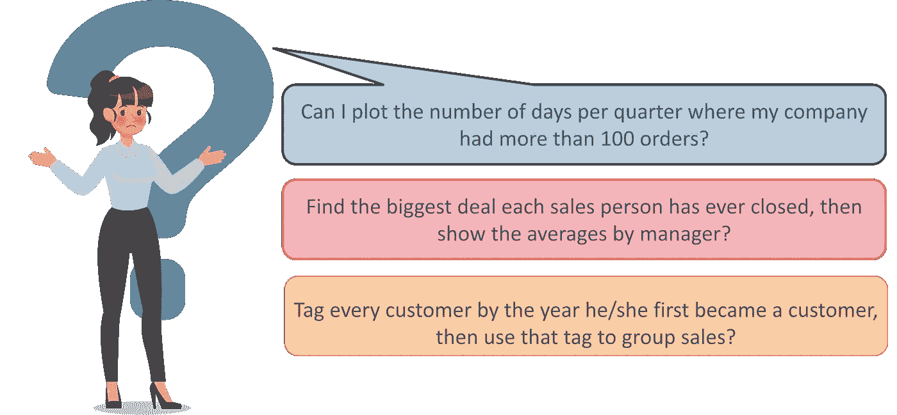
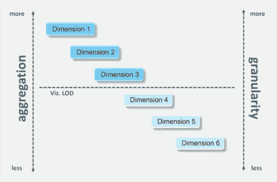

# LOD 表达式如何在 Tableau 中工作？

> 原文：<https://medium.com/edureka/lod-expressions-work-in-tableau-c9b4eabf61cd?source=collection_archive---------0----------------------->

任何 BI 工具的目的都是为了给 ***数据分析*** 一个更好的流程。如果一个人，作为一个专业人士，在解决一个问题时面临使用工具的困难，流动的状态就被打破了。这个问题的一个常见原因是需要处理已经在 Tableau (LOD) 中聚合到不同 ***细节级别的数据。***

在 Gartner 的魔力象限中，Tableau 连续第六次位居榜首，这无疑说明了它在市场中的需求。这大概是 [Tableau 认证课程](https://www.edureka.co/tableau-certification-training)最好的时机。

本博客将帮助您理解 LOD 表达式并讨论以下主题:

*   [**为什么 Tableau 中需要细节层次？**](https://www.edureka.co/blog/tableau-lod/#Why_do_you_need_Level_of_Detail_in_Tableau)
*   [**Tableau 中的细节层次是什么？**](https://www.edureka.co/blog/tableau-lod/#What_is_Level_of_Detail_in_Tableau)
*   [**行级&视图级表达式**](https://www.edureka.co/blog/tableau-lod/#Row_Level_and_View_Level_Expressions)
*   [**LOD 表达式的类型**](https://www.edureka.co/blog/tableau-lod/#Types_of_LOD_Expressions)
*   [**聚合和 LOD 表达式**](https://www.edureka.co/blog/tableau-lod/#Aggregation_and_LOD_Expressions)
*   [**滤镜和 LOD 表达式**](https://www.edureka.co/blog/tableau-lod/#Filters_and_LOD_Expressions)
*   [**创建 LOD 表达式**](https://www.edureka.co/blog/tableau-lod/#Creating_LOD_Expressions)
*   [**数据源支持表**](https://www.edureka.co/blog/tableau-lod/#Data_Sources_supporting_Level_Of_Detail_in_Tableau) 中的明细级别
*   [**表格计算 vs Tableau 中的详细程度**](https://www.edureka.co/blog/tableau-lod/#Table_Calculations_vs_LOD)
*   [**Tableau 中细节层次的限制**](https://www.edureka.co/blog/tableau-lod/#Limitations_of_Level_Of_Detail_in_Tableau)

## Tableau LOD:为什么需要 LOD？

在分析数据时，经常会遇到一些问题。这些问题通常问起来简单，但很难回答。它们通常听起来像这样:

为了解决这些类型的问题，Tableau 9.0 中引入了一种称为**细节层次**的新语法。这种新的语法简化并扩展了 Tableau 的计算语言，使得直接解决这些问题成为可能。

## Tableau LOD:什么是 LOD？

*LOD 表达式代表了一种优雅而强大的方式来回答涉及单个可视化中多个粒度级别的问题。*

Tableau 或 LOD 表达式中的细节级别允许您计算数据源级别和可视化级别的值。然而，LOD 表达式为您提供了对想要计算的粒度级别的更多控制。它们可以在*更细粒度的*级别(包括计算)、一个*更细粒度的*级别(不包括计算)或一个*完全独立的级别* l(固定计算)上执行。

# Tableau LOD:行级和视图级表达式

## 行级别

在 Tableau 中，为基础表中的每一行计算引用**未聚合的**数据源列的表达式。在这种情况下，表达式的维度是*行级别*。行级表达式的一个示例是:

`[Sales] / [Profit]`

该计算将在数据库的每一行中进行评估。每行中的销售值将除以该行中的利润值，产生一个新列，其中包含相乘的结果(利润率)。

如果使用此定义创建计算，用名称[ProfitRatio]保存它，然后将其从数据窗格拖到工具架，Tableau 通常会聚合视图的计算字段:

`SUM[ProfitRatio]`

## 视图级别

相比之下，引用**聚合**数据源列的表达式是在视图中由维度定义的维度上计算的。在这种情况下，表达式的维度是视图级别。视图级表达式的一个示例是:

`SUM(Sales) / SUM(Profit)`

如果您将该计算拖到一个架子上(或者作为特别计算直接在架子上键入)，Tableau 会将它包含在一个 **AGG 函数**中:

`AGG(SUM(Sales) / SUM(Profit))`

这就是所谓的**聚合计算**。

# Tableau LOD:聚合和 LOD 表达式

## LOD 表达式比视图详细程度粗糙

当一个表达式引用视图中尺寸的**子集时，它比视图具有更粗糙的细节层次。**

例如，对于包含维[类别]和[段]的视图，您可以在 Tableau 中创建一个仅使用其中一个维的详细级别:

`{FIXED [Segment] : SUM([Sales])}`

在这种情况下，表达式的细节层次比视图粗糙。它的值基于一个维度([段])，而视图基于两个维度([段]和[类别])。

结果是，在视图中使用细节层次表达式会导致某些值被复制，也就是说，**会出现多次**。

## 细节层次表达比视图细节层次更精细

当表达式引用视图中尺寸的**超集时，它具有比视图更精细的细节层次。**

当您在视图中使用这样的表达式时，Tableau 会将结果聚合到视图级别。例如，Tableau 中的以下详细级别引用了两个维度:

`{FIXED [Segment], [Category] : SUM([Sales])}`

当该表达式用在只有[Segment]作为其细节层次的视图中时，值*必须聚合*。如果将该表达式拖到架子上，您将看到以下内容:

`AVG([{FIXED [Segment]], [Category]] : SUM([Sales]])}])`

Tableau 会自动分配一个**聚合**(在本例中为平均值)。您可以根据需要更改聚合。

## 将详细等级表达式添加到视图中

Tableau 表达式中的细节级别是在视图中聚合还是复制由**表达式类型**和**粒度**决定。

*   包含表达式将具有与视图相同的细节级别，或者比视图更精细的细节级别。因此，价值观永远不会被复制。
*   固定表达式可以具有比视图更精细的细节级别、更粗糙的细节级别或相同的细节级别。是否需要聚合固定细节级别的结果取决于视图中的维度。
*   排除表达式总是导致复制的值出现在视图中。当包含排除细节级别表达式的计算被搁置时，Tableau 默认使用 **ATTR 聚合**，而不是求和或 AVG，以表明表达式实际上没有被聚合，并且更改聚合不会对视图产生影响。

我希望这篇博客能给你提供信息，增加你的知识。

如果你想查看更多关于人工智能、Python、道德黑客等市场最热门技术的文章，你可以参考 Edureka 的官方网站。

请留意本系列中的其他文章，它们将解释 Tableau 的各个方面。

> *1。* [*Tableau 教程*](/edureka/tableau-tutorial-37d2d6a9684b)
> 
> *2。* [*Tableau 仪表盘*](/edureka/tableau-dashboards-3e19dd713bc7)
> 
> *3。* [*Tableau 功能*](/edureka/tableau-functions-ce794b10e588)
> 
> *4。* [*画面图表*](/edureka/tableau-charts-111758e2ea97)
> 
> *5。*[*Tableau 中的 LOD 表达式*](/edureka/tableau-lod-2f650ca1503d)
> 
> *6。* [*画面技巧*](/edureka/tableau-tips-and-tricks-a18bf8991afc)
> 
> *7。* [*循序渐进指导学习 Tableau*](/edureka/tableau-public-942228327953)
> 
> *8。* [*Tableau 桌面 vs Tableau 公共 vs Tableau 阅读器*](/edureka/tableau-desktop-vs-tableau-public-vs-tableau-reader-fbb2a3aa0bac)
> 
> *9。* [*如何在 Tableau 中创建和使用参数？*](/edureka/parameters-in-tableau-ac552e6b0cde-ac552e6b0cde)
> 
> *10。*[*Tableau 中的集合是什么，如何创建*](/edureka/sets-in-tableau-39befe9b7fa1)
> 
> *11。* [*数据融合*](/edureka/tableau-lod-2f650ca1503d)
> 
> *12。* [*圆环图中的 Tableau*](/edureka/donut-chart-in-tableau-a2e6fadf6534)
> 
> *13。*[*2020 年你必须准备的 50 大 Tableau 面试题*](/edureka/tableau-interview-questions-and-answers-4f80523527d)
> 
> *14。* [*如何以及何时使用不同的 Tableau 图表*](/edureka/tableau-charts-111758e2ea97)

*最初发表于 2021 年 9 月 20 日 www.edureka.co**。*