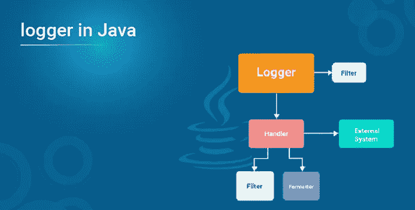
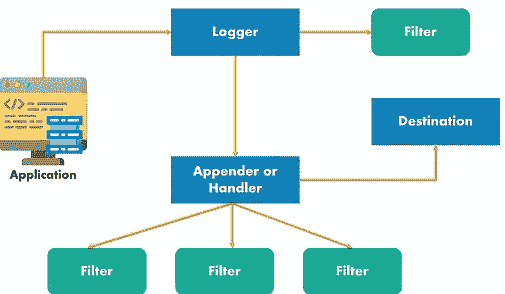

# Java 中的日志器是什么，为什么要用它？

> 原文：<https://medium.com/edureka/logger-in-java-4898c667d34c?source=collection_archive---------2----------------------->



日志是一个重要的特性，开发人员需要考虑它来追溯错误。Java 是最流行的编程语言之一，它通过提供基本的日志 API，提供了一种可定制的日志记录方法。因此，在这篇关于 Java Logger 的文章中，我将讨论专业人员如何使用这一特性在 Java 中实现可扩展的日志记录。

本文将涵盖以下主题:

1.  需要伐木
2.  日志组件
3.  什么是 Logger？

*   创建新的记录器
*   日志级别
*   属性文件
*   记录事件

4.附加程序或处理程序

5.布局或格式化程序

之前，我们深入探讨了 java 中的日志记录，让我们了解了日志记录的必要性。

# 需要伐木

在构建应用程序时，我们经常会遇到需要调试的错误。因此，在日志的帮助下，我们可以很容易地获得关于应用程序中发生了什么的信息，包括错误和异常情况的记录。现在，您可能会想到，为什么不在 Java 中使用 System.out.print()语句。这些语句的问题是日志消息只会在控制台上显示。所以，一旦你自动关闭控制台，所有的日志都会丢失。因此，日志不会被永久存储，而是逐个显示，因为这是一个单线程环境。

为了避免这样的问题，Java 中的日志记录在通过包和`java.util.logging org.apache.log4j.*`包提供的 API 的帮助下得到简化。

# 日志组件

Java 日志组件帮助开发人员创建日志，将日志传递到各自的目的地，并保持正确的格式。以下是三个组件:

*   **Loggers**——负责捕获日志记录，并将它们传递给相应的 Appender。
*   **添加者或处理者**——他们负责将日志事件记录到目的地。在发送输出之前，Appenders 在布局的帮助下格式化事件。
*   **布局或格式化器** —负责确定数据出现在日志条目中时的外观。

您可以参考下图了解所有三个组件的工作情况:



当应用程序进行日志记录调用时，Logger 组件将事件记录在 LogRecord 中，并将其转发给适当的 Appender。然后，它根据所需的格式使用布局格式化记录。除此之外，您还可以使用多个过滤器来指定哪些 Appenders 应该用于事件。

现在，让我们深入了解一下什么是 Java 中的 logger。

# Java 中的 Logger 是什么？

Java 中的记录器是触发日志事件的对象，它们是在应用程序的代码中创建和调用的，在应用程序中，它们在将日志事件传递给下一个组件(即 Appender)之前生成日志事件。您可以在一个类中使用多个记录器来响应各种事件，或者在一个层次结构中使用记录器。它们通常使用分层的点分隔名称空间来命名。此外，所有记录器名称都必须基于所记录组件的类或包名。

除此之外，每个记录器都在[记录器](https://docs.oracle.com/javase/7/docs/api/java/util/logging/Logger.html)名称空间中跟踪最近的现有祖先，并且还有一个与之相关联的“级别”。我将在本文的后半部分讨论日志记录器，但在此之前，让我向您展示如何用 Java 创建日志记录器。

## 创建新的记录器

用 Java 创建一个新的记录器的过程非常简单。你得用 `Logger.getLogger()`的方法。`getLogger()` [方法](https://www.edureka.co/blog/java-methods/)识别记录器的名称，并将字符串作为参数。因此，如果记录器预先存在，则返回该记录器，否则创建一个新的记录器。

## 语法:

```
static Logger logger = Logger.getLogger(SampleClass.class.getName());
```

这里，SampleClass 是我们正在获取 Logger 对象的类名。

**示例:**

```
public class Customer
{ private static final Logger LOGGER = Logger.getLogger(Customer.class);
 public void getCustomerDetails()
 {
 }
 }
```

既然我已经告诉了您如何在 Java 中创建一个日志记录器，那么让我们来看看日志记录中可用的不同级别。

# 日志级别

日志级别用于根据日志的严重性或对应用程序稳定性的影响对日志进行分类。 `org.apache.log4j.*`包和`java.util.logging`都提供了不同级别的日志记录。让我们一个一个来看看。

`org.apache.log4j.*`该软件包按降序提供以下级别:

*   致命的
*   错误
*   警告
*   信息
*   调试

`java.util.logging`该软件包按降序提供以下级别:

*   严重(最高级别)
*   警告
*   信息
*   配置
*   很好
*   好的
*   最精细(最低级别)

除此之外，上述包还提供了两个额外的级别`ALL`和`OFF`，分别用于记录所有消息和禁用记录。

## 使用`org.apache.log4j.*`包登录 Java 的例子:

```
import org.apache.log4j.Logger;
public class Customer {
    static Logger logger = Logger.getLogger(Customer.class);
    public static void main(String[] args) { 
    logger.error("ERROR");
        logger.warn("WARNING"); 
    logger.fatal("FATAL");
        logger.debug("DEBUG");
        logger.info("INFO");
        System.out.println("Final Output");
    }
}
```

因此，如果您的输出是 root logger，在我们的 *log4j.properties* 文件中为 WARN 级别，那么优先级高于 WARN 的所有错误消息都将打印如下:

您也可以使用`java.util.logging`包中的 setLevel()方法设置等级，如下所示:

```
logger.setLevel(Level.WARNING);
```

## 使用`java.util.logging`包登录 Java 的例子:

```
package edureka;
import java.io.IOException; 
import java.util.logging.Level; 
import java.util.logging.Logger; 
import java.util.logging.*; 

class EdurekaLogger { 
    private final static Logger LOGGER =  Logger.getLogger(Logger.GLOBAL_LOGGER_NAME);   
    public void sampleLog() 
    { 
        LOGGER.log(Level.WARNING, "Welcome to Edureka!"); 
    } 
}   
public class Customer { 
    public static void main(String[] args) 
    { 
        EdurekaLogger obj = new EdurekaLogger(); 
        obj.sampleLog(); 
        LogManager slg = LogManager.getLogManager();        
        Logger log = slg.getLogger(Logger.GLOBAL_LOGGER_NAME);   
        log.log(Level.WARNING, "Hi! Welcome from Edureka"); 
    } 
}
```

要使用`org.apache.log4j.*`包或`java.util.logging`包在您的应用程序中启用日志，您必须配置属性文件。接下来，在这篇关于 Java Logger 的文章中，让我们讨论一下它们的属性文件。

# Log4j 和 Java Util 包的属性文件

## Log4j 属性文件示例:

```
# Enable Root logger option log4j.rootLogger=INFO, file, stdout # Attach appenders to print file log4j.appender.file=org.apache.log4j.RollingFileAppender log4j.appender.file.File=E:loglogging.log log4j.appender.file.MaxFileSize=10MB log4j.appender.file.MaxBackupIndex=5 log4j.appender.file.layout=org.apache.log4j.PatternLayout log4j.appender.file.layout.ConversionPattern=%d{yyyy-MM-dd HH:mm:ss} %-5p %c{1}:%L - %m%n # Attach appenders to print on console log4j.appender.stdout=org.apache.log4j.ConsoleAppender log4j.appender.stdout.Target=System.out log4j.appender.stdout.layout=org.apache.log4j.PatternLayout log4j.appender.stdout.layout.ConversionPattern=%d{yyyy-MM-dd HH:mm:ss} %-5p %c{1}:%L - %m%n
```

Log4j 属性文件创建在项目的 src 文件夹中。

*   log4j . appender . file = org . Apache . log4j . rolling file appender->打印文件中的所有日志
*   log4j . appender . stdout = org . Apache . log4j . console appender->打印控制台中的所有日志
*   log4j . appender . file . file = D:log logging . log->指定日志文件的位置
*   log4j . appender . file . max filesize = 10MB->日志文件的最大大小为 10MB
*   log4j . appender . file . maxbackupindex = 5->将备份文件的数量限制为 5 个
*   log4j . appender . file . layout = org . Apache . log4j . pattern layout-->指定日志打印到日志文件的模式。
*   log4j . appender . file . layout . conversion pattern = % d { yyyy-MM-DD HH:MM:ss } %-5p % c { 1 }:% L—% m % n-->设置默认转换模式。

## Java Util 包属性文件示例

```
# Enable Root logger option
log4j.rootLogger=INFO, file, stdout
# Attach appenders to print file
log4j.appender.file=org.apache.log4j.RollingFileAppender
log4j.appender.file.File=E:loglogging.log
log4j.appender.file.MaxFileSize=10MB
log4j.appender.file.MaxBackupIndex=5
log4j.appender.file.layout=org.apache.log4j.PatternLayout
log4j.appender.file.layout.ConversionPattern=%d{yyyy-MM-dd HH:mm:ss} %-5p %c{1}:%L - %m%n
# Attach appenders to print on console
log4j.appender.stdout=org.apache.log4j.ConsoleAppender
log4j.appender.stdout.Target=System.out
log4j.appender.stdout.layout=org.apache.log4j.PatternLayout
log4j.appender.stdout.layout.ConversionPattern=%d{yyyy-MM-dd HH:mm:ss} %-5p %c{1}:%L - %m%n
```

这里，

*   模式= %h/java%u.log ->日志文件将被写入 C:TEMPjava1.log
*   Java . util . logging . file handler . limit = 50000-->记录器写入任何一个文件的最大字节数。
*   Java . util . logging . file handler . count = 1->指定输出文件的数量
*   Java . util . logging . file handler . formatter = Java . util . logging . XML formatter->提到用于格式化的格式化程序。这里使用了 XML 格式化程序。
*   Java . util . logging . console handler . level = WARNING->将默认日志级别设置为 WARNING
*   Java . util . logging . ConsoleHandler . Formatter = Java . util . logging . simple Formatter-->指定所有 console handler 使用的格式化程序。这里使用了 SimpleFormatter。

## 记录事件

要在 Java 中记录事件，您必须确保您指定了一个级别来轻松过滤事件。要指定级别并提及消息，您可以使用以下方法:

## 方法 1:

```
logger.log(Level.INFO, "Display message");
Here, level is INFO and the message to be printed is "Display Message".
```

## 方法二:

```
logger.info("Display message");
```

要确保 Java 中的 Logger 只记录 INFO 级别或以上的事件，可以使用上面讨论的 **setLevel()** 方法。

现在，我已经讨论了如何在 Java 中使用 Logger，让我们讨论 Log4j 架构的下一个组件，即 Appenders。

# 附加程序或处理程序

附加器或处理程序负责将日志事件记录到目标。每个记录器都可以访问多个处理程序，并从记录器接收日志消息。然后，附加器使用格式化程序或布局来格式化事件，并将它们发送到相应的目的地。

可以使用 setLevel(Level)关闭 Appender。OFF)方法。`java.util.logging`包中两个最标准的处理程序如下:

*   **FileHandler:** 将日志信息写入文件
*   **控制台处理器:**将日志消息写入控制台

为了让您更好地理解，我在属性部分解释了几个附加器。

# 布局或格式化程序

格式化程序的布局用于格式化和转换日志事件中的数据。日志框架为 HTML、XML、Syslog、JSON、纯文本和其他日志提供了布局。

1.  **SimpleFormatter** :生成包含基本信息的短信。
2.  **XMLFormatter** :为日志生成 XML 消息

为了让您更好地理解，我在属性部分解释了一些布局。至此，我们结束了这篇关于“Java 中的日志记录器”的博客。我希望你们清楚这篇文章教给你们的东西。

这就把我们带到了这篇“Java Map Interface”文章的结尾。我讲过 Java 的一个有趣的话题，就是 Java 中的 Map 接口。如果你想查看更多关于人工智能、DevOps、道德黑客等市场最热门技术的文章，那么你可以参考 [Edureka 的官方网站。](https://www.edureka.co/blog/?utm_source=medium&utm_medium=content-link&utm_campaign=logger-in-java)

请留意本系列中解释 Java 其他各方面的其他文章。

> *1。* [*面向对象编程*](/edureka/object-oriented-programming-b29cfd50eca0)
> 
> *2。*[*Java 中的继承*](/edureka/inheritance-in-java-f638d3ed559e)
> 
> *3。*[*Java 中的多态性*](/edureka/polymorphism-in-java-9559e3641b9b)
> 
> *4。*[*Java 中的抽象*](/edureka/java-abstraction-d2d790c09037)
> 
> *5。* [*Java 字符串*](/edureka/java-string-68e5d0ca331f)
> 
> *6。* [*Java 数组*](/edureka/java-array-tutorial-50299ef85e5)
> 
> *7。* [*Java 集合*](/edureka/java-collections-6d50b013aef8)
> 
> *8。* [*Java 线程*](/edureka/java-thread-bfb08e4eb691)
> 
> *9。*[*Java servlet 简介*](/edureka/java-servlets-62f583d69c7e)
> 
> *10。* [*Servlet 和 JSP 教程*](/edureka/servlet-and-jsp-tutorial-ef2e2ab9ee2a)
> 
> *11。*[*Java 中的异常处理*](/edureka/java-exception-handling-7bd07435508c)
> 
> 12。 [*Java 教程*](/edureka/java-tutorial-bbdd28a2acd7)
> 
> *13。* [*Java 面试题*](/edureka/java-interview-questions-1d59b9c53973)
> 
> *14。* [*Java 程序*](/edureka/java-programs-1e3220df2e76)
> 
> 15。 [*科特林 vs Java*](/edureka/kotlin-vs-java-4f8653f38c04)
> 
> 16。 [*依赖注入使用 Spring Boot*](/edureka/what-is-dependency-injection-5006b53af782)
> 
> 17。 [*堪比 Java 中的*](/edureka/comparable-in-java-e9cfa7be7ff7)
> 
> *18。* [*十大 Java 框架*](/edureka/java-frameworks-5d52f3211f39)
> 
> *19。* [*Java 反射 API*](/edureka/java-reflection-api-d38f3f5513fc)
> 
> 20。[*Java 中的 30 大模式*](/edureka/pattern-programs-in-java-f33186c711c8)
> 
> *21。* [*核心 Java 备忘单*](/edureka/java-cheat-sheet-3ad4d174012c)
> 
> *22。*[*Java 中的套接字编程*](/edureka/socket-programming-in-java-f09b82facd0)
> 
> *23。* [*Java OOP 备忘单*](/edureka/java-oop-cheat-sheet-9c6ebb5e1175)
> 
> *24。*[*Java 中的注释*](/edureka/annotations-in-java-9847d531d2bb)
> 
> *25。*[*Java 中的库管理系统项目*](/edureka/library-management-system-project-in-java-b003acba7f17)
> 
> *26。*[*Java 中的树*](/edureka/java-binary-tree-caede8dfada5)
> 
> *27。*[*Java 中的机器学习*](/edureka/machine-learning-in-java-db872998f368)
> 
> *28。* [*顶级数据结构&Java 中的算法*](/edureka/data-structures-algorithms-in-java-d27e915db1c5)
> 
> *29。* [*Java 开发人员技能*](/edureka/java-developer-skills-83983e3d3b92)
> 
> 三十岁。 [*前 55 名 Servlet 面试问题*](/edureka/servlet-interview-questions-266b8fbb4b2d)
> 
> 31。 [](/edureka/java-exception-handling-7bd07435508c)[*顶级 Java 项目*](/edureka/java-projects-db51097281e3)
> 
> *32。* [*Java 字符串备忘单*](/edureka/java-string-cheat-sheet-9a91a6b46540)
> 
> 33。[*Java 中的嵌套类*](/edureka/nested-classes-java-f1987805e7e3)
> 
> 34。 [*Java 集合面试问答*](/edureka/java-collections-interview-questions-162c5d7ef078)
> 
> *35。*[*Java 中如何处理死锁？*](/edureka/deadlock-in-java-5d1e4f0338d5)
> 
> *36。* [*你需要知道的 50 大 Java 合集面试问题*](/edureka/java-collections-interview-questions-6d20f552773e)
> 
> *37。*[*Java 中的字符串池是什么概念？*](/edureka/java-string-pool-5b5b3b327bdf)
> 
> 38。[*C、C++和 Java 有什么区别？*](/edureka/difference-between-c-cpp-and-java-625c4e91fb95)
> 
> 39。[*Java 中的回文——如何检查一个数字或字符串？*](/edureka/palindrome-in-java-5d116eb8755a)
> 
> *40。* [*你需要知道的顶级 MVC 面试问答*](/edureka/mvc-interview-questions-cd568f6d7c2e)
> 
> *41。*[*Java 编程语言的十大应用*](/edureka/applications-of-java-11e64f9588b0)
> 
> *42。*[*Java 中的死锁*](/edureka/deadlock-in-java-5d1e4f0338d5)
> 
> *43。*[*Java 中的平方和平方根*](/edureka/java-sqrt-method-59354a700571)
> 
> *44。*[*Java 中的类型转换*](/edureka/type-casting-in-java-ac4cd7e0bbe1)
> 
> *45。*[*Java 中的运算符及其类型*](/edureka/operators-in-java-fd05a7445c0a)
> 
> *46。*[*Java 中的析构函数*](/edureka/destructor-in-java-21cc46ed48fc)
> 
> *47。* [*爪哇*二分搜索法](/edureka/binary-search-in-java-cf40e927a8d3)
> 
> 48。[*Java 中的 MVC 架构*](/edureka/mvc-architecture-in-java-a85952ae2684)
> 
> *49。* [*冬眠面试问答*](/edureka/hibernate-interview-questions-78b45ec5cce8)

*原载于 2019 年 9 月 5 日 https://www.edureka.co**T21*[。](https://www.edureka.co/blog/logger-in-java)