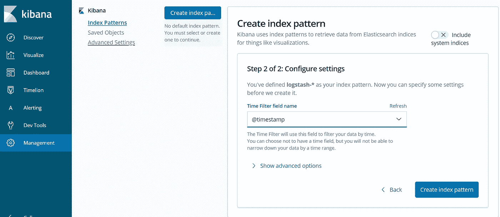
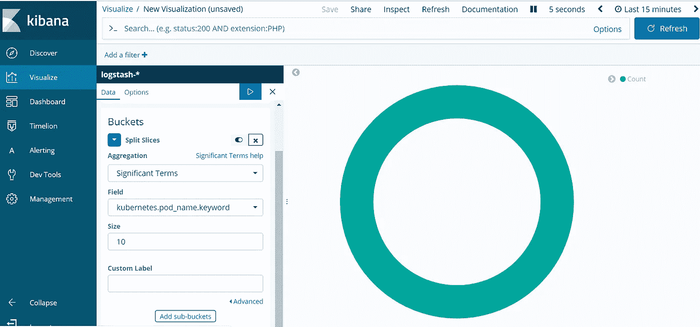

# 知道如何用 Elasticsearch 和 Kibana 可视化 Kubernetes 集群

> 原文：<https://medium.com/edureka/logging-monitoring-elasticsearch-fluentd-kibana-e2cd477a576b?source=collection_archive---------0----------------------->


在本文中，您将了解如何使用 Fluentd 日志代理将 Kubernetes 集群事件数据发布到 Amazon Elastic Search。这些数据将通过 Kibana 查看，Kibana 是一个用于 Elasticsearch 的开源可视化工具。亚马逊 ES 由集成的 Kibana 集成组成。

我们将带您完成以下流程:

*   创建 Kubernetes 集群
*   创建 Amazon ES 集群
*   在 Kubernetes 集群上部署 Fluentd 日志代理
*   想象一下基巴纳的库伯内特人的约会

# 步骤 1:创建 Kubernetes 集群

Kubernetes 是 Google 创建的一个开源平台，用于管理容器化的应用程序。它使您能够在集群环境中管理、扩展和部署您的容器化应用。我们可以使用 Kubernetes 在各种主机上协调我们的容器，动态扩展包含所有资源的容器化应用程序，并拥有一个集中的容器管理环境。

我们将从创建 Kubernetes 集群开始，我将逐步向您演示如何在 CentOS 7 上安装和配置 Kubernetes。

1.  配置主机

*   vi /etc/hosts
*   根据主机文件中的主机详细信息进行更改


**2。**通过执行以下命令禁用 SELinux

*   setenforce 0
*   sed-I–follow-symlinks ' s/SELINUX = enforcing/SELINUX = disabled/g '/etc/sys config/SELINUX

**3。**启用 br_netfilter 内核模块

安装 kubernetes 需要 br_netfilter 模块。

运行以下命令以启用 br_netfilter 内核模块。

*   modprobe br_netfilter
*   echo ' 1 ' >/proc/sys/net/bridge/bridge-nf-call-iptables

**4。**通过运行以下命令禁用交换。

*   swapoff -a
*   然后编辑/etc/fstab 并注释掉交换行


**5。**安装 Docker CE 的最新版本。通过运行以下命令安装 docker-ce 的包依赖项。

*   yum install -y yum-utils 设备映射器持久数据 lvm2

将 docker 存储库添加到系统中，并使用 yum 命令安装 docker-ce。

*   yum-config-manager-add-repo[https://download.docker.com/linux/centos/docker-ce.repo](https://download.docker.com/linux/centos/docker-ce.repo)
*   yum 安装-y docker-ce

**6。**安装 Kubernetes

使用以下命令将 kubernetes 存储库添加到 centos 7 系统中。

*   yum install-y kube let kube ADM kube CTL

```
[kubernetes]

name=Kubernetes
baseurl=[https://packages.cloud.google.com/yum/repos/kubernetes-el7-x86_64](https://packages.cloud.google.com/yum/repos/kubernetes-el7-x86_64)
enabled=1
gpgcheck=1
repo_gpgcheck=1
gpgkey=[https://packages.cloud.google.com/yum/doc/yum-key.gpg](https://packages.cloud.google.com/yum/doc/yum-key.gpg)
       [https://packages.cloud.google.com/yum/doc/rpm-package-key.gpg](https://packages.cloud.google.com/yum/doc/rpm-package-key.gpg)
EOF
```

通过运行下面的 yum 命令，使用安装 kubernetes 包 kubeadm、kubelet 和 kubectl。

*   系统启动对接器&&系统启动对接器

安装完成后，重新启动所有这些服务器。重启后，启动 docker 和 kubelet 服务

*   系统启动对接器&&系统启动对接器
*   系统控制启动库删除&&系统控制启用库删除

**7。** Kubernetes 集群初始化

登录到主服务器并运行下面的命令。

*   系统控制启动库删除&&系统控制启用库删除

一旦 Kubernetes 初始化完成，您将得到结果。从得到的结果中复制命令并执行它，开始使用集群。


记下结果中的 kubeadm join 命令。该命令将用于向 kubernetes 集群注册新节点。


**8。**将法兰绒网络部署到 kubernetes 集群

[https://raw . githubusercontent . com/core OS/法兰绒/master/Documentation/kube-法兰绒. yml](https://raw.githubusercontent.com/coreos/flannel/master/Documentation/kube-flannel.yml)


法兰绒网络已经部署到 Kubernetes 集群。

等待一段时间，然后使用下面的命令检查 kubernetes 节点和 pod。

*   kubectl 获取节点
*   kubectl get pods——所有名称空间

您将看到“k8s-master”节点作为状态为“ready”的“master”群集运行，并且您将看到该群集所需的所有 pod，包括用于网络 pod 配置的“kube-法兰绒-ds”。

**9。**向集群添加节点连接到 node01 服务器并运行 kubeadm join 命令

*   kube ADM join 172 . 31 . 7 . 47:6443–token at 03m 9 . iinkh 5 PS 9 q 12 sh 2 I–discovery-token-ca-cert-hash sha 256:3 f6c 1824796 e f1 ff 3d 9427 c 883 bde 915 D5 BC 13331d 74891d 831 f 29 a 8 C4 A0 C5 ab

连接到 node02 服务器并运行 kubeadm join 命令

*   kube ADM join 172 . 31 . 7 . 47:6443–token at 03m 9 . iinkh 5 PS 9 q 12 sh 2 I–discovery-token-ca-cert-hash sha 256:3 f6c 1824796 e f1 ff 3d 9427 c 883 bde 915 D5 BC 13331d 74891d 831 f 29 a 8 C4 A0 C5 ab

等待一段时间并验证“k8s-master”主集群服务器，使用以下命令检查节点和 pod。

*   kubectl 获取节点


现在，您将看到 worker1 和 worker2 已添加到集群中，状态为“ready”。

*   kubectl get pods——所有名称空间


Kubernetes 集群主服务器初始化和配置已完成。

# 步骤 2:创建 Amazon ES 集群

Elasticsearch 是一个开源搜索和分析引擎，用于日志分析和实时监控应用程序。Amazon Elasticsearch Service(Amazon ES)是一项 AWS 服务，允许在 AWS 云中部署、操作和扩展 elastic search。您可以使用 Amazon ES 来分析来自 Amazon SES 的电子邮件发送事件

我们将创建一个 Amazon ES 集群，然后将 Fluentd 日志记录代理部署到 Kubernetes 集群，该集群将收集日志并发送到 Amazon ES 集群

本节展示了如何使用 Amazon ES 控制台创建 Amazon ES 集群。

## **创建 Amazon ES 集群**

1.  登录 AWS 管理控制台，打开位于[https://console.aws.amazon.com/es/](https://console.aws.amazon.com/es/)的亚马逊 Elasticsearch 服务控制台
2.  选择**创建一个新的域，并在 Amazon ES 控制台中选择部署类型**。


3.在版本下，保留 Elasticsearch 版本字段的默认值。

4.选择下一步

5.在**配置域下的**配置集群**页面上为您的弹性搜索域键入一个名称。**

6.在“配置群集”页面上，选择“数据实例”下的以下选项

*   **实例类型** —选择 t2.micro.elasticsearch(符合自由层条件)。
*   **实例数量** — 1

7.在专用主实例下

*   **启用专用主机** —不启用该选项。
*   **启用区域感知** —不启用此选项。

8.在存储配置下，选择以下选项。

*   **存储类型** —选择 EBS。对于 EBS 设置，选择 EBS 卷类型通用(SSD ), EBS 卷大小为 10。

9.在加密下— **不要启用此选项**

10.快照配置不足

*   **自动快照开始时间** —选择自动快照开始时间 00:00 UTC(默认)。

11.选择下一步

12.在“网络配置”下，选择“VPC 接入”,然后根据您的 VPC 选择详细信息，如下所示。


在 Kibana 身份验证下:—不要启用此选项。

13.要设置访问策略，请选择允许对域的开放访问。注意:-在生产中，您应该限制对特定 IP 地址或范围的访问。


14.选择下一步。

15.在“查看”页面上，查看您的设置，然后选择“确认并创建”。

**注意:**部署集群最多需要十分钟。点击创建的弹性搜索域后，记下您的 Kibana URL。

# 步骤 3:在 Kubernetes 集群上部署 Fluentd 日志代理

Fluentd 是一个开源数据收集器，它让您统一数据收集和消费，以便更好地使用和理解数据。在这种情况下，我们将在 Kubernetes 集群上部署 Fluentd 日志记录，它将收集日志文件并发送到 Amazon Elastic Search。

我们将创建一个 ClusterRole，它提供对 pod 和名称空间对象的权限，以便向集群发出 get、list 和 watch 请求。

首先，我们需要配置 RBAC(基于角色的访问控制)权限，以便 Fluentd 可以访问适当的组件。

## **1.fluentd-rbac.yaml:**

```
apiVersion: v1
kind: ServiceAccount
metadata:
  name: fluentd
  namespace: kube-system

---

apiVersion: rbac.authorization.k8s.io/v1beta1
kind: ClusterRole
metadata:
  name: fluentd
  namespace: kube-system
rules:
- apiGroups:
  - ""
  resources:
  - pods
  - namespaces
  verbs:
  - get
  - list
  - watch

---

kind: ClusterRoleBinding
apiVersion: rbac.authorization.k8s.io/v1beta1
metadata:
  name: fluentd
roleRef:
  kind: ClusterRole
  name: fluentd
  apiGroup: rbac.authorization.k8s.io
subjects:
- kind: ServiceAccount
  name: fluentd
  namespace: kube-system
```

创建:$ ku bectl create-f kubernetes/fluentd-RBAC . YAML

现在，我们可以创造恶魔集了。

## **2。fluentd-daemonset.yaml**

```
apiVersion: extensions/v1beta1
kind: DaemonSet
metadata:
  name: fluentd
  namespace: kube-system
  labels:
    k8s-app: fluentd-logging
    version: v1
    kubernetes.io/cluster-service: "true"
spec:
  template:
    metadata:
      labels:
        k8s-app: fluentd-logging
        version: v1
        kubernetes.io/cluster-service: "true"
    spec:
      serviceAccount: fluentd
      serviceAccountName: fluentd
      tolerations:
      - key: node-role.kubernetes.io/master
        effect: NoSchedule
      containers:
      - name: fluentd
        image: fluent/fluentd-kubernetes-daemonset:v1.3-debian-elasticsearch
        env:
          - name:  FLUENT_ELASTICSEARCH_HOST
            value: "elasticsearch.logging"
          - name:  FLUENT_ELASTICSEARCH_PORT
            value: "9200"
          - name: FLUENT_ELASTICSEARCH_SCHEME
            value: "http"
          - name: FLUENT_UID
            value: "0"
        resources:
          limits:
            memory: 200Mi
          requests:
            cpu: 100m
            memory: 200Mi
        volumeMounts:
        - name: varlog
          mountPath: /var/log
        - name: varlibdockercontainers
          mountPath: /var/lib/docker/containers
          readOnly: true
      terminationGracePeriodSeconds: 30
      volumes:
      - name: varlog
        hostPath:
          path: /var/log
      - name: varlibdockercontainers
        hostPath:
          path: /var/lib/docker/containers
```

确保根据您的弹性搜索环境定义 FLUENT _ elastic search _ HOST & FLUENT _ elastic search _ PORT

## **部署:**

```
$ kubectl create -f kubernetes/fluentd-daemonset.yaml
```


## **验证日志**

```
$ kubectl logs fluentd-lwbt6 -n kube-system | grep Connection
```

您应该在日志中看到 Fluentd 连接到 Elasticsearch:


# 步骤 4:在 Kibana 中可视化 kubernetes 数据

1.  连接到 kibana dashboard URL 以从 Amazon ES 控制台获取
2.  要在 Kibana 中查看 Fluentd 收集的日志，请单击“管理”,然后选择“Kibana”下的“索引模式”
3.  选择默认索引模式(logstash-*)


4.单击可视化并选择创建可视化，然后选择饼图。如下所示填写以下字段。



5.单击发现查看您的应用程序日志


6.单击可视化并选择创建可视化，然后选择饼图。如下所示填写以下字段。

*   选择 Logstash-* index 并单击拆分切片
*   聚合—重要术语
*   field = kubernetes . pod _ name . keyword
*   尺寸— 10



7.并应用更改


就是这样！这就是你如何想象在基巴纳创造的库伯内特豆荚。

## **总结**:

通过日志分析进行监控是任何应用程序部署的重要组成部分。您可以在 Kubernetes 中收集和整合集群中的日志，以便从一个单一的仪表板监控整个集群。在我们的例子中，我们看到 fluentd 充当了 kubernetes 集群和 Amazon ES 之间的中介。Fluentd 结合了日志收集和聚合，并将日志发送到 Amazon ES，以便使用 kibana 进行日志分析和数据可视化。

上面的例子展示了如何使用 fluentd 向 kubernetes 集群添加 AWS 弹性搜索日志记录和 kibana 监控。

如果你想查看更多关于人工智能、Python、道德黑客等市场最热门技术的文章，你可以参考 Edureka 的官方网站。

请留意本系列中的其他文章，它们将解释 Kubernetes 的各个方面。

> 1.[什么是 Kubernetes？](/edureka/what-is-kubernetes-container-orchestration-tool-d972741550f6)
> 
> 2.[在 Ubuntu 上安装 Kubernetes](/edureka/install-kubernetes-on-ubuntu-5cd1f770c9e4)
> 
> 3. [Kubernetes 教程](/edureka/kubernetes-tutorial-fe6de6a20325)
> 
> 4. [Kubernetes 仪表板安装&视图](/edureka/kubernetes-dashboard-d909b8b6579c)
> 
> 5. [Kubernetes 建筑](/edureka/kubernetes-architecture-c43531593ca5)
> 
> 6. [*Kubernetes 网络*](/edureka/kubernetes-networking-a46d9f994bab)
> 
> 7.[Kubernetes vs Docker Swarm](/edureka/kubernetes-vs-docker-45231abeeaf1)
> 
> 8. [Kubernetes 面试问题](/edureka/kubernetes-interview-questions-c9790e5abddb)
> 
> 9.[与亚马逊 EKS 合作开发 Kubernetes 应用](/edureka/amazon-eks-ac646c23abf8)
> 
> 10.[在 AWS 上设置 Kubernetes 入口控制器](/edureka/kubernetes-ingress-controller-nginx-c5cf9e8ff031)

*原载于 2019 年 6 月 21 日*[*https://www.edureka.co*](https://www.edureka.co/blog/logging-monitoring-elasticsearch-fluentd-kibana/)*。*