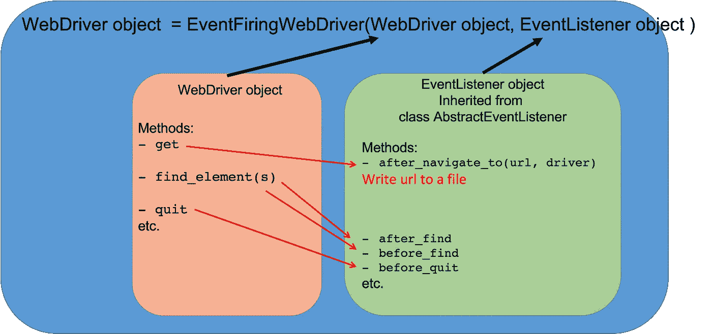

# 为 Pythonistas 记录 Selenium WebDriver 事件

> 原文：<https://medium.com/quick-code/logging-selenium-webdriver-events-for-pythonistas-59e347dc05ad?source=collection_archive---------2----------------------->

在自动化测试过程中记录事件有助于管理和维护测试驱动开发(TDD)。Selenium 提供了一个 API，允许实时监听测试执行期间发生的事件。在本文中，我们通过解释 Python Selenium 中的概念，扩展了以前为 Java Selenium 编写的[中型文章](/quick-code/understanding-webdriver-events-e58124575edd)，并展示了如何利用这个 API 来记录 Selenium 事件。


## 什么是事件？

事件是我们为了运行测试而采取的行动之一，包括:

1.  寻找元素
2.  单击元素
3.  发送文本和密钥

等等。

## 为什么我们需要记录事件？

日志记录可以简单地将整个测试会话记录在一个文件中，包括 assert 操作的结果，它可以指示哪些测试用例通过了，哪些测试用例失败了。因此，我们可以有一个清晰有用的测试报告，然后可以提交给开发团队。

## 需要哪些 API？

为了记录事件，首先，我们需要有一个 API 来定义每次执行某个 Selenium 驱动程序动作时执行的代码——例如，每当我们执行`find_element`(即，将主代码与其他/辅助代码捆绑在一起；*参见下面的示意图*。每次执行 Selenium 代码时执行的代码可以是*日志*代码。因此，其次，我们还需要一个 API(或几行代码)来记录或记录一些东西。**日志记录简单地说就是将格式化的文本写入文件**。



对于第一个 API，Selenium 已经提供了可以通过`from selenium.webdriver.support.events import EventFiringWebDriver`导入的类`EventFiringWebDriver`。这个类用众所周知的`webdriver`对象包装/捆绑了另一个`AbstractEventListener`类型的对象。但是我们不直接使用`AbstractEventListener`类，因为它是一个抽象/祖先类，需要继承才能使用(相当于 Java 中的接口)。因此，在通过`from selenium.webdriver.support.events import AbstractEventListener`导入`AbstractEventListener`类之后，我们需要从它继承一个类，在那里我们定义我们希望与`webdriver`事件一起执行的任意代码。下面的代码块显示了对`AbstractEventListener`的简单继承，它带有一个定义好的方法，一旦我们执行`webdriver`的`get`方法，这个方法就会被激活。

```
from selenium.webdriver.support.events import AbstractEventListenerclass AnEventListener(AbstractEventListener):
        def after_navigate_to(self, url, driver):
                # Writing url to a file 
```

有许多标准的硬编码方法，需要在继承过程中全部或部分实现。例如，在上面的代码块中，我们看到在`webdriver`的`get`方法之后执行的`after_navigate_to`方法。在这里可以看到与`webdriver`方法[相连接的`AbstractEventListener`方法的完整列表。](https://github.com/SeleniumHQ/selenium/blob/trunk/py/selenium/webdriver/support/abstract_event_listener.py)

在我们想要在继承的`AbstractEventListener`中实现的标准方法中，我们定义了我们的日志动作。这样的日志记录动作可以来自另一个众所周知的 Python 包:`logging`(使用`logging`的例子见)。下面的代码块显示了一个`logging`包的示例实现，它对于自动化测试来说已经足够好了。

这里，我们可以在我们的`AbstractEventListener`实现中使用上面的`logger`对象。

> 还有一个`logging`的实现，可以用来制作漂亮的 HTML 报告(参见[这里的](https://gist.github.com/ColinDuquesnoy/8296508)

最后，当我们的`AnEventListener`类被定义时，我们只需要将它的一个对象，或者简单地将`AnEventListener()`和一个`webdriver`对象(比如说`webdriver.Chrome()`)传递给类`EventFiringWebDriver`来实例化一个新的或升级的`webdriver`对象，该对象有一个额外的(包装的)API 来监听它的所有方法。

这个新的`driver`将在文件`report.log`中记录每个浏览过的网站。您可以对此进行扩展，并添加其他方法。例如，您可以考虑定义方法`on_exception`，并通过`logger.debug("exception message")`将所有异常作为 debug 打印到同一个文件中。