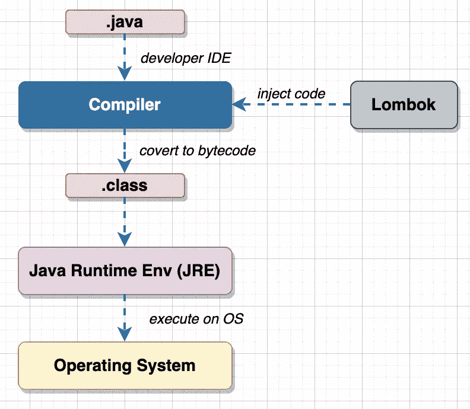
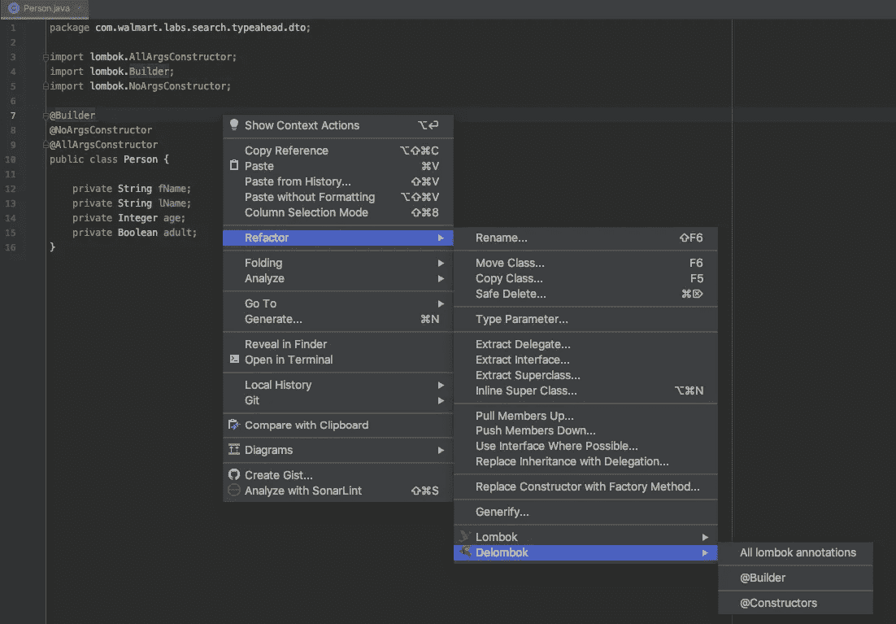

# 龙目岛和爪哇——美女与野兽

> 原文：<https://medium.com/walmartglobaltech/lombok-the-beauty-and-the-beast-5e511dbf49f6?source=collection_archive---------0----------------------->


Photo credit: [pixabay](https://pixabay.com/photos/indonesia-lombok-rinjani-landscape-4497577/), Lombok island, Indonesia

## 目录

*   介绍
*   使用 Lombok
*   getter/setter
*   等于/哈希码
*   建设者
*   NoArgs/AllArgs 构造函数
*   不变
*   SneakyThrows
*   其余的
*   德龙博克
*   逮到你了
*   结论

## 介绍

当我们设计和构建现代软件时，我们想要关注的一个关键方面是 [*关注点分离*](https://en.wikipedia.org/wiki/Separation_of_concerns) 。这对于任何好的软件来说都是必要的，尤其是在构建微服务的时候。dto(或[POJO](https://en.wikipedia.org/wiki/Plain_old_Java_object))有助于在服务内/跨服务通信时封装数据，也有助于将对象(从)序列化为 JSON/XML 等。

dto 是这种系统的一个重要方面，写起来同样乏味(并且容易出错)。它们包含许多样板代码，看起来微不足道。与此同时，一个小错误(比如丢失了 *final* 关键字，或者返回了 *shallow copy* )可能会造成严重破坏，并且很难调试。

对于我们这些用 Java 编码的人来说，我们知道编写 POJOs 的痛苦。我们已经看到，随着我们添加更多的字段，永无止境的 dto 在规模上不断增长。对于添加的单个字段，我们可以添加最少的 getters 和 setters。如果你喜欢冒险，你可能最终会修改构造函数和添加构造函数。更不用说，如果你加上[不变性](https://docs.oracle.com/javase/tutorial/essential/concurrency/immutable.html)和[深度克隆](https://www.baeldung.com/java-deep-copy)，事情就变得更加复杂了。

## 使用 Lombok

如果你曾经打开地图册，查找爪哇岛的位置，你可能会看到邻近的岛屿叫做龙目岛。难怪在编程语言的世界里， [project Lombok](https://projectlombok.org/) 已经被用来帮助 Java 程序员了。

Lombok 的目标是尽量减少 POJOs 的冗长。随着时间的推移，它引入了 getters & setters、toString、equals 和 hashCode、日志记录、构建器、不变性、同步等。目标是减少样板代码并提高工程生产率，这样工程师就可以专注于功能开发，而不是固定螺母和螺栓。它还可以简化可读性、重构和容易地识别错误。

那就是龙目岛的 ***美女*** 。然而，如果你不真正了解幕后发生了什么，事情可能会很快变得很糟糕。测试用例可能会变得令人讨厌，代码覆盖率数字看起来会变得奇怪。

> 如果你想要“美”，你需要知道如何驯服“野兽”。

在这里，我们将尝试理解 Lombok 是做什么的，以及是如何做到的。因此，我们会明白如何正确地使用它。



Source code, byte code, and Lombok

因为 Java 是独立于平台的。java 文件被转换成。类[的字节码](https://en.wikipedia.org/wiki/Bytecode)被编译器编译。这就是 JRE 感兴趣的。JRE 不是独立于平台的，并且在操作系统上执行字节码。

龙目岛介于。java 和。类文件并将字节级代码注入到。用于*getter、setters、builders、*等的类文件。

除了。类文件，JRE 不知道 Lombok 的存在(也不应该知道)。现在您可能已经理解了，Lombok 只在编译时需要。因为这个原因，maven *范围*可以(也应该)设置为*编译/提供*。

```
<dependency>
    <groupId>org.projectlombok</groupId>
    <artifactId>lombok</artifactId>
    <version>1.18.18</version>
    <scope>provided</scope>
</dependency>
```

Lombok 注释用于减少冗长。这些注释取代了工程师通常编写的样板代码。在编译时，Lombok 会读取注释并将相应的代码注入到生成的类文件中。接下来，我们将看看注释以及如何安全地使用它们。

## getter/setter

这些是最简单的开始。典型的 POJO 应该是这样的。对于类的 4 个属性，我们有 8 个方法和 38 个 loc。

您可以想象一个包含更多属性和一些自定义方法的 DTO 长达数百行。龙目岛不再是了:

## 等于/哈希码

在介绍这些注释之前，您应该理解 [equals()和 hashCode()](https://www.baeldung.com/java-equals-hashcode-contracts) 的用法。否则， [@EqualsAndHashCode](https://projectlombok.org/features/EqualsAndHashCode) 会生成不必要的代码，降低您的测试代码覆盖率。例如，如果您引入了这个注释，但是在相等性检查中，或者在这样的 DTO 的集合或映射中没有使用 DTO(因此没有用于这样的场景的测试用例)，这些行将永远不会被执行。

下面是 Lombok 为单个属性生成的内容示例:

## 建设者

[生成器](https://en.wikipedia.org/wiki/Builder_pattern)是一个非常有用的构造，特别是对于冗长的 dto。生成器还有助于避免多个带有可选参数的构造函数。从下面的例子中我们可以看到，我们正在使用 [@Builder](https://projectlombok.org/features/Builder) 设置 *fName* 和 *age* 。这是基于构建器模式由 [*四人组*](https://en.wikipedia.org/wiki/Design_Patterns) *组成。*

使用 setters 会生成更多的行，而使用构造函数，我们将需要多个重载来满足所有可能的场景(或者为剩余的字段传递 null/default 值)。与@EqualsAndHashCode 非常相似，builder 注释会生成大量代码，所以除非您有涵盖这些的测试用例，否则代码覆盖率肯定会下降。

注意，当使用构建器时，未设置的字段将被默认(原语的默认值为[，其他为 null)。还要注意，构建器不能像设置器一样改变对象。它应该用于一次性创建一个新对象。进一步的变异，如果需要的话，应该由设定者来完成。](https://docs.oracle.com/javase/tutorial/java/nutsandbolts/datatypes.html)

## NoArgs/AllArgs 构造函数

顾名思义，这些注释有助于创建默认(无参数)构造函数和全参数构造函数。Java(不是 Lombok)创建默认的构造函数(在。类)，仅当没有任何用户定义的类时。因此，如果你没有这两个注释，java 会创建一个无参数(顺便说一下， [Jackson](https://en.wikipedia.org/wiki/Jackson_(API)) 利用了这一点)。但是，如果您使用@Builder 或 [@AllArgsConstructor](https://projectlombok.org/features/constructor) ，并且还使用 Jackson 将对象序列化(反序列化)到 JSON，请确保添加@NoArgsConstructor。Jackson 需要构造函数正确地实例化对象。这适用于大多数 JSON/XML 处理 API。

长话短说，如果您引入了@Builder 或@AllArgsConstructor 而没有添加@NoArgsConstructor，一个正常工作的 DTO-杰克森组合将开始失败。

## 不变

创建不可变类也是一个很好的特性，Lombok 支持使用 [@Value](https://projectlombok.org/features/Value) 注释。它确保不生成 setters，并且字段被定义为 *final* ，这样它们的引用就不会被更改。下面是代码实际外观的一个例子。注意所有数据类型的*深度不变性*(包括自定义*地址类*)。

如果你不需要不可变性，但是需要 getters、setters、equals、hashCode 和 allArgsConstructor，而不是单独注释这些，你可以使用 [@Data](https://projectlombok.org/features/Data) 注释。除了不变性之外，@Data 和@Value 是相似的。此外，如果您对不可变的 setters 感兴趣，请使用检查[@。](https://projectlombok.org/features/With)

## SneakyThrows

如果你是一个优秀的程序员，你会确保所有的异常都得到妥善处理。这并不意味着每个方法中都有一个 try-catch 块。相反，您可以拥有一个调用多层函数的代理函数。较低级别的函数只是抛出异常，委托者函数优雅地处理它们。听起来不错！！但这意味着，所有较低级别的函数都需要在它们的方法签名中添加一个 *throws* 子句，增加冗长性，或者在每次添加一个抛出特定异常的新代码片段时进行更改。

[@SneakyThrows](https://projectlombok.org/features/SneakyThrows) 帮助将所有检查过的异常包装成未检查的异常，从而避免处理新异常的冗长或必要性。虽然它使代码更干净，但也使代码变得非常危险，因为不再有编译时警告。*你，只有你有责任在 JVM 崩溃之前处理未检查的异常。所以在使用这个注释*的时候要非常小心。这里有一个例子:

## 其余的

使用[记录器](https://projectlombok.org/features/log)，或者[同步锁](https://projectlombok.org/features/Synchronized)也可以使用 Lombok 注释。有关全套注释，请参考[此链接](https://projectlombok.org/features/all)。

[深度克隆](https://howtodoinjava.com/java/cloning/a-guide-to-object-cloning-in-java/)可以使用构建器注释实现。克隆的首选方式是使用*复制构造函数*而不是使用*可克隆的*接口(您将被 Sonar 标记)。如果能通过 Lombok 获得一个复制构造函数就好了。这是[实验特性](https://projectlombok.org/features/experimental/all)的列表，我们还没有看到任何这样的选项。

## 德龙博克

如果你对 Lombok 生成的代码感兴趣，你可以随时“delombok”查看。这可以从类似于 [this](https://projectlombok.org/features/delombok) 的 CLI 中完成，或者从任何集成了 Lombok 的 IDE 中完成。IntelliJ 是这样做的:



Delomking code in IDE

## 逮到你了

在生成 getter/setter 时，Lombok 对本地布尔和装箱布尔的处理是不同的。请注意这可能会导致不正确的序列化(反序列化)。在推动此类更改之前，请始终测试您的序列化数据。查看以下“成人”和“吸烟者”的吸气剂:

## 结论

Lombok 是一个漂亮的工具，可以减少很多样板代码。对于为微服务创建 dto(甚至是共享 dto)或者快速从 log4j2 迁移到 slf4j(只需更改一个注释)，它可能特别有用。

你可能会说，最现代的 ide 有助于生成 getter/setter/constructor。这是真的；然而，这并没有减少代码的冗长。以后需要修改代码的工程师仍然需要检查代码。想象一个 DTO 被覆盖了下面的 *setAddresses* :

如果同一个类有一些属性并且不是 Lomboked 的，简单的目测不会发现自定义 setter，由于它的紧凑性，这在上面是如此清晰可见。

同时，既然是在玩字节码，就要负责，要谨慎。代码覆盖率、异常处理、(反)序列化是您需要小心的一些领域。

正如我前面提到的，如果你能驯服野兽，你应该不难找到龙目岛提供的美。龙目岛快乐！！