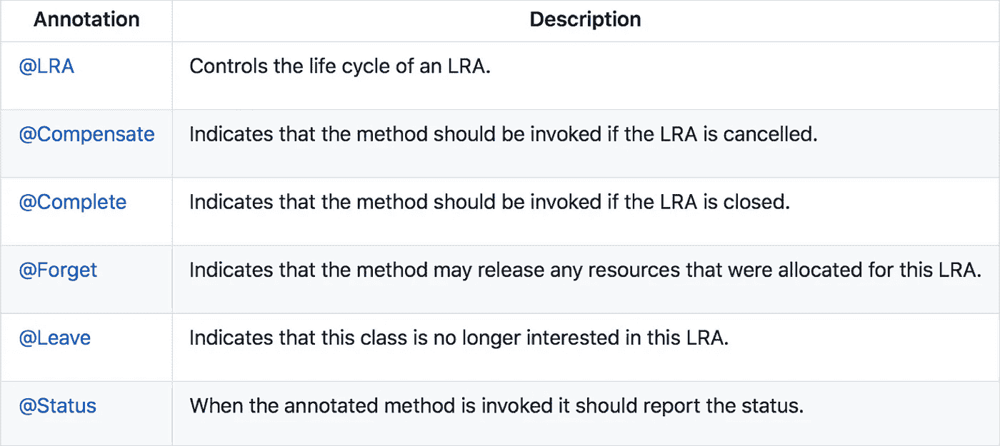

# Helidon 上微轮廓的长期运行动作…微服务的数据完整性。

> 原文：<https://medium.com/oracledevs/long-running-actions-for-microprofile-on-helidon-data-integrity-for-microservices-2bd4d14fe955?source=collection_archive---------0----------------------->


微服务对数据的一致性和完整性提出了挑战，这就需要改变它们所使用的事务处理和数据模式。

传统系统依赖于**两阶段提交和 XA** 协议，这些协议使用同步通信、资源锁定和通过回滚(或提交，视情况而定)进行恢复。虽然这提供了很强的一致性和隔离，但由于持有锁的延迟，它在微服务环境中不能很好地扩展，因此只适合于这种用例的一小部分(通常是吞吐量要求较低的用例)

**saga 模式**仅使用异步通信和本地资源(无分布式锁)并通过补偿动作进行恢复。这种方法伸缩性很好，因此非常适合微服务环境中的长时间运行的事务。然而，额外的应用设计考虑是必要的，因为读取隔离和补偿逻辑以及调试可能是困难的。

微概要文件 LRA，如在[https://github.com/eclipse/microprofile-lra](https://github.com/eclipse/microprofile-lra)所述，“[…]为服务引入 API 来协调活动。
该提案的主旨是为松散耦合的服务引入一个 API，以协调长期运行的活动，从而保证全球一致的结果，而无需锁定数据。”

在许多方面，长时间运行活动(LRA)API 对于微服务之间的关系就像 Java 事务 API (JTA)对于两阶段提交和 XA 对于传统应用程序的关系一样(或者对于单个微服务内的封闭使用)。

关于这个话题已经写了很多了，所以这里的重点是在 Helidon 运行 LRA。Helidon 使用 LRA 规范的 Narayana 实现。

# 在 Helidon MP 使用 LRA

涉及两个主要部分:

*   参与者:这些是将参与 LRA 的 JAX-RS 微服务，并标注了规范中下表所列的标准`org.eclipse.microprofile.lra.annotation.ws.rs.LRA`值…



*   LRA 协调者:这是一个参与者隐式注册的专用服务(由于他们的 LRA 注释),负责驱动 LRA 完成、补偿等..

# 更新您的 LRA 参与者`pom.xml (s)`

添加 LRA 注释和运行时的依赖关系。

虽然运行时不需要，但是可以使用构建时 LRA 注释检查器。

# 在应用程序中添加 LRA 功能

您的 MP javax.ws.rs.core.Application 可能已经有了类似的代码。只需添加包含动态特性`io.narayana.lra.filter.FilterRegistration`的代码行:

# 注释端点

向您的微服务端点添加 LRA 注释。
在本例中，LRA 涉及两项服务，即订单服务和库存服务。

订单服务:

*   由于`@LRA(value = LRA.Type.RequiresNew)`注释，客户端对`placeOrder`的调用开始 LRA，并向 LRA 协调器注册服务
*   调用库存服务检查库存/传播具有 LRA id 的`LRA_HTTP_CONTEXT_HEADER`(通过注册客户端 LRA 过滤器实现)。
*   如果库存存在(默认)，成功返回给订单服务，这隐式地完成了 LRA，协调器调用`@Complete`带注释的方法`completeOrder`
*   如果库存不存在(通过调用库存服务上的 removeInventory 端点实现),将失败返回给订单服务，订单服务取消 LRA，协调器调用`@Compensate`带注释的方法`cancelOrder`

库存服务:

*   订单服务对`reserveInventoryForOrder`的调用在 LRA 内执行，由订单服务根据`@LRA(value = LRA.Type.Mandatary)`注释启动和传播，并向 LRA 协调器注册服务
*   检查库存并将结果(成功或失败)返回给订单服务

# 建立和部署上帝抵抗军协调员

添加依赖项来构建和运行 LRA 协调器服务 jar。

# 构建并启动 LRA 应用程序

运行示例`./build.sh`脚本来构建和打包订单和库存参与者服务以及协调器。

启动服务。

# 为成功案例运行 LRA 应用程序

请注意订单服务的输出:

```
OrderResource.placeOrder in LRA due to LRA.Type.REQUIRES_NEW lraId:[...]
OrderResource.placeOrder response from inventory:inventorysuccess
OrderResource.completeOrder
```

请注意库存服务的输出:

```
InventoryResource.addInventory
InventoryResource.placeOrder in LRA due to LRA.Type.MANDATORY lraID:[...]
InventoryResource.completeOrder prepare item for shipping lraId:[...]
```

# 为补偿情况运行 LRA 应用程序

请注意订单服务的输出:

```
OrderResource.placeOrder in LRA due to LRA.Type.REQUIRES_NEW lraId:[...]
OrderResource.placeOrder response from inventory:inventoryfailure
OrderResource.cancelOrder
```

请注意库存服务的输出:

```
InventoryResource.removeInventory
InventoryResource.placeOrder in LRA due to LRA.Type.MANDATORY lraID:[...]
InventoryResource.cancelOrder put inventory back lraId:[...]
```

# 接下来呢？

LRA 规范目前完成了 88%,预计将包含在下一个 MicroProfile 版本中。这里可以关注进展:[https://github.com/eclipse/microprofile-lra/milestone/1](https://github.com/eclipse/microprofile-lra/milestone/1)

在此基础上，Helidon 将继续促进微服务数据模式的这一领域和其他领域，提供。

*   等效螺旋支撑
*   消息传递(和事件源)功能
*   高可用性配置
*   数据库集成特性

例子可以在这里找到:[https://github.com/paulparkinson/helidon-examples-lra](https://github.com/paulparkinson/helidon-examples-lra)