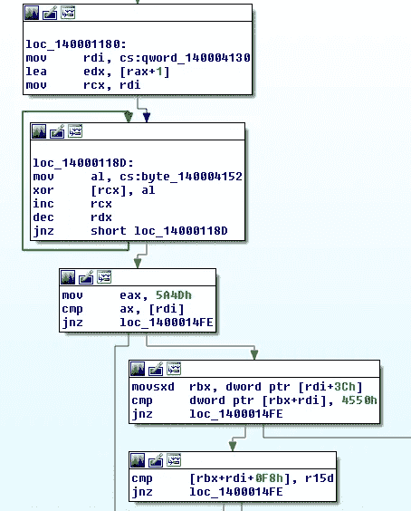

# 看看新的氪密码器和最近的数据泄露样本

> 原文：<https://medium.com/walmartglobaltech/looking-at-the-new-krypton-crypter-and-recent-data-exfiltrator-samples-4c484875cf70?source=collection_archive---------2----------------------->

作者:杰森·里维斯和约书亚·普拉特


最近 ReversingLabs 写了一个用于数据渗透的实用程序[1]，它使用了我们之前讨论过的相同的字符串加密，TrickBot 将其用于新的 CobaltStrike 加载程序[2]。由于“mOrxx”的结束标记，字符串编码非常引人注目，字符串编码既用于对字符串进行编码，也用于密码器中。密码器本身是氪[4]的变体，氪也被称为氙[3]，它在密码器领域已经存在很长时间了。

# **氪密码器**

较新版本的密码器包括单字节异或和 LZNT 压缩的可变层。



XOR and MZ check

如果 PE 头没有被解码出来，那么它将对数据进行解压缩，然后对解压缩的 blob 进行单字节 XOR 编码。

打开某些对象的包装:

```
Sample:
0ac2376677e4e85efb460cb6fff78f1c61226c7ac3fd65b133fe6c92dfcddb7fUnpacked strings:
raw.githubusercontent.com
Curl
hgvggjhkvbhulbhnkj/potential-octo-pancake/master/img.pngSample:
101b5d0fea7ab98a354a8d333fc90b6c485062da6672d0312e5443bb686ccce7Unpacked is Mimikatz Sample:
8dde0e4edffb940823c04a4253a0aaaecb8ff90bb681b9d87866308eb45e925eUnpacked is POC for CVE-2020-0787Sample:
92c7c3ce3fd5c867e68760e943958959b8786e15a5657629a27b69f92b850308Unpacked strings:
raw.githubusercontent.com
mikijmmiu5ktjrgf/psychic-octo-doodle/master/favicon.icoSample:Unpacked strings:
WinInet Test
temp.positiveseca.com
askscc.php?4334523
test
https://temp.positiveseca.com/askscc.php?4334523
can't decompress buff!
can't get len of decompressed buff!
```

# **氪弦**

字符串编码在上面的两篇博客[1，2]中都有概述，但是因为它被用于独立的可执行文件和 crypter 存根，所以我决定根据我们以前的报告[2]写一个字符串解码脚本，以便更仔细地研究用于混淆字符串的示例。

```
def decode_str(s,k=0):
    blob = bytearray(s[5:])
    for i in range(len(blob)):
        blob[i] ^= k
        blob[i] = (blob[i] - (i+1)) & 0xff
    return blobdata = open(sys.argv[1], 'rb').read()
encoded_strs = re.findall('''\xfb\xfc\xfe\xff\xaa[^\x00]+''', data)
for val in encoded_strs:
    t = decode_str(val)
    print(t)
```

使用它，我们可以转储样本中的大部分字符串:

```
uploadFile.php
Mozilla/5.0 (Windows NT 10.0; Win64; x64; rv:89.0) Gecko/20100101 Firefox/89.0
GET
198.58.127.161
90j8vjv9807rv912jRJehkdfsvIUE2387
POST
```

我们还剩下一些加载到堆栈上的字符串，因此对于这些字符串，我们可以快速查找先加载的前面的字节(' \xfb\xfc\xfe\xff\xaa '):

```
encoded_stack_needles = re.findall('''c64424..fbc64424..fcc64424..fec64424..ffc64424..aac64424....''', binascii.hexlify(data))
encoded_stack_strings = []
blob = data
for val in encoded_stack_needles:
    off = blob.find(binascii.unhexlify(val))
    blob = blob[off+4:]
    out = ""
    c = ord(blob[0])
    while c != 0:
        out += chr(c)
        blob = blob[5:]
        c = ord(blob[0])
    print(decode_str(out))
```

现在，我们可以转储所有或至少大部分解码后的字符串:

```
uploadFile.php
Mozilla/5.0 (Windows NT 10.0; Win64; x64; rv:89.0) Gecko/20100101 Firefox/89.0
GET
198.58.127.161
90j8vjv9807rv912jRJehkdfsvIUE2387
POST
HttpOpenRequestW
InternetOpenW
HttpSendRequestW
NtCreateThreadEx
RtlGetCompressionWorkSpaceSize
RtlCompress
LoadLibraryW
GetProductInfo
GetVersionExA
user32
GetWindowRect
GetDesktopWindow
psapi
EnumProcesses
```

查看一些用氪加密的样本，我们可以发现在未加密的样本中也使用了字符串编码:

```
Sample:
68e4924cdd25baf562eff5a223a6e74ff1cc76201dc5d8a55b12734aa79986cfUnpacked and Decoded strings:
raw.githubusercontent.com
hgvggjhkvbhulbhnkj/furry-palm-tree/main/2020.gif
logo.png
Curl
GET
wininet.dllSample:
a32e37ae08d6a723dff7313d96bc7e23fe9b7db18295e2916f3c935530329919Unpacked and Decoded strings:
raw.githubusercontent.com
hgvggjhkvbhulbhnkj/palm/main/shared.gif
logo.png
Curl
GET
wininet.dll
```

# **数据过滤器样本**

现在，我们可以有效地解码字符串，我们可以将注意力集中在数据导出器样本上，以从我们找到的样本中转储所有数据，根据这些没有剥离 PDB 的样本中的一些，这些样本被称为“file_sender”:

```
E:\work\proj\file_sender\x64\file_sender.pdb
```

从样本集中收集的数据:

```
Sample:
MD5: 4a7b6a0ee35d930996c6e5625f184d87
SHA256: 0d7358a3c04d860883da564d51c983e262d5b3057da29a3804d5e8f67644e02eDecoded strings:
uploadFile.php
Mozilla/5.0 (Windows NT 10.0; Win64; x64; rv:89.0) Gecko/20100101 Firefox/89.0
GET
se1.buttonrich.com
3f9n8uv0n43809vn3d092v09290
POST
LoadLibraryW
GetProductInfo
GetVersionExA
NtCreateThreadEx
RtlGetCompressionWorkSpaceSize
RtlCompress
user32
GetWindowRect
GetDesktopWindow
HttpOpenRequestW
InternetOpenW
HttpSendRequestW
psapi
EnumProcessesSample:
MD5: 5ca7b4a0e7981a2569033031ea1dc726
SHA256: 5c268313821c3e851f500e5dea135cce0670f1f2efe4466394d7dcdaeb321aa8Decoded strings:
uploadFile.php
Mozilla/5.0 (Windows NT 10.0; Win64; x64; rv:89.0) Gecko/20100101 Firefox/89.0
GET
198.58.127.161
90j8vjv9807rv912jRJehkdfsvIUE2387
POST
HttpOpenRequestW
InternetOpenW
HttpSendRequestW
NtCreateThreadEx
RtlGetCompressionWorkSpaceSize
RtlCompress
LoadLibraryW
GetProductInfo
GetVersionExA
user32
GetWindowRect
GetDesktopWindow
psapi
EnumProcessesSample:
MD5: e3300ec2f31f5730970c5bb066d2f0ed
SHA256: 68af250429833d0b15d44052637caec2afbe18169fee084ee0ef4330661cce9cDecoded strings:
uploadFile.php
Mozilla/5.0 (Windows NT 10.0; WOW64) AppleWebKit/537.36 (KHTML, like Gecko) discord/0.0.309 Chrome/83.0.4103.122 Electron/9.3.5 Safari/537.36
GET
figures.pablotech.info
8953n7b8ewurdfb3njnyuridrwdb
POST
C:\Windows\
NtAllocateVirtualMemory
NtFreeVirtualMemory
LoadLibraryW
GetProductInfo
GetVersionExA
user32
GetWindowRect
GetDesktopWindow
HttpOpenRequestW
InternetOpenW
HttpSendRequestW
psapi
EnumProcessesSample:
MD5: 85fc54cb1d9dc2207d2f49cc4631fe21
SHA256: 7bc5ea877a9a4ebf173334b63bfdd9762acf8d53fd066049b12f0d6fd9f7892cDecoded strings:
uploadFile.php
Mozilla/5.0 (Windows NT 10.0; Win64; x64; rv:89.0) Gecko/20100101 Firefox/89.0
GET
192.241.144.56
4bw243bg54nyh3wtn46uthgt43
POST
LoadLibraryW
GetProductInfo
GetVersionExA
user32
GetWindowRect
GetDesktopWindow
NtCreateThreadEx
RtlGetCompressionWorkSpaceSize
RtlCompress
HttpOpenRequestW
InternetOpenW
HttpSendRequestW
psapi
EnumProcessesSample:
MD5: 020573d76c6f2d102e40ad882d88ec73
SHA256: 7c7317c7f036c00d4c55d00ba36cb2a58a39a72fe24a4b8d11f42f81b062f80bDecoded strings:
uploadFile.php
Mozilla/5.0 (Windows NT 10.0; Win64; x64; rv:89.0) Gecko/20100101 Firefox/89.0
GET
167.172.170.139
jkrenugbiowenuyfboiwenuyIUONbefuwu849f
POST
user32
GetWindowRect
GetDesktopWindow
HttpOpenRequestW
InternetOpenW
HttpSendRequestW
NtCreateThreadEx
RtlGetCompressionWorkSpaceSize
RtlCompress
LoadLibraryW
GetProductInfo
GetVersionExA
psapi
EnumProcessesSample:
MD5: 5a0dd4b0ff5be657edb0a7f95ded0683
SHA256: 853dce7c9dc870735499df094fba68b2ca23218b4014ce22124fea145c3c2cfeDecoded strings:
uploadFile.php
Mozilla/5.0 (Windows NT 10.0; WOW64) AppleWebKit/537.36 (KHTML, like Gecko) discord/0.0.309 Chrome/83.0.4103.122 Electron/9.3.5 Safari/537.36
GET
figures.pablotech.info
8953n7b8ewurdfb3njnyuridrwdb
POST
C:\Windows\
NtAllocateVirtualMemory
NtFreeVirtualMemory
LoadLibraryW
GetProductInfo
GetVersionExA
user32
GetWindowRect
GetDesktopWindow
HttpOpenRequestW
InternetOpenW
HttpSendRequestW
psapi
EnumProcessesSample:
MD5: 12a7595d94e142847a04f11659ed183d
SHA256: 8cfd554a936bd156c4ea29dfd54640d8f870b1ae7738c95ee258408eef0ab9e6Decoded strings:
uploadFile.php
Mozilla/5.0 (Windows NT 10.0; Win64; x64; rv:89.0) Gecko/20100101 Firefox/89.0
GET
51.77.110.6
3f9n8uv0n43809vn3d092v09290
POST
user32
GetWindowRect
GetDesktopWindow
LoadLibraryW
GetProductInfo
GetVersionExA
HttpOpenRequestW
InternetOpenW
HttpSendRequestW
NtFreeVirtualMemory
NtCreateThreadEx
RtlCompressBuffer
psapi
EnumProcessesSample:
MD5: 9b95da664bc50363541f9f7e89ac32c3
SHA256: 8ea24457df1459297503237411594b734794ee0d2654b22c66d3a976e2e6ff4fDecoded strings:
uploadFile.php
Mozilla/5.0 (Windows NT 10.0; Win64; x64; rv:89.0) Gecko/20100101 Firefox/89.0
GET
172.104.142.206
htyrnhernerIEKmnubOIMUewfiobwuioewb83
POST
user32
GetWindowRect
GetDesktopWindow
LoadLibraryW
GetProductInfo
GetVersionExA
NtCreateThreadEx
RtlGetCompressionWorkSpaceSize
RtlCompress
HttpOpenRequestW
InternetOpenW
HttpSendRequestW
psapi
EnumProcessesSample:
MD5: 4af8b45c9b0f73d47a499d92064b6c2e
SHA256: 934c557e52bd47fa312ea4098e05781145d0b81c9dc543ef42b266813bdb05d4Decoded strings:
uploadFile.php
Mozilla/5.0 (Windows NT 10.0; Win64; x64; rv:89.0) Gecko/20100101 Firefox/89.0
GET
51.161.82.135
huve3fn298vmfu293jKVFDSfvjjfe893
POST
HttpOpenRequestW
InternetOpenW
HttpSendRequestW
C:\Windows\
NtAllocateVirtualMemory
NtFreeVirtualMemory
LoadLibraryW
GetProductInfo
GetVersionExA
user32
GetWindowRect
GetDesktopWindow
psapi
EnumProcessesSample:
MD5: 7c801e3c256d2e9e1f4462fe84e44c68
SHA256: a7cf0f72bb6f1e0a61fbf39e3a3a36db6540250caeef35b47fb51a8959f40984Decoded strings:
uploadFile.php
Mozilla/5.0 (Windows NT 10.0; Win64; x64; rv:89.0) Gecko/20100101 Firefox/89.0
GET
51.161.82.135
huve3fn298vmfu293jKVFDSfvjjfe893
POST
user32
GetWindowRect
GetDesktopWindow
LoadLibraryW
GetProductInfo
GetVersionExA
HttpOpenRequestW
InternetOpenW
HttpSendRequestW
C:\Windows\
NtAllocateVirtualMemory
NtFreeVirtualMemory
psapi
EnumProcessesSample:
MD5: 1010bec081572dc3bd16e26a1e37d815
SHA256: dcc4ac1302ac5693875c4a4b193242cbb441b77cd918569c43fe318bcf64fe3dDecoded strings:
uploadFile.php
Mozilla/5.0 (Windows NT 10.0; WOW64) AppleWebKit/537.36 (KHTML, like Gecko) discord/0.0.309 Chrome/83.0.4103.122 Electron/9.3.5 Safari/537.36
GET
files.pablotech.info
46rnyegq235etnerhgf43trrthgbfRYdfnhg
POST
LoadLibraryW
GetProductInfo
GetVersionExA
HttpOpenRequestW
InternetOpenW
HttpSendRequestW
C:\Windows\
NtAllocateVirtualMemory
NtFreeVirtualMemory
user32
GetWindowRect
GetDesktopWindow
psapi
EnumProcesses
```

# IOCs

```
temp.positiveseca.com
se1.buttonrich.com
198.58.127.161
figures.pablotech.info
192.241.144.56
167.172.170.139
51.77.110.6
172.104.142.206
51.161.82.135
files.pablotech.info
```

# 参考

1:[https://blog.reversinglabs.com/blog/data-exfiltrator](https://blog.reversinglabs.com/blog/data-exfiltrator)

2:[https://medium . com/Walmart global tech/trick bot-crews-new-cobalt strike-loader-32 c 72 b 78 e 81 c](/walmartglobaltech/trickbot-crews-new-cobaltstrike-loader-32c72b78e81c)

3:[https://fidelissecurity . com/threatgeek/archive/shining-light-xenon-unraveling-crypter/](https://fidelissecurity.com/threatgeek/archive/shining-light-xenon-unravelling-crypter/)

4:[https://github . com/sys opfb/un packers/blob/master/Krypton/15/Krypton 15 unpack . py](https://github.com/sysopfb/Unpackers/blob/master/Krypton/15/krypton15unpack.py)