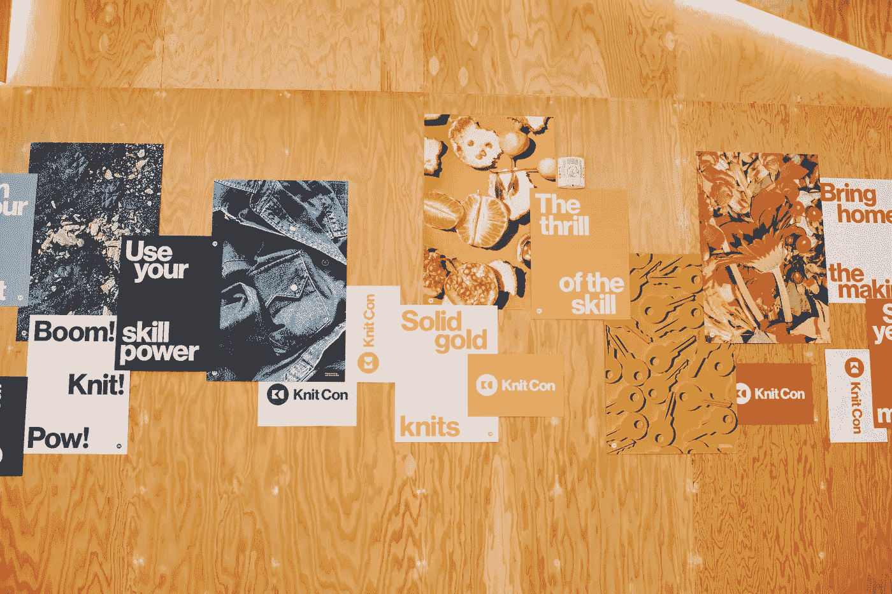

# 深入了解推动 Pinterest 发展的技术

> 原文：<https://medium.com/pinterest-engineering/looking-inside-the-technology-that-powers-pinterest-2e8bd1cfc329?source=collection_archive---------3----------------------->

作者:Vanja Josifovski

Pinterest 最初是一家小型创业公司，现在已经发展成为一家为超过 2 . 5 亿人提供超过 1 . 75 亿个 pin 的公司。虽然我们拥有最大的在线数据集之一，但我们有 600 多名工程师，因此每个人都需要能够使用技术，以便在高效构建和扩展这个可视化发现引擎中发挥作用。

所有这些增长的基础是内置于系统中的技术，这些技术在客户机和服务器上组织和提供大量数据。在相对较短的时间内，我们的旅程迫使我们多次构建和重建我们的系统——有时很紧急。因此，我们的许多技术实现既是历史环境和交付紧迫性的结果，也是严格设计的结果。

与所有有机生长的工件一样，我们技术系统的几个部分没有以可预测和逻辑上预先设计的方式开发。因此，堆栈的不同部分有时会相互碰撞和冲突。其他时候，系统之间有大量的重叠和重复。虽然这些问题很大程度上是由于我们努力的速度和节俭造成的，但它们也推动了我们公司迄今为止的发展。

为了继续扩大规模，去年我们开始通过阐明和整理我们技术基础的发展方向来优化速度和效率，为我们堆栈的关键部分制定了一套*技术策略*。

统一这些个人技术策略是 Pinterest 的技术框架，它定义了我们个人技术策略的使命、背景和关键的基本原则。

# 代表团

我们技术战略的使命与我们公司的使命相匹配:**帮助人们发现和做他们喜欢的事情**。我们不会为了发展技术而发展技术。相反，我们将开发具有*目的*的技术——支持 Pinterest 的使命。

# 语境

让我们来看看 Pinterest 产品工程的背景，看看我们需要什么样的系统来为 Pinners 提供尽可能好的体验，正如我们的使命所定义的那样。以下是我们技术环境的关键参数:

*   **复杂产品:** Pinterest 作为一个产品是相当复杂的。我们生成、消费、处理和提供的数据量是巨大的。我们有不同的表面，需要特定的方法来选择提出的引脚。例如，主页 feed 需要的个性化从根本上不同于搜索和大头针特写中的相关大头针。我们有异构数据——产品和富 pin 是与常规 pin 非常不同的工件。最后，每个表面都有有机的和促进的 pin，它们在语料库大小、寿命和用户交互模式方面也有根本的不同。
*   资源:作为一家为数亿人开发产品的成长型公司，Pinterest 的每个工程团队总是可以使用更多的资源。我们是一个占地很广的小组织。人数分配是领导团队最难做出的决定之一，因为总有几个不同的领域，增加的资源可以改善 Pinners、Partners 和 Pinterest 的结果(总是按此顺序优先)。
*   **宏图:**随着我们全球用户群的增长，我们的系统必须面向实现长期增长轨迹，而不是专注于微小的增量改进。

# 战略原则

以下是定义我们一般如何推进技术进步的关键战略原则:

*   **简单&速度**:根据我们的工程原则，我们专注于开始*简单*然后迭代。我们的技术战略对于确保我们的工程团队拥有一个清晰、深思熟虑且灵活的北极星至关重要。这提供了恰到好处的方向，同时让我们有足够的自由来利用最新的创新。我们构建的一切都需要支持快速迭代。
*   **规模**:我们*构建 Pinterest 规模的影响力*系统，展望数十亿用户和数万亿 pin。我们的技术战略确保长期思考，并允许我们预测和构建未来的规模，而不是做出短视的决定，这可能需要昂贵的返工。
*   **所有权**:通过保持我们的策略的方向性而不是严格的指令性，我们鼓励工程师拥有关于平衡速度和质量的本地决策。此外，战略本身是在公司工程师的广泛参与下制定的，以确保所有团队在规划我们堆栈的技术未来方面都有真正的利益。

此外，我们还确定了以下原则，以更具体地传达我们的战略愿景:

*   **可重用性**:在关注手头问题的同时，我们看看是否有其他系统可以满足我们的需求。我们联合起来共同构建，通过使用和贡献开源项目，几乎总是跨越内部界限，也经常跨越公司界限。我们努力思考如何使用例达到最大公分母。我们考虑了许多不同的重用方式，并找到了与速度的正确平衡。
*   **聚焦复杂性**:我们是各自领域的专家，需要精通 Pinterest 之外的技术。我们能够挑选合适的尖端技术，并利用我们选择复杂解决方案的关键领域。我们非常谨慎地接受复杂性，并对权衡有着深刻的理解。

# 技术策略

我们在下面的各个技术策略中体现了这些原则。我们在开发这些策略时，会听取技术领导者的适当意见，同时避免对工程团队造成不必要的干扰。在迭代的精神中，技术策略是活的人工制品，并将随着时间的推移不断进化。

以下是目前已经完成或正在实施的战略:

*   **机器学习:**机器学习对于 Pinterest 的许多团队和技术的运作至关重要。统一的策略帮助我们最大化模型实验的速度。根据这一战略，我们开发了单一模型培训和服务渠道，为我们的大部分有机和广告用例提供支持。从这一战略发展而来的技术降低了在 Pinterest 构建新的基于 ML 的生产应用程序的障碍。
*   **内容分发基础设施:**Pinterest 的大多数核心用例基于用户输入提供有机或付费内容。所有这些都面临技术挑战，如实现低延迟、支持大规模、避免系统碎片等等。因此，我们基于一组通用的构建模块和使用模式构建了一个策略，允许重用和定制的正确组合。其中，这些构建块包括带有增量更新的倒排索引、键值存储、分散-聚集层和图形遍历基础设施..
*   **数据管理:** Pinterest 拥有强大的通过真实世界实验进行数据驱动决策的文化。为了确保我们工程和技术决策的持续成功，我们加强并保持对业务关键指标的信任，提高开发人员的工作效率，并增加数据管道的投资回报率。数据管理战略方向关注数据治理、质量、发现和编码等领域。
*   **数据处理**:在上述更广泛的数据管理策略的基础上，这一方向提供了关于特定日志记录、查询处理、编程框架和数据处理系统的战略方向。
*   **实验:**我们的迭代速度取决于我们进行实验的速度。根据实验策略，我们将实验基础设施和方法的发展定义为 10 倍实验吞吐量。
*   **云**:云战略计划旨在记录我们在 2-4 年内对基础云基础设施的战略方法。清晰的基础设施方向将确保 Pinterest 保持高可用性、弹性、性能、充分利用、成本效益和可预测性。
*   **支持的语言:**在 Pinterest，我们在工作中使用多种编程语言，包括 Java、Python、JavaScript、C++和 Go。每种语言都需要我们整个工程组织一定程度的广泛支持。语言策略提供了一个框架，用于分析和构建快速、安全且经济高效地开发我们的产品所需的语言支持。
*   **核心客户端平台**:该专题介绍了一种构建客户端技术的战略方法，能够产生快速的 Pinner 体验，符合平台约定，利用本地设备功能，并快速响应不断变化的实验、网络条件和服务器响应。
*   **API**:API 跟踪为 Pinterest 上的所有 API 和 API 端点提供了一个连贯一致的方向。这既包括为第一方客户提供产品功能的内部 API，也包括为合作伙伴、第三方应用程序开发人员和第三方产品集成提供的外部 API。

这些战略是活的和不断发展的文件。在开始新的工作时，它们被用作参考，也可以作为新工程师的参考。这些策略还有助于在跨多个组织的技术问题上推动内部的清晰化。最后，战略文档用于与工程外部的利益相关方就支持我们的核心工程目标所需的方法和资金水平进行沟通。

现在，您已经对我们的技术框架有了更多的了解，请查看我们开放的[工程角色，并加入我们的](https://careers.pinterest.com/careers)！