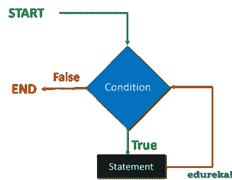
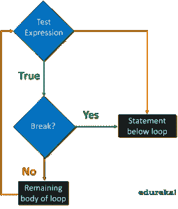

# python 中的循环——为什么要使用循环

> 原文：<https://medium.com/edureka/loops-in-python-fc5b42e2f313?source=collection_archive---------1----------------------->


Loops in Python - Edureka

对于任何程序员来说，处理冗余代码和重复命令都是一场噩梦。Python 利用循环、控制和条件语句来克服这个障碍。本文将帮助您理解 python 中的循环以及围绕循环的所有术语。

1.  Python 中的循环是什么？
2.  回路和**而**回路的**是什么？**
3.  循环控制语句

# Python 中的循环是什么？

Python 中的循环允许我们多次执行一组语句。我们举个例子来理解一下 python 中为什么要使用循环。

假设，你是一名软件开发人员，你需要为办公室的所有员工提供一个软件模块。因此，您必须分别打印每个员工的工资单明细。打印所有员工的详细信息将是一项令人厌烦的任务，相反，您可以使用逻辑来计算详细信息，并继续迭代相同的逻辑语句。这将节省您的时间，并使您的代码高效。

下图是循环的流程图:


执行开始并检查条件是真还是假。条件可以是我们想在程序中测试的任何逻辑。如果为真，它将执行循环体，如果为假，它将退出循环。

# 条件语句

**Python 中的条件语句**支持数学中常见的逻辑条件。

例如:

*   等于:a == b
*   不等于:a！= b
*   小于:a < b
*   Less than or equal to: a <= b
*   Greater than: a > b
*   大于或等于:a >= b

这些语句有几种用法，最常见的是在 **if** 语句中。

让我们理解一下 **if** 语句的概念。

## “if”语句

使用' **if'** 关键字编写一个 **if** 语句，语法是关键字' if '后跟条件。

下面是 **if** 语句的流程图:


如您所见，执行遇到了 **if** 条件，并相应地采取行动。如果为真，则执行主体，如果为假，则退出 **if** 语句。

```
a = 10
b = 20
if a < b :
print(" b is greater")
```

上面的代码片段说明了在 **if** 语句中如何使用条件的基本示例。

当到达 ***if 语句*** 时，检查 b 的值是否大于。如果 b 大于，则打印“ ***b 大于*** ”。现在如果条件为假，则退出 ***if 语句*** 并执行下一条语句。为了打印下一条语句，我们可以为我们希望执行的替代结果添加一个关键字' **else** '。为了更好地理解，我们转到 **else** 语句。

## else 语句

**else** 关键字捕捉前面条件没有捕捉到的任何内容。当 **if** 语句的条件为假时，将执行 else 语句。

下面我们来看看 **else** 语句的流程图:


如你所见，当 **if** 语句为假时，执行转移到 **else 的主体。**我们用一个例子来理解这个。

```
a = 10
b = 20
if a < b :
print(" b is greater")
else:
print(" a is greater")
```

第一个条件不成立，因此我们将转到下一个语句，即 **else** 语句，并打印“ **b 大于**”。

如果我们有更多的条件要测试，我们也可以使用 **elif** 语句。

## “elif”语句

elif 语句通俗地说就是“改为尝试这个条件”。其余的条件可以通过使用 **elif** 关键字来使用。

让我们看看下面的代码:

```
a = 10
b = 20
if a < b :
print(" b is greater")
elif a == b :
print(" a is equal to b ")
else:
print(" a is greater")
```

“当 **if** 语句不为真时，执行将移至 **elif** 语句并检查其是否为真。而最终， **else** 语句 if 和 **elif** 都为假。

自从 a！= b，“b 更大”将打印在这里。

注意: *python 依赖缩进，其他编程语言对循环使用花括号。*

# 什么是“for”循环和“while”循环


循环的**用于执行语句，对序列中的每个项目执行一次。该序列可以是列表、字典、集合或字符串。**

循环的**有两部分，指定迭代语句的块和每次迭代执行一次的主体。**

与 **while** 循环不同，我们已经指定了迭代必须执行的次数。 **for** 循环语法采用三个字段，一个布尔条件，计数变量的初始值和计数变量的增量。

看看这个例子可以更好地理解这一点:

```
days = ["sun" , "mon" , "tue" , "wed", "thu", "fri", "sat"]
for x in days:
print(x)
```

这里我们遍历了列表。要遍历代码指定的次数，我们可以使用 range()函数。

## 距离函数

范围函数需要一个特定的数字序列。它从 0 开始，然后值递增 1，直到达到指定的数字。

例如:

```
for x in range(3) 
print(x)
```

它将从 0–2 开始打印，**输出**将如下所示

```
0  
1 
2
```

注:*(3)不是指 0-3 之间的值，而是指 0-2 之间的值。*

下面是使用条件语句的另一个示例:


```
num = int(input("number"))

factorial = 1
if num < 0 :
print(" invalid input")
elif num == 0:
print(" factorial is 1")
else:
for i in range( 1 , num+1):
factorial = factorial * i
print(factorial)
```

## “while”循环

只要**条件为真**，**‘while’**循环就执行这组语句。

它由条件块和语句集的主体组成，它将继续执行语句，直到条件变为假。不能保证看到循环将保持迭代多长时间。

以下是 while 循环的流程图:



为了理解这一点，让我们看看下面的例子。

示例:

```
i = 1
while i < 6 :
     print(i)
     i += 1
```

**输出**:打印 1 2 3 4 5

执行将继续，直到 **i** 的值达到 6。

while 循环要求相关变量准备好，这里我们需要一个索引变量，可以是任何值。

让我们考虑另一个例子:


```
num = int(input("enter number"))
while num > 0:
    if num < 13:
        print("the number is too large")
        break
    elif num < 13:
        print("number too small")
        break
    elif num == 13:
        print("exit: congratulations")
        break
```

注意:*记得迭代 I 否则循环会永远继续下去。如果这里没有控制语句，循环将永远继续下去。请尝试删除 break 语句，然后再次运行。*

在某些情况下，我们可能需要控制执行流程以支持一些条件，所以让我们来理解 Python 中的循环控制语句。

# 循环控制语句

为了控制循环的流程或根据一些特定的条件改变执行，我们使用下面讨论的循环控制语句。控制语句用于根据条件改变执行。

在 Python 中，我们有三个控制语句:

## 破裂

**Break** 语句用于终止包含它的循环的执行。一旦循环遇到 break 语句，循环就终止，执行转移到循环后面的下一条语句。



如您所见，当 **break** 返回 true 时，执行移动到循环下面的语句。

让我们通过一个例子来更好地理解这一点:

```
for val in "string" :
    if val == "i":
       break
       print(val)
    print("the end")
```

**输出**:

```
s 
t 
r 
The end
```

这里，只要在字符串中遇到字符串“I ”,执行就会停止。然后执行会跳到下一条语句。

## 继续

**continue** 语句用于跳过当前迭代循环中的剩余代码。它不像 **break** 语句那样终止循环，而是继续剩余的迭代。


当遇到 continue 时，它仅跳过该迭代的剩余循环。

例如:

```
for val in "string" :
    if val == "i":
       continue
       print(val)
   print("the end")
```

输出:

```
s
t
r
n
g
the end
```

它将跳过输出中的字符串“I ”,其余的迭代仍将执行。字符串中除“I”以外的所有字母都将被打印。

# 及格

**pass** 语句是一个空操作。这基本上意味着该语句在语法上是必需的，但是您不希望执行任何命令或代码。

看看下面的代码:

```
for val in "please":
if val == "a":
   pass
   print("pass block")
   print(val)
```

**输出:**

```
p 
l
e
pass block
a
s
e
```

执行不会受到影响，一旦遇到“a”字符串，它将只打印**通过**块。并且执行将从“a”开始并执行剩余的迭代。

# 使用 Break 语句的“while”循环

让我们通过下面的例子来理解如何使用 **break** 语句来使用 **while** 循环:

```
i = 1
while i < 6 : 
     print(i)
     if i == 3 :
        break
        i += 1
```

**输出**:打印 1 2

当迭代到 3 时，执行将被终止，下一条语句将被执行。

## 使用 Continue 语句

让我们以 **while** 循环中的 continue 语句为例:

```
i = 1
while i < 6: 
   print(i)
   if i == 3 :
      continue
      i += 1
```

输出:1 2 4 5

这里的执行将被跳过，其余的迭代将被执行。

# 嵌套循环

Python 允许我们在一个循环中使用另一个循环，下面是几个例子

# 嵌套 for 循环

在另一个循环的**中使用**循环的示例:****

```
for i in range(1 , 6):
  for j in range(i):
     print( i , end="")
   print()
```

**输出:**

```
1 
2 2 
3 3 3 
4 4 4 4
```

## 嵌套的“while”循环

下面是使用嵌套的 **while** 循环的基本语法:

```
while expression:
while expression:
statement(s)
statement(s)
```

示例:

一个示例显示了一个嵌套的 **while** 和 **for** 循环:

```
travelling = input("yes or no")
while travelling == "yes" :
      num = int(input("number of people"))
 for num in range( 1 , num+1):
     name = input("name")
     age = input("age")
     gender = input("gender")
     print(name)
     print(age)
     print(gender)
travelling = input("oops missed someone")
```

在这个程序中，我们使用了一个 **while** 循环，并且在 **while** 循环的体内，我们为循环加入了一个**。**

这篇博客中讨论的概念将帮助你理解 Python 中的循环。当你想掌握 Python 时，这将非常方便，并帮助你提高代码效率。Python 是一种广泛使用的高级语言。如果你想查看更多关于人工智能、DevOps、道德黑客等市场最热门技术的文章，那么你可以参考 [Edureka 的官方网站。](https://www.edureka.co/blog/?utm_source=medium&utm_medium=content-link&utm_campaign=loops-in-python)

请留意本系列中的其他文章，它们将解释 Python 和数据科学的各个方面。

> 1. [Python 教程](/edureka/python-tutorial-be1b3d015745)
> 
> 2. [Python 编程语言](/edureka/python-programming-language-fc1015de7a6f)
> 
> 3. [Python 函数](/edureka/python-functions-f0cabca8c4a)
> 
> 4.[Python 中的文件处理](/edureka/file-handling-in-python-e0a6ff96ede9)
> 
> 5. [Python Numpy 教程](/edureka/python-numpy-tutorial-89fb8b642c7d)
> 
> 6. [Scikit Learn 机器学习](/edureka/scikit-learn-machine-learning-7a2d92e4dd07)
> 
> 7.[蟒蛇熊猫教程](/edureka/python-pandas-tutorial-c5055c61d12e)
> 
> 8. [Matplotlib 教程](/edureka/python-matplotlib-tutorial-15d148a7bfee)
> 
> 9. [Tkinter 教程](/edureka/tkinter-tutorial-f655d3f4c818)
> 
> 10.[请求教程](/edureka/python-requests-tutorial-30edabfa6a1c)
> 
> 11. [PyGame 教程](/edureka/pygame-tutorial-9874f7e5c0b4)
> 
> 12. [OpenCV 教程](/edureka/python-opencv-tutorial-5549bd4940e3)
> 
> 13.[用 Python 进行网页抓取](/edureka/web-scraping-with-python-d9e6506007bf)
> 
> 14. [PyCharm 教程](/edureka/pycharm-tutorial-d0ec9ce6fb60)
> 
> 15.[机器学习教程](/edureka/machine-learning-tutorial-f2883412fba1)
> 
> 16.[Python 中从头开始的线性回归算法](/edureka/linear-regression-in-python-e66f869cb6ce)
> 
> 17.[面向数据科学的 Python](/edureka/learn-python-for-data-science-1f9f407943d3)
> 
> 18. [Python 项目](/edureka/python-projects-1f401a555ca0)
> 
> 19. [Python 正则表达式](/edureka/python-regex-regular-expression-tutorial-f2d17ffcf17e)
> 
> 20.[机器学习项目](/edureka/machine-learning-projects-cb0130d0606f)
> 
> 21.[Python 中的数组](/edureka/arrays-in-python-14aecabec16e)
> 
> 22.[在 Python 中设置](/edureka/sets-in-python-a16b410becf4)
> 
> 23.[Python 中的多线程](/edureka/what-is-mutithreading-19b6349dde0f)
> 
> 24. [Python 面试问题](/edureka/python-interview-questions-a22257bc309f)
> 
> 25. [Java vs Python](/edureka/java-vs-python-31d7433ed9d)
> 
> 26.[如何成为一名 Python 开发者？](/edureka/how-to-become-a-python-developer-462a0093f246)
> 
> 27. [Python Lambda 函数](/edureka/python-lambda-b84d68d449a0)
> 
> 28.[网飞如何使用 Python？](/edureka/how-netflix-uses-python-1e4deb2f8ca5)
> 
> 29.[Python 中的套接字编程是什么](/edureka/socket-programming-python-bbac2d423bf9)
> 
> 30. [Python 数据库连接](/edureka/python-database-connection-b4f9b301947c)
> 
> 31. [Golang vs Python](/edureka/golang-vs-python-5ac32e1ef2)
> 
> 32. [Python Seaborn 教程](/edureka/python-seaborn-tutorial-646fdddff322)
> 
> 33. [Python 职业机会](/edureka/python-career-opportunities-a2500ce158de)

*原载于 2019 年 3 月 20 日*[*www.edureka.co*](https://www.edureka.co/blog/loops-in-python/)*。*