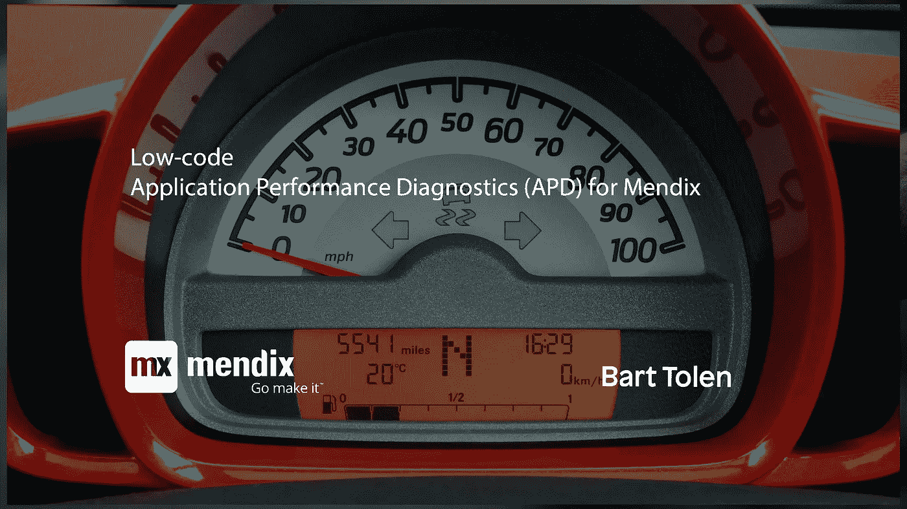

# 面向 Mendix 的低代码应用性能诊断(APD)

> 原文：<https://medium.com/mendix/low-code-application-performance-diagnostics-apd-for-mendix-931dbee6d9f1?source=collection_archive---------6----------------------->

## 您的 Mendix 应用程序的医生现在在云中

对于用户和开发人员来说，没有什么比性能问题更令人沮丧的了。随着应用程序变得越来越复杂，寻找任何性能问题的根本原因变得比以往任何时候都更加困难。为了解决这些问题，Mendix 与 Mansystems 合作提供了一套独特的云服务工具，称为 Mendix 的应用性能诊断(APD ),使开发人员和 IT 团队能够查明任何性能问题的根源。

IT 团队应该将 APD 视为您的 Mendix 应用程序的医生。APD for Mendix 对您的 Mendix 应用程序有着比大多数开发人员做梦都想不到的更深入的了解。用于 Mendix 的 APD 准确地知道您的应用程序的问题所在，这为每个相关人员节省了大量的痛苦、时间和金钱。

同样重要的是，面向 Mendix 的 APD 使 IT 团队能够采用最佳的 Mendix DevOps 流程，最终加快部署高质量应用的速度。选择权在你。IT 团队要么学会忍受现有的应用程序难题，要么以 Mendix 的 APD 形式咨询当地医生，像所有医生一样，该医生发誓要保密。

最重要的是，我们针对 Mendix 的 APD 医生不断了解可能影响 Mendix 应用的潜在问题。事实上，最新发布的 APD for Mendix 提供了一系列额外的新功能。

# APD 的发布

Mansystems 的正式名称是 Mansystems APM 工具，它今天宣布正式推出面向 Mendix 低代码应用的更名 APD 服务，作为第三方应用性能管理(APM)平台的补充。APD 这个名字更好地反映了 Mansystems 在 APM 平台不断扩展和发展的时候所提供的能力。

我们现在超越了简单的监控，因为我们的优势在于了解 Mendix 模型中性能问题的原因所在。我们认为 APD 和第三方 APM 平台可以同时使用。然而，Mendix 的 APD 不仅仅是跟踪简单的指标，如 CPU 和内存利用率。

APD 聚焦于

*   从应用程序(服务器)和用户(浏览器)收集您的 Mendix 应用程序使用情况的统计数据，
*   使用统计数据来查看应用程序的执行情况，
*   找到需要改进的地方或需要立即关注的地方，
*   在趋势和智取问题浮出水面之前就发现它们，
*   记录用户活动，这样开发人员可以在较低的层次上看到正在发生的事情。

# 有什么新鲜事？

新名字(APD)并不是唯一改变的。

*   APD 是 Mansystems 智能数字工厂<link to="" sdf="">的一部分。因此，APD 具有开放的 API
*   随着我们客户群的增长，我们觉得有必要在 APD 的架构和可伸缩性方面下功夫
*   当然，我们不断增加对最新 Mendix 版本的支持
*   我们改进了 APD 代理中已经广泛的安全措施

# 来自发行说明

以下特性变化更具技术性，但也值得一提

*   智能数字工厂可以通过开放 API 使用 APD 功能，如统计快照和记录
*   此外，对于智能数字工厂用户，APD 现在可以通过 APD 代理从我们的 CI/CD 运行您的单元测试
*   APD 浏览器代理已经过重新设计，可以通过运行时代理进行通信，而不是直接与 APM 管理器进行通信，以减少网络带宽消耗。
*   APD 管理器具有改进的排队机制来处理更高的负载
*   APD 数据清理提高了性能
*   APD 运行时代理也有许多小的改进
*   当然，我们会不断增加对最新 Mendix 版本的支持
*   内存使用的安全措施得到了增强，不会在偶尔出现内存高峰时停止我们的 APD 服务

Mendix 应用程序性能诊断工具(APD)是 Mendix 平台的一项商业附加服务，使 IT 团队能够立即诊断性能问题。

要安排 APD 演示，请访问[https://www.mansystems.com/what-we-offer](https://www.mansystems.com/what-we-offer#request-demo)

