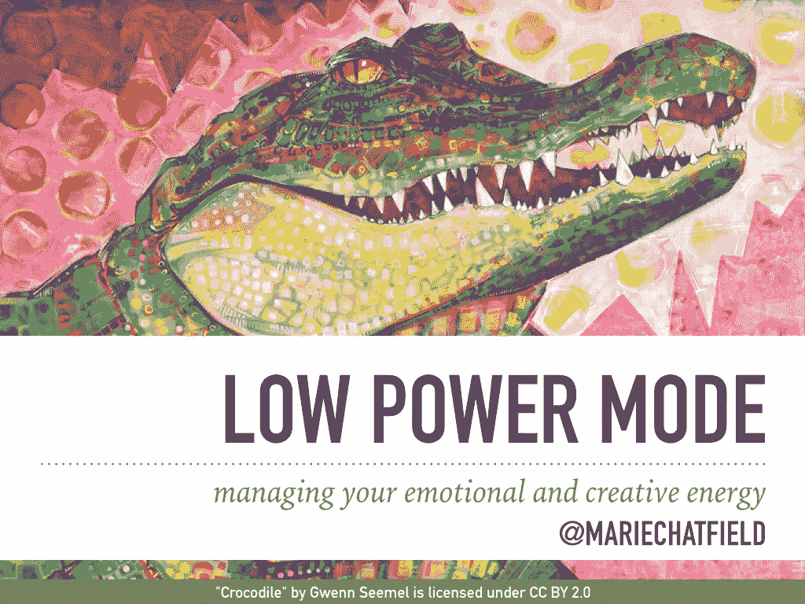
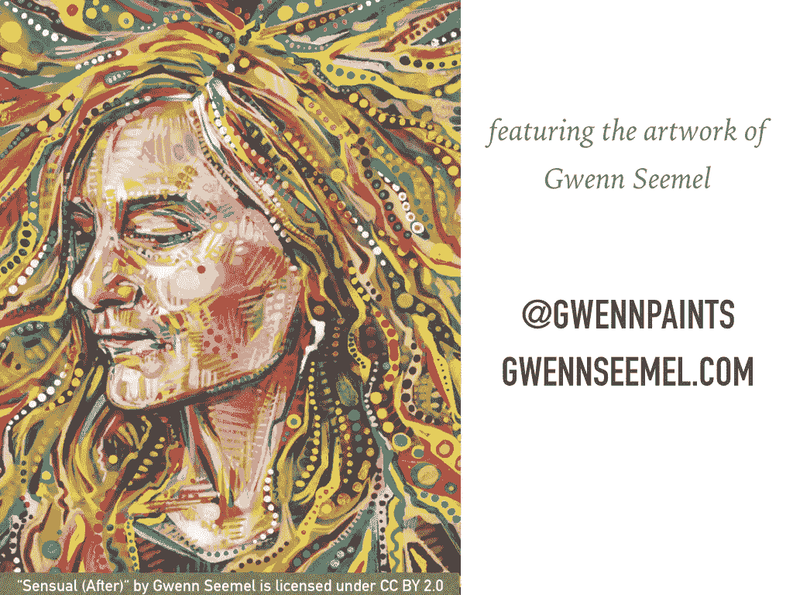
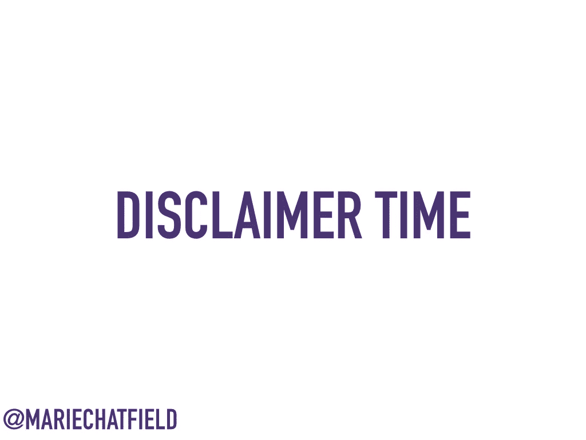
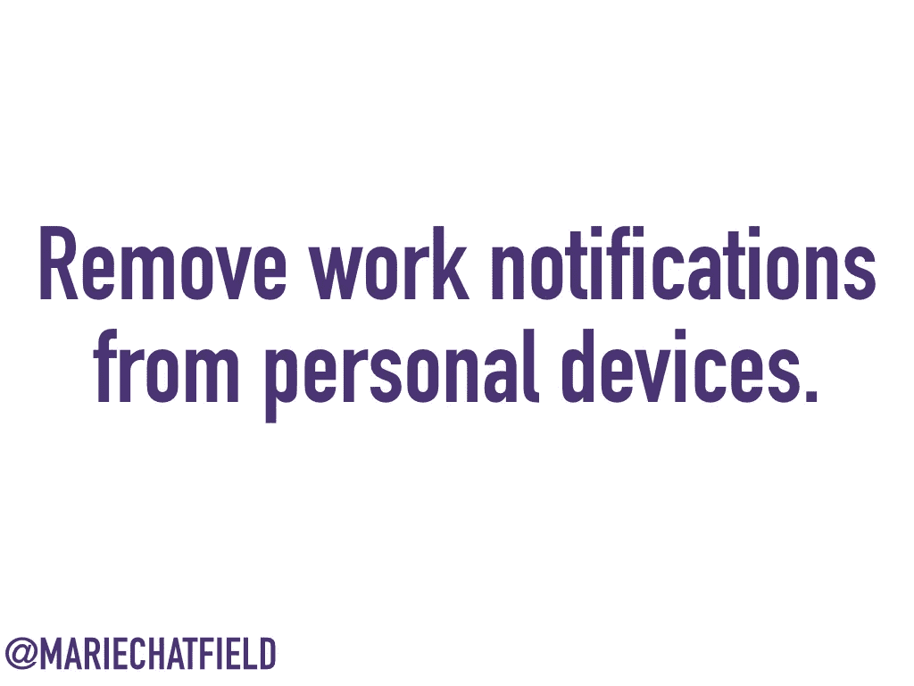

# 低功耗模式:管理你的情绪和创造力

> 原文：<https://medium.com/square-corner-blog/low-power-mode-managing-your-emotional-and-creative-energy-3ce6faad74a8?source=collection_archive---------1----------------------->

> 注意，我们已经行动了！如果您想继续了解 Square 的最新技术内容，请访问我们的新家[https://developer.squareup.com/blog](https://developer.squareup.com/blog)
> 
> *2016 年 10 月 1 日在波特兰 AlterConf 会议上演讲的幻灯片和演讲者注释。*

Low Power Mode: managing your emotional and creative energy. @mariechatfield // Art Credit: “[Crocodile](https://flic.kr/p/tTNwbg)” by Gwenn Seemel, licensed under CC BY 2.0

(下午见面时用语)下午好我叫玛丽·查特菲尔德，我很荣幸今天能和你们在一起。我来自休斯顿，现在住在旧金山，在 Square 的一个前端基础设施团队工作。

我已经做了一年半的全职软件工程师，我完全打算在这个行业待上几年——所以我有既得利益确保我不会精疲力竭。为此，我一直在思考如何管理工作中的精力，我想在接下来的 15 分钟里与你分享我的一些想法。

Featuring the artwork of Gwenn Seemel, @gwennpaints, gweenseemel.com // Art Credit: “[Sensual (After)](https://flic.kr/p/eq1j95)” by Gwenn Seemel, licensed under CC BY 2.0

在我们继续之前，我想给艺术家 Gwenn Seemel 一个快速的大喊，他的美丽艺术贯穿了整个演讲。她实际上已经把她所有的作品都加入了公共领域。如果你想看更多她的作品或支持她，你可以在推特[@ gwennpanate](https://twitter.com/gwennpaints)s 或[gwennseemel.com](http://gwennseemel.com)上找到她！

Productive, Busy, Active, Involved // Art Credit: “[The real Amazons (Western Honey Bee)](https://flic.kr/p/fntshC)” by Gwenn Seemel, licensed under CC BY 2.0

当我刚开始在 Square 工作时，我加入了一个非常棒的工程师团队，致力于解决有趣且具有挑战性的问题。刚从大学毕业时，我觉得我需要和想学的东西太多了，而且我处在一个鼓励我提问的环境中。我在 Square 找到了几个我真正关心的社区，包括我们的女性工程小组、无伴奏合唱小组和棋盘游戏之夜。通过 Square 与当地非营利组织 Spark 的合作，我自愿在秋季学期的每个星期二与一名中学生会面。我进行了一些非常有趣的对话，讨论如何利用我的特权成为一个更好的盟友，我开始了一个内部众包列表，列出了成为盟友的具体方式——然后在 Chrome extension 的一个项目上工作，这个项目会提醒你成为一个盟友。

我全力以赴，我热爱这份工作——我发布代码，组织活动，回馈我热爱的事业。

Overwhelmed, Stressed, Exhausted, Worn // Art Credit: “[Broken Heart](https://flic.kr/p/qWaAQD)” by Gwenn Seemel, licensed under CC BY 2.0

没过多久，我就意识到，尽管我所有的努力都是值得的，但我付出了太多。我下班时感到筋疲力尽。我的工作节奏无法持续我为自己设想的终身职业生涯。

我很快开始了解到，工作与生活的平衡不仅仅是你日历上工作和个人时间的划分，而是你在生活的不同领域所投入的精力的数量和质量。

Strategies for Managing Energy: Enable Low Power Mode, Charge Your Batteries, Power Down

如果我的故事能引起你和你的经历的共鸣，我很乐意分享一些我学到的在工作中管理精力的策略。我把这些策略分成了三大类。

作为一个偶然的诗人，我喜欢一个好的扩展隐喻。所以今天，我们要考虑我们像智能手机一样的方式——我们非常强大，但我们的能量有限，需要时间来补充。

我们将首先讨论启用低功耗模式意味着什么，然后讨论如何给电池充电，最后讨论不时关机的重要性。

Disclaimer Time

作为免责声明，并不是所有对我有用的技术对你都有用，尤其是如果你没有一个尊重你设定的精力和时间界限的经理或团队，如果你已经在技术领域被边缘化，就更是如此。

如果你是一名经理或领导，请尽你所能创造一种文化，让你的员工感到有权设定和执行界限。你可以通过以身作则和不惩罚引入限制的员工来做到这一点。

Enable Low Power Mode: focus your energy on the essential tasks and drop everything else. // Art Credit: “[Copyright is a prayer](https://flic.kr/p/qDTKJK)” by Gwenn Seemel, licensed under CC BY 2.0

那么，我所说的低功耗模式是什么意思呢？正是手机上的这一伟大设置认识到能量是宝贵的和有限的。当低功耗模式开启时，手机会停止使用能源来执行后台任务或其他非必要的工作。

同样，你也可以在自己的生活中启用低功耗模式，把精力集中在重要的任务上，放下所有其他事情。当你电量不足时，启用低功耗模式特别有帮助，但你也可以永远呆在那里，即使你有多余的能量。

Ruthlessly prioritize your responsibilities.

启用低功耗模式的第一步是**毫不留情地**优先考虑你的职责。有很多我们想在一天内完成的工作，我们认为重要并且应该完成的工作，加上一些我们确实应该做的其他事情。这项工作永远不会停止，但我们会。

因此，我们应该不断地与我们的经理和团队或其他利益相关者沟通和协商，以确定本周、冲刺阶段或本季度绝对必须发生的事情。当有新的事情需要完成时，我发现问自己“相对于我现有的工作，我应该如何安排新工作的优先次序”是很有用的。为了完成这项工作，我可以放弃什么？”如果答案是*没有什么*可以被丢弃，那就告诉我这个新的工作没有足够的优先级来把它放到我的待办事项列表中。

Remove work notifications from personal devices.

从个人设备中删除工作通知。这种方法并不总是实用的，尤其是当你有一个随叫随到的轮班或者其他你被期望高度可用的时候。因此，当你不在一个高度可用的时期时，我建议你把手机或笔记本上的所有工作内容都删除掉。

我个人发现，我可以在工作日用手机处理工作邮件，但在周末这太让人分心了。所以我在周五下午关掉我的工作邮件，周一早上再打开。

Decrease involvement in events and communities.

减少对活动和社区的参与。

有一天，当我环顾四周，意识到我是 Square 集团普通女性和 Square 集团工程女性的领导团队成员时，我不得不迈出这一步。对我来说，一下子要处理的事情太多了，这也意味着其他人在这些领导岗位上成长的机会更少了。

我在工程领域的女性小组中投入了更多，所以我决定完全退出一般的女性小组，暂时停止参加那些活动。我完成了对女性工程团队的领导承诺，帮助将我的知识转移到领导团队的下一轮，然后享受成为一名正式成员的快乐。下一季度，我计划为我们的工程女性团队组织一次我热衷的小型活动。我觉得我现在有了更多的精力，这也是我想集中精力的地方。

在你的生活中，可能有几个季节你有额外的精力，你可以把它花在参与社区活动上。但是也可能有这样的季节，你的能量没有得到最好的利用。

知道这一点很重要:如果你是一个在技术领域代表性不足的团体的成员，你没有义务出现，更不用说组织或领导任何针对你的活动或社区。唯一的例外是有人付钱让你去那里。

如果你有精力回馈，那很好——但是如果你现在(或者永远)没有，那也很好。你在这里，这就够了。

Say no to unpaid diversity work.

与此相关的是:对无报酬的多元化工作说不。请注意，决定为你认为对你有意义的组织或活动贡献你的时间和被要求无偿贡献你的工作或时间是有区别的——特别是当你的工作的受益人或受众是一家公司或一个非边缘化群体时。

你的时间和精力比这更有价值，你没有责任代表任何人的多样性。

Charge Your Batteries: identify what gives you energy and joy — then make time to do that. // Art Credit: “[Copycat](https://flic.kr/p/qDL4jy)” by Gwenn Seemel, licensed under CC BY 2.0

下一类策略是给你的电池充电。就像我们每天晚上给手机充电一样，我们需要在日常生活中找到补充能量的方法。这意味着确定什么能给你能量和快乐，然后定期抽时间去做。

Walk outside the office for lunch or coffee.

走出办公室去吃午饭或喝咖啡。逛逛街区，找一个附近的公园，或者去当地的商店或餐馆。出去享受新鲜空气吧！

当我在一个下午感觉特别累，并且意识到我需要快速休息时，我喜欢走到离我办公室不远的一个街区的咖啡店。我通常会邀请我的队友一起去——至少有一两个人会跟着去，即使他们不想买任何东西。当我们回到办公室时，我总是感觉神清气爽，准备好开始下一项工作。

Take regular screen breaks.

定期休息屏幕。太多的时候，我从办公桌前站起来去倒水或吃零食，然后马上从盯着我的显示器的大屏幕切换到我的手机的小屏幕。我会像一个屏幕僵尸一样在办公室的走廊里走上几分钟，然后再盯着我的显示器看一个小时。难怪一天下来，我的眼睛和大脑会筋疲力尽！

不要成为屏幕僵尸——试着让你的眼睛和大脑休息一下，把手机放在办公桌上，在办公室里走动时休息几分钟。

Put time for creative outlets on your calendar.

在你的日历上为创造性的发泄留出时间。这是我最喜欢的策略之一——我喜欢写诗，但是如果让我自己决定，我几乎没有时间坐下来写。当我实际上安排一个小时去写作，然后坚持下去，我总是在投入我的创造性肌肉后感到精力充沛。

我不能鼓励你去追求你自己的创造性出路。创造一些与你日常工作完全无关的东西会让人耳目一新，即使除了你自己，你从来没有和任何人分享过最终的结果。

Make time for movement that gives you joy.

腾出时间给自己带来快乐的运动。这可能对每个人来说都不一样，取决于你的能力、精力、力量和兴趣。也许你游泳或者在附近漫无目的地闲逛，或者跳尊巴舞，或者参加轮椅篮球队，或者做呼吸练习或者恢复性瑜伽，或者你做所有这些事情。

如果有什么方法可以让你移动身体，让你充满快乐，让你感觉更好，给你能量，那就去做吧——即使这意味着早一点下班或者晚一点下班。

Power Down: disconnect completely and give yourself space to recover. // Art Credit: “[Tough](https://flic.kr/p/AH8PHD)” by Gwenn Seemel, licensed under CC by 2.0

管理能源的最后一类策略是断电。用历史悠久的 IT 建议的话说:“关掉它，然后再打开。”

比起我们的手机，我们更需要时间来彻底休息和重置。我们可以通过完全断开，给自己恢复的空间来做到这一点。

Leave work at work, at a reasonable hour.

在合理的时间下班。重要的是不要太早到达，或者呆得太晚，太有规律。但同样重要的是，如果可能的话，不要把工作带回家。

向自己承诺不要一周只有一天把工作带回家。如果你觉得这样做已经很舒服了，试试两天或更长时间！

Learn ways to disrupt unhealthy thinking habits.

学会打破不健康思维习惯的方法。当你意识到你正在思考工作或者工作压力过大时，你需要一种方法来停止这种思路。你可能会发现冥想、想象、祈祷或放声歌唱对你有帮助。

老实说，这是我仍在努力的事情。在很少的情况下，我实际上已经完全被试图解决一个棘手的问题所困扰，以至于我发现自己实际上梦想着不同的方法。有一次，我甚至在睡觉的时候想出了一个解决方案——请注意，不一定是好的解决方案，只是 T2 的一个解决方案——然后在半夜迅速醒来，因为我太兴奋了。但是你怎么能在那之后继续睡觉呢？我翻来覆去，最后只是打开灯，看一本书，直到我的大脑能够平静下来。

如果你发现自己经常对工作感到压力或焦虑，你可能需要去看治疗师或其他心理健康专家——这是我真诚地建议每个人在一生中至少做一次的事情。

Enjoy your sleep and get enough of it.

享受你的睡眠，并获得足够的睡眠。这可能会很难，尤其是如果你有失眠症，或者有小孩，或者有其他可能扰乱你睡眠的情况。但是在对你来说合理的范围内，试着睡上几个小时不受干扰的觉。如果你意识到你的生活中有阻碍你休息的模式，改变它们！

例如，我已经意识到，当我晚上从床上把手机放在房间的另一边时，我睡得更好了，并且我睡觉前和睡觉后的时间质量也提高了很多。如果我的手机触手可及，我会在睡觉前浏览 Twitter，当我第一次醒来时，甚至在我完全正常工作之前再次浏览。

当我在打电话的时候，我更喜欢把手机放在我的头旁边，这样我就不会在晚上错过一页或任何其他重要的通知。问题是，我很少在晚上被传呼——但我确实有朋友和熟人住在比我更早的时区。也就是说，我最后一次打电话时，连续一周每天早上 6 点被我最好的朋友的短信吵醒，她开始了一天的工作。我最终想出了一个办法来改变我的电话设置，这样 PagerDuty 和我的直系亲属就可以联系到我，但当我睡觉和打电话时，其他人都保持沉默。

Take vacation and refuse to be reachable.

最后，休假，拒绝被联系。不在办公室时，不要查看电子邮件或信息或接电话，也不要承诺这样做——这只会延续永不离线的文化。

切断绳索，享受你的休息时间。你很努力，你需要时间恢复。这可能很难，尤其是如果你在一家小公司工作或者经营自己的生意，但是你可以从花一天时间(或者只是半天)照顾自己开始，看看你是否能从那里开始努力。

Enable low power mode, charge your batteries, power down. // Art Credit: “[Big Mama](https://flic.kr/p/kGLGJD)” by Gwenn Seemel, licensed under CC BY 2.0

因此，现在我们已经讨论了管理你的能量的策略，包括三个主要方面:通过专注于基本任务来启用低功率模式，通过腾出时间做你喜欢的事情来给你的电池充电，以及通过断开连接并给自己空间来恢复来关机。

我很想听听这些策略是否对你有所帮助，或者你是否有我所遗漏的管理自己能量的策略。请稍后来找我，或者发微博给我。

我希望大家好好休息，在这个周末的剩余时间和以后的时间里精力充沛。谢谢大家！