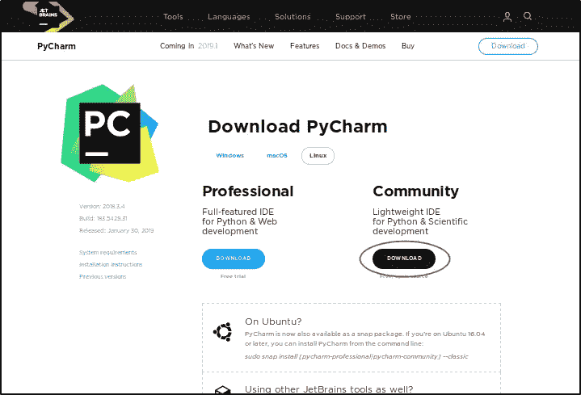
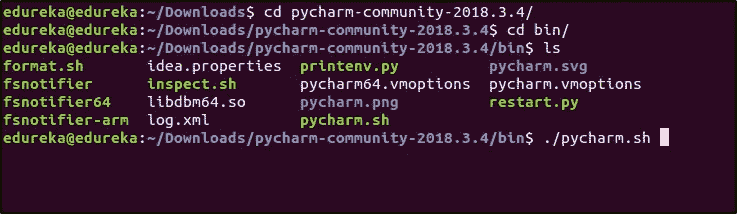
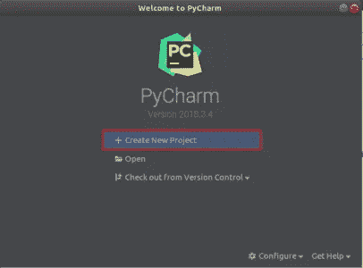
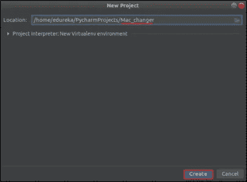
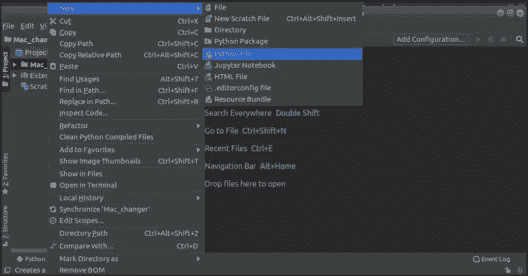
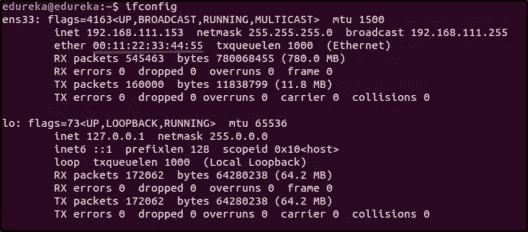

# 使用 Python 的 MacChanger 您迈向道德黑客的第一步

> 原文：<https://medium.com/edureka/macchanger-with-python-ethical-hacking-7551f12da315?source=collection_archive---------2----------------------->


道德黑客很有趣，但是一个道德黑客应该知道很多事情。比如掩盖他的行踪。其中一种方法是使用 MacChanger。在本教程中，我将教你如何用 Python 编写一个 MacChanger。

我将讨论以下主题:

*   为什么用 Python 做道德黑客？
*   什么是换碟机？
*   在 Ubuntu 上安装 PyCharm
*   编写 MacChanger

在编写 MacChanger 之前，让我们看看为什么要使用 Python 进行道德黑客攻击。

# 为什么用 Python 做道德黑客？

道德黑客是在系统中寻找攻击者可以利用并造成损害的漏洞的过程。然后，利用这些结果来提高网络和系统的安全性。我们已经有很多合乎道德的黑客工具可用，那么还需要 Python 做什么呢？

Python 被用来自动化**道德黑客**的过程。道德黑客不是一蹴而就的。道德黑客行为有不同的阶段，其中一些你必须进行不止一次。使用 Python 进行合乎道德的黑客攻击使这变得很容易。

假设您想要测试网站的漏洞，您将必须在网站上运行测试。完成这个项目后，你可能需要测试另一个网站。现在，您将不得不从头开始遵循相同的步骤。这里可以使用 Python 来自动化这些测试步骤。所以，你写一次代码，每次你想测试一个网站的时候就用它。

现在我们知道我们在处理什么，让我们了解什么是 MacChanger！

# 什么是换碟机？

设备制造商为每台网络设备分配了一个 MAC 地址，这有助于与其它设备进行通信。MAC 地址是在设备上硬编码的**，不可能永久更改。但是，我们可以使用 MacChanger 临时改变它。MacChanger 是一种将 MAC 地址更改为所需(或随机)地址的工具，直到设备重新启动。一旦设备重新启动，该设备的 MAC 地址将被设置为其原始 MAC 地址。**

**现在我们知道了什么是 MacChanger，让我们使用 Python 来构建它！**

**对于这篇用 Python 编写 MacChanger 的教程，我们将在 PyCharm 中运行我们的 Python 脚本，py charm 是一个集成开发环境。因此，要运行我们的 Python 脚本，我们需要首先安装 PyCharm。我们来看看如何在 Ubuntu 上安装 PyCharm。**

# **在 Ubuntu 上安装 PyCharm**

**要在 Ubuntu 上安装 PyCharm，首先进入这个链接:[https://www.jetbrains.com/pycharm/download/#section=linux](https://www.jetbrains.com/pycharm/download/#section=linux)**

**在这里，您会发现两个版本，对于本教程，我们将使用社区版。**

****

**当您单击下载按钮时，下载应该会开始。下载完成后，我们必须安装 PyCharm。默认情况下，该文件将被下载到“**下载”**目录中。打开终端并运行以下命令:**

```
$ cd Downloads 
$ tar -xvf pycharm-community-2018.3.4.tar.gz
```

**请记住，将上述命令中的文件名替换为您系统中下载的文件名。**

**上面的命令将提取 PyCharm 文件。现在，要运行 PyCharm，您必须进入**py charm-community-2018 . 3 . 4/bin**文件夹并运行 **pycharm.sh** 文件。为此，请运行以下命令:**

```
$ cd pycharm-community-2018.3.4/ 
$ cd bin/ 
$ ./pycharm.sh
```

****

**当您第一次运行它时，您必须接受条款和条件。一旦完成，PyCharm 就可以运行了。**

**现在我们已经安装了 PyCharm，让我们继续编写一个 MacChanger。**

# **编写 MacChanger**

**您将使用 PyCharm 编写 MacChanger 脚本。要启动 PyCharm，请转到 PyCharm 被解压缩的目录并运行 shell 脚本。**

```
$ cd pycharm-community-2018.3.4/ 
$ cd bin/ 
$ ./pycharm.sh
```

**您将看到 PyCharm 的欢迎屏幕。点击**“创建新项目”。****

****

**输入项目的名称。我将把这个**命名为 Mac_changer。**然后点击**创建**。**

****

**你现在将看到工作场所。接下来，让我们创建一个 Python 文件。为此，右键单击项目名称，转到“**新建**”，然后单击“ **Python 文件**”。**

****

**现在，您可以在这里编写 python 脚本。但是首先，您应该决定要更改哪个网络设备的 MAC 地址。为此，打开终端并运行以下命令:**

```
$ ifconfig
```

**您应该会看到网络接口及其各自 MAC 地址的列表。您可能有不同的接口名称或 MAC 地址。当使用本博客中的脚本时，请确保将接口名称更改为您系统中的名称。对于本教程，我将更改“ **ens33** ”的 MAC 地址。**

**更改 MAC 地址的脚本如下:**

```
import subprocess subprocess.call(["sudo","ifconfig","ens33","down"]) subprocess.call(["sudo","ifconfig","ens33","hw","ether","00:11:22:33:44:55"]) 
subprocess.call(["sudo","ifconfig","ens33","up"])
```

**我将把 MAC 地址更改为 **00:11:22:33:44:55。**现在运行这个脚本。要运行脚本，单击顶部的**“运行”**选项卡，然后单击“**运行**”。**

**运行脚本后，为了检查接口的 MAC 地址是否已经更改，我们将再次检查详细信息。只需在终端中运行 **ifconfig** 命令。**

****

**你看到 MAC 地址的变化了吗？新的 MAC 地址是 **00:11:22:33:44:55** 。就是这么简单。现在，每当您需要更改 MAC 地址时，您所要做的就是在 Python 脚本中更新 MAC 地址和/或接口名称。**

**但是这并没有什么不同或者节省很多时间，对吗？我的意思是，这只是 3 个命令，我们可以手动完成。为什么要为此编写 Python 脚本呢？**

**让我告诉你它是如何产生影响的。想象一下每 5 分钟就必须更改 MAC 地址的场景。假设您正在工作一个小时，您将不得不运行这三个命令 12 次。因此，您总共需要运行 **3 * 12 = 36 个**命令。好吧，现在看起来太多了，不是吗？**

**当你写 Python 脚本时，你可以循环运行这个脚本，每 5 分钟改变一次 MAC 地址。现在你看到你可以节省多少时间和精力。**

**恭喜你！你已经用 Python 写了一个 MacChanger，并看到了它的运行*。*如果你想查看更多关于人工智能、DevOps、云等市场最热门技术的文章，你可以参考 [Edureka 的官方网站。](https://www.edureka.co/blog/?utm_source=medium&utm_medium=content-link&utm_campaign=macchanger-with-python-ethical-hacking)**

**请留意本系列中的其他文章，它们将解释网络安全的各个方面。**

> **1.[什么是网络安全？](/edureka/what-is-cybersecurity-778feb0da72)**
> 
> **2.[网络安全框架](/edureka/cybersecurity-framework-89bbab5aaf17)**
> 
> **3.[隐写术教程](/edureka/steganography-tutorial-1a3c5214a00f)**
> 
> **4.[什么是网络安全？](/edureka/what-is-network-security-1f659407dcc)**
> 
> **5.[什么是计算机安全？](/edureka/what-is-computer-security-c8eb1b38de5)**
> 
> **6.[什么是应用安全？](/edureka/application-security-tutorial-e6a0dda25f5c)**
> 
> **7.[渗透测试](/edureka/what-is-penetration-testing-f91668e2291a)**
> 
> **8.[道德黑客教程](/edureka/ethical-hacking-tutorial-1081f4aacc53)**
> 
> **9.[关于 Kali Linux 你需要知道的一切](/edureka/ethical-hacking-using-kali-linux-fc140eff3300)**
> 
> **10.[使用 Python 的道德黑客](/edureka/ethical-hacking-using-python-c489dfe77340)**
> 
> **11. [DDOS 攻击](/edureka/what-is-ddos-attack-9b73bd7b9ba1)**
> 
> **12.[什么是密码学？](/edureka/what-is-cryptography-c94dae2d5974)**
> 
> **13 [ARP 欺骗](/edureka/python-arp-spoofer-for-ethical-hacking-58b0bbd81272)**
> 
> **14. [Proxychains，Anonsurf & MacChange](/edureka/proxychains-anonsurf-macchanger-ethical-hacking-53fe663b734)**
> 
> **15.[足迹](/edureka/footprinting-in-ethical-hacking-6bea07de4362)**
> 
> **16.[50 大网络安全面试问答](/edureka/cybersecurity-interview-questions-233fbdb928d3)**

***原载于 2019 年 2 月 27 日*[*【www.edureka.co*](https://www.edureka.co/blog/macchanger-with-python-ethical-hacking/)*。***