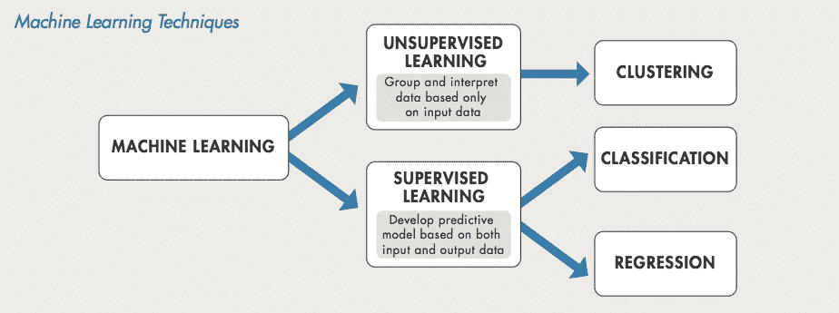

# An Introduction to Machine Learning

> 原文：<https://medium.easyread.co/machine-learning-2bffa3c529d5?source=collection_archive---------7----------------------->

## Apa itu machine learning?

Machine Learning images taken from google

*Artificial Intelligence* atau yang dikenal juga dengan Kecerdasan Buatan merupakan ilmu pengetahuan dan rekayasa pembuatan mesin cerdas yang memiliki kemampuan untuk meraih tujuan seperti yang dilakukan manusia (John McCarthy, 1955). *Nah* , dengan kata lain, *Artificial Intelligence* adalah kecerdasan manusia yang diperagakan oleh mesin.

*Machine Learning* sendiri merupakan sebuah sub-bidang besar dari *Artificial Intelligence* (AI) yang membahas tentang bidang studi yang memberikan komputer kemampuan untuk belajar tanpa diprogram secara eksplisit. *Machine learning* merupakan sebuah pendekatan untuk mencapai *Artificial Intelligence* (Arthur Samuel, 1959). *Machine learning* merupakan bidang studi yang memanfaatkan prinsip ilmu komputer dan statistika untuk membuat model statistik. Model ini pada umumnya digunakan untuk mengajari komputer melakukan dua hal yakni untuk membuat prediksi masa depan berdasarkan data di masa lalu dan/atau menjelajahi pola dalam data.

Machine Learning Techniques image taken from google

Terdapat dua jenis teknik *machine learning* yaitu *supervised learning* dan *unsupervised learning* . Dalam *supervised learning* , mesin belajar memprediksi sampel uji berikutnya berdasarkan data yang telah diberi label sebelumnya. Sedangkan *dalam unsupervised learning* , kita tidak memiliki data yang telah diberi label sebelumnya, melainkan kita perlu memprediksi terlebih dahulu label tersebut. *Unsupervised learning* digunakan ketika kita perlu mengelompokkan item berdasarkan kesamaan antar item. Teknik pengelompokkan ini disebut dengan *clustering* (NLTK *Essentials* ).

Dalam teknik teknik *supervised learning* . Algoritma diberikan *input* dan *output* dengan tujuan untuk menemukan pemetaan antara keduanya yang akan menghasilkan *output* yang baik dari *input* baru. *Supervised learning* terdiri dari dua jenis yaitu *classification* dan *regression. Classification* (klasifikasi) digunakan ketika kita perlu memprediksi apakah sebuah sampel uji merupakan bagian dari salah satu kelas atau kategori yang telah ditentukan. Sedangkan regresi digunakan ketia kita perlu memprediksi sebuah variabel *continuous* seperti harga barang.

Untuk menggunakan algoritma *machine learning* digunakan dalam membantu mesin mempelajari data untuk menyelesaikan masalah, perlu diketahui secara spesifik apa yang akan digunakan algoritma sebagai data. Secara umum metode dan algoritma *machine learning* ditulis untuk fitur atau variabel numerik. Fitur merupakan hasil observasi data *train* yang ditranslasikan dalan bentuk kuantitatif atau kualitatif. Banyak fitur digabungkan menjadi vektor fitur yang digunakan sebagai input untuk algoritma *machine learning* dalam menentukan kelas yang sesuai bagi data baru *.*

*Nah,* kira-kira bagaimana? Tertarik mempelajari *machine learning* ?

*Artikel ini di tulis oleh* [*Agri Fina*](https://medium.com/u/e96f6bff56dd?source=post_page-----2bffa3c529d5--------------------------------) *ia menulis artikel mengenai Software Engineering dan Programming. Ikuti profilnya untuk mendapatkan update-an terbaru artikel-artikel miliknya.*

*Jika kamu merasa artikel ini menarik dan bermanfaat, bagikan ke lingkaran pertemanan kamu, agar mereka dapat membaca artikel ini.*