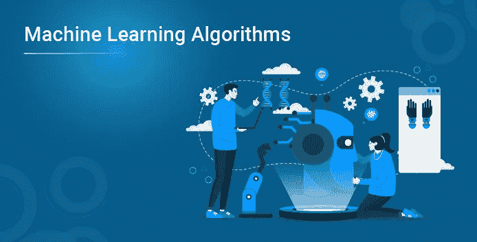
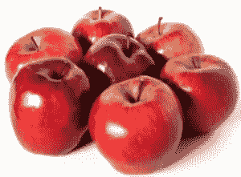
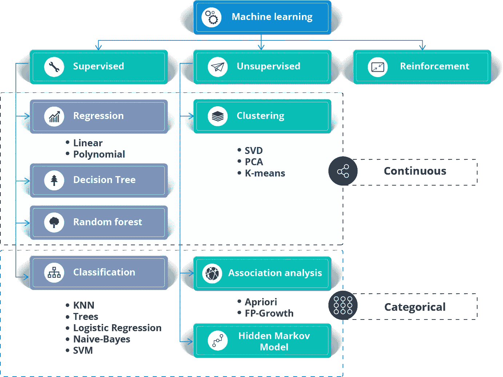
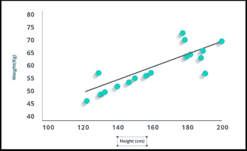
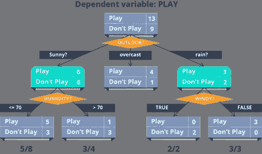
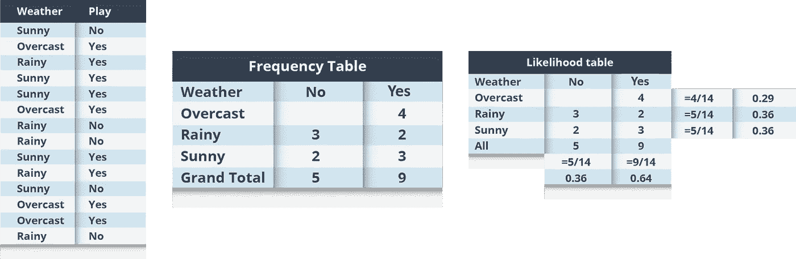
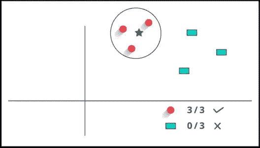

# 机器学习算法

> 原文：<https://medium.com/edureka/machine-learning-algorithms-171164eace7f?source=collection_archive---------5----------------------->



我们可能正生活在技术最具决定性的时期。计算从大型主机到 PC 再到自动驾驶汽车和机器人的时期。但让它具有决定性的不是发生了什么，而是走到这一步需要付出什么。这个时期令人兴奋的是资源和技术的民主化。曾经需要几天的数据处理，今天只需要几分钟，这一切都归功于 ***机器学习算法*** 。

这就是数据科学家每年获得高达 12.4 万美元年薪的原因，这增加了对*数据科学认证的需求。*

让我给你一个大纲，这篇文章将帮助你理解。

*   **什么是机器学习？**
*   **什么是机器学习算法？**
*   **机器学习算法有哪些类型？**
*   **什么是监督学习算法？**
*   **什么是无监督学习算法？**
*   **什么是强化学习算法？**
*   **机器学习算法列表**

# 机器学习算法:什么是机器学习？

***机器学习*** 是一个允许机器从例子和经验中学习的概念，这也不需要显式编程。

我给你打个比方，让你更容易理解。

让我们假设有一天你去买苹果。小贩有一辆装满苹果的手推车，在那里你可以亲手挑选苹果，称重，并根据固定的价格(每公斤)付款。

任务:你将如何挑选最好的苹果？

下面给出的是一组人类从购买苹果的经历中获得的知识，你可以深入了解它的细节。浏览一遍，你会很容易把它和机器学习联系起来。

**学问 1:** 鲜红的苹果比苍白的苹果更甜

又小又红的苹果只有一半时间是甜的

小而苍白的苹果一点也不甜

**学习 4:** 更脆的苹果更多汁

青苹果比红苹果好吃

学习 6:你不再需要苹果了



如果你必须为它写一个代码呢？

现在，想象你被要求写一个计算机程序来选择你的苹果。您可以编写以下规则/算法:

你可以用这些规则来选择苹果。

但是每当你从实验中得出一个新的观察结果(如果你不得不选择橙子，那会怎么样),你必须手动修改规则列表。

你必须了解影响水果质量的所有因素的细节。如果问题变得足够复杂，你可能很难手工制定精确的规则来涵盖所有可能的水果类型。这需要大量的研究和努力，不是每个人都有这么多的时间。

这就是机器学习算法发挥作用的地方。

因此，你要做的不是编写代码，而是向通用算法提供数据，算法/机器根据给定的数据构建逻辑。

# 机器学习算法:什么是机器学习算法？

机器学习算法是常规算法的一种进化。它让你的程序“更聪明”，允许它们从你提供的数据中自动学习。该算法主要分为:

因此，在我之前给出的例子的基础上，让我们来谈谈这些阶段。

**训练阶段**

你从市场上随机选择一个苹果样本(**训练数据**，制作一个表格，列出每个苹果的所有物理特征，如颜色、大小、形状、生长在该国的哪个地区、由哪个供应商出售等(**特征**，以及该苹果的甜味、多汁性、成熟度(**输出变量**)。你将这些数据输入机器学习算法(**分类/回归**)，它就会学习一个苹果平均物理特征与其质量之间的相关性模型。

**测试阶段**

下次当你去购物时，你将测量你正在购买的苹果的特征(**测试数据**)，并将其馈送给机器学习算法。它将使用之前计算的模型来预测苹果是否是甜的、成熟的和/或多汁的。该算法可能在内部使用规则，类似于您之前手工编写的规则(例如，一个**决策树**)。最后，你现在可以非常自信地购买苹果，而不用担心如何选择最好的苹果的细节。

# **结论**

你知道吗！你可以让你的算法随着时间的推移而改进(**强化学习**)，这样当它在越来越多的训练数据集上得到训练时，它就会提高它的准确性。万一它做出错误的预测，它将自己更新它的规则。

最棒的是，你可以使用相同的算法来训练不同的模型。你可以分别创建一个来预测芒果、葡萄、香蕉或任何你想要的水果的质量。

让我们将机器学习算法分成几个部分，看看它们是什么，它们是如何工作的，以及它们在现实生活中是如何使用的。

# 机器学习算法:机器学习算法有哪些类型？

因此，机器学习算法可以分为以下三种类型。



## 机器学习算法:什么是监督学习？

这一类别被称为 ***监督学习*** ，因为从训练数据集学习算法的过程可以被认为是**老师教他的学生**。算法在训练数据的基础上不断预测结果，并由老师不断修正。学习继续进行，直到算法达到可接受的性能水平。

**让我用简单的术语重新表述一下:**

在监督机器学习算法中，训练数据集的每个实例都由输入属性和期望输出组成。训练数据集可以接受任何类型的数据作为输入，如数据库行的值、图像的像素，甚至音频直方图。

**示例:**在**生物识别护理**中，您可以使用您的生物识别身份输入来训练机器——它可以是您的拇指、虹膜或耳垂等。一旦机器被训练，它可以验证你未来的输入，并可以很容易地识别你。

**机器学习算法:什么是无监督学习？**

这种机器学习被称为无监督学习，因为与有监督学习不同，没有老师。算法自行发现并返回数据中有趣的结构。

无监督学习的目标是对数据中的底层结构或分布进行建模，以便了解更多关于数据的信息。

**让我用简单的术语重新表述一下**

在无监督学习方法中，训练数据集的样本没有与其相关联的预期输出。使用无监督学习算法，您可以根据输入数据的典型特征来检测模式。聚类可以被认为是使用无监督学习方法的机器学习任务的例子。然后，机器将相似的数据样本分组，并在数据中识别不同的聚类。

**例子:欺诈检测**可能是无监督学习最流行的用例。利用欺诈性索赔的过去历史数据，可以根据其与指示欺诈模式的聚类的接近程度来隔离新的索赔。

**机器学习算法:什么是强化学习？**

强化学习可以被认为是一种反复试验的学习方法。机器每执行一个动作就会得到一个奖励或惩罚点。如果选项正确，机器将获得奖励点，如果回答错误，机器将被扣分。

强化学习算法完全是关于环境和学习代理之间的交互。学习代理基于探索和开发。

*探索*是指学习代理在试错的基础上采取行动，而*开发*是指它根据从环境中获得的知识采取行动。环境对代理人的每一个正确动作都给予奖励，这就是强化信号。为了获得更多的奖励，代理人改进其环境知识以选择或执行下一个动作。

## 让我们看看巴甫洛夫是如何用强化训练训练他的狗的？

巴甫洛夫把他的狗的训练分为三个阶段。

**第一阶段:**在第一部分，巴甫洛夫给了狗肉，作为对肉的回应，狗开始垂涎三尺。

第二阶段:在下一阶段，他用铃铛发出声音，但这一次狗没有任何反应。

第三阶段:在第三阶段，他试着用铃铛训练他的狗，然后给它们食物。看到食物，狗开始流口水。

最终，狗一听到铃声就开始流口水，即使没有食物，因为狗被*强化*只要主人按铃，它就会得到食物。通过刺激或反馈，强化学习是一个持续的过程。

## 机器学习算法:机器学习算法列表

这里列出了 5 种最常用的机器学习算法。

1.  线性回归
2.  逻辑回归
3.  决策图表
4.  朴素贝叶斯
5.  kNN

## 1.线性回归

它用于估计实际价值(房屋成本、通话次数、总销售额等)。)基于连续变量。这里，我们通过拟合最佳直线来建立自变量和因变量之间的关系。这条最佳拟合线被称为*回归线*，由线性方程 **Y= aX + b** 表示。

理解 ***线性回归*** 最好的方法就是重温童年的这段经历。比方说，你让一个五年级的孩子按体重增加的顺序排列他班里的人，而不问他们的体重！你觉得这孩子会怎么做？他/她可能会查看(视觉分析)人的身高和体型，并使用这些可见参数的组合来安排他们。这是现实生活中的线性回归！这个孩子实际上已经算出了身高和体型与体重之间的关系，就像上面的等式一样。

在这个等式中:

*   **Y —因变量**
*   **a —斜率**
*   **X —自变量**
*   **b —截距**



这些系数 **a** 和 **b** 是基于最小化数据点和回归线之间距离的‘平方差之和’得出的。

看给出的情节。这里，我们已经确定了具有线性方程 **y=0.2811x+13.9** 的最佳拟合。现在利用这个等式，我们可以知道一个人的身高，从而求出体重。

## r 代码:

```
#Load Train and Test datasets
#Identify feature and response variable(s) and values must be numeric and numpy arrays
x_train <- input_variables_values_training_datasets
y_train <- target_variables_values_training_datasets
x_test <- input_variables_values_test_datasets
x <- cbind(x_train,y_train)
# Train the model using the training sets and check score
linear <- lm(y_train ~ ., data = x)
summary(linear)
#Predict Output
predicted= predict(linear,x_test)
```

## 2.逻辑回归

不要被它的名字搞糊涂了！这是一种分类，而不是回归算法。它用于根据一组给定的独立变量估计离散值(二进制值，如 0/1、是/否、真/假)。简而言之，它通过将数据拟合到一个*逻辑函数*来预测事件发生的概率。因此，它也被称为。由于它预测概率，其输出值介于 0 和 1 之间。

同样，让我们通过一个简单的例子来理解这一点。

假设你的朋友给了你一个难题要你解决。只有两种结果——要么解决，要么不解决。现在想象一下，你正在接受各种各样的难题/测验，试图了解你擅长的科目。这项研究的结果大概是这样的——如果给你一个十年级的三角学问题，你有 70%的可能解决它。另一方面，如果是五年级历史题，得到答案的概率只有 30%。这就是逻辑回归给你提供的。

说到数学，结果的对数概率被建模为预测变量的线性组合。

```
odds= p/ (1-p) = probability of event occurrence / probability of not event occurrence ln(odds) = ln(p/(1-p)) logit(p) = ln(p/(1-p)) = b0+b1X1+b2X2+b3X3....+bkXk
```

以上， *p* 是感兴趣特征出现的概率。它选择最大化观察样本值的可能性的参数，而不是最小化误差平方和的参数(就像普通回归一样)。

## r 代码:

为了改进模型，可以尝试许多不同的步骤:

*   包括交互术语
*   移除功能
*   正则化技术
*   使用非线性模型

## 3.决策图表

这是我最喜欢的算法之一。这是一种监督学习算法，主要用于分类问题。令人惊讶的是，它对分类变量和连续变量都有效。在这个算法中，我们将种群分成两个或更多的同类集合。这是基于最重要的属性/独立变量来完成的，以尽可能地形成不同的组。



在上图中，你可以看到人口根据多种属性被分为四个不同的组，以识别“他们是否会玩”。

## r 代码:

```
library(rpart)
x <- cbind(x_train,y_train)
# grow tree 
fit <- rpart(y_train ~ ., data = x,method="class")
summary(fit)
#Predict Output 
predicted= predict(fit,x_test)
```

## 4.朴素贝叶斯

这是一种基于*贝叶斯定理*的分类技术，假设预测器之间相互独立。简单来说， ***朴素贝叶斯分类器*** 假设一个类中特定特征的存在与任何其他特征的存在无关。

例如，如果一个水果是红色的，圆形的，直径约为 3 英寸，它就可以被认为是苹果。即使这些特征相互依赖或依赖于其他特征的存在，朴素贝叶斯分类器也会考虑所有这些属性，以独立地影响该水果是苹果的概率。

朴素贝叶斯模型易于构建，对于非常大的数据集尤其有用。除了简单之外，朴素贝叶斯被认为比高度复杂的分类方法更好。

贝叶斯定理提供了从 **P(c)** 、 **P(x)** 和 **P(x|c)** 计算后验概率 **P(c|x)** 的方法。看下面的等式:


这里，

*   ***P* ( *c|x* )是*类* ( *目标*)给定*预测器* ( *属性*)的后验概率。**
*   ***P* ( *c* )是*类*的先验概率。**
*   ***P* ( *x|c* )为似然，即*预测器*给定*类*的概率。**
*   ***P* ( *x* )是*预测器*的先验概率。**

**举例:**我们用一个例子来理解一下。下面我有一个训练数据集的天气和相应的目标变量'播放'。现在，我们需要根据天气情况对球员是否上场进行分类。让我们按照以下步骤来执行它。

**步骤 1:** 将数据集转换成频率表

**第二步:**通过查找**阴概率= 0.29** 和**出牌概率为 0.64** 这样的概率，创建一个似然表。



**第三步:**现在，使用朴素贝叶斯方程计算每一类的后验概率。具有最高后验概率的类是预测的结果。

**问题:**如果天气晴朗玩家会付费，这种说法正确吗？

我们可以使用上面讨论的方法来解决它，所以**P(Yes | Sunny)= P(Sunny | Yes)* P(Yes)/P(Sunny)**

这里我们有 **P (Sunny |Yes) = 3/9 = 0.33** ， **P(Sunny) = 5/14 = 0.36** ， **P( Yes)= 9/14 = 0.64**

现在， **P(是|晴)= 0.33 * 0.64 / 0.36 = 0.60** ，概率较高。

朴素贝叶斯使用类似的方法来预测基于各种属性的不同类别的概率。该算法主要用于文本分类和多类问题。

## r 代码:

```
library(e1071)
x <- cbind(x_train,y_train)
# Fitting model
fit <-naiveBayes(y_train ~ ., data = x)
summary(fit)
#Predict Output 
predicted= predict(fit,x_test)
```

# 5.k-最近邻

它可用于分类和回归问题。但在行业内分类问题上应用更广泛。 ***K 近邻*** 是一个简单的算法，它存储所有可用的案例，并通过其 K 近邻的多数投票对新案例进行分类。被分配到该类的事例在通过距离函数测量的 K 个最近邻中最为常见。

这些距离函数可以是欧几里德距离、曼哈顿距离、闵可夫斯基距离和汉明距离。前三个函数用于连续函数，第四个函数(Hamming)用于分类变量。如果 **K = 1** ，则该案例被简单地分配给其最近邻的类别。有时，在执行 kNN 建模时，选择 K 是一个挑战。



KNN 可以很容易地映射到我们的现实生活中。如果你想了解一个你没有任何信息的人，你可能会想知道他的密友和他活动的圈子，并获得他/她的信息！

## r 代码:

```
library(knn)
x <- cbind(x_train,y_train)
# Fitting model
fit <-knn(y_train ~ ., data = x,k=5)
summary(fit)
#Predict Output 
predicted= predict(fit,x_test)
```

## 选择 KNN 之前需要考虑的事项:

*   KNN 计算量很大
*   变量应该被规范化，否则更高范围的变量可能会使它产生偏差
*   在使用 kNN 之前，更多地在预处理阶段工作，比如离群点、噪声去除

这让我想到了这篇文章的结尾。敬请关注更多关于机器学习和数据科学的内容！

一旦你知道了机器学习的基础知识，你是否想知道如何进步？看一看 Edureka 的机器学习认证，它将帮助你走上正确的道路，在这个迷人的领域取得成功。学习机器学习的基础，机器学习的步骤和方法，包括无监督和有监督的学习，数学和启发式方面，以及创建算法的动手建模。你会为机器学习工程师的职位做好准备。

你也可以参加机器学习硕士课程。该计划将为您提供关于现实世界中机器学习应用的最深入和实用的信息。此外，您将学习在机器学习领域取得成功所需的基本知识，如统计分析、Python 和数据科学。

如果你想查看更多关于人工智能、DevOps、道德黑客等市场最热门技术的文章，你可以参考 Edureka 的官方网站。

请留意本系列中的其他文章，它们将解释 Python 和数据科学的各个方面。

> *1。* [*Python 教程*](/edureka/python-tutorial-be1b3d015745)
> 
> *2。*[](/edureka/python-functions-f0cabca8c4a)*[*Python 编程语言*](/edureka/python-programming-language-fc1015de7a6f)*
> 
> **3。* [*Python 函数*](/edureka/python-functions-f0cabca8c4a)*
> 
> **4。*[](/edureka/python-numpy-tutorial-89fb8b642c7d)*[*Python 中的文件处理*](/edureka/file-handling-in-python-e0a6ff96ede9)**
> 
> ***5。*[](/edureka/scikit-learn-machine-learning-7a2d92e4dd07)*[*Python Numpy 教程*](/edureka/python-numpy-tutorial-89fb8b642c7d)***
> 
> ***6。* [*Scikit 学习机*](/edureka/scikit-learn-machine-learning-7a2d92e4dd07)**
> 
> ***7。* [*Python 熊猫教程*](/edureka/python-pandas-tutorial-c5055c61d12e)**
> 
> ***8。* [*Matplotlib 教程*](/edureka/python-matplotlib-tutorial-15d148a7bfee)**
> 
> ***9。* [*Tkinter 教程*](/edureka/tkinter-tutorial-f655d3f4c818)**
> 
> ***10。* [*请求教程*](/edureka/python-requests-tutorial-30edabfa6a1c)**
> 
> ***11。* [*PyGame 教程*](/edureka/pygame-tutorial-9874f7e5c0b4)**
> 
> ***12。* [*OpenCV 教程*](/edureka/python-opencv-tutorial-5549bd4940e3)**
> 
> ***13。* [*用 Python 进行网页抓取*](/edureka/web-scraping-with-python-d9e6506007bf)**
> 
> ***14。* [*PyCharm 教程*](/edureka/pycharm-tutorial-d0ec9ce6fb60)**
> 
> **15。[*Python 中从零开始的线性回归算法*](/edureka/linear-regression-in-python-e66f869cb6ce)**
> 
> **16。 [*用于数据科学的 Python*](/edureka/learn-python-for-data-science-1f9f407943d3)**
> 
> ***17。* [*Python 正则表达式*](/edureka/python-regex-regular-expression-tutorial-f2d17ffcf17e)**
> 
> ***18。*[*Python 中的循环*](/edureka/loops-in-python-fc5b42e2f313)**
> 
> **19。 [*Python 项目*](/edureka/python-projects-1f401a555ca0)**
> 
> **20。 [*机器学习项目*](/edureka/machine-learning-projects-cb0130d0606f)**
> 
> ***21。*[*Python 中的数组*](/edureka/arrays-in-python-14aecabec16e)**
> 
> ***22。* [*在 Python 中设置*](/edureka/sets-in-python-a16b410becf4)**
> 
> ***23。*[*Python 中的多线程*](/edureka/what-is-mutithreading-19b6349dde0f)**
> 
> ***24。* [*Python 面试题*](/edureka/python-interview-questions-a22257bc309f)**
> 
> ***25。*[*Java vs Python*](/edureka/java-vs-python-31d7433ed9d)**
> 
> ***26。* [*如何成为一名 Python 开发者？*](/edureka/how-to-become-a-python-developer-462a0093f246)**
> 
> ***27。* [*Python Lambda 函数*](/edureka/python-lambda-b84d68d449a0)**
> 
> ***28。* [*网飞如何使用 Python？*](/edureka/how-netflix-uses-python-1e4deb2f8ca5)**
> 
> ***29。*[*Python 中的套接字编程是什么*](/edureka/socket-programming-python-bbac2d423bf9)**
> 
> ***三十。* [*Python 数据库连接*](/edureka/python-database-connection-b4f9b301947c)**
> 
> ***31。*[*Golang vs Python*](/edureka/golang-vs-python-5ac32e1ef2)**
> 
> ***32。* [*Python Seaborn 教程*](/edureka/python-seaborn-tutorial-646fdddff322)**
> 
> ***33。* [*Python 职业机会*](/edureka/python-career-opportunities-a2500ce158de)**

***原载于 2022 年 1 月 5 日*[*【https://www.edureka.co】*](https://www.edureka.co/blog/machine-learning-algorithms/)*。***