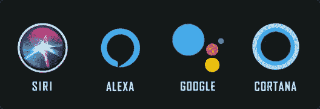

# 机器学习的十大应用

> 原文：<https://medium.com/edureka/machine-learning-applications-4c0a3c844340?source=collection_archive---------3----------------------->

机器学习是现在科技世界的一个时髦词，有充分的理由，它代表着计算机学习方式的一个重大进步。对*机器学习工程师*的需求很高，这种激增是由于不断发展的技术和大量数据的产生。平均而言，一名 ML 工程师的期望工资为 **₹719,646** (印度)或 **$111，490** (美国)。所以，我们来讨论一下机器学习的一些应用。

我将逐一讨论机器学习的以下应用:

*   交通警报
*   社会化媒体
*   交通和通勤
*   产品推荐
*   虚拟个人助理
*   自动驾驶汽车
*   动态定价
*   谷歌翻译
*   在线视频流
*   欺诈检测

# 交通警报(地图)

现在，**谷歌地图**可能是**无论何时我们外出并需要方向和交通方面的帮助时使用的**应用程序。前几天我去另一个城市旅行，走了高速公路，地图上显示:“ ***尽管交通拥挤，你还是在最快的路线上*** ”。但是，**它是怎么知道的呢？**

嗯，它结合了目前使用该服务的人，随着时间的推移收集的该路线的历史数据，以及从其他公司获得的一些技巧。每个使用地图的人都提供他们的位置、平均速度、他们正在行进的路线，这反过来帮助谷歌收集关于交通的大量数据，这使他们预测即将到来的交通并根据它调整你的路线。

# 社交媒体(脸书)

机器学习最常见的应用之一是脸书或任何其他社交媒体平台上的自动好友标记建议。脸书使用**面部检测**和**图像识别**来自动找到与其数据库匹配的人的面部，因此建议我们基于 DeepFace 标记该人。

脸书的深度学习项目 **DeepFace** 负责人脸识别，识别照片中的人是谁。它还为已经上传到脸书上的图片提供替代标签。例如，如果我们在脸书上检查下面的图像，alt-tag 有一个描述。

# 交通和通勤(优步)

如果你已经使用一个应用程序预订了一辆出租车，你在一定程度上已经在使用机器学习。它为您提供了独一无二的个性化应用。自动检测您的**位置**，并根据您的**历史和模式提供回家、办公室或任何其他经常去的地方的选项。**

它使用基于历史行程数据的机器学习算法来做出更准确的 **ETA 预测**。随着机器学习的实施，他们看到了 26%的送货和取件准确率。

# 产品推荐

假设你在亚马逊上查看了一件商品，但你没有当场购买。但是第二天，你正在 YouTube 上看视频，突然你看到了同一商品的广告。你转到脸书，也能看到同样的广告。那么这是怎么发生的呢？

嗯，这是因为谷歌**跟踪你的搜索历史**，并根据你的搜索历史推荐广告。这是机器学习最酷的应用之一。事实上，**亚马逊收入的 35%** 是由产品推荐产生的。

# 虚拟个人助理

顾名思义，当通过文本或语音询问时，虚拟个人助理有助于找到有用的信息。这里机器学习的几个主要应用是:

*   语音识别
*   语音到文本转换
*   自然语言处理
*   文本到语音转换

你只需要问一个简单的问题，比如“**我明天的日程安排是什么？**或**显示我即将到来的航班**。作为回答，您的个人助理会搜索信息或调用您的相关查询来收集信息。最近，个人助理正在聊天机器人中使用，聊天机器人正在各种食品订购应用程序、在线培训网站以及通勤应用程序中实现。

# 自动驾驶汽车

这是机器学习最酷的应用之一。它就在这里，人们已经在使用它了。机器学习在自动驾驶汽车中扮演着非常重要的角色，我相信你们可能听说过**特斯拉**。这个行业的领头羊和他们现在的 ***人工智能*** 是由硬件厂商**英伟达**驱动的，基于无监督学习算法。

NVIDIA 表示，他们没有训练他们的模型来检测人或任何物体。该模型在 ***深度学习*** 上工作，它从所有车辆和司机那里众包数据。它使用作为**物联网**一部分的内部和外部传感器。根据麦肯锡收集的数据，汽车数据将拥有 7500 亿美元的巨大价值。

# 动态定价

为商品或服务定价是经济理论中的一个老问题。有大量的定价策略取决于所追求的目标。无论是电影票、机票还是出租车费，一切都是动态定价的。近年来，人工智能使定价解决方案能够跟踪购买趋势，并确定更具竞争力的产品价格。

优步是如何决定你乘坐的价格的？

优步对机器学习的最大使用是以激增定价的形式出现的，这是一种昵称为“ **Geosurge** ”的机器学习模型。如果你开会要迟到了，你需要在拥挤的地方预订一张优步，准备好付两倍于正常票价的钱。即使是航班，如果你在节日期间旅行，价格也可能是原价的两倍。

# 谷歌翻译

还记得当你旅行到一个新的地方，你发现很难与当地人交流，或者找到所有东西都用不同语言书写的地方。

那些日子已经过去了。谷歌的 **GNMT** (谷歌神经机器翻译)是一种在数千种语言和字典上工作的神经机器学习，使用 ***自然语言处理*** 来提供任何句子或单词的最准确翻译。由于单词的语气也很重要，它使用了其他技术，如词性标注、NER(命名实体识别)和组块。这是机器学习的最佳和最常用的应用之一。

# 在线视频流(网飞)

拥有超过 1 亿用户的网飞无疑是在线流媒体世界的父亲。网飞的迅速崛起让所有电影工业家大吃一惊——他们不禁要问，“**一个网站怎么能和好莱坞叫板？”**。答案是机器学习。

网飞算法不断收集关于用户活动的大量数据，例如:

*   当您暂停、倒回或快进时
*   你哪天看内容(工作日看电视节目，周末看电影)
*   您观看的日期和时间
*   当你暂停并离开内容时(如果你回来的话)
*   给出的评级(每天约 400 万)、搜索(每天约 300 万)
*   浏览和滚动行为

还有很多。他们为每个用户收集这些数据，并使用他们的推荐系统和许多机器学习应用程序。这就是为什么他们有如此巨大的客户保留率。

# 欺诈检测

专家预测，2020 年**，网上信用卡诈骗将飙升至惊人的****32**亿。这比可口可乐和摩根大通的利润总和还要多。那是需要担心的事情。欺诈检测是机器学习最必要的应用之一。由于过多的支付渠道——信用卡/借记卡、智能手机、众多的钱包、合众国际社等等——交易的数量增加了。与此同时，犯罪分子的数量也变得善于寻找漏洞。****

********

****就这样，我们到了这篇文章的结尾。如果你对这个话题有任何疑问，请在下面留下评论，我们会尽快回复你。如果你想查看更多关于 Python、DevOps、Ethical Hacking 等市场最热门技术的文章，你可以参考 Edureka 的官方网站。****

****请留意本系列中的其他文章，它们将解释数据科学的各个方面。****

> *****1。* [*数据科学教程*](/edureka/data-science-tutorial-484da1ff952b)****
> 
> *****2。* [*数据科学的数学与统计*](/edureka/math-and-statistics-for-data-science-1152e30cee73)****
> 
> *****3。*[*R 中的线性回归*](/edureka/linear-regression-in-r-da3e42f16dd3)****
> 
> *****4。* [*数据科学教程*](/edureka/data-science-tutorial-484da1ff952b)****
> 
> *****5。*[*R 中的逻辑回归*](/edureka/logistic-regression-in-r-2d08ac51cd4f)****
> 
> *****6。* [*分类算法*](/edureka/classification-algorithms-ba27044f28f1)****
> 
> *****7。* [*随机森林中的 R*](/edureka/random-forest-classifier-92123fd2b5f9)****
> 
> *****8。* [*决策树中的 R*](/edureka/a-complete-guide-on-decision-tree-algorithm-3245e269ece)****
> 
> *****9。* [*机器学习入门*](/edureka/introduction-to-machine-learning-97973c43e776)****
> 
> *****10。* [*朴素贝叶斯在 R*](/edureka/naive-bayes-in-r-37ca73f3e85c)****
> 
> *****11。* [*统计与概率*](/edureka/statistics-and-probability-cf736d703703)****
> 
> *****12。* [*如何创建一个完美的决策树？*](/edureka/decision-trees-b00348e0ac89)****
> 
> ****13。 [*关于数据科学家角色的十大误区*](/edureka/data-scientists-myths-14acade1f6f7)****
> 
> *****14。*[*5 大机器学习算法*](/edureka/machine-learning-algorithms-29eea8b69a54)****
> 
> *****15。* [*数据分析师 vs 数据工程师 vs 数据科学家*](/edureka/data-analyst-vs-data-engineer-vs-data-scientist-27aacdcaffa5)****
> 
> ****16。 [*人工智能的种类*](/edureka/types-of-artificial-intelligence-4c40a35f784)****
> 
> ****17。[*R vs Python*](/edureka/r-vs-python-48eb86b7b40f)****
> 
> ****18。 [*人工智能 vs 机器学习 vs 深度学习*](/edureka/ai-vs-machine-learning-vs-deep-learning-1725e8b30b2e)****
> 
> *****19。* [*机器学习项目*](/edureka/machine-learning-projects-cb0130d0606f)****
> 
> *****20。* [*数据分析师面试问答*](/edureka/data-analyst-interview-questions-867756f37e3d)****
> 
> *****21。* [*面向非程序员的数据科学和机器学习工具*](/edureka/data-science-and-machine-learning-for-non-programmers-c9366f4ac3fb)****
> 
> *****22。* [*十大机器学习框架*](/edureka/top-10-machine-learning-frameworks-72459e902ebb)****
> 
> *****23。* [*统计机器学习*](/edureka/statistics-for-machine-learning-c8bc158bb3c8)****
> 
> *****24。* [*随机森林中的 R*](/edureka/random-forest-classifier-92123fd2b5f9)****
> 
> *****25。* [*广度优先搜索算法*](/edureka/breadth-first-search-algorithm-17d2c72f0eaa)****
> 
> *****26。*[*R 中的线性判别分析*](/edureka/linear-discriminant-analysis-88fa8ad59d0f)****
> 
> *****27。* [*机器学习的先决条件*](/edureka/prerequisites-for-machine-learning-68430f467427)****
> 
> *****28。* [*互动 WebApps 使用 R 闪亮*](/edureka/r-shiny-tutorial-47b050927bd2)****
> 
> *****29。* [*机器学习十大书籍*](/edureka/top-10-machine-learning-books-541f011d824e)****
> 
> ****三十岁。 [*无监督学习*](/edureka/unsupervised-learning-40a82b0bac64)****
> 
> *****31.1* [*0 本数据科学最佳书籍*](/edureka/10-best-books-data-science-9161f8e82aca)****
> 
> *****32。* [*监督学习*](/edureka/supervised-learning-5a72987484d0)****

*****原载于 2019 年 1 月 28 日*[*https://www.edureka.co*](https://www.edureka.co/blog/machine-learning-applications/)*。*****