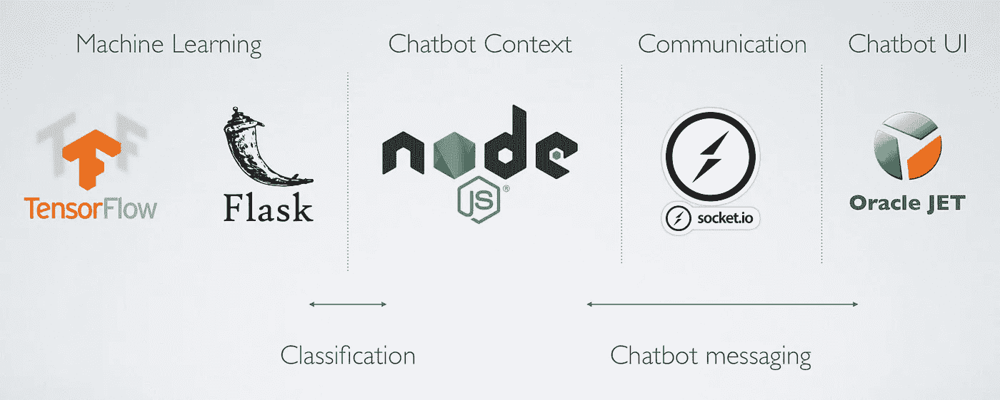
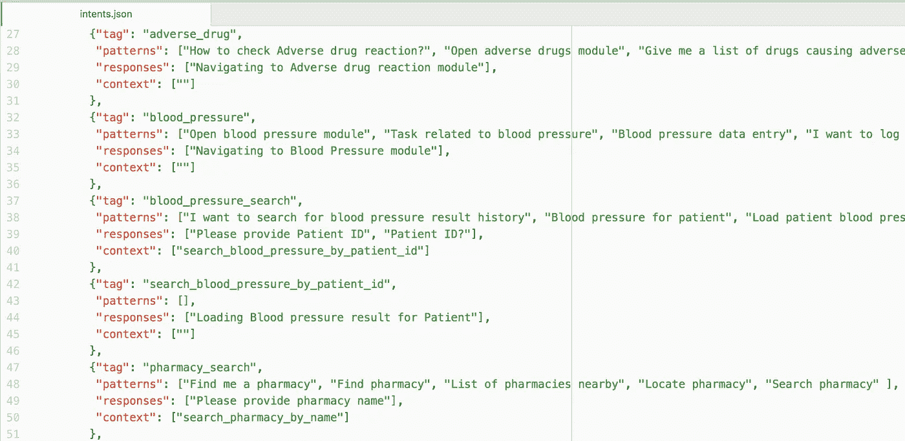
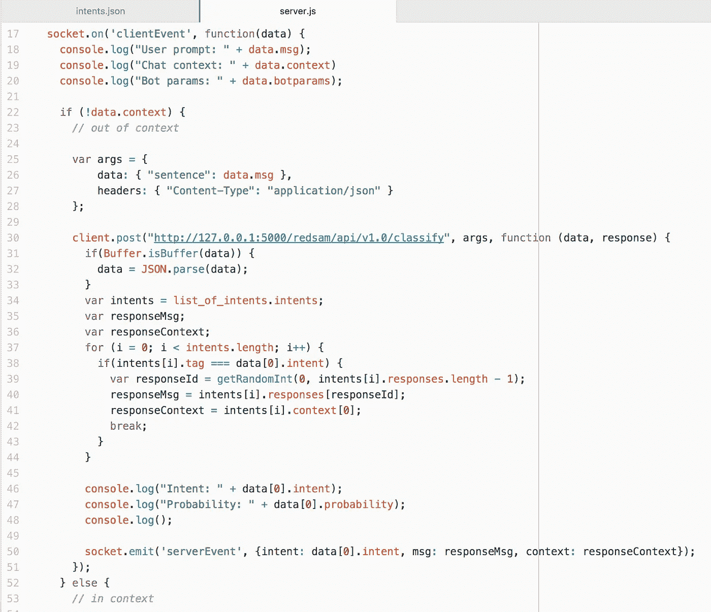
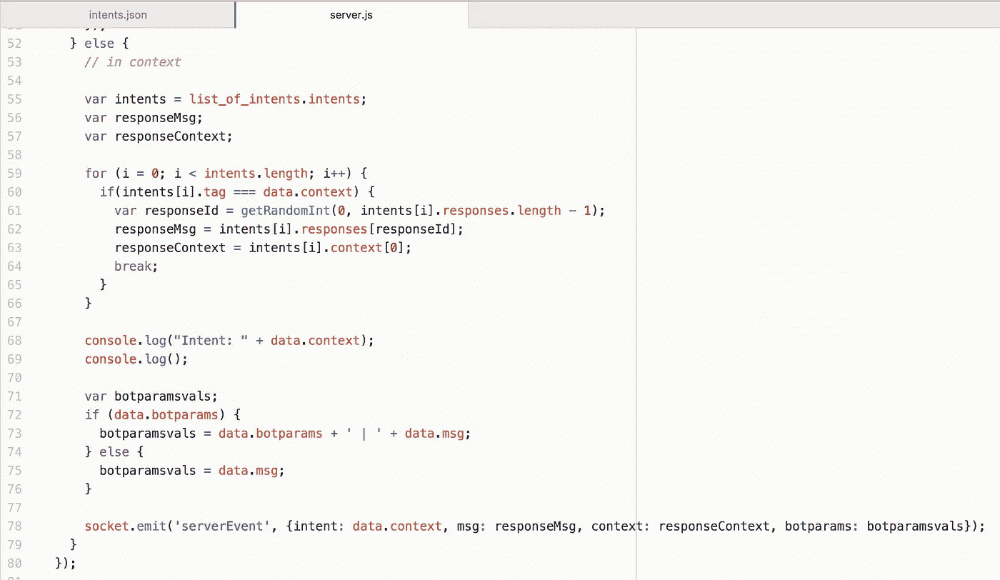
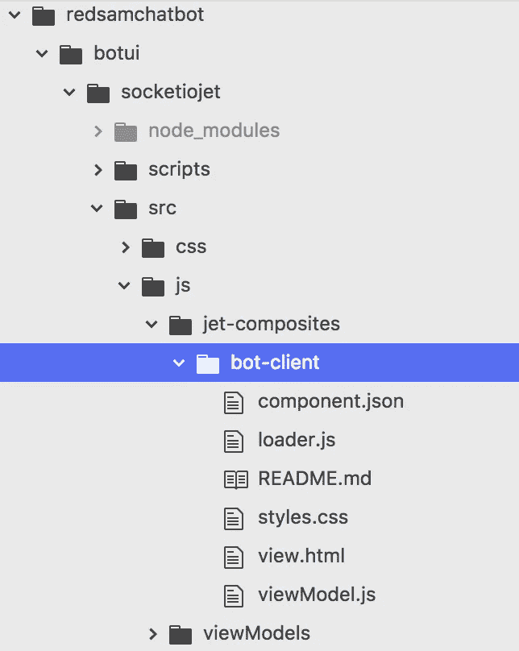
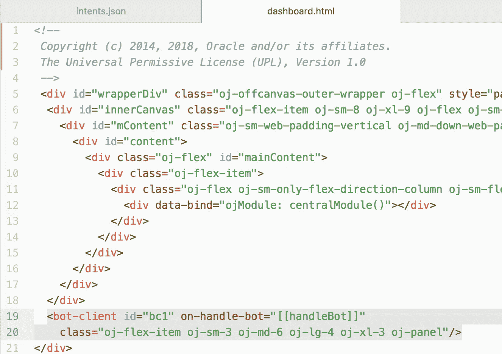
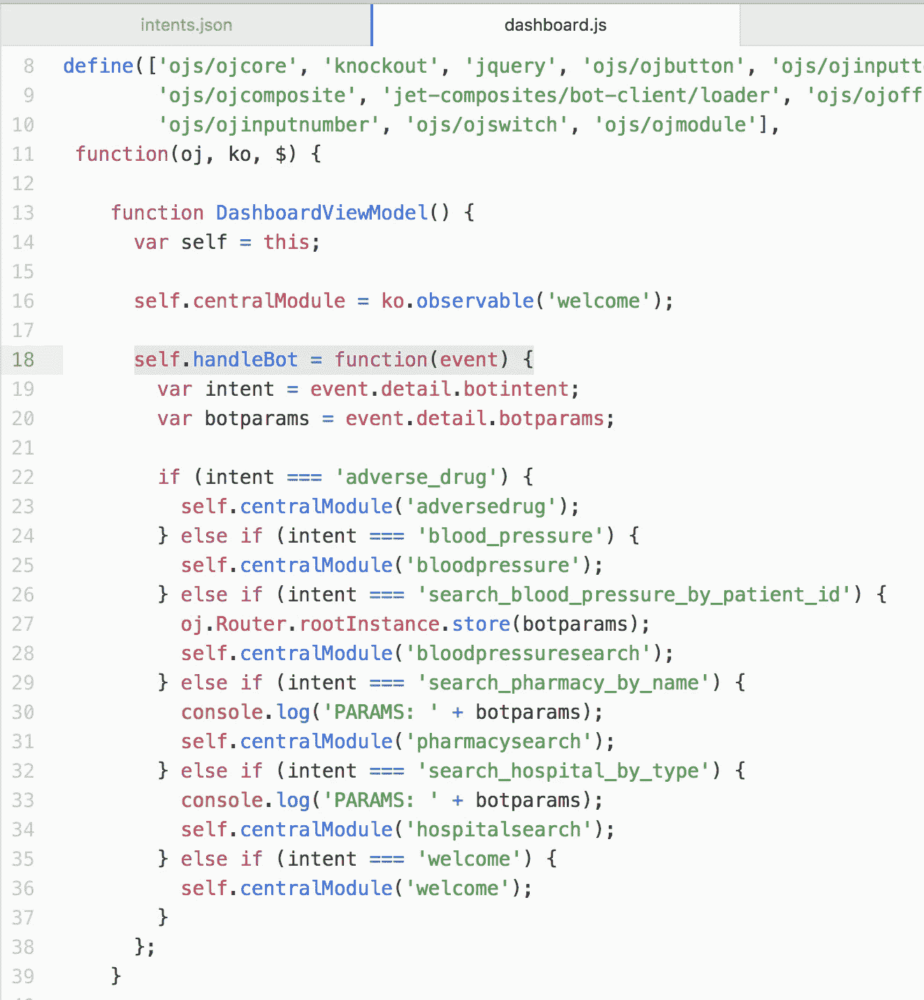
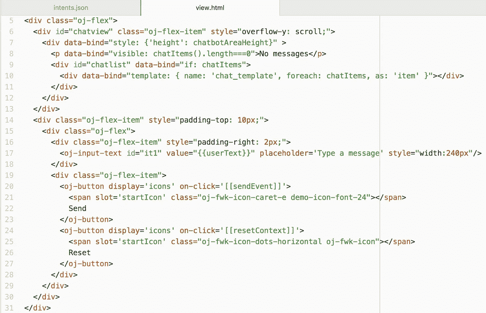
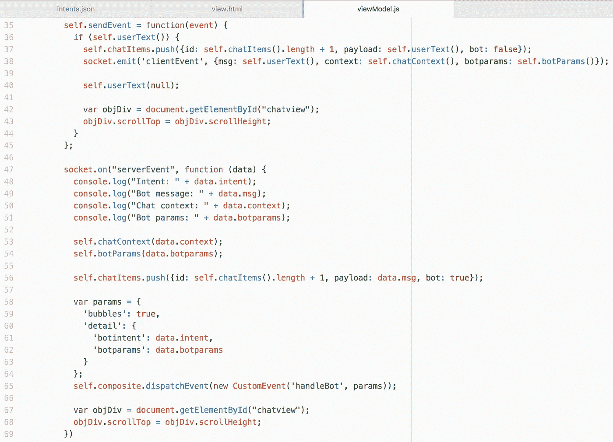
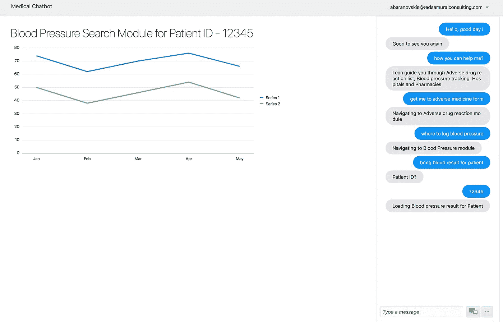

# 应用机器学习— TensorFlow 聊天机器人 UI，带有 Oracle JET 自定义组件

> 原文：<https://medium.com/oracledevs/machine-learning-applied-tensorflow-chatbot-ui-with-oracle-jet-custom-component-c7bb2ea2f8bf?source=collection_archive---------0----------------------->

本帖基于甲骨文码 2018 深圳、华沙、柏林会谈。查看[幻灯片共享](https://www.slideshare.net/andrejusb/machine-learning-applied-contextual-chatbots-coding-oracle-jet-and-tensorflow)上的演示文稿:

在我以前的帖子中，我概述了如何用 TensorFlow 构建聊天机器人后端— [分类—用 TensorFlow 构建机器学习聊天机器人](http://andrejusb.blogspot.com/2018/03/classification-machine-learning-chatbot.html)。今天的帖子是下一步——我将解释如何使用 Oracle JET 在 TensorFlow 聊天机器人上构建自定义 UI。

您可以从我的 [GitHub](https://github.com/abaranovskis-redsamurai/shenzhen) 资源库下载完整的源代码(包括 TensorFlow 部分、chatbot 上下文处理后端和 JET 自定义组件 chatbot UI)。

这是解决方案架构快照:

TensorFlow 用于机器学习和文本分类任务。烧瓶允许通过 REST 与来自外部的张量流进行通信。上下文聊天机器人对话处理在 Node.js 后端实现，与 Oracle JET 客户端的通信由 Socket.io 处理。

聊天机器人实现的关键点——为机器训练过程构建正确的数据结构。学习将越精确，随后将获得更好的分类结果。聊天机器人训练数据可以以 JSON 的形式出现。训练数据的质量可以通过意图和例句之间的重叠来衡量。随着重叠越来越多，产生的机器学习输出将越来越弱，分类将越来越不准确。训练数据可以包含 TensorFlow 不直接使用的信息-我们可以将意图上下文处理包括到相同的结构中，它将由上下文处理算法使用。训练数据的 JSON 结构示例:

TensorFlow 的精确分类只是聊天机器人功能的一部分。我们需要保持对话上下文。这可以通过自定义算法在 Node.js 后端实现。在我的例子中，当没有设置上下文时— TensorFlow 被调用来分类语句并产生意图概率。同一个句子可能有多个分类的意图— TensorFlow 将返回多个概率。这取决于你，要么总是选择最有可能的意图，要么让用户选择。通过调用 *socket.emit* 函数，通过 Socket.io 处理回客户端的通信:

如果已经设置了上下文，我们就不调用分类函数——在这一步中我们不需要它。相反，我们通过意图上下文映射来检查——下一步应该做什么。基于这些信息，我们通过调用 *socket.emit* 函数，再次通过 Socket.io 将问题或操作发送回客户端:

聊天机器人 UI 是用 JET 定制组件实现的(查看 [JET 菜谱](http://www.oracle.com/webfolder/technetwork/jet/jetCookbook.html?component=composite&demo=basic)中的工作原理)。这使得在各种应用程序中重用同一组件变得非常容易:

这是一个例子，当聊天机器人用户界面被纳入消费应用程序。它带有自定义监听器，在那里可以执行任何自定义操作。自定义监听器允许将任何自定义逻辑移出聊天机器人组件，使其真正可重用:

自定义逻辑的示例—基于聊天机器人回复，我们可以加载应用程序模块、分配参数值等。：

Chatbot UI 实现基于列表，它使用模板呈现 bot 和客户端消息。该模板检测消息是属于客户端还是 bot，并应用所需的样式—这有助于呈现可读的列表。还有输入区和控制按钮:

JS 模块执行有助于显示 bot 消息的逻辑，通过将消息添加到消息列表来生成要由自定义逻辑监听器处理的事件。客户端通过调用 Socket.io *socket.emit* 函数向 bot 服务器发送消息:

以下是最终结果—用 Oracle JET 实现的聊天机器人框:

*原载于 2018 年 6 月 11 日*[*andrejusb.blogspot.com*](http://andrejusb.blogspot.com/2018/06/machine-learning-applied-tensorflow.html)*。*