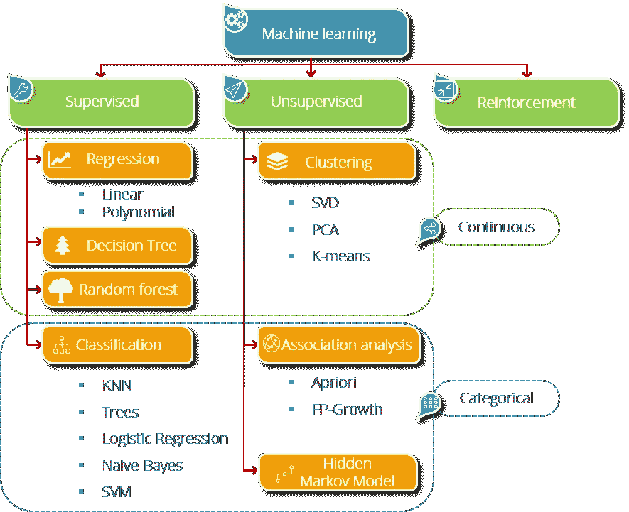

# 用 Python 构建第一个机器学习分类器

> 原文：<https://medium.com/edureka/machine-learning-classifier-c02fbd8400c9?source=collection_archive---------3----------------------->


ML Classifier in Python — Edureka

机器学习是现在的流行语。一些不可思议的事情正在机器学习的帮助下完成。从成为我们的*私人助理*到决定我们的*旅行路线*，帮助我们购物，帮助我们经营我们的企业，到照顾我们的*健康和福利，*机器学习已经在如此基础的层面上融入到我们的日常生活中，以至于大多数时候我们甚至没有意识到我们正在依赖它。在本文中，我们将遵循初学者的方法，用 Python 实现标准的机器学习分类器。

*   机器学习概述
*   机器学习分类器的模板
*   机器学习分类问题

# 机器学习概述

机器学习是一个概念，它允许机器从例子和经验中学习，并且不需要显式编程。因此，你要做的不是编写代码，而是向通用算法提供数据，算法/机器根据给定的数据构建逻辑。


机器学习涉及机器做出决策、评估其行动结果以及改善其行为以连续获得更好结果的能力。

学习过程以三种主要方式进行

*   监督学习
*   无监督学习
*   强化学习



# 机器学习分类器的模板

名为 scikit-learn 的 Python 库中提供了非常方便的机器学习工具，访问和应用非常简单。

使用以下命令通过命令提示符安装 scikit-learn:

```
pip install -U scikit-learn
```

如果您是 anaconda 用户，可以在 anaconda 提示符下使用:

```
conda install scikit-learn
```

安装需要在您的系统上预先安装 NumPy 和 SciPy 软件包。

**预处理:**任何基于机器学习的数据分析，第一步也是最必要的一步就是预处理部分。数据的正确表示和清理对于 ML 模型的良好训练和发挥其潜力是绝对必要的。

**步骤 1** —导入必要的库

```
import numpy as np
import pandas as pd
import matplotlib.pyplot as plt
```

**步骤 2** —导入数据集

```
dataset = pd.read_csv(<pathtofile>)
```

然后，我们将数据集分成自变量和因变量。自变量是输入数据，因变量是输出数据。

```
X=dataset.iloc[<range of rows and input columns>].values y=dataset.iloc[<range of rows and output column>].values
```

**步骤 3** —处理缺失数据

数据集可能包含空白值或空值，这可能会导致我们的结果出错。因此，我们需要处理这样的条目。一种常见的做法是用一个公共值替换空值，比如该列中的平均值或最频繁出现的值。

```
from sklearn.preprocessing import Imputer
imputer=Imputer(missing_values="NaN", strategy="mean", axis=0)
imputer=imputer.fit(X[<range of rows and columns>])
X[<range of rows and columns>]=imputer.transform(X[<range of rows and columns>])
```

**步骤 4** —将分类变量转换为数值变量

```
from sklearn.preprocessing import LabelEncoder
le_X=LabelEncoder()
X[<range of rows and columns>]=le_X.fit_transform(X[<range of rows and columns>])
labelencoder_y = LabelEncoder()
y = labelencoder_y.fit_transform(y)
```

现在，在编码之后，机器可能会假设数字数据是编码列的等级。因此，为了提供相等的权重，我们必须使用 OneHotEncoder 类将数字转换为一个热点向量。

```
from sklearn.preprocessing import OneHotEncoder
oneHE=OneHotEncoder(categorical_features=[<range of rows and columns>])
X=oneHE.fit_transform(X).toarray()
```

**第五步** —进行缩放

这一步是处理因变量比例不匹配而产生的差异。因此，我们将它们都缩放到相同的范围，以便它们在输入到模型中时获得相同的权重。为此，我们使用 StandardScaler 类的一个对象。

```
from sklearn.preprocessing import StandardScaler
sc_X=StandardScaler()
X=sc_X.fit_transform(X)
```

**步骤 6** —将数据集拆分成训练和测试数据

作为预处理的最后一步，需要将数据集分为训练集和测试集。训练-测试分割的标准比率为 75%-25%。我们可以根据需要修改。train_test_split()函数可以为我们做这件事。

```
from sklearn.model_selection import train_test_split
X_train,X_test,y_train,y_test=train_test_split(X,y,test_size=0.25)
```

**模型搭建:**这一步其实挺简单的。一旦我们决定了对数据应用哪个模型，我们就可以创建一个相应类的对象，并使该对象适合我们的训练集，将 X_train 作为输入，y_train 作为输出。

```
from sklearn.<class module> import <model class>
classifier = <model class>(<parameters>)
classifier.fit(X_train, y_train)
```

模型现在已经训练好了，准备好了。我们现在可以将我们的模型应用于测试集，并找到预测的输出。

```
y_pred = classifier.predict(X_test)
```

**查看结果:**分类器的性能可以通过准确度、精确度、召回率和 f1 值等参数来评估。可以使用一种称为 classification_report()的方法来查看这些值。t 也可以被看作是一个混淆矩阵，帮助我们知道哪一类数据中有多少被正确分类。

```
from sklearn.metrics import confusion_matrix
cm = confusion_matrix(y_test, y_pred)
print(cm)

from sklearn.metrics import classification_report
target_names = [<list of class names>]
print(classification_report(y_test, y_pred, target_names=target_names))
```

# 机器学习分类器问题

我们将使用非常流行和简单的鸢尾数据集，包含 3 类花的尺寸——鸢尾-刚毛鸢尾、鸢尾-杂色鸢尾和鸢尾-海滨鸢尾。数据集中有 150 个条目。


```
# Importing the libraries
import numpy as np
import matplotlib.pyplot as plt
import pandas as pd

# Importing the dataset
dataset = pd.read_csv('iris.csv')
```

现在让我们来看看数据集。

```
dataset.head()
```

我们有 4 个自变量(不包括 Id)，即第 1-4 列，第 5 列是因变量。所以我们可以把它们分开。

```
X = dataset.iloc[:, 1:5].values
y = dataset.iloc[:, 5].values
```

现在，我们可以将数据集分为训练和测试两部分。

```
# Splitting the dataset into the Training set and Test set
from sklearn.model_selection import train_test_split
X_train, X_test, y_train, y_test = train_test_split(X, y, test_size = 0.25)
```

现在，我们将对数据集应用逻辑回归分类器。

```
# Building and training the model
from sklearn.linear_model import LogisticRegression
classifier = LogisticRegression()
classifier.fit(X_train, y_train)

# Predicting the Test set results
y_pred = classifier.predict(X_test)
```

最后一步是分析训练好的模型的性能。

```
# Making the Confusion Matrix
from sklearn.metrics import confusion_matrix
cm = confusion_matrix(y_test, y_pred)
print(cm)
```


这向我们表明，模型正确预测了第一类的 13 个条目、第二类的 11 个条目和第三类的 9 个条目。

```
# Generating accuracy, precision, recall and f1-score
from sklearn.metrics import classification_report
target_names = ['Iris-setosa','Iris-versicolor','Iris-virginica']
print(classification_report(y_test, y_pred, target_names=target_names))
```


该报告显示了模型在我们的测试集上的精度、召回率、f1 值和准确度值，该测试集包含 38 个条目(占数据集的 25%)。

*祝贺您，您已经成功地用 Python 创建并实现了您的第一个机器学习分类器！如果你想查看更多关于人工智能、DevOps、道德黑客等市场最热门技术的文章，你可以参考 Edureka 的官方网站。*

请留意本系列中的其他文章，它们将解释 Python 和数据科学的各个方面。

> 1. [Python 教程](/edureka/python-tutorial-be1b3d015745)
> 
> 2. [Python 编程语言](/edureka/python-programming-language-fc1015de7a6f)
> 
> 3. [Python 函数](/edureka/python-functions-f0cabca8c4a)
> 
> 4.[Python 中的文件处理](/edureka/file-handling-in-python-e0a6ff96ede9)
> 
> 5. [Python Numpy 教程](/edureka/python-numpy-tutorial-89fb8b642c7d)
> 
> 6. [Scikit 学习机器学习](/edureka/scikit-learn-machine-learning-7a2d92e4dd07)
> 
> 7. [Python 熊猫教程](/edureka/python-pandas-tutorial-c5055c61d12e)
> 
> 8. [Matplotlib 教程](/edureka/python-matplotlib-tutorial-15d148a7bfee)
> 
> 9. [Tkinter 教程](/edureka/tkinter-tutorial-f655d3f4c818)
> 
> 10.[请求教程](/edureka/python-requests-tutorial-30edabfa6a1c)
> 
> 11. [PyGame 教程](/edureka/pygame-tutorial-9874f7e5c0b4)
> 
> 12. [OpenCV 教程](/edureka/python-opencv-tutorial-5549bd4940e3)
> 
> 13.[用 Python 进行网页抓取](/edureka/web-scraping-with-python-d9e6506007bf)
> 
> 14. [PyCharm 教程](/edureka/pycharm-tutorial-d0ec9ce6fb60)
> 
> 15.[机器学习教程](/edureka/machine-learning-tutorial-f2883412fba1)
> 
> 16.[Python 中从头开始的线性回归算法](/edureka/linear-regression-in-python-e66f869cb6ce)
> 
> 17.[面向数据科学的 Python](/edureka/learn-python-for-data-science-1f9f407943d3)
> 
> 18.[Python 中的循环](/edureka/loops-in-python-fc5b42e2f313)
> 
> 19. [Python 正则表达式](/edureka/python-regex-regular-expression-tutorial-f2d17ffcf17e)
> 
> 20. [Python 项目](/edureka/python-projects-1f401a555ca0)
> 
> 21.[机器学习项目](/edureka/machine-learning-projects-cb0130d0606f)
> 
> 22.[Python 中的数组](/edureka/arrays-in-python-14aecabec16e)
> 
> 23.[在 Python 中设置](/edureka/sets-in-python-a16b410becf4)
> 
> 24.[Python 中的多线程](/edureka/what-is-mutithreading-19b6349dde0f)
> 
> 25. [Python 面试问题](/edureka/python-interview-questions-a22257bc309f)
> 
> 26. [Java vs Python](/edureka/java-vs-python-31d7433ed9d)
> 
> 27.[如何成为一名 Python 开发者？](/edureka/how-to-become-a-python-developer-462a0093f246)
> 
> 28. [Python Lambda 函数](/edureka/python-lambda-b84d68d449a0)
> 
> 29.[网飞如何使用 Python？](/edureka/how-netflix-uses-python-1e4deb2f8ca5)
> 
> 30.[Python 中什么是套接字编程](/edureka/socket-programming-python-bbac2d423bf9)
> 
> 31. [Python 数据库连接](/edureka/python-database-connection-b4f9b301947c)
> 
> 32. [Golang vs Python](/edureka/golang-vs-python-5ac32e1ef2)
> 
> 33. [Python Seaborn 教程](/edureka/python-seaborn-tutorial-646fdddff322)

*原载于 2019 年 8 月 2 日*[*https://www.edureka.co*](https://www.edureka.co/blog/machine-learning-classifier/)*。*