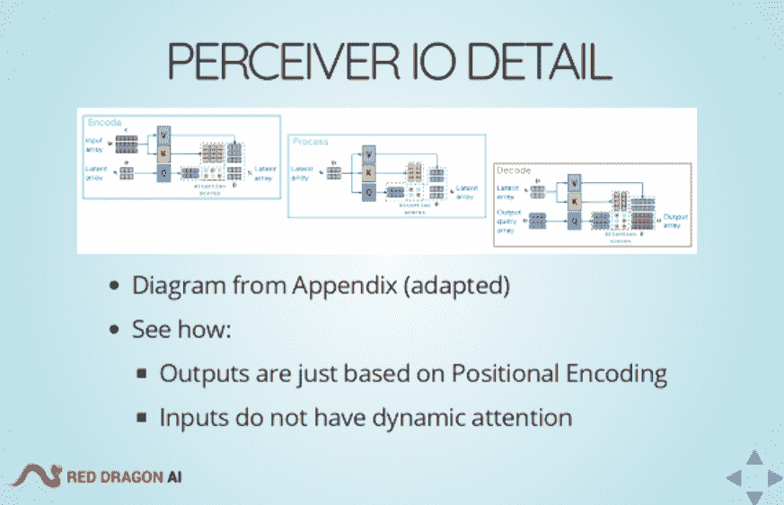
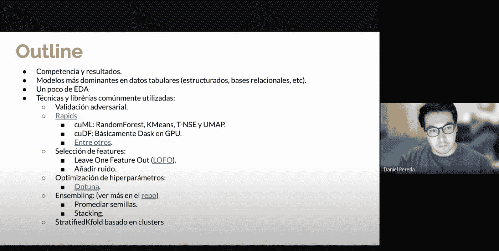

# 机器学习社区:2011 年第 3 季度亮点和成就

> 原文：<https://medium.com/google-developer-experts/machine-learning-communities-q3-21-highlights-and-achievements-91f482d54b9e?source=collection_archive---------4----------------------->

*作者:HyeJung Lee，DevRel 社区经理/ Soonson Kwon，DevRel 项目经理*

让我们按地区探索上一季度巨大的谷歌机器学习社区的亮点和成就。专家( [GDE](https://developers.google.com/community/experts) ，职业个人)、社区( [TFUG](https://www.tensorflow.org/community/groups) ，TensorFlow 用户群)、学生( [GDSC](https://developers.google.com/community/gdsc/leads) ，学生社团)、开发者群体( [GDG](https://developers.google.com/community/gdg/organizers) )的活动在这里一一呈现。

# 主要亮点

[ka ggle 30 天 ML](https://www.kaggle.com/thirty-days-of-ml)旨在帮助初学者使用 Kaggle Learn 课程学习 ML，以及专门针对该计划参与者的竞赛。与 Kaggle 团队合作，使+30ML GDEs 和 TFUG 组织者作为在线导师和发言人志愿者参与了这项倡议。

共有 16 个 GDE/GDSC/TFUGs 参照共享的[社区组织指南](https://docs.google.com/presentation/d/1cuDClGgxXBgFl9Y_g_ris5XhSVIbDKmAwQ7185qttxg/edit?resourcekey=0-bm_lSAGroM5Y2vAnj2AAhg#slide=id.p)开展社区组织项目。[休斯顿 tensor flow&Applied AI/ML](https://www.hccug.org/user-groups/houston-tensorflow-user-group)[在 7573 支队伍中排名第 6](https://www.linkedin.com/pulse/first-global-aiml-competition-placed-6th-out-7573-teams-moreign/)——比赛中唯一进入前 10 名的美国人。TFUG 圣地亚哥(智利)的组织者也参加了，他们在公众排行榜上名列第 17 位。

# 亚太

GDE [松田稔](https://developers.google.com/community/experts/directory/profile/profile-minori-matsuda)(日本)关于[可口可乐装瓶厂日本](https://cloud.google.com/blog/ja/topics/customers/coca-cola-bottlers-japan)的项目发布在谷歌云日本博客上，内容包括通过使用 Vertex AI 在 2 个月内创建一个 ML 管道部署到实际业务中。这也用英语发表在 [GCP 的博客上](https://cloud.google.com/blog/topics/developers-practitioners/coca-cola-bottlers-japan-collects-insights-700000-vending-machines-vertex-ai)。

GDE [朴成星](https://developers.google.com/community/experts/directory/profile/profile-chansung-park)(韩国)和 [Sayak Paul](https://developers.google.com/community/experts/directory/profile/profile-sayak-paul) (印度)在 GCP 博客上发表了许多文章。首先，“[使用自然语言查询的图像搜索](https://cloud.google.com/blog/topics/developers-practitioners/image-search-natural-language-queries)”解释了如何使用 OpenAI 的 CLIP 模型从自然语言输入构建一个简单的图像解析器。从这第二篇“作为 CI/CD 系统的模型训练:([第一部分](https://cloud.google.com/blog/topics/developers-practitioners/model-training-cicd-system-part-i)，[第二部分](https://cloud.google.com/blog/topics/developers-practitioners/model-training-cicd-system-part-ii))”的文章中，您可以了解到为什么为您的 ML 应用拥有一个有弹性的 CI/CD 系统对成功至关重要。最后，“[Vertex AI 上的双重部署](https://cloud.google.com/blog/topics/developers-practitioners/dual-deployments-vertex-ai)”讨论了使用 Vertex AI、TFX 和 Kubeflow 的端到端工作流。

在中国，GDE [叶君朋](https://developers.google.com/community/experts/directory/profile/profile-junpeng-ye)使用 TensorFlow 2.x 显著减少了微信 Finder 上的代码库(15k → 2k ),这是微信中的抖音替代品。GDE [丹·李](https://developers.google.com/community/experts/directory/profile/profile-dan-lee)写了一篇关于理解 TensorFlow 系列的文章:[第 1 部分](/@Adline125/understanding-tensorflow-series-979e71cc5562)、[第 2 部分](/@Adline125/understanding-tensorflow-fcc431891d08)、[第 3–1 部分](/@Adline125/understanding-tensorflow-ce18f0e1bbbc)、[第 3–2 部分](/@Adline125/understanding-tensorflow-2c6496b71368)、[第 4 部分](/@Adline125/understanding-tensorflow-94bdea8e1fd9)

来自越南的 GDE [Ngoc Ba](https://developers.google.com/community/experts/directory/profile/profile-ngoc-ba) 贡献了 [AI 论文阅读和编码系列](https://protonx.ai/papers-videos-code/?playlist=09f4124&video=df36f79)在 TensorFlow 中实现 ML/DL 论文，并每两周创建一次幻灯片/视频。(视频: [Vit 变压器](https://www.youtube.com/watch?v=o487J_u4JGU)、 [MLP 混频器](https://www.youtube.com/watch?v=T1hGxK5IsIA&t=316s)和[变压器](https://www.youtube.com/watch?v=_Zt23FA31co&t=2428s))

初学者友好的 codelabs ( [从音频分类](https://developers.google.com/learn/pathways/get-started-audio-classification)开始，[从音频分类](https://developers.google.com/learn/pathways/going-further-audio-classification)更进一步)作者[GDSC·苏克明(韩国)](https://dsc.community.dev/events/details/developer-student-clubs-sookmyung-womens-university-presents-google-io-extended-get-started-with-audio-classification-go-further-with-audio-classification-codelab/)学习使用 TFlite Model Maker 根据您的需求定制预训练的音频分类模型，并将其部署到您的应用程序中。

来自澳洲的 gave 马修·凯尔西(Matthew Kelcey)在品尼高活动(T3)上做了一个关于 T2·JAX 的演讲。Mat 概述了 JAX 的基础知识，并介绍了在其上开发的一些库。

在新加坡，TFUG [新加坡](https://www.meetup.com/Machine-Learning-Singapore/)潜心研究一些最新的论文、技术和研究领域，在许多领域提供最先进的成果。GDE [马丁·安德鲁斯](https://developers.google.com/community/experts/directory/profile/profile-martin-andrews)在[感知者](https://github.com/deepmind/deepmind-research/tree/master/perceiver)上为发布的感知者代码做了一个[简短的代码演练——突出了 JAX 的样子，俳句与十四行诗的关系，以及通过 tf.data 完成的数据加载](https://blog.mdda.net/ai/2021/08/26/presentation-at-mlsg)

来自巴基斯坦的 GDE [Imran us Salam Mian](https://developers.google.com/community/experts/directory/profile/profile-imran-us-salam-mian) 出版了一本书“[使用 TensorBoard 进行机器学习实验](https://www.packtpub.com/product/machine-learning-experimentation-with-tensorboard/9781801073967)”。

# 印度

GDE 已经出版了 TF-JAX 系列教程的第 4 部分到第 8 部分。[第 4 部分](https://www.kaggle.com/aakashnain/tf-jax-tutorials-part-4-jax-and-devicearray)简要介绍了 JAX(什么/为什么)和 DeviceArray。[第 5 部分](https://www.kaggle.com/aakashnain/tf-jax-tutorials-part-5-pure-functions-in-jax)讲述了为什么纯函数是好的，为什么 JAX 更喜欢它们。[第 6 部分](https://www.kaggle.com/aakashnain/tf-jax-tutorials-part-6-prng-in-jax)关注 Numpy 和 JAX 的伪随机数生成(PRNG)。第 7 部分关注 JAX 的即时编译(JIT)。并且[第 8 部分](https://www.kaggle.com/aakashnain/tf-jax-tutorials-part-8-vmap-pmap/)涵盖了 vmap 和 pmap。

GDE [巴维什·巴特](https://developers.google.com/community/experts/directory/profile/profile-bhavesh-bhatt)发布了一段关于[他参加谷歌云专业数据工程师认证考试](https://www.youtube.com/watch?v=96kzG3ZqF6E&list=PLS2b7XO82fsdLs44UamFwUXAmG9F2qA8B&index=1)的经历的视频。

气候变化项目使用顶点 AI 由 ML GDE [萨亚克保罗](https://developers.google.com/community/experts/directory/profile/profile-sayak_paul)和[悉达多甘居](http://sidgan.github.io/siddhaganju)(英伟达)。他们发表了一篇[论文](http://arxiv.org/abs/2107.08369)(使用半监督学习对 Sentinel-1 SAR 图像进行洪水分割)，并开源了关于 [NASA Impact 的 ETCI 竞赛](https://nasa-impact.github.io/etci2021/)的[项目](https://git.io/JW3P8)。这个项目制作了四个 NeurIPS 工作坊[AI for Science:Mind the gap](https://ai4sciencecommunity.github.io/)、[用机器学习应对气候变化](https://www.climatechange.ai/events/neurips2021.html)、[ML 中的女性](https://wimlworkshop.org/)和[机器学习与物理科学](https://ml4physicalsciences.github.io/)。他们[获得了亚军](https://competitions.codalab.org/competitions/30440#results)(参见测试阶段 2)。

关于[手写识别](https://keras.io/examples/vision/handwriting_recognition/)的教程由 GDE [萨亚克保罗](https://developers.google.com/community/experts/directory/profile/profile-sayak_paul)和[阿卡什库马尔奈恩](https://developers.google.com/community/experts/directory/profile/profile-aakash-nain)贡献给 Keras 示例。

GDE [Sayak Pau](https://developers.google.com/community/experts/directory/profile/profile-sayak_paul) 使用合成图进行图像分类的图正则化被添加到 TensorFlow 中的[神经结构化学习的官方示例中。](https://github.com/tensorflow/neural-structured-learning/blob/master/neural_structured_learning/examples/notebooks/graph_keras_cnn_flowers.ipynb)

GDE [萨亚克·保罗](https://developers.google.com/community/experts/directory/profile/profile-sayak-paul)和[苏米克·拉克希德](https://github.com/soumik12345)共享了一个新的 [NLP 数据集](https://www.kaggle.com/spsayakpaul/arxiv-paper-abstracts)用于多标签文本分类。该数据集由论文标题、摘要和从 arXiv 收集的术语类别组成。

# 北美洲

在 GSoC (谷歌代码之夏)期间，一些 gde 指导或共同指导学生。GDE [Margaret Maynard-Reid](https://developers.google.com/community/experts/directory/profile/profile-margaret-maynard-reid) (美国)指导 TF-GAN、Model Garden、TF Hub 和 TFLite 产品。你可以从 GDE 的博客中获得她的一些经验和建议。你还可以找到 GDE [萨亚克·保罗](https://developers.google.com/community/experts/directory/profile/profile-sayak-paul)(印度)和谷歌的摩根·罗夫[在(共同)指导 TensorFlow 和 TF Hub 方面的 GSoC 经验](https://blog.tensorflow.org/2021/09/tensorflow-hubs-experience-with-gsoc-2021.html)。

与 ML GDE 亨利瑞兹(美国)的[张量流初学者友好研讨会由](https://gdsc.community.dev/e/mywh3p/) [GDSC 德克萨斯 A & M 大学](https://gdsc.community.dev/texas-am-university/)(美国)为学生们举办。

Youtube 视频[自我关注讲解:变形金刚是怎么工作的？来自加拿大的 Tanmay Bakshi 解释了如何使用 TPU、Colab 和 Keras 构建一个基于转换器编码器的神经网络来将代码分类成 8 种不同的编程语言。](https://www.youtube.com/watch?v=kO0XdAsY5YA)

# 欧洲

GDG / GDSC 土耳其与[全球人工智能中心](https://globalaihub.com/home/)合作举办[人工智能夏令营](https://globalaihub.com/global-ai-hub-and-google-developer-groups-turkey-joined-forces-for-ai/)。7100 名参与者了解了 ML、TensorFlow、CV 和 NLP。

TechTalk [深度学习和 JAX/Trax](https://youtu.be/00qwLpXXVmE) 的语音处理，作者 GDE [塞尔吉·科门科](https://developers.google.com/community/experts/directory/profile/profile-sergii-khomenko)(德)和[m·优素福·萨格斯](https://developers.google.com/community/experts/directory/profile/profile-m-yusuf-sarigoz)(土)。他们回顾了 Jax、TensorFlow、Trax 等技术，以及其他有助于推动我们语音处理研究的技术*。*

# 南美洲/中美洲

在世界的另一端，在巴西，GDE [雨果·萨尼尼·戈麦斯](https://twitter.com/hugoznn)写了一篇关于“使用 TensorFlow.js 在浏览器中进行自定义对象检测”的文章，文章使用 TensorFlow 2 对象检测 API 和 Colab [发布在 TensorFlow 博客](https://blog.tensorflow.org/2021/01/custom-object-detection-in-browser.html)上。

Hugo 做了一个关于浏览器中的[实时语义分割的演讲——由 TensorFlow.js](https://www.youtube.com/watch?v=3XzQQlh_p1c&t=3s&ab_channel=TensorFlow) 制作，以 JavaScript 的有效方式使用 SavedModels，直接使您能够为您的新研究获得网络的覆盖范围和规模。

[GDE 谈到了 ML 的数据管道](https://itec-ucb.com/)[来自玻利维亚的 Nathaly Alarcon Torrico](https://developers.google.com/community/experts/directory/profile/profile-nathaly-alarcon-torrico) 解释了 ML 和数据科学产品创建的所有阶段，从 ML 模型的数据收集、转换、存储和产品创建开始。

tech talk“[机器学习竞赛 vo: Top 1% en Kaggle](https://www.meetup.com/TensorFlow-Santiago/events/280777560/) ( [视频](https://www.youtube.com/watch?v=0o72ndnTnCQ))”由 TFUG [圣地亚哥](https://www.meetup.com/es/TensorFlow-Santiago/)(智利)主持。在这次演讲中，演讲者介绍了生成能够进入 Kaggle 排行榜前 1%的模型的步骤。重点是展示用于在实现和执行中快速测试许多想法的库和“技巧”,以及如何在生产环境中使用它们。

# 梅纳

GDE [鲁奇亚·宾·萨菲](https://developers.google.com/community/experts/directory/profile/profile-ruqiya-bin-safi)(沙特)在 GDG 中东北非举办了一场关于[递归神经网络:第一部分](https://youtu.be/x2pUbRrzQAU)([Github](https://github.com/Ruqyai/MENADD-DL)/[Slide](https://docs.google.com/presentation/d/e/2PACX-1vRCtK3KfsTe33dByBNklj7Eko0hKS4a8g_jbPCVb5e3mzc05W5VQxsEQvl3fhV1lyl2FcaBcgix21c4/pub?start=false&loop=false&delayms=3000&slide=id.gdb1cacfbfd_0_131))的研讨会。Ruqiya 在 GDG [云沙特](https://gdg.community.dev/gdg-cloud-saudi/)(沙特)发表了关于[循环神经网络:第二部分](https://gdg.community.dev/events/details/google-gdg-cloud-saudi-presents-menadd-recurrent-neural-networks-part-2-lshbk-lsby-lmtkrr-ljz-2/)的演讲。

[GDSC](https://dsc.community.dev/events/details/developer-student-clubs-islamic-university-of-gaza-presents-ai-training-deep-dive/)[加沙伊斯兰大学](https://gdsc.community.dev/islamic-university-of-gaza/)巴勒斯坦 KaggleAI 培训。这是一个为期两个月的培训，涵盖了 Kaggle 的数据处理、图像处理和 NLP。

# 撒哈拉以南非洲

TFUG [伊巴丹](https://www.meetup.com/TensorFlow-Ibadan/)有两个 TensorFlow 事件:[tensor flow 基本情感分析](https://www.meetup.com/TensorFlow-Ibadan/events/280461693/)和[tensor flow 推荐系统介绍](https://www.meetup.com/TensorFlow-Ibadan/events/280659010/)。

文章介绍了一些学习、准备和通过法语 TensorFlow 开发人员考试的技巧，作者是 ML GDE[Yannick Serge Obam Akou](https://developers.google.com/community/experts/directory/profile/profile-yannick-serge-obam-akou)(喀麦隆)。