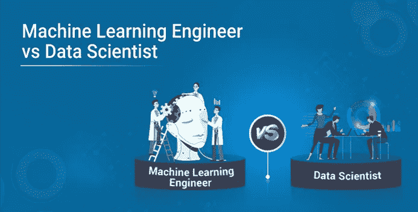
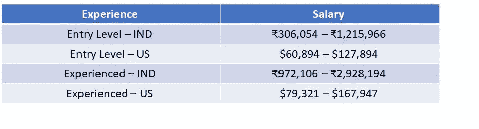
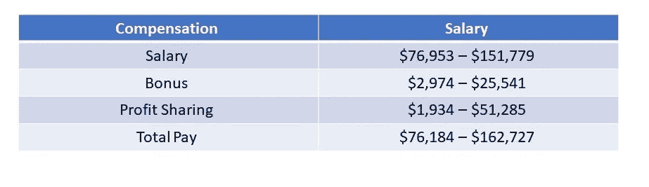
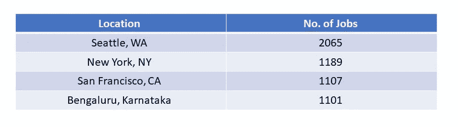
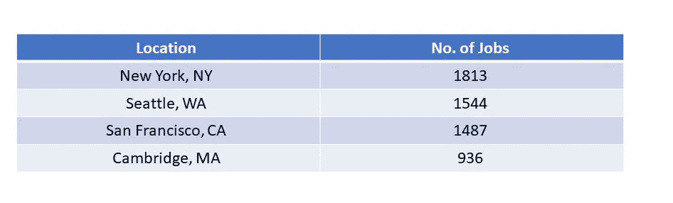
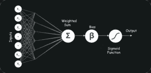
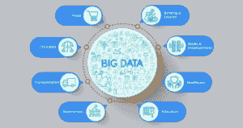

# 机器学习工程师 vs 数据科学家:职业比较

> 原文：<https://medium.com/edureka/machine-learning-engineer-vs-data-scientist-5cc65387e9ad?source=collection_archive---------0----------------------->

Machine Learning Engineer vs Data Scientist — Edureka

机器学习工程师和数据科学家是目前行业中最热门的两个职位，这是有充分理由的。随着每天产生 2.5 万亿字节的数据，能够组织这些海量数据以提供商业解决方案的专业人士才是真正的英雄！机器学习工程师和数据科学家之间的竞争正在增加，他们之间的界限正在缩小。

这所需的个性特征、经验和分析技能的组合被认为很难找到，因此，近年来对合格的数据科学家和机器学习工程师的需求超过了供应。因此，让我们按照以下顺序开始这篇文章，找出这两个专业人士之间的区别:

*   谁是数据科学家？
*   谁是机器学习工程师？
*   机器学习工程师 vs 数据科学家
*   雇佣这些专业人士的公司

# 谁是数据科学家？

尽管数据科学家有几种定义，但基本上他们是实践数据科学艺术的专业人士。数据科学家利用他们在科学领域的专业知识解决复杂的数据问题。这是一个专家的职位。

他们擅长不同类型的技能，如演讲、文本分析(NLP)、图像和视频处理、医学和材料模拟等。这些专家角色中的每一个在数量上都非常有限，因此这样一个专家的价值是巨大的。既然是对比机器学习工程师 vs 数据科学家，那就来看看谁是 ML 工程师。

# 谁是机器学习工程师？

机器学习工程师是成熟的程序员，他们开发可以学习和应用知识而无需特定方向的机器和系统。

人工智能是机器学习工程师的目标。他们是计算机程序员，但他们的重点不仅仅是为机器编写特定的程序来执行特定的任务。他们创造程序，使机器能够采取行动，而不需要特别指导去执行那些任务。

# 机器学习工程师 vs 数据科学家

2012 年，大量数据科学家的招聘信息涌现并充斥市场。机器学习工程师的角色也是如此，这是一个相对较新的角色，正在我们有数据专家的地方慢慢出现。这些术语模糊不清，因为它们是新的。现在，如果我们比较机器学习工程师和数据科学家，我们需要考虑几个参数:

*   薪资趋势
*   工作趋势
*   技能要求
*   必备的机器学习工程师技能
*   必备的数据科学家技能
*   角色和职责

# 薪资趋势

数据科学家的平均工资约为 91，470 美元(美国)或₹693,637(印第安纳州)。我们根据经验来看看一个数据科学家的工资。

这个数字还取决于其他一些因素，比如你工作的公司或地点。但是上表主要描述了不同经验水平的平均工资范围。

现在，一名机器学习工程师的平均工资约为**111，490 美元**或 **₹719,646 (IND)。**我们来看看一个机器学习工程师的工资报酬。

因此，如果我们比较机器学习工程师和数据科学家的工资趋势，我们可以看到，总体而言，机器学习工程师**比数据科学家**挣得多一点。现在有人可能会问为什么会这样，因此，我们需要看看机器学习工程师与数据科学家之间的技能和角色差异。但首先，让我们来看看就业趋势。

# 工作趋势

## **数据科学家工作趋势**

## **机器学习工程师工作趋势**

一方面，机器学习工程师的薪酬比数据科学家略高，另一方面，数据科学家的需求或职位空缺比 ML 工程师多。这是因为 ML 工程师致力于人工智能，这相对来说是一个新的领域。

# 技能要求

现在机器学习工程师 vs 数据科学家的技能要求非常相似，所以让我们从**常用技能集**开始。

## **编程语言:**

首要的要求是掌握一门编程语言，最好是 python，因为它简单易学，应用范围比任何其他语言都广。

虽然 Python 是一门非常好的语言，但它本身并不能帮助你。你可能需要学习所有这些语言，比如 C++、R、Python、Java，并且在某些时候还需要使用 MapReduce。

## **统计:**

维基百科将其定义为对数据的收集、分析、解释、展示和组织的研究。因此，数据科学家以及机器学习工程师需要了解统计学，这不应该是一个惊喜。要求熟悉矩阵、向量和矩阵乘法。

## **数据清洗和可视化:**

数据清理是一个有价值的过程，可以帮助公司节省时间和提高效率。能够用数据讲述一个令人信服的故事，对于表达你的观点并吸引听众至关重要。

如果你的发现不能被简单快速地识别，那么你将很难让别人理解。因此，当涉及到数据的影响时，数据可视化可能会产生成败的影响。

## **机器学习和神经网络架构:**

机器学习和预测建模正迅速成为两个最热门的话题。你需要了解机器学习技术，比如监督机器学习、决策树、逻辑回归等。这些技能将帮助你解决基于主要组织成果预测的不同数据分析问题。

深度学习将传统的机器学习方法提升到了一个新的水平。它受到生物神经元(脑细胞)的启发。这里的想法是模仿人脑。使用这种人工神经元的大型网络，这被称为深度神经网络。

## **大数据处理框架:**

训练机器学习/深度学习模型需要大量的数据。早期由于缺乏数据和计算能力，创建精确的机器学习/深度学习模型是不可能的。如今，大量的数据以很高的速度产生。

因此，我们需要像 Hadoop 和 Spark 这样的框架来处理大数据。如今，大多数组织都在使用大数据分析来获得隐藏的业务洞察力。因此，这是数据科学家和机器学习工程师的必备技能。

## **行业知识:**

最成功的项目将是那些解决真正痛点的项目。无论你在哪个行业工作。你应该知道这个行业是如何运作的，以及什么对企业有利。如果机器学习工程师或数据科学家不具备商业敏锐性，也不知道构成成功商业模式的要素，那么所有这些技术技能都无法得到有效利用。

你将无法辨别出需要解决的问题和潜在的挑战，以维持和发展业务。你将无法真正帮助你的组织探索新的商业机会。

## **计算机视觉:**

计算机视觉和机器学习是计算机科学的两个核心分支，可以为完全依赖 CV 和 ML 算法的非常复杂的系统提供功能和动力，但当你将两者结合起来时，你可以实现更多。

# 必备的机器学习工程师技能

## **语言、音频和视频处理:**

因为自然语言处理结合了 ie 的两个主要领域。语言学和计算机科学，在某些时候，你可能会用到文本、音频或视频。

因此，有必要很好地控制像 Gensim、NLTK 这样的库，以及像 word2vec、情感分析和摘要这样的技术。

## **应用数学:**

很多机器学习技术都只是一些奇特的函数逼近。对算法理论有扎实的理解，理解梯度下降、凸优化、二次规划、偏导数等科目会有很大帮助。

## **信号处理技术:**

少数机器学习工程师技能之一也是对信号处理的理解，并且具有使用信号处理技术作为特征提取来解决不同问题的能力是机器学习最重要的部分之一。

时频分析知识和先进的信号处理算法，如小波、剪切波、曲波和小波将帮助你解决复杂的情况。

## **软件开发:**

机器学习工程师也是软件开发人员，并且在 it 方面是健全的。很好地理解像数据结构、内存管理和类这样的主题是很重要的。人们必须知道如何打包软件、软件开发生命周期、模块化和设计模式。

# 必备的数据科学家技能

## **创造性和批判性思维:**

数据科学家必须查看数字、趋势和数据，并根据发现得出新的结论。据说聪明人会问很难的问题，而真正聪明的人会问简单的问题。事实上，你可以问的关于你公司的许多最重要的问题都是最简单的。使用数据找到问题的答案意味着首先要弄清楚要问什么。这可能相当棘手！

## **有效沟通:**

你需要向在这个领域几乎没有专业知识的人解释很多概念。你可能需要和一个工程师团队以及许多其他团队一起工作。

交流将使这一切变得更加容易。寻找强大数据科学家的公司正在寻找能够清晰流利地将他们的技术发现翻译给非技术团队(如营销或销售部门)的人。

# 角色和职责

现在我们来到机器学习工程师 vs 数据科学家的最后一章，即。他们在日常生活中具体做什么，他们面临什么样的挑战。

## **机器学习工程师角色:**

*   研究和转换数据科学原型
*   设计机器学习系统
*   研究和实现适当的 ML 算法和工具
*   根据需求开发机器学习应用
*   选择合适的数据集和数据表示方法
*   运行机器学习测试和实验
*   使用测试结果执行统计分析和微调
*   必要时对系统进行培训和再培训
*   扩展现有的 ML 库和框架
*   跟上该领域的发展

## **数据科学家角色:**

*   使用机器学习技术选择特征、构建和优化分类器
*   了解客户的业务需求，并引导他们找到解决方案
*   使用最新方法的数据挖掘
*   处理、清理和验证用于分析的数据的完整性
*   进行市场调查
*   获取数据并认可实力
*   使用深度学习框架，如 MXNet、Tensorflow、Theano 和 Keras，来建立深度学习模型
*   精确定位复杂数据集中的趋势、相关性和模式
*   识别流程改进的新机会
*   与专业服务开发运维顾问合作，帮助客户在构建模型后实施模型

# 雇佣这些专业人士的公司

## 机器学习工程师

## 数据科学家

现在，说到这里，我们就到了这篇文章的结尾。我希望你能深入了解这两种职业，以及他们在技能、角色和薪水方面的不同。

如果你想查看更多关于人工智能、Python、道德黑客等市场最热门技术的文章，你可以参考 Edureka 的官方网站。

请留意本系列中的其他文章，它们将解释数据科学的各个方面。

> *1。* [*数据科学教程*](/edureka/data-science-tutorial-484da1ff952b)
> 
> *2。* [*数据科学的数学与统计*](/edureka/math-and-statistics-for-data-science-1152e30cee73)
> 
> *3。*[*R 中的线性回归*](/edureka/linear-regression-in-r-da3e42f16dd3)
> 
> *4。* [*机器学习算法*](/edureka/machine-learning-algorithms-29eea8b69a54)
> 
> *5。*[*R 中的逻辑回归*](/edureka/logistic-regression-in-r-2d08ac51cd4f)
> 
> *6。* [*分类算法*](/edureka/classification-algorithms-ba27044f28f1)
> 
> *7。* [*随机森林中的 R*](/edureka/random-forest-classifier-92123fd2b5f9)
> 
> *8。* [*决策树中的 R*](/edureka/a-complete-guide-on-decision-tree-algorithm-3245e269ece)
> 
> *9。* [*机器学习入门*](/edureka/introduction-to-machine-learning-97973c43e776)
> 
> *10。* [*朴素贝叶斯在 R*](/edureka/naive-bayes-in-r-37ca73f3e85c)
> 
> *11。* [*统计与概率*](/edureka/statistics-and-probability-cf736d703703)
> 
> *12。* [*如何创建一个完美的决策树？*](/edureka/decision-trees-b00348e0ac89)
> 
> 13。 [*关于数据科学家角色的十大神话*](/edureka/data-scientists-myths-14acade1f6f7)
> 
> 14。 [*顶级数据科学项目*](/edureka/data-science-projects-b32f1328eed8)
> 
> *15。* [*数据分析师 vs 数据工程师 vs 数据科学家*](/edureka/data-analyst-vs-data-engineer-vs-data-scientist-27aacdcaffa5)
> 
> *16。* [*人工智能类型*](/edureka/types-of-artificial-intelligence-4c40a35f784)
> 
> 17。[*R vs Python*](/edureka/r-vs-python-48eb86b7b40f)
> 
> 18。 [*人工智能 vs 机器学习 vs 深度学习*](/edureka/ai-vs-machine-learning-vs-deep-learning-1725e8b30b2e)
> 
> 19。 [*机器学习项目*](/edureka/machine-learning-projects-cb0130d0606f)
> 
> *20。* [*数据分析师面试问答*](/edureka/data-analyst-interview-questions-867756f37e3d)
> 
> *21。* [*面向非程序员的数据科学和机器学习工具*](/edureka/data-science-and-machine-learning-for-non-programmers-c9366f4ac3fb)
> 
> *22。* [*十大机器学习框架*](/edureka/top-10-machine-learning-frameworks-72459e902ebb)
> 
> *23。* [*统计机器学习*](/edureka/statistics-for-machine-learning-c8bc158bb3c8)
> 
> *24。* [*随机森林中的 R*](/edureka/random-forest-classifier-92123fd2b5f9)
> 
> *25。* [*广度优先搜索算法*](/edureka/breadth-first-search-algorithm-17d2c72f0eaa)
> 
> *26。* [*线性判别分析中的 R*](/edureka/linear-discriminant-analysis-88fa8ad59d0f)
> 
> *27。* [*机器学习的先决条件*](/edureka/prerequisites-for-machine-learning-68430f467427)
> 
> *28。* [*互动 WebApps 使用 R 闪亮*](/edureka/r-shiny-tutorial-47b050927bd2)
> 
> *29。* [*机器学习十大书籍*](/edureka/top-10-machine-learning-books-541f011d824e)
> 
> 三十岁。 [*无监督学习*](/edureka/unsupervised-learning-40a82b0bac64)
> 
> 31。 [*10 本最好的数据科学书籍*](/edureka/10-best-books-data-science-9161f8e82aca)
> 
> *32。* [*监督学习*](/edureka/supervised-learning-5a72987484d0)

*原载于 2019 年 2 月 12 日 https://www.edureka.co**T21*[。](https://www.edureka.co/blog/machine-learning-engineer-vs-data-scientists/)