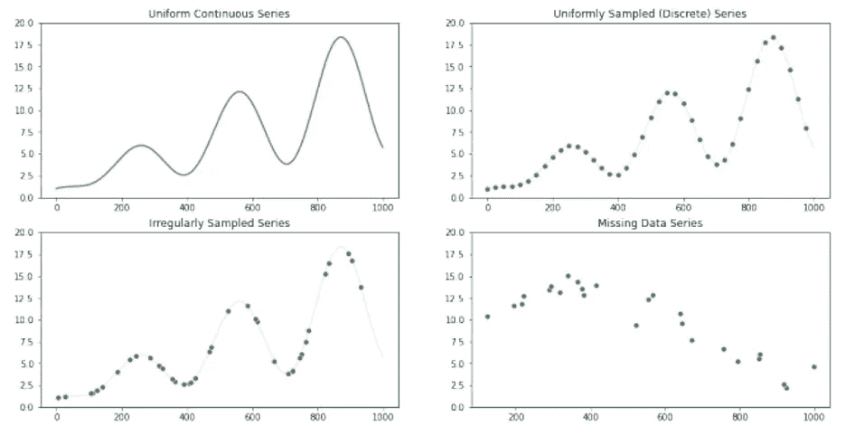
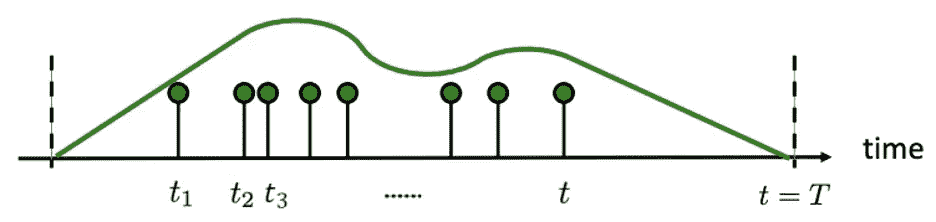
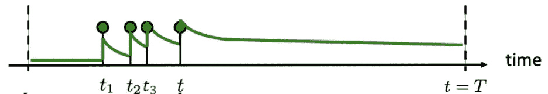
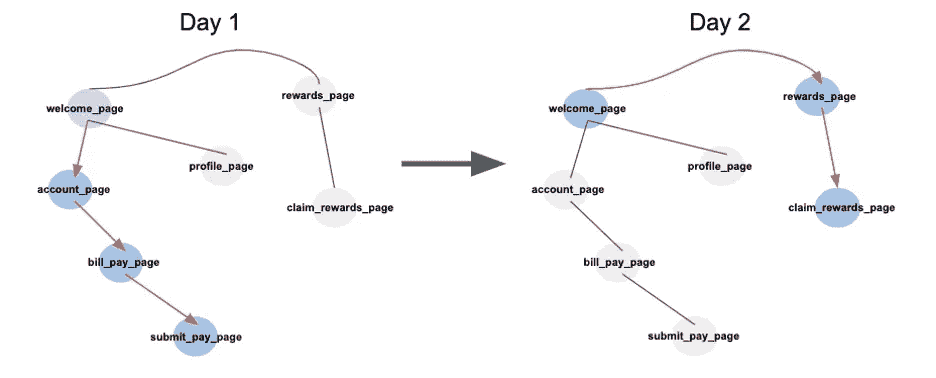
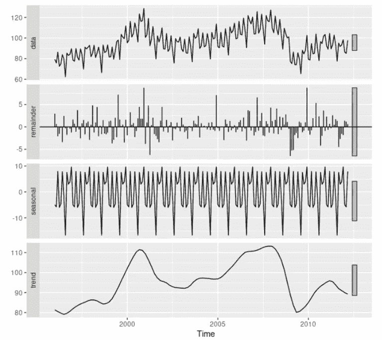
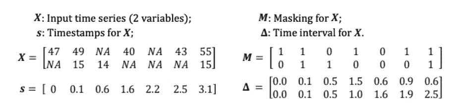
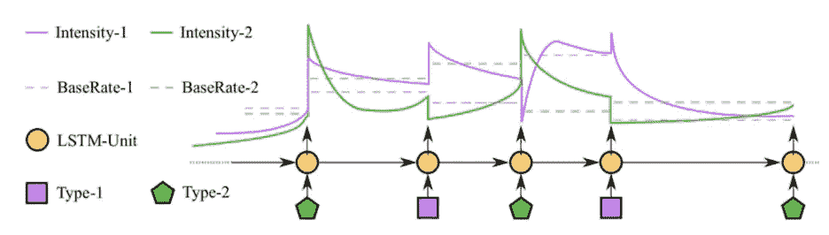
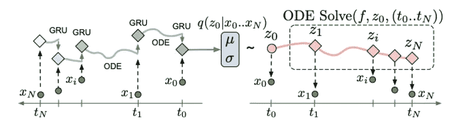

# 金融时态数据的机器学习

> 原文：<https://medium.com/capital-one-tech/machine-learning-for-temporal-data-in-finance-80dafe1ee8ef?source=collection_archive---------2----------------------->

## 机器学习方法如何发展以解决消费者金融数据的复杂时间和顺序元素

[时间序列](https://en.wikipedia.org/wiki/Time_series)建模一直是金融的核心要素，因为金融行业的投资在很大程度上基于对当前和历史知识下的未来经济和市场条件的了解。预测商品和股票价格或宏观经济指标可能是时间序列模型的传统应用。

技术的进步和随之而来的行业数字化，从根本上改变了金融服务业中时间序列建模的必要和可能的范围。这种转变带来了新的数据流，如详细的债务/信用交易数据、数字信用报告、多渠道支付、支票图像和客户点击流数据。虽然机器学习的进步加快了利用这些数据的模型的开发，但在为静态数据设计的方法和可以捕捉新数据流的复杂时间和序列方面的方法之间仍然存在差距。

Capital One 的研究人员[杰森·威滕巴赫](https://www.linkedin.com/in/jason-wittenbach-44266311/)、[布莱恩·达莱森德罗](https://www.linkedin.com/in/briandalessandro/)和[巴扬·布鲁斯](https://www.linkedin.com/in/bayan-bruss/)在他们的 [KDD 2020](https://www.kdd.org/kdd2020/) 金融机器学习研讨会论文 [*金融时态数据的机器学习:挑战与机遇*](https://arxiv.org/abs/2009.05636) *中评论了我们在金融行业面临的新挑战和新研究的机会领域。*在这篇博客中，我概述了他们的观察结果，并总结了当前和过去对时间序列这一主题的研究。

# 拓宽时间序列建模的范围

通常，时间序列在金融学中是以最严格的形式建模和思考的。这些是 ***均匀时间序列*** :一系列均匀间隔的数据点，以明确的顺序排列，带有相关的时间戳。针对这种特定类型数据的模型有大量的研究。然而，它只适用于非常有限的一组问题。

许多金融机构有许多不属于这个狭义定义的时态数据类型。这些被广义地称为*。您可能会猜测这些数据点的时间间隔是不规则的。这当然不会使建模变得更容易。关于非均匀时间序列如何产生的不同理论导致了两个子类:**不规则采样时间序列**和**时间点过程**。*

# *不规则采样时间序列*

*不规则采样的时间序列可能以两种方式出现。第一种是当我们有一些连续的时间序列，我们采取不定期的测量。以血压为例。血压是连续的，因为在任何时候我们想测量一个人的血压都是存在的，而且是可以测量的。第二种形式是一个离散的过程，它可能均匀地发生，但某些观测值是缺失的。每天测量血压也可以看作是一个统一的离散过程。遗漏的观察可能是由于医生的错误、不可预见的医疗事件或对患者健康的信心。缺失值的不同原因通常会导致“信息缺失”——提供分类标签相关信息的缺失值，如患者结果( [Che 2018](https://www.nature.com/articles/s41598-018-24271-9.pdf) )。*

**

**Different types of time series (Wittenbach, d’Alessandro, Bruss 2020)**

# *时间点过程*

*时间[点过程](https://en.wikipedia.org/wiki/Point_process)是离散事件，其中事件之间的时间由概率分布确定。客户进行信用卡交易是一个积分过程。直到顾客使用他们的信用卡的时间是未知的和随机的，至少对观察者来说是这样。两个常见的点过程是[泊松](https://en.wikipedia.org/wiki/Poisson_point_process)和[霍克斯](https://en.wikipedia.org/wiki/Point_process#Hawkes_(self-exciting)_processes)过程。它们都依赖于强度或速率的概念，其中高强度导致一段时间内事件密度的增加。泊松过程通常描述下一个事件发生的时间与过去无关的事件，而霍克斯过程模拟最近事件发生的时间决定未来事件发生的可能性的情况。*

**

**Inhomogeneous Poisson Process (*[*Rodriguez 2018*](http://learning.mpi-sws.org/tpp-icml18/seminar-icml18-part1.pdf)*)**

**

**Self-exciting/Hawkes Process (*[*Rodriguez 2018*](http://learning.mpi-sws.org/tpp-icml18/seminar-icml18-part1.pdf)*)**

# *多元和多模态扩展*

*非均匀时间序列可以进一步扩展。到目前为止，我们只引用了在任何时候都具有单一值的单变量时间序列。金融机构记录了大量关于特定事件的信息，这意味着每个事件都可能有多个相关特征。金融服务公司不仅记录发生的信用卡交易，还存储有关金额、商店和位置的信息。这些特性应该如何一起建模？例如，过去地点和消费金额的顺序与交易欺诈的可能性有什么关系？同时，并行数据流(如借记卡交易和现金取款/存款)引入了另一个需要考虑的因素层次。*

*最后一层复杂性来自不同的模态。常见的形式有图像、文本、[图形](https://en.wikipedia.org/wiki/Graph_(discrete_mathematics))和表格数据。尽管金融服务中的大部分数据是表格形式的，但其他形式现在正变得越来越常见:来自移动存款的支票图像序列、定期访问和浏览网站图表的客户，或者来自在线客服聊天的文本。现代机器学习已经实现了这些模态的有效表示，但当我们试图理解它们的时间交互时，新的挑战出现了。*

**

**A sequence of website graph traversals (Samuel Sharpe 2020)**

# *机器学习的最新研究进展*

*所有的希望都没有失去！统一时间序列得益于几十年来的研究，这些研究侧重于统计自回归方法或分解为水平、趋势和季节性的方法。最近，虽然许多不同的深度递归神经网络(RNN)已经出现，但传统的方法已被证明仍然是鲁棒的和有竞争力的。直到最近，基于 RNN 的方法才超越了统一时间序列预测任务的性能；它采用了一种反映传统分解模型的方法来有效地应用深度学习( [Oreshkin 2019](https://arxiv.org/abs/1905.10437) )。*

**

**Time series decomposition (*[*Hyndman 2014*](https://otexts.com/fpp2/components.html)*)**

*非均匀时间序列的深度学习方法在过去几年中发展迅速。对不规则时间序列进行建模的一种常见方法是强制使其一致:将其分成大小相等的时间区间，以便每个时间段内最多只发生一次事件。然而，这种方法通常会导致比它解决的问题更多的问题。我们如何填补缺失数据的位置？如果事件很少，但它们有时发生得很近，那该怎么办？我们需要非常小的容器大小，并且会不必要地扩大数据的大小。对于手头的任务来说，观察的存在或事件的时机重要吗？研究人员试图通过增加缺失指标、观测间隔时间或甚至将时间衰减纳入 RNN 的架构来解决这些问题。*

**

**Example masks and time delta features (*[*Che 2018*](https://www.nature.com/articles/s41598-018-24271-9.pdf)*)**

*为了避免这些离散方法面临的一些障碍，研究转向了旨在直接对不规则形式的数据进行建模的模型。神经网络可用于参数化传统的点过程或常微分方程(ODE)。时间点过程是由潜在的强度定义的，因此我们可以利用神经网络来模拟影响事件发生率的因素。公共点过程的一个缺点是它们局限于一个固定的函数形式——类似于任何概率分布。*

**

**Depiction of a neural hawkes process where “excitement” is modeled with an LSTM cell (*[*Mei 2017*](https://www.cs.jhu.edu/~jason/papers/mei+eisner.arxiv17.pdf)*)**

*常微分方程将函数与其导数或变化率联系起来。将由神经网络参数化的复杂函数与其随时间的变化率相关联的能力允许我们在没有固定形式或任何观察的情况下随时间发展这些函数。神经 ode 最近增加了 RNNs，定义了观察之间隐藏状态的变化。这些方法的神经增强提供了时间序列的灵活的连续时间模型，因此对于金融服务公司收集的原始数据来说更加现实。*

**

**Latent ODE Model with ODE-RNN Encoder (*[*Rubanova 2019*](https://arxiv.org/abs/1907.03907)*)**

*连续时间深度学习的进展正在加快，但尚未在多模态研究中采用。多模态融合的大部分工作受益于 RNNs、注意机制和表征学习，并应用于大多数时间不可知的一般序列数据。研究人员开发了多模型融合模型，这些模型可以为图像添加字幕，将单词与语音对齐，通过音频和视觉线索识别情绪，将文本与图像中的本地化对象进行匹配，甚至可以将电影和书籍对齐。需要做更多的工作来将这些技术扩展到连续和不规则的时间序列数据。*

# *未来的挑战和机遇*

*对非均匀时间序列的研究为处理事件数据流的不规则时间方面提供了一条前进的道路。实验是金融服务行业公司的第一步。我们如何将这些新方法应用于我们的数据？它是否极大地增进了我们对客户的了解？在计算或可解释性等新方法的复杂性之间是否存在权衡？*

*对于试图捕捉异构数据的全部动态的未来工作，仍然存在额外的挑战。目前的研究缺少什么，我们需要看到全貌？它会有效地对多元数据建模吗？会不会体贴的把不同的数据流结合起来？它如何纳入替代模式？*

*尽管所有这些问题仍然存在挑战，但我们在金融服务中的时态数据建模方法的研究和应用中看到了巨大的前景。*

# *额外资源*

## *博客和演示*

*[预测:原理与实践](https://otexts.com/fpp3/)*

*[理解神经颂的](https://jontysinai.github.io/jekyll/update/2019/01/18/understanding-neural-odes.html)*

*[用时态点过程学习 ICML 2018 教程](http://learning.mpi-sws.org/tpp-icml18/)*

*[多模态机器学习教程](https://www.cs.cmu.edu/~morency/MMML-Tutorial-ACL2017.pdf)*

## *报纸*

*[具有缺失值的多元时间序列的递归神经网络](https://www.nature.com/articles/s41598-018-24271-9)*

*[神经 hawkes 过程:一种神经自调节的多元点过程](http://papers.nips.cc/paper/7252-the-neural-hawkes-process-a-neurally-self-modulating-multivariate-point-process.pdf)*

*[神经常微分方程](https://arxiv.org/abs/1806.07366)*

*[不规则采样数据的潜在 ODEs](https://arxiv.org/abs/1907.03907)*

# *参考*

*Oreshkin，Boris N .等人，“N-BEATS:可解释时间序列预测的神经基础扩展分析”arXiv 预印本 arXiv:1905.10437 (2019)。*

*[Che，z .，Purushotham，s .，Cho，k .等.用于具有缺失值的多元时间序列的递归神经网络。Sci Rep 8，6085 (2018)。](https://doi.org/10.1038/s41598-018-24271-9)*

*梅、洪源和杰森·m·艾斯纳。"神经 hawkes 过程:一个神经自调节的多变量点过程."神经信息处理系统进展。2017.*

*[R.J. Hyndman 和 G. Athanasopoulos。2014.预测:原理与实践。OTexts。](https://books.google.com/books?id=gDuRBAAAQBAJ)*

*[罗德里格兹，戈麦斯和伊莎贝尔·瓦莱拉。"学习时间点过程."ICML 大学的辅导课程(2018 年)。](http://learning.mpi-sws.org/tpp-icml18/seminar-icml18-part1.pdf)*

*Rubanova，Yulia，Ricky TQ Chen 和 David Duvenaud。"不规则采样时间序列的潜在常微分方程."arXiv 预印本 arXiv:1907.03907 (2019)。*

*[威滕巴赫、杰森、布莱恩·达莱山德罗和巴扬·布鲁斯。“金融中时间序列的机器学习:挑战与机遇”。KDD 金融机器学习研讨会(2020)。](https://arxiv.org/abs/2009.05636)*

**披露声明:2021 资本一。观点是作者个人的观点。除非本帖中另有说明，否则 Capital One 不隶属于所提及的任何公司，也不被这些公司认可。使用或展示的所有商标和其他知识产权是其各自所有者的财产。**

**原载于*[*https://www.capitalone.com*](https://www.capitalone.com/tech/machine-learning/machine-learning-for-temporal-data-in-finance/)*。**