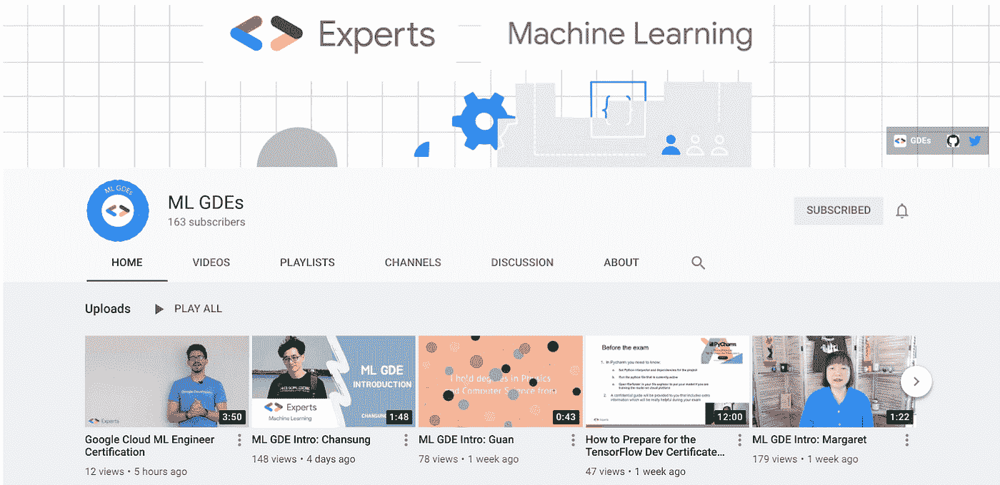
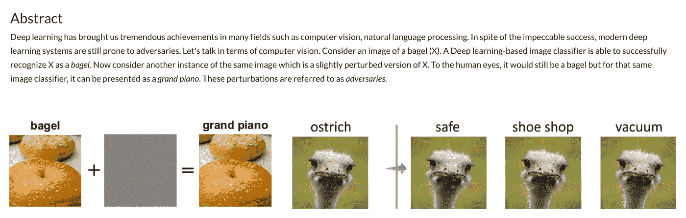
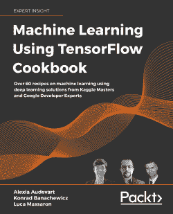
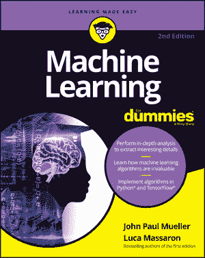
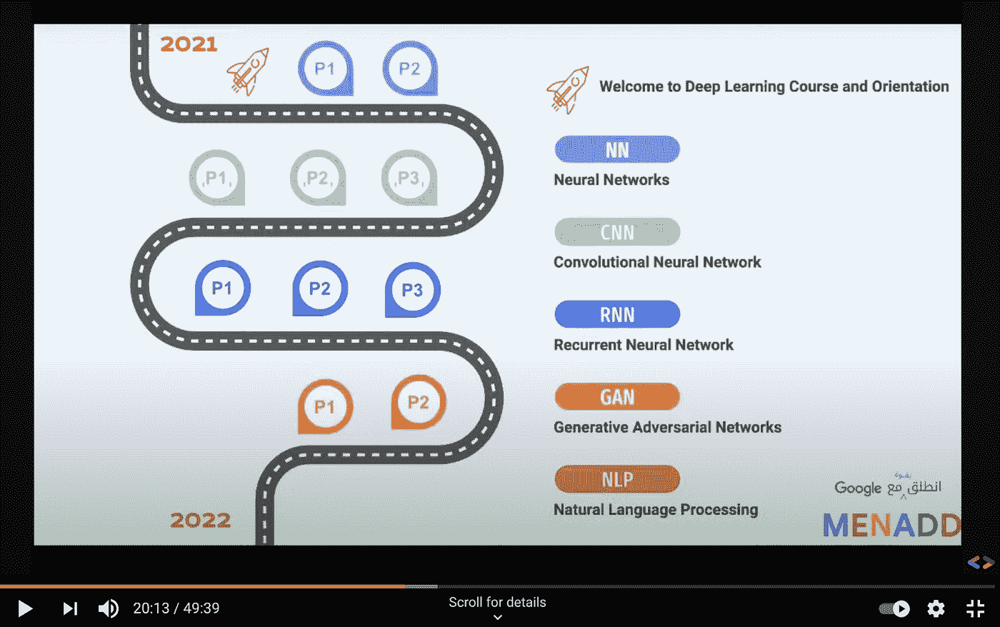
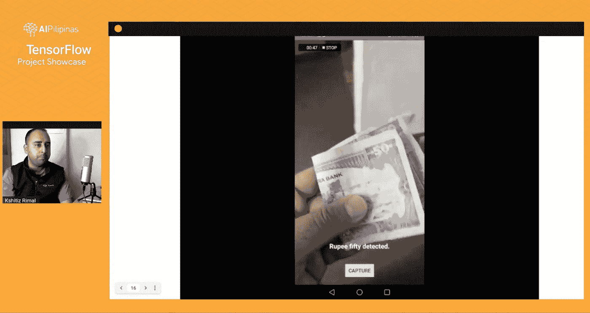
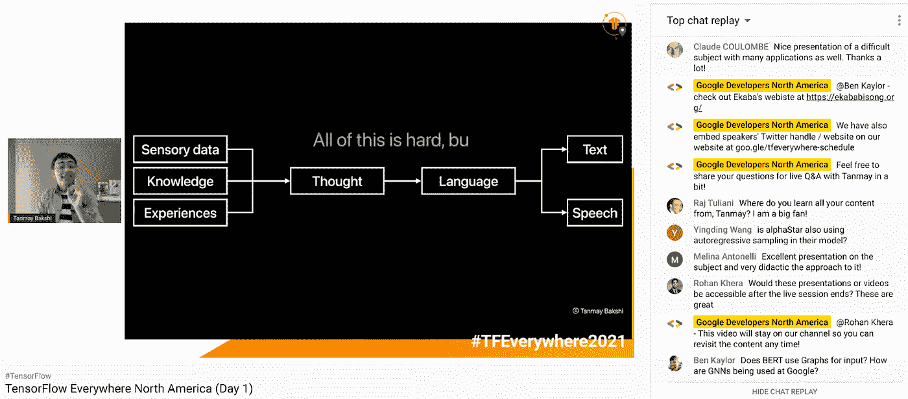
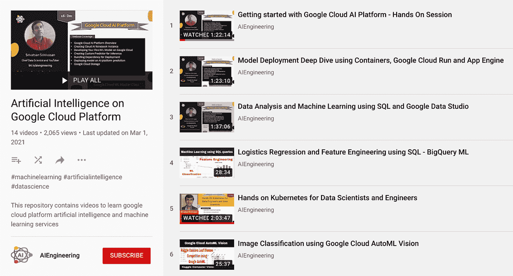
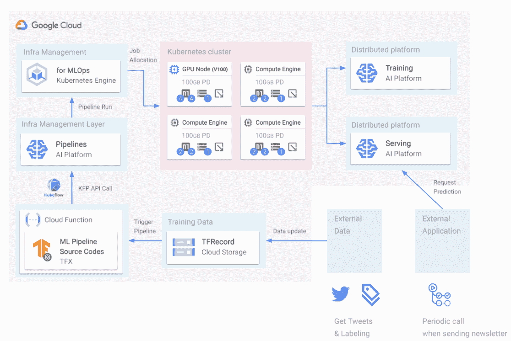
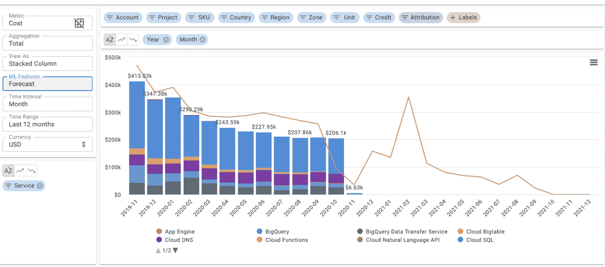

# 机器学习 GDEs:

> 原文：<https://medium.com/google-developer-experts/machine-learning-gdes-7e60768d8156?source=collection_archive---------4----------------------->

**Q1 2021 亮点、项目和成果**

*由谷歌 ML 生态系统社区经理 HyeJung Lee 和 MJ You 撰写。由开发者关系项目经理 Soonson Kwon 审核。*

G [*oogle 开发者专家*](https://developers.google.com/community/experts) *是一个充满激情的开发者社区，他们喜欢与他人分享他们的知识。他们中的许多人专门研究机器学习(ML)。尽管在过去的几个月里发生了许多意想不到的变化，并且在正在进行的疫情期间减少了各种面对面活动的机会，但他们的热情并没有停止。*

以下是大联盟 GDE 在 2021 年 Q1 奥运会期间为全球大联盟生态系统做出贡献的一些亮点。

**ML GDE YouTube 频道**

The brand new ML GDEs YouTube channel

在美国 GDE [玛格丽特梅纳德里德](https://developers.google.com/community/experts/directory/profile/profile-margaret_maynard-reid)的倡议和领导下，我们推出了 [**ML GDEs YouTube 频道**](https://www.youtube.com/channel/UCAHB3PMBUUPj-sqh5YzMjwA) 。这是 GDEs 接触全球受众、作为一个社区进行合作、创建独特内容和促进彼此工作的一个很好的方式。该频道将包含涵盖一系列不同主题的材料，从技术讲座、教程、研讨会到对 ML 社区成员的采访。我们一直在努力为频道增加新的内容，但许多视频已经可供观看，包括: [ML GDE 来自世界各地的介绍](https://www.youtube.com/playlist?list=PLS2b7XO82fsfprpSRPVVsylcSusr0HzzT)，TensorFlow & GCP 认证的提示以及如何使用[谷歌云平台](https://www.youtube.com/playlist?list=PLS2b7XO82fsf4P9vGgaWYjhry61HORnfd)。 [**现在就订阅频道吧！**](https://youtube.com/MLGDEs)！

**张量流无处不在**

17 ML GDEs 在由当地 TensorFlow 用户组主办的 [TensorFlow Everywhere](https://www.tensorflow.org/community/tf-everywhere) (面向全球 TensorFlow 和机器学习爱好者和开发者的全球社区主导的活动系列)上展示。您可以在 ML GDE Youtube 频道的 [TensorFlow Everywhere 播放列表](https://www.youtube.com/playlist?list=PLS2b7XO82fsdaPpruVe0h4gAIQhVfbtaM)中观看录制的会话。大多数课程都涵盖了 Tensorflow 中的新功能。

**国际妇女节**

许多 ML GDEs 参加了庆祝国际妇女节(3 月 8 日)的活动。GDE [Ruqiya Bin Safi](https://developers.google.com/community/experts/directory/profile/profile-ruqiya_bin_safi) (总部在沙特)与 WTM 沙特合作组织了“Social thon”——社会发展黑客马拉松，并发表了一场演讲“[社会发展的成功经验](https://www.pscp.tv/w/1dRKZNPzjlzKB)”，有 77 万观众现场观看，并在 10K 播放。印度的 GDE [Charmi Chokshi](https://developers.google.com/community/experts/directory/profile/profile-charmi_chokshi) 参加了 GirlScript 的国际妇女节活动，并发表了演讲:“[科技领域的女性以及我们如何在充满挑战的世界中帮助那些未被充分代表的女性](https://www.youtube.com/watch?v=4XwNYRsdVog&t=2383s)”。如果你正在寻找更多鼓舞人心的材料，请查看我们的 [ML GDE YouTube 频道](https://youtube.com/MLGDEs)上的“[AI 中的女性](https://www.youtube.com/playlist?list=PLS2b7XO82fseT-HqzXrGC6mePtOkzcYdQ)”播放列表！

**辅导**

ML GDEs 也非常积极地指导社区开发者、[谷歌开发者学生俱乐部](https://developers.google.com/community/dsc)的学生和[谷歌创业加速器](https://startup.google.com/accelerator/)项目的创业公司。其中，GDE [阿纳尔多·瓜尔韦托](https://developers.google.com/community/experts/directory/profile/profile-arnaldo_gualberto)(巴西)为谷歌快速通道计划中的初创公司举办了导师会议，讨论如何通过 TensorFlow 使用机器学习/深度学习来解决挑战。

**张量流**

A screenshot from [“Practical Adversarial Robustness in Deep Learning: Problems and Solutions”](https://sites.google.com/corp/view/par-2021).

我们来自印度的 GDEs、 [Sayak Paul](https://developers.google.com/community/experts/directory/profile/profile-sayak_paul) 和 [Dipanjan Sarkar](https://developers.google.com/community/experts/directory/profile/profile-dipanjan_sarkar) 以及[Pin-陈愉](https://sites.google.com/site/pinyuchenpage/home)(来自 IBM Research)创建了一个教程[“深度学习中的实际对抗鲁棒性:问题和解决方案”](https://sites.google.com/corp/view/par-2021)，该教程已在 CVPR 2021 上被接受。CVPR 是计算机视觉领域的领先会议。他们用 TensorFlow 代码示例整理了理论和实践，以便学者和行业从业者都能从本教程中受益。

Recent publications of ML GDEs

与此同时，在欧洲，GDEs [Alexia Audevart](https://developers.google.com/community/experts/directory/profile/profile-alexia_audevart) (位于法国)和 [Luca Massaron](https://developers.google.com/community/experts/directory/profile/profile-luca_massaron) (位于意大利)发布了[“使用 TensorFlow 的机器学习食谱”。](https://www.packtpub.com/product/machine-learning-using-tensorflow-cookbook/9781800208865)为在计算机视觉、NLP 和表格数据项目中成功使用 TensorFlow 2.x 提供了简单有效的思路。此外，卢卡出版了第二版[傻瓜机器学习](https://www.wiley.com/en-us/Machine+Learning+For+Dummies%2C+2nd+Edition-p-9781119724056)书，第一版于 2015 年出版。他的最新版本增加了产品更新，主要是更大份额的页面专门讨论深度学习和 TensorFlow / Keras 的使用。

Screenshot from the “Welcome to Deep Learning Course and Orientation” workshop

除了与女性科技相关的活动， [Ruqiya Bin Safi](https://developers.google.com/community/experts/directory/profile/profile-ruqiya_bin_safi) 还将在 2021 年举办[“欢迎参加深度学习课程和指导”](https://www.youtube.com/watch?v=aQ2ZUOUmAcg)月度研讨会。该课程旨在帮助参与者获得深度学习算法的基础知识，并获得在 TensorFlow 中构建神经网络的实践经验。

Screenshot of the [“TensorFlow Project Showcase: Cash Recognition for Visually Impaired”](https://www.facebook.com/239492583252612/videos/187904752915839)

总部位于尼泊尔的 GDE [克希提兹·里马尔](https://developers.google.com/community/experts/directory/profile/profile-kshitiz_rimal?hl=en)在[发表了题为“TensorFlow 项目展示:视障人士的现金识别”的演讲](https://www.facebook.com/239492583252612/videos/187904752915839)，介绍了他的项目，该项目使用 TensorFlow、Google Cloud AutoML 和边缘计算技术为尼泊尔的视障人士社区创建了一个解决方案。

Screenshot of the [“Machine Learning-powered Pipelines to Augment Human Specialists”](https://youtu.be/ysZ9RMKsNLk?t=9330)

在世界的另一端，加拿大，GDE [坦梅·巴克西](https://developers.google.com/community/experts/directory/profile/profile-tanmay_bakshi?hl=en)在 TensorFlow Everywhere NA 期间发表了一篇演讲[“机器学习驱动的管道来增强人类专家的能力”](https://youtu.be/ysZ9RMKsNLk?t=9330)。它涵盖了通过深度学习的 NLP 世界，它在历史上是如何完成的，Transformer 革命，以及如何使用 TensorFlow & Keras 来实现从小规模名称生成到大规模亚马逊评论质量排名的用例。

**谷歌云平台**

“[Artificial Intelligence on Google Cloud Platform](https://www.youtube.com/playlist?list=PL3N9eeOlCrP6Nhv4UFp67IsQ_TVDpXqXK)” series

我们在 GCP 这边也同样忙碌。在美国，GDE[Srivatsan Srinivasan](https://developers.google.com/community/experts/directory/profile/profile-srivatsan_srinivasan)创作了一系列名为“[谷歌云平台上的人工智能](https://www.youtube.com/playlist?list=PL3N9eeOlCrP6Nhv4UFp67IsQ_TVDpXqXK)”的视频，其中一集“[谷歌云产品和专业机器学习工程师认证深潜](https://www.youtube.com/watch?v=pIzX7wk56iA&list=PL3N9eeOlCrP6Nhv4UFp67IsQ_TVDpXqXK&index=11)”，获得超过 3000 次观看。

[“Machine Learning Pipeline (CI/CD for ML Products in GCP)”](https://docs.google.com/presentation/d/13MO1nR3853D0zv-3fIxPDzrBcRV6452xxggUOChnaV4/edit#slide=id.g806f581815_0_0) analysis

韩国人 GDE [Chansung Park](https://developers.google.com/community/experts/directory/profile/profile-chansung_park) 以他的[“机器学习管道(GCP ML 产品的 CI/CD)】](https://docs.google.com/presentation/d/13MO1nR3853D0zv-3fIxPDzrBcRV6452xxggUOChnaV4/edit#slide=id.g806f581815_0_0)分析贡献给 TensorFlow 用户群韩国，重点是关于 Google 云平台中的机器学习管道。

Screenshot from the article [“Seven Tips for Forecasting Cloud Costs”](https://blog.doit-intl.com/seven-tips-for-predicting-the-future-with-facebooks-prophet-51cf8d6c89dc)

最后但并非最不重要的是，以色列的 GDE [盖德·本拉姆](https://developers.google.com/community/experts/directory/profile/profile-gad_benram?hl=en)写了一篇关于[“预测云成本的七个技巧”](https://blog.doit-intl.com/seven-tips-for-predicting-the-future-with-facebooks-prophet-51cf8d6c89dc)的文章，其中他解释了如何使用 Google Cloud Run 构建和部署时间序列预测的 ML 模型。这与他构建云支出控制系统的解决方案有关，该系统可以帮助用户更轻松地分析他们的云成本。

***如果你想了解更多关于谷歌专家社区和他们的全球开源 ML 贡献，请访问*** [***GDE 目录***](https://developers.google.com/community/experts/directory) ***并在***[***Twitter***](https://twitter.com/GoogleDevExpert)***和***[***LinkedIn***](http://linkedin.com/showcase/experts-program)上联系 GDEs 你也可以在 [***ML GDE 的 YouTube 频道***](https://www.youtube.com/watch?v=Ey38mvsKujU&list=PLS2b7XO82fsfprpSRPVVsylcSusr0HzzT) ***上虚拟地遇见他们！***