# 机器学习 GDEs: Q2 的 21 个亮点和成就

> 原文：<https://medium.com/google-developer-experts/machine-learning-gdes-q2-21-highlights-and-achievements-ce0386b97fd0?source=collection_archive---------2----------------------->

作者:HyeJung Lee，MJ You (ML 生态系统社区经理)。审核人:Soonson Kwon

[*谷歌开发者专家*](https://developers.google.com/community/experts) *是一个充满激情的开发者社区，他们喜欢与他人分享他们的知识。他们中的许多人专门研究机器学习。*

以下是展示上季度 ML GDEs 成就的一些亮点，这些成就对全球 ML 生态系统做出了贡献。如果你有兴趣成为 ML GDE，请向下滚动，看看你如何申请！

# ML 开发者大会@Google I/O

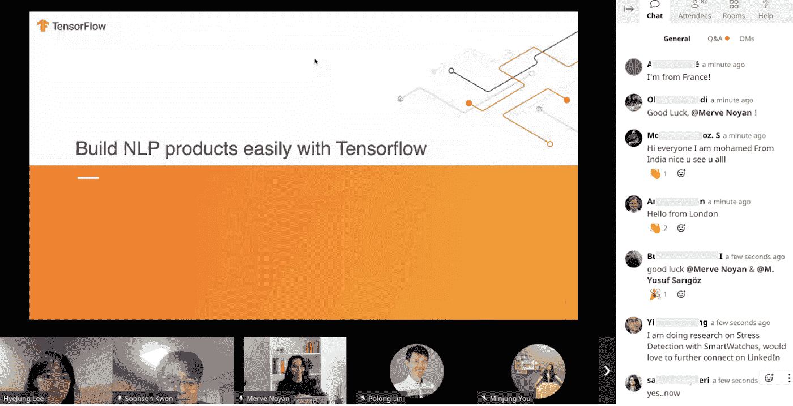

在今年的 I/O 大会上，我们举办了两次 ML 开发者聚会([美国/APAC](https://gdg.community.dev/events/details/google-io-community-lounge-meetups-presents-machine-learning-developers-meetup-americasapac/) 和 [EMEA/APAC](https://gdg.community.dev/events/details/google-io-community-lounge-meetups-presents-machine-learning-developers-meetup-emeaapac/) )。[梅尔夫·诺扬](https://developers.google.com/community/experts/directory/profile/profile-merve-noyan) / [优素福·萨格斯](https://developers.google.com/community/experts/directory/profile/profile-m-yusuf-sarigoz)(土耳其)[萨亚克·保罗](https://developers.google.com/community/experts/directory/profile/profile-sayak-paul) / [巴维什·巴特](https://developers.google.com/community/experts/directory/profile/profile-bhavesh-bhatt)(印度)[利·强生](https://developers.google.com/community/experts/directory/profile/profile-leigh-johnson) / [玛格利特·梅纳德-里德](https://developers.google.com/community/experts/directory/profile/profile-margaret-maynard-reid)(美国)[大卫·卡多佐](https://developers.google.com/community/experts/directory/profile/profile-david-cardozo)(哥伦比亚)[维尼西乌斯·卡里达](https://developers.google.com/community/experts/directory/profile/profile-vinicius-carida) / [阿纳尔多·瓜尔伯特](https://developers.google.com/community/experts/directory/profile/profile-arnaldo-gualberto)

# I/O 扩展 2021

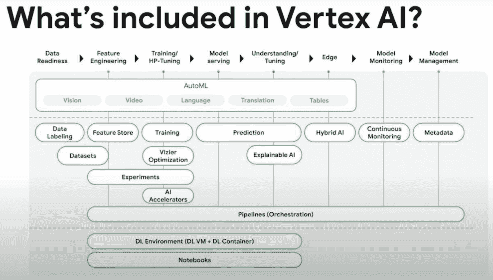

在 I/O 之后，许多 ML GDEs 在他们的博客上发布了 I/O 的摘要。 [Chansung Park](https://developers.google.com/community/experts/directory/profile/profile-chansung-park) (韩国)概述了 [ML 主题演讲摘要](https://docs.google.com/presentation/d/1Qh3aw6sBnRmw3yv5rJ6QR2KHJ77gTQ0N_fdmp8PeBQ4/edit?usp=sharing)，而美国 [Victor Dibia](https://developers.google.com/community/experts/directory/profile/profile-victor-dibia) 总结了来自 Google IO 2021 的[十大机器学习和设计见解。](https://victordibia.com/blog/google-io-2021/)

Vertex AI 是活动中的话题。来自日本的 Minori 松田隼写了一篇日本文章，标题是“介绍强大的顶点人工智能汽车预测”。同样， [Piero Esposito](https://developers.google.com/community/experts/directory/profile/profile-piero-esposito) (巴西)发布了一篇名为“[Vertex AI 的无服务器机器学习管道:简介](https://towardsdatascience.com/serverless-machine-learning-pipelines-with-vertex-ai-an-introduction-30af8b53188e)”的文章，其中包括一篇关于完全定制代码的教程。总部位于印度的 [Sayak Paul](https://developers.google.com/community/experts/directory/profile/profile-sayak-paul) 在 Vertex AI 发布后不久与人合作撰写了一篇博文[讨论 Vertex AI 中的关键部分，展示了如何使用 Vertex AI 运行 TensorFlow 培训工作。](https://cloud.google.com/blog/topics/developers-practitioners/streamline-your-ml-training-workflow-vertex-ai)

诸如[Google Developers Groups(GDG)](https://developers.google.com/community/gdg)和[tensor flow users Groups(TFUG)](https://www.tensorflow.org/community/groups)等社区举办了扩展活动，在这些活动中，演讲者进一步讨论了来自 I/O 的不同 ML 主题，包括来自中国的[宋林](https://developers.google.com/community/experts/directory/profile/profile-song-lin)对来自 I/O 的 [TensorFlow 亮点和应用体验的演讲](https://www.huodongxing.com/event/5599841786200)，该演讲有 24k 在线参与者， [Chansung Park](https://developers.google.com/community/experts/directory/profile/profile-chansung-park) (韩国)还就什么是顶点 AI 以及您可以用顶点 AI 做什么进行了演讲。

# 云人工智能

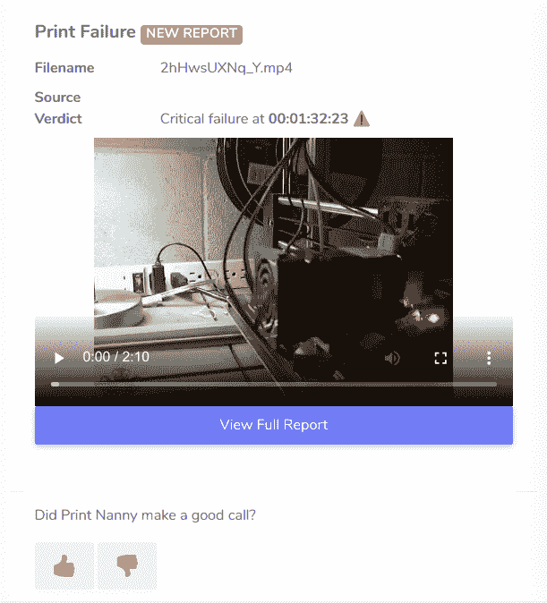

[Leigh Johnson](https://developers.google.com/community/experts/directory/profile/profile-leigh-johnson) (美国)写了一篇详细的文章[以 solo 创始人的身份软发布了一款 AI/ML 产品](https://towardsdatascience.com/soft-launching-an-ai-ml-product-as-a-solo-founder-87ee81bbe6f6)涵盖了 GCP AutoML Vision、GCP IoT Core、TensorFlow Model Garden 和 TensorFlow.js。这是一个 Solo 创始人开发用于检测 3D 打印机打印故障的 ML 产品的故事(关于这个惊人故事的更多内容即将推出，敬请关注！)

演示和代码示例来自[维克多·迪比亚](https://developers.google.com/community/experts/directory/profile/profile-victor-dibia)(美国)[纽约州出租车项目](https://taxiadvisor.victordibia.com/)、[米诺里·松田隼](https://developers.google.com/community/experts/directory/profile/profile-minori-matsuda)(日本)关于 AutoML 和 AI 平台笔记本的[文章](https://helmetti.medium.com/empowering-google-cloud-ai-platform-notebooks-by-powerful-automl-277114b9cc56)、 [Srivatsan Srinivasan](https://developers.google.com/community/experts/directory/profile/profile-srivatsan-srinivasan) (美国)的[视频教程](https://www.youtube.com/playlist?list=PL3N9eeOlCrP6Nhv4UFp67IsQ_TVDpXqXK)、 [Sayak Paul](https://developers.google.com/community/experts/directory/profile/profile-sayak-paul) (印度)的[tensor flow 与 AI 平台的分布式培训& Docker](https://sayak.dev/distributed-training/)

Aqsa Kausar (巴基斯坦)在国际妇女节菲律宾活动上做了一个关于谷歌云端可解释人工智能的演讲。她解释了它的重要性，以及它在 ML 工作流程中的应用位置和方式。

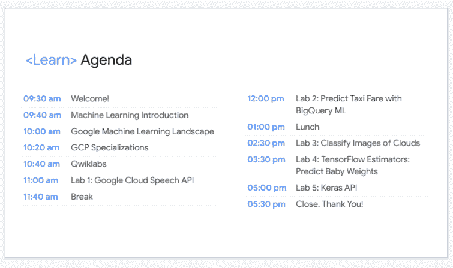

最后， [ML Lab](https://docs.google.com/presentation/d/10cf3JkkHPEsD_FKtDgCfduGpZLaQazh9AsMT38n50Pk/edit?usp=sharing) ，来自尼日利亚的 [Robert John](https://developers.google.com/community/experts/directory/profile/profile-robert-john) 介绍了 GCP 的 ML 景观，涵盖从 BigQueryML 到 AutoML 到 TensorFlow 和 AI 平台。

# 张量流

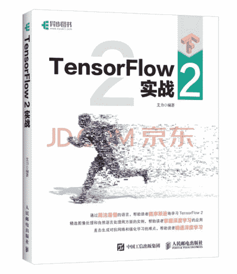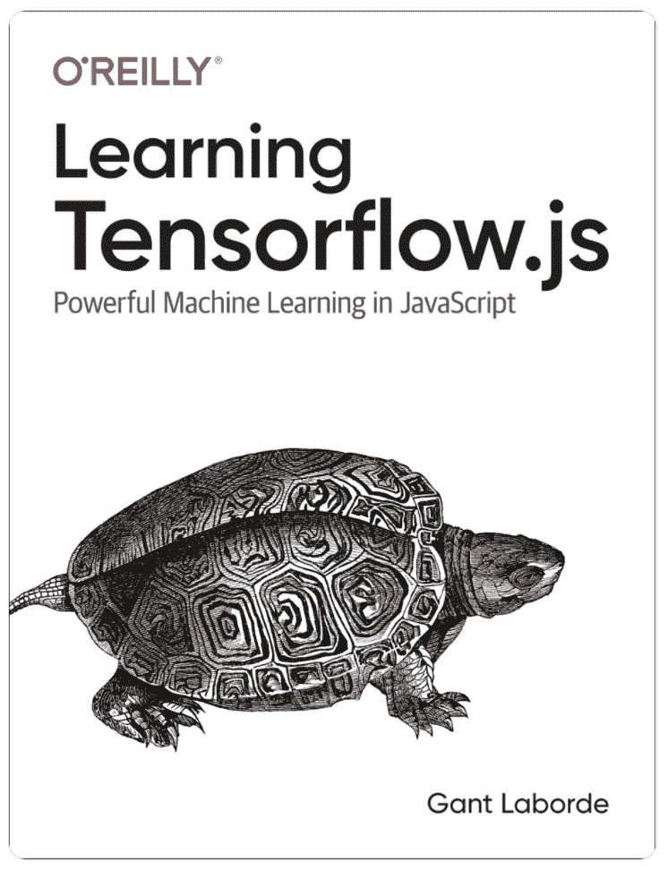

[Eliyar Eziz](https://developers.google.com/community/experts/directory/profile/profile-eliyar-eziz) (中国)出版了一本书“ [TensorFlow 2，带有现实生活中的用例](https://item.jd.com/13320676.html)”。[来自美国的 Gant Laborde](https://developers.google.com/community/experts/directory/profile/profile-gant-laborde) 撰写了 [O'reilly 的书《学习 tensor flow . js》](https://twitter.com/GantLaborde/status/1366473478770163712)并写了一篇文章“[没有数据没有问题——tensor flow . js 迁移学习](https://towardsdatascience.com/no-data-no-problem-tensorflow-js-transfer-learning-f774312d1d2a)”，内容是关于寻找新的数据集，在以前没有模型训练过的地方大胆地进行训练。他还出版了“[一个 Riddikulus 数据集](/google-developer-experts/a-riddikulus-dataset-fb68f9044e33)”，谈论创建哈利波特数据集。

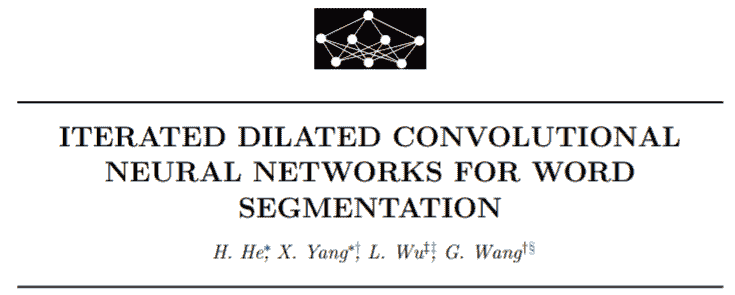

总部位于香港的[王官](https://developers.google.com/community/experts/directory/profile/profile-guan-wang)发表了一篇研究论文“[迭代扩张卷积神经网络分词](http://www.nnw.cz/doi/2020/NNW.2020.30.022.pdf)”，涵盖了 Keras 在 TensorFlow 上实现的最先进的性能改进。

[突尼斯的埃利斯·马奈](https://developers.google.com/community/experts/directory/profile/profile-elyes-manai)写了一篇文章“[成为 Tensorflow 认证开发者](https://manai-elyes.medium.com/become-a-tensorflow-certified-developer-its-easier-than-you-think-5a5b1e9e2105)”，介绍 TensorFlow 认证指南和技巧。

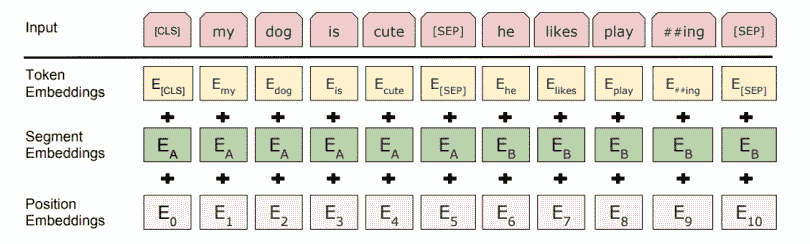

总部位于希腊的乔治·索卢皮斯写了一篇教程“[使用 Colab TPU](https://farmaker47.medium.com/fine-tune-a-bert-model-with-the-use-of-colab-tpu-34cf29067357) 微调 BERT 模型”，讲述如何使用 Colab 的 TPU(v2–8)微调一个经过希腊语专门训练的 BERT 模型，以执行文本分类的下游任务。

# JAX

总部位于印度的 Aakash Nain 已经发布了 TF-JAX 教程系列([第一部分](https://www.kaggle.com/aakashnain/tf-jax-tutorials-part1)、[第二部分](https://www.kaggle.com/aakashnain/tf-jax-tutorials-part2)、[第三部分](https://www.kaggle.com/aakashnain/tf-jax-tutorials-part3/)、[第四部分](https://www.kaggle.com/aakashnain/tf-jax-tutorials-part-4-jax-and-devicearray))，旨在向所有人传授 TensorFlow 和 JAX 框架的构建模块。

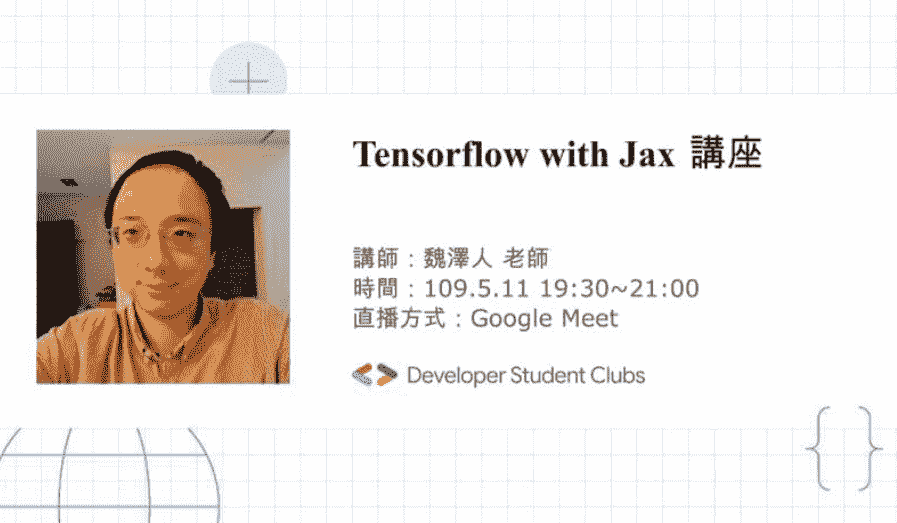

来自台湾的[魏哲仁](https://developers.google.com/community/experts/directory/profile/profile-tzer-jen-wei)的在线聚会 [Tensorflow 和 JAX](https://www.facebook.com/dscnccu/posts/285883059907099) 涵盖了 JAX 的介绍和使用案例。它还涉及了写张量流模型和训练循环的不同方法。

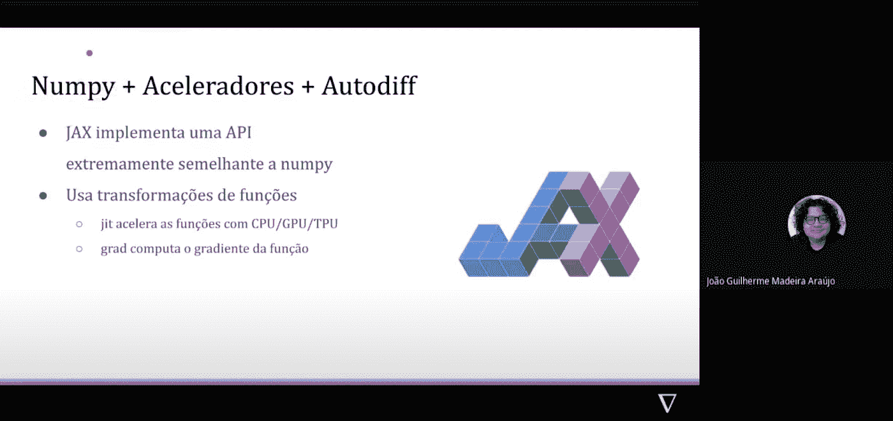

YouTube 视频[神经网络，有一个在 JAX 写的实际例子](https://www.youtube.com/watch?v=GByl_PEo94M&t=107s)，可能是第一个葡萄牙语的 JAX techtalk，作者是[若昂·古伊列梅·马代亚·阿劳若](https://developers.google.com/community/experts/directory/profile/profile-joao-guilherme-madeia-araujo)(巴西)。

# 克拉斯

来自印度的 Sayak Paul 提供了许多 Keras 示例，下面列出了其中一些示例。

*   [使用 AdaMatch](https://keras.io/examples/vision/adamatch/) ( [github](https://github.com/keras-team/keras-io/blob/master/examples/vision/adamatch.py) )进行半监督和领域自适应，涵盖 AdaMatch(无监督领域自适应中的 SOTA)的实施和演练
*   [学习在计算机视觉中调整大小](https://keras.io/examples/vision/learnable_resizer/) ( [github](https://github.com/keras-team/keras-io/blob/master/examples/vision/learnable_resizer.py) )
*   [带迁移学习的关键点检测](https://keras.io/examples/vision/keypoint_detection/) ( [github](https://github.com/keras-team/keras-io/blob/master/examples/vision/keypoint_detection.py) )

# 卡格尔

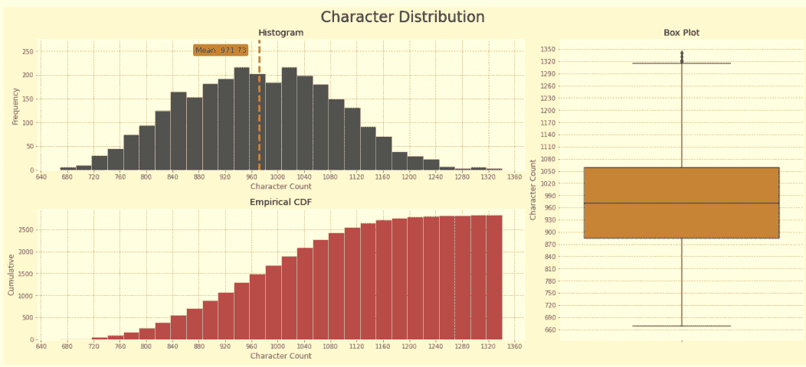

笔记本“[带有句子嵌入的简单贝叶斯岭](https://www.kaggle.com/datafan07/eda-simple-bayesian-ridge-with-sentence-embeddings)”作者[埃尔图鲁尔·德米尔](https://developers.google.com/community/experts/directory/profile/profile-ertugrul-demir)(土耳其)讲述了一项自然语言处理任务，该任务使用伯特微调，然后在变形金刚生成的句子嵌入之上进行简单线性回归。

[来自韩国的韩优·李](https://developers.google.com/community/experts/directory/profile/profile-youhan-lee)做了一个关于“[学习机器学习和 tensorflow 与 Kaggle 竞赛](https://festa.io/events/1395?fbclid=IwAR3VCvu-egmMC00eoSDRA8zdQcpT0r6WTo7mn9bEiRIM5NcPk050zW-vQy0)”的演讲。他解释了如何使用 Kaggle 平台学习 ML。

# 研究

机器学习和深度学习研究的进展正在改变我们的技术，许多 ML GDEs 对此感兴趣并做出了贡献。

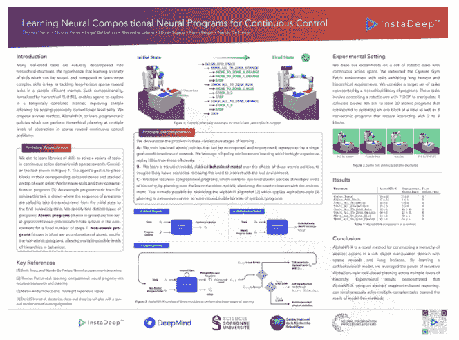

[Karim Beguir](https://developers.google.com/community/experts/directory/profile/profile-karim-beguir) (英国)与 DeepMind 团队合作撰写了一篇[论文](https://deepmind.com/research/publications/Learning-Compositional-Neural-Programs-for-Continuous-Control)，内容涉及一种使用深度强化学习解决机器人操纵任务的新颖组合方法。它在 NeurIPS 研讨会上被接受。

最后，来自印度的 [Sayak Paul](https://developers.google.com/community/experts/directory/profile/profile-sayak-paul) 与[Pin-陈愉](https://scholar.google.co.in/citations?user=jxwlCUUAAAAJ&hl=en)一起发表了一篇研究论文，“[视觉变形器是健壮的学习者](https://arxiv.org/abs/2105.07581)”，涵盖了视觉变形器(ViT)对常见的腐败和干扰、分布变化和自然对抗例子的鲁棒性。

如果你想了解更多关于谷歌专家社区和他们所有的全球开源 ML 贡献，请访问 [GDE 目录](https://developers.google.com/community/experts/directory)并在 Twitter 和 LinkedIn 上联系 GDEs。你也可以在 [ML GDE 的 YouTube 频道上虚拟地见到他们](https://www.youtube.com/watch?v=Ey38mvsKujU&list=PLS2b7XO82fsfprpSRPVVsylcSusr0HzzT)！