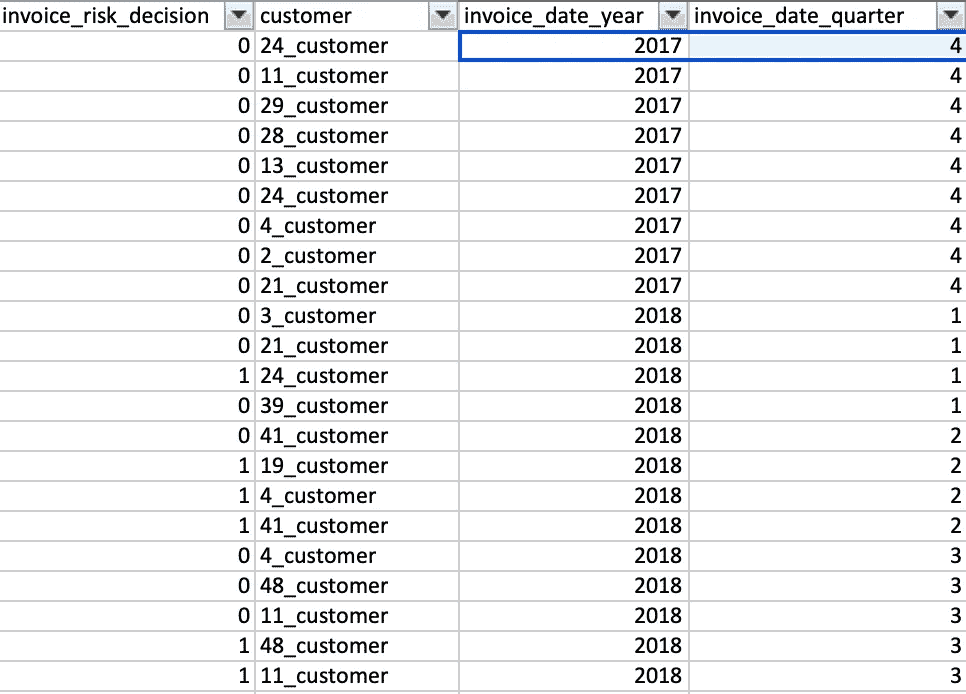
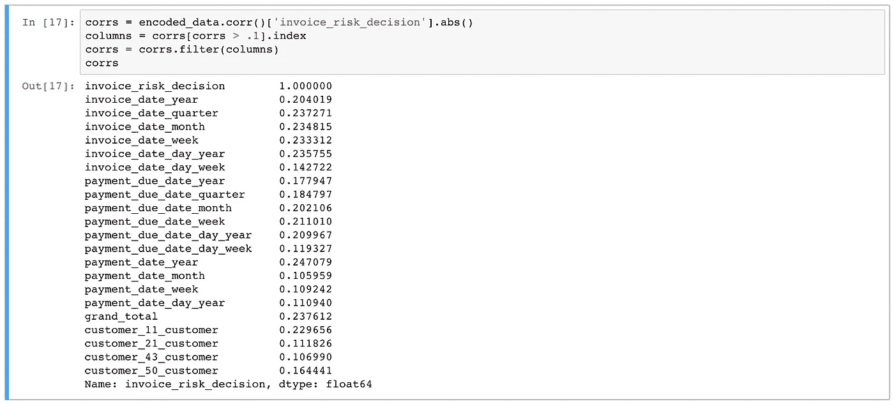

# 机器学习——将数据整理成正确的形状

> 原文：<https://medium.com/oracledevs/machine-learning-getting-data-into-right-shape-34d6faafda51?source=collection_archive---------0----------------------->

当您建立机器学习模型时，首先从数据开始-确保输入数据准备充分，并且它代表您希望机器学习模型学习的真实状态。数据准备任务需要时间，但不要着急——高质量的数据是机器学习成功的关键。在这篇文章中，我将介绍将数据整理成正确形状并输入机器学习算法所需的基本步骤。

这篇文章的样本数据集和 Python 笔记本可以从我的 [GitHub](https://github.com/abaranovskis-redsamurai/automation-repo) repo 下载。

数据集中的每一行代表发送给客户的发票。从 ERP 系统中提取的原始数据集有五列:

*客户* —客户 ID

*发票日期* —创建发票的日期

*付款到期日* —预计发票付款日期

*付款日期* —实际发票付款日期

*总计* —发票总计

*invoice _ risk _ decision*—描述当前发票风险的 0/1 值列。机器学习模块的目标是根据对历史发票数据的风险估计，识别未来发票的风险。

有两种类型的特征-分类特征和连续特征:

*分类* —通常是文本而不是数字，代表不同的组/类型

*连续* —数字

机器学习通常与数字打交道。这意味着我们需要将所有的分类特征转换成连续的。例如， *grand_total* 是连续特性，但日期和客户 ID 不是。

通过将日期分成多列，可以将其转换为连续特征。以下是将 *invoice_date* 分解为多个连续特征(年、季度、月、周、年中的某一天、月中的某一天、周中的某一天)的示例:

使用这种方法，所有的日期列都可以转换成连续的特征。客户 ID 列可以转换成 0/1 的矩阵。每个唯一文本值被移到单独的列中，并被赋予 1，该行中的所有其他列被赋予 0。这个转换可以通过名为 Pandas 的 Python 库来完成，我们稍后会看到。

您的数据可能有决策值，也可能没有，这取决于数据是如何收集的，以及在 ERP 应用程序中实施了什么流程来收集这些数据。决策列( *invoice_risk_decision* )值表示我们要用机器学习计算的业务规则。请参阅分配给此列的 0/1:

规则描述:

0-发票按时支付，支付日期小于或等于支付日期

0-发票未按时支付，但总额小于所有发票的平均总额，且支付延迟小于或等于当前客户平均水平的 10%

1 —所有其他情况，表示发票支付风险高，我建议以 CSV 格式保存数据。准备好数据后，我们可以将其加载到 Python 笔记本中:

我正在使用 Pandas 库(通过 *pd* 变量导入)将数据从文件加载到数据框中。函数 head()打印数据帧(数据集大小为 5x24)的前五行:

我们可以用 0/1 显示行数，这有助于理解数据集是如何构建的——我们看到超过一半的行代表没有支付风险的发票:

客户 ID 列不是数字，我们需要转换它。将会使用熊猫 *get_dummies* 功能来完成这个任务。它会将每个唯一值转换为一列，并根据行中是否包含该值来放置 0 或 1(这将增加数据集宽度):

原来的客户列不见了，现在每个客户都有多个列。如果 ID = 4 的客户位于给定行，则设置 1:

最后，我们可以检查决策列— *invoice_risk_decision* 与数据集中其他列之间的相关性。相关性显示机器学习算法将使用哪些列来根据数据集中其他列的值预测值。以下是我们数据集的相关性(相关性超过 10%的所有列):

如您所见，所有日期列都有很高的相关性，还有 *grand_total* 。我们的规则告诉我们，如果发票金额小于所有总平均值，则发票支付风险较低——这就是 *grand_total* 值存在相关性的原因。

ID = 11 的客户是发票数量最多的客户，正如所料，该客户的相关性高于其他客户。

*原载于 2018 年 11 月 7 日*[*andrejusb.blogspot.com*](http://andrejusb.blogspot.com/2018/11/machine-learning-getting-data-into.html)*。*