# 数字过程自动化中的机器学习——第一部分

> 原文：<https://medium.com/oracledevs/machine-learning-in-digital-process-automation-part-i-7c7468e23804?source=collection_archive---------6----------------------->

这是关于如何在 [Oracle 集成云](https://cloud.oracle.com/OIC)的数字流程自动化和集成应用中使用[机器学习](https://www.oracle.com/data-science/machine-learning/what-is-machine-learning/) (ML)的系列文章的第一篇。对于本系列，我们将混合使用 Oracle 云服务，并逐步实施几个用例。第一篇文章(这一篇)关注于为我们的第一个用例设置机器学习环境和实现机器学习模型。


Flow (Image © Ralf Mueller)

# 示例使用案例

审批工作流是流程自动化应用程序非常流行的示例，因为审批在任何组织中都广泛使用，例如

*   在员工入职流程中批准雇用员工
*   在采购过程中批准购买设备
*   在差旅管理流程中审批差旅费
*   等等。等等。

这个清单可以一直列下去。但是对于本系列，我们从销售中选取一个用例，并希望实现以下场景

*   客户的订单来自公司的销售代表
*   除其他数据外，订单具有以下相关信息
    -订单金额
    -订单创建的季度(1、2、3、4)
    -客户状态(绿色、黄色、红色)
    -客户要求的折扣(0–99%)
*   根据订单信息，我们希望**预测**该订单是否应该由给定季度的销售副总裁批准。

这是任何公司的典型情况，销售代表从客户那里获得订单，销售副总裁必须决定是否批准该订单。尤其是到了第四季度末，这对于销售副总裁来说会变得相当有压力，因此这里的一些自动化将显著改善销售流程，并有助于处理更多订单。

在本文中，我们将展示如何使用 [Oracle 自治数据仓库](https://cloud.oracle.com/en_US/datawarehouse)建立机器学习(ML)环境，并为我们的用例实现一个 ML 模型。

# Oracle 自治数据仓库

[Oracle 自治数据仓库](https://cloud.oracle.com/en_US/datawarehouse) (ADW)是一项 Oracle 云基础设施原生服务。这是一个完全托管的云服务，具有机器学习和[人工智能](https://www.oracle.com/artificial-intelligence/what-is-ai/)功能，可以非常简单地供应数据仓库，快速轻松地加载数据，并使用内置的基于网络的工具(如笔记本电脑)查询数据。[基于 Apache Zeppelin](http://zeppelin.apache.org/) 的 ML 笔记本和 [Oracle Advanced Analytics](https://www.oracle.com/database/technologies/datawarehouse-bigdata/advanced-analytics.html) 一起为数据科学家提供了一个全面的 ML 工具包，用于加载和可视化数据、训练和测试 ML 模型，并使用简单的 markdown 语言记录 ML 用例。

# 初始用户设置

有关 ADW 的设置和管理，请参见本文的附录。建议在 ADW 设置用户。ADW 用户不同于 OCI 用户，因为 ADW 用户实际上是在 ADW 拥有模式的数据库用户。在 ADW 创建用户后，用户可能希望运行几个安装 SQL 脚本。这些在系统中只需要一次，然后可以在每个笔记本或 SQL 脚本中使用。关于如何在 ADW 创建用户，请参见[在 Oracle Machine Learning](https://docs.oracle.com/en/cloud/paas/autonomous-data-warehouse-cloud/omlug/administer-oracle-machine-learning.html#GUID-6899BA4F-C845-4364-9E28-9C267363CB15) 中创建用户账户。要在 ADW 创建 SQL 脚本，使用您的用户和密码登录，然后从用户主页打开*运行 SQL 脚本*

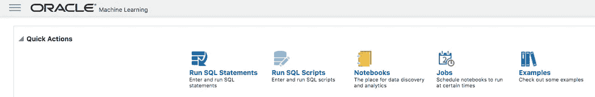

ADW User home page

这将打开一个 SQL 脚本暂存，您可以在其中按段落组织 SQL 脚本，然后单独执行每个段落或执行整个脚本暂存。我建议按段落组织工作，这样你可以稍后再回来，只在需要时执行适当的段落。

## 创建凭据

由于我们稍后将与 Oracle Cloud Storage 合作，将数据从云存储加载到 ADW，因此我们需要在 ADW 设置用户凭据，以使用 ADW 包 DBMS_CLOUD 的过程连接到云存储。为此，在 ADW 中打开一个 SQL 脚本并执行以下命令

Create Credential to connect to Cloud Storage from ML notebooks

参见 [DBMS_CLOUD。CREATE_CREDENTIAL](https://docs.oracle.com/en/cloud/paas/autonomous-data-warehouse-cloud/user/dbmscloud-reference.html#GUID-742FC365-AA09-48A8-922C-1987795CF36A) 过程和使用授权令牌的[了解详情。](https://docs.cloud.oracle.com/iaas/Content/Identity/Tasks/managingcredentials.htm#two)

## 创建将 BLOB 写入 DATA_PUMP_DIR 的过程

接下来，我们将创建一个方便的过程，用于将序列化的 ML 模型作为二进制 BLOB 转储到 ADW 的 DATA_PUMP_DIR。我们稍后会解释为什么需要这样做。为此，将以下内容添加到您的 SQL 草稿栏并执行它

Procedure to write a BLOB to a directory on ADW Database

# 实施销售审批机器学习模型

我们现在准备在 ADW 使用 ML 笔记本来实现这个用例。为此，请转到主页，单击笔记本，然后单击创建

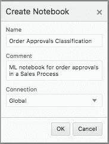

Creation of ML notebook

这将打开一个新的空 ML 笔记本，如下所示:

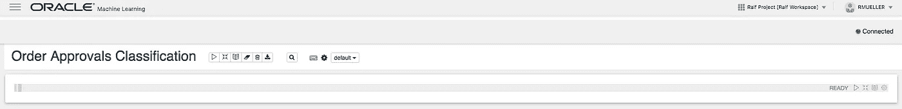

Empty ML notebook for Order Approvals Classification

## ML 笔记本使用

ML 笔记本被组织在所谓的段落中。每个段落由以下实现类型之一实现

*   **%md**
    这是标记语言，可用于记录 ML 笔记本。标清中的链接可用于链接到外部资源。
*   **% script**这是针对 PL/SQL 语言的 SQL 脚本。在 ADW 的后续版本中，将增加对 Python 的支持。
*   **%sql**

实现类型应该在每段的第一行指定。段落可以单独执行。此外，整个 ML 笔记本可能会被执行。为此，笔记本上和每一段上都有一个小小的*播放*按钮。有关 ML 笔记本及其使用的更多信息，请参见[使用 Oracle 机器学习](https://docs.oracle.com/en/cloud/paas/autonomous-data-warehouse-cloud/omlug/get-started-oracle-machine-learning.html#GUID-2AEC56A4-E751-48A3-AAA0-0659EDD639BA)。阅读关于 Apache Zeppelin 笔记本电脑的一般知识，以更好地理解它们的用法和最佳实践，可能也是有用的。

下面的部分是以一种方式组织的，你可以将示例代码复制粘贴到你的 ML 笔记本的新段落中。在这一段结束时，你将有一个运行的 ML 笔记本，它为订单分类创建了一个 ML 模型。

## 1.证明文件

记录您的用例是一个很好的实践，为此，我们从一个标记(%md)段落开始 ML 笔记本

Paragraph to document the use case

## 2.清除

接下来，我们将清理这个用例上下文中的任何现有数据。这将使 ML 笔记本可重复。

Cleanup data for this use case

## 3.创建数据库对象

清理之后，我们将在 ADW 数据库中创建所需的对象。

Create tables required for this use case

## 4.从云存储中加载数据

接下来，我们将把云存储中的数据加载到表 SALES_DATA 中。此表包含我们稍后用来训练 ML 模型的训练集。ADW 提供了多种将数据加载到 ADW 数据库的选项，详见[使用自主数据仓库](https://docs.oracle.com/en/cloud/paas/autonomous-data-warehouse-cloud/user/load-data.html#GUID-1351807C-E3F7-4C6D-AF83-2AEEADE2F83E)加载数据。在我们的用例中，数据在云存储中是一个. CSV 文件，我们可以使用 [DBMS_CLOUD 将它加载到数据库中。COPY_DATA](https://docs.oracle.com/en/cloud/paas/autonomous-data-warehouse-cloud/user/dbmscloud-reference.html#GUID-9428EA51-5DDD-43C2-B1F5-CD348C156122) 程序

Copy data from .CSV file on Cloud Object Storage to table SALES_DATA

这里是云对象存储上的文件 sales_data_export.csv

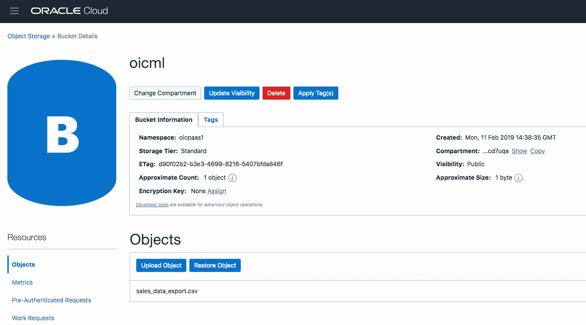

sales_data_export.csv on Object Storage

## 5.分割数据

对于任何机器学习练习，将数据分成两部分都是很好的做法

1.  **训练数据**
    训练数据用于实际训练机器学习模型
2.  **测试数据**

这可以在 SQL 中通过在 SALES_DATA 表的顶部创建两个视图来方便地实现，一个视图用于训练数据，另一个视图用于测试数据

Split SALES_DATA into training and test data by using views

这里有一个警告:虽然上面的 SQL 非常方便且富有表现力，但是这种分割方法不应该用于大型训练集，因为 SQL MINUS 操作并不真正具有高性能。相反，应该结合使用案例 id 和 ora_hash 函数来分割数据集。

## 6.为 GLM 算法准备设置

对于这个用例，我们将使用一个[广义线性模型](https://docs.oracle.com/en/database/oracle/oracle-database/19/dmcon/generalized-linear-models.html#GUID-5E59530F-EBD9-414E-8C8B-63F8079772CE) (GLM) ML 算法，这是一个用于[分类](https://docs.oracle.com/en/database/oracle/oracle-database/19/dmcon/classification.html#GUID-3D51EC47-E686-4468-8F49-A27B5F8E8FE4)模型的算法。为了在 ADW 使用 GLM，我们需要参数化算法的设置。默认情况下，自动数据准备是打开的，不需要显式设置。为了完整起见，下面只显示了它。

Settings for GLM algorithm

## 7.显示数据

我们现在准备使用 GLM 分类算法为存储在表 SALES_DATA 中的数据训练一个机器学习模型。在此之前，我们查询表 SALES_DATA 并显示一些图形。为此，我们可以创建一个新段落，并选择%sql 作为实现，然后将以下 sql 添加到该段落中

```
%sqlselect CustomerStatus, Quarter, OrderAmount from sales_data_train
```

在用户选择对查询结果使用条形图可视化后，将显示类似下面的内容。

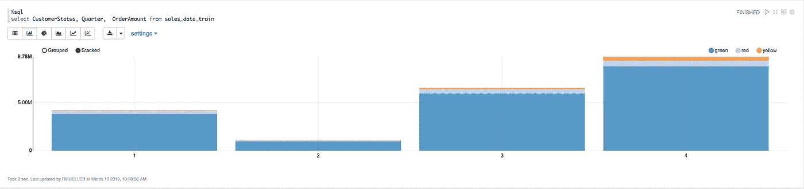

Example bar chart from data in view SALES_DATA_TRAIN

请随意使用笔记本中可用的可视化和各种图表实现。上面的条形图显示了状态为绿色、红色和黄色的客户在四个季度的订单金额分布。

## 8.训练机器学习模型

现在是时候根据视图 SALES_DATA_TRAIN 中的数据来训练 ML 模型了

Creation of ML model SALES_CLASSIFICATION_GLM_V2

这可能需要更多的解释，完整的细节请参见 [DBMS_DATA_MINING。CREATE_MODEL](https://docs.oracle.com/en/database/oracle/oracle-database/19/dmprg/model-creation.html#GUID-03C85895-C9C3-4003-AFB4-C36E36B60CE8) 文档和 Oracle 高级分析[数据挖掘用户指南](https://docs.oracle.com/en/database/oracle/oracle-database/19/dmprg/index.html)。

*   我们创建了一个名为销售 _ 分类 _GLM_V2 的模型
*   该模型的挖掘功能是分类
*   培训数据存储在视图 SALES_DATA_TRAIN 中
*   目标列(我们稍后想要预测的属性)是批准
*   算法的设置存储在表 GLM 设置中

## 9.显示预测结果

既然我们已经建立了模型，我们可以检查模型的质量。在本文中，我们只展示了针对视图 SALES_DATA_TEST 的一些预测结果。

用以下内容在你的 ML 笔记本上创建一个新段落

```
%sqlselect prediction(SALES_CLASSIFICATION_GLM_V2 USING *) pr,
       Quarter,
       OrderAmount
  from sales_data_test
  order by pr ;
```

可能会显示这样的内容

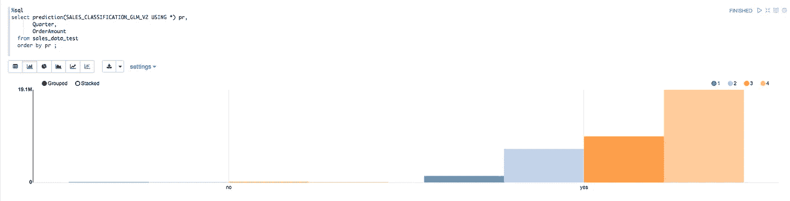

Result of predicting APPROVALS using data from view SALES_DATA_TEST

不出所料，对于批准属性，大多数预测是“是”，只有一小部分是“否”。在现实世界中，人们会使用不同的算法构建更多的分类模型，然后比较每个算法的结果，然后为用例选择最佳算法。然而，这将远远超出本系列的目的，实际上可能是一个系列本身。

ADW 为以下项目提供了大量的 ML 技术和算法

*   分类
*   回归
*   异常检测
*   使聚集
*   联合
*   时间序列
*   特征选择和回归

关于一套完整的算法，请参见[算法](https://docs.oracle.com/en/database/oracle/oracle-database/19/dmcon/algorithms.html#GUID-B901A29B-218C-4F37-91E0-AA94631364E3)。

## 10.将 ML 模型写入目录

现在我们已经为用例建立了一个 ML 模型，我们可以把它的序列化版本作为 BLOB 写到 ADW 的一个目录中。本段将利用我们最初在用户设置时创建的过程 *write_serialized_model* 。此过程可在其他 ML 笔记本中使用，因此我们没有在此处创建它，而是作为设置 Data Scientist ML 笔记本环境的一部分。

Writing serialized ML model to ADW DATA_PUMP_DIR

## 11.将 ML 模型转移到云对象存储

作为 ML 笔记本的最后一步，我们将把 ML 模型的序列化版本从 ADW 的 DATA_PUMP_DIR 目录转移到云对象存储。为此，我们使用 [DBMS_CLOUD。PUT_OBJECT](https://docs.oracle.com/en/cloud/paas/autonomous-data-warehouse-cloud/user/dbmscloud-reference.html#GUID-716F0DE7-C669-477E-8AB8-EA42E41ACB12) 程序。

Transfer serialized ML model from DATA_PUMP_DIR to Cloud Object Storage

我们现在完成了 ML 笔记本。运行这个 ML 笔记本的结果是一个存储在云对象存储上的机器学习模型*sales classification v2 . mod*。在本系列的下一部分，我们将展示如何使用这个机器学习模型进行评分。

# 附录:自治数据仓库管理

在本章中，我们将重点介绍 ADW 的一些管理功能，这些功能对于使用 ADW 实例可能很有价值。

## ADW 数据库连接和服务控制台

ADW 提供了某些可以从 OCI 自治数据仓库控制台访问的管理功能。为此，ADW 的管理员可能希望从 OCI 控制台中选择适当的 ADW 实例，如下所示

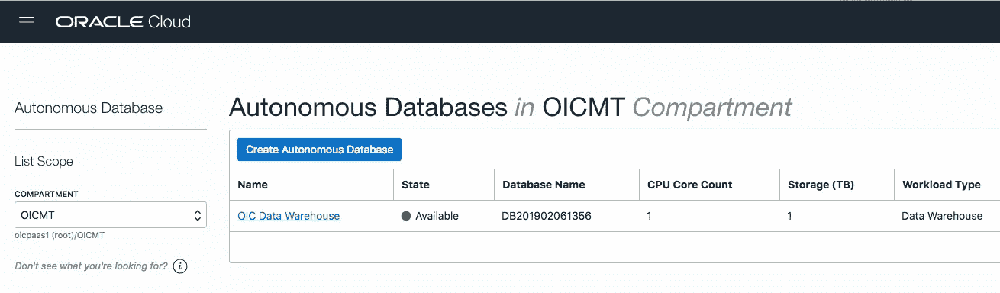

List of Autonomous Data Warehouse instances

## 正在下载客户端凭据

使用 SQL*Developer 的全套功能来处理 ADW 数据库非常方便。在 18.1 及更高版本中，SQL*Developer 支持从客户端凭据文件(也称为 Wallet)创建数据库连接。要下载 ADW 数据库的客户机身份证明，请在 OCI 控制台中打开 ADW 实例详细信息页面，然后单击*数据库连接*

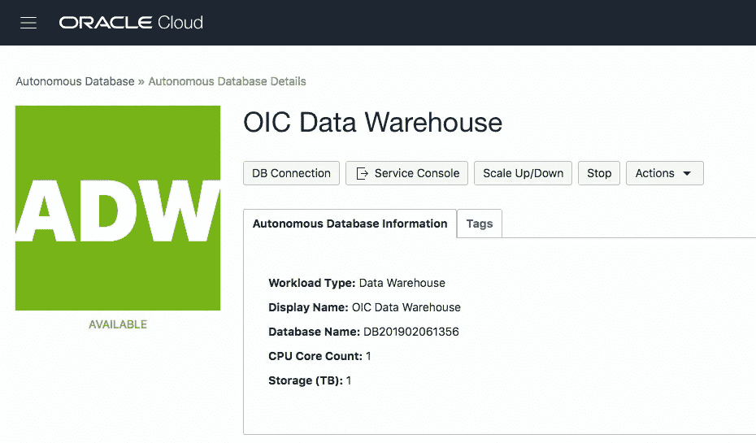

Details of Autonomous Data Warehouse Instance

这将打开另一个对话框，您可以从中下载. zip 存档文件

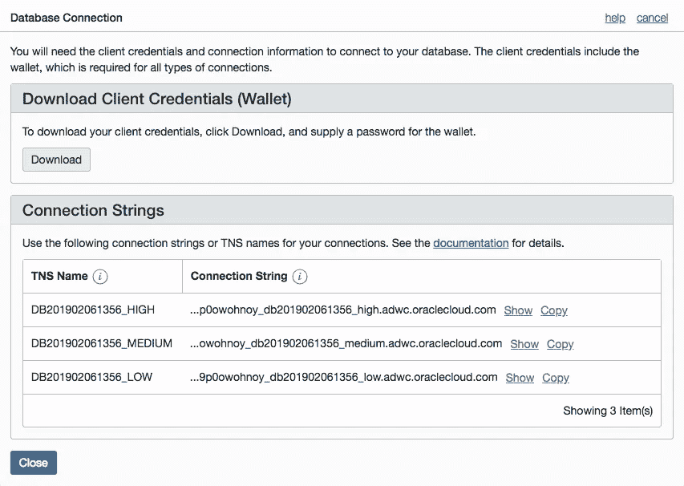

的。zip 存档包含通过 TLS 上的 JDBC 连接到 ADW 数据库所需的客户端凭证和密钥。可以在 SQL*Developer 中使用该归档文件来创建数据库连接。

## 服务控制台

服务控制台显示了 ADW 实例的一些运行时统计数据，包括 CPU 利用率和平均 SQL 语句响应时间等。

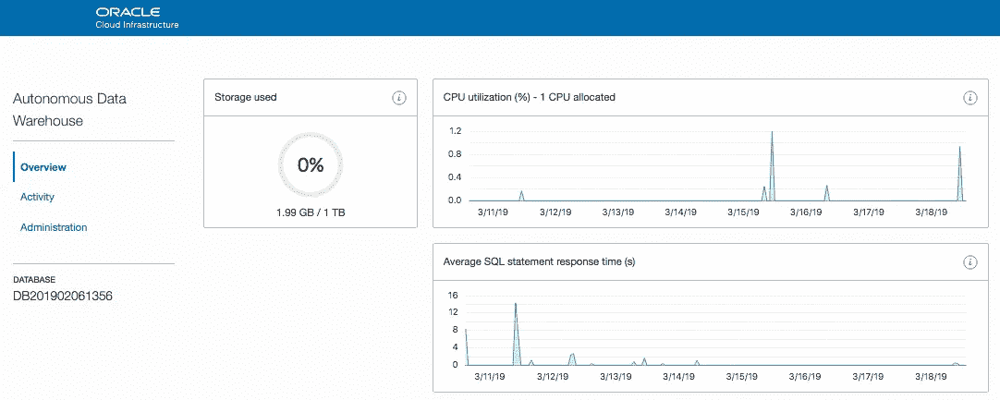

ADW Service Console

ADW 的所有管理任务都可以通过服务控制台的*管理*菜单来完成

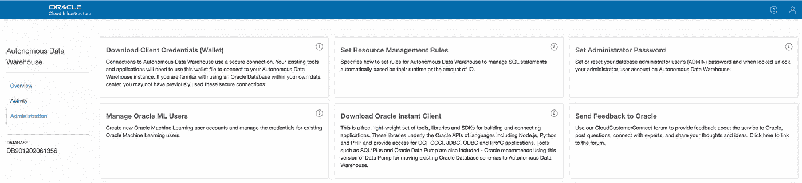

ADW Administration Tasks

综上，管理控制台允许 ADW 管理员进行以下操作

*   **下载客户端凭证**
    这与您可以从 ADW 实例的实例详细信息页面中执行的操作基本相同，如上所述
*   **设置资源管理规则**
    这允许您为 ADW 消费群设置高、中、低计算资源限制
*   **设置管理员密码**
*   **管理 Oracle ML 用户**
    允许 ADW 管理员向自治数据仓库添加用户。这些用户本质上是数据库用户(而不是由 OCI 身份管理系统管理的用户)。为了使用 ADW 的 ML 笔记本功能，应该创建一个用户
*   **下载 Oracle Instant Client**
    这将重定向到 [Oracle Instant Client 下载](https://www.oracle.com/technetwork/database/database-technologies/instant-client/overview/index.html)页面，您可以从该页面下载适用于您选择的平台和操作系统的 Oracle Instant Client。instant client 可让您通过 SQL*Plus、imp/exp 等著名的 Oracle 客户端工具访问 ADW 数据库。
*   **向甲骨文发送反馈**

# 承认

本系列文章是与 Oracle 机器学习(OML)团队一年多合作的成果。因此，我要感谢 Boriana Milenova 和她的开发团队对机器学习的大力支持、及时交付和宝贵对话。感谢来自[**@**OracleAnalytics](https://twitter.com/OracleAnalytics)的产品经理 [Charlie Berger](https://medium.com/u/8a5bd14977df?source=post_page-----7c7468e23804--------------------------------) 对 OML 和集成云的推广，以及有机会在各种场合展示这项工作。最后，非常感谢流程运行时团队和集成云 UI 团队的苏曼·甘塔在集成云中支持 OML。