# 数字过程自动化中的机器学习——第二部分

> 原文：<https://medium.com/oracledevs/machine-learning-in-digital-process-automation-part-ii-ebeeec8763dc?source=collection_archive---------0----------------------->

在 ML in Digital Process Automation 系列文章的第二部分中，我们将重点关注如何使用在[自治数据仓库](https://cloud.oracle.com/en_US/datawarehouse) (ADW)中创建的[机器学习](https://www.oracle.com/data-science/machine-learning/what-is-machine-learning/)模型，以便在集成云流程中进行评分。假设读者熟悉[第一部分](/oracledevs/machine-learning-in-digital-process-automation-part-i-7c7468e23804)的内容。对于本文，我们假设一个现有的 ML 模型存储在[对象存储器](https://cloud.oracle.com/storage/object-storage/features)中。我们将逐步说明如何将这些模型引入 Oracle 集成云，并在流程自动化中使用它们。


Curve (Image © Ralf Mueller)

> 在撰写本文时，Integration Cloud Process Automation 的机器学习功能处于“有限可用性”模式，必须通过功能标志来启用。请联系您的集成云代表，以便为您的集成云实例启用此功能。

# OML 微服务公司

Oracle Integration Cloud 由一组新的微服务组成，用于机器学习[和人工智能](https://www.oracle.com/data-science/machine-learning/what-is-machine-learning/)，这是由 Oracle 高级分析组织的 OML 团队开发的 Oracle 机器学习(OML)微服务，是 Oracle 机器学习平台的一部分。我们将在后面的文章中对 OML 微服务进行深入的概述，现在，理解 OML 微服务的功能就足够了

*   **认知文本服务**
    认知文本服务为文本分类、关键词、摘要、相似性和情感分析提供机器学习功能。底层 ML 模型由 Oracle 预先训练，可以开箱即用。数字过程自动化中的典型例子包括给出大文本文档的摘要或给出对客户输入的意见。
*   **认知图像服务**
    认知图像服务为图像分类、NSFW 内容和图像相似性提供机器学习功能。像认知文本服务一样，底层的 ML 模型是由 Oracle 预先训练的。
*   **模型库服务**
    模型库服务管理用[自治数据库](https://cloud.oracle.com/en_US/database)创建并保存在[对象存储](https://cloud.oracle.com/storage/object-storage/features)或本地文件系统中的 ML 模型。一旦 ML 模型被上传到模型库服务，就可以使用模型部署服务将它作为用于评分的服务来启用。请注意，ML 模型可以使用 18.3 或更高版本的任何**Oracle 数据库创建，包括本地数据库。这为 ML 模型训练提供了广泛的选择。然而在本文中，我们主要使用自治数据库作为 ML 模型训练的基础，因为[自治数据仓库](https://cloud.oracle.com/en_US/datawarehouse)为模型训练和数据可视化提供了 ML 笔记本用户体验。**
*   **模型部署服务**
    模型部署服务管理机器学习服务的生命周期。上传到模型库服务的 ML 模型可以在模型部署服务中启用服务，以便根据其底层 ML 模型对数据进行评分。

OML 微服务是部署到每个 Oracle 云基础设施(OCI)区域的 Kubernetes (OKE)的[容器引擎的多实例(或多租户)服务。](https://cloud.oracle.com/en_US/containers)

> 重要的是要理解，一旦 ML 模型被上传到 OML 模型库服务，就不需要自治数据库来根据 ML 模型评分。评分由 OML 模型部署服务执行，该服务提供低延迟和高吞吐量的评分功能。

# 过程自动化中的机器学习服务

在这一章中，我们将详细描述如何将在自治数据库中创建并保存到对象存储中的机器学习模型引入 OML 知识库服务。一旦 ML 模型被上传到模型库服务，它就可以用于集成云中的评分。

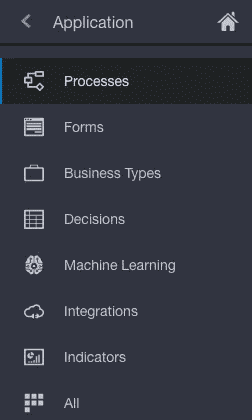

Machine Learning in Process Application palette

我们向 Process Applications 调色板添加了一个新的一级 ***机器学习*** 实体，用于管理机器学习模型和服务。

通过这个新的用户界面来管理与 OML 模型库和部署服务的交互。

流程应用程序的其他一级实体包括流程、表单、业务类型、决策、集成和指示器。

## 将 ML 模型上传到模型库服务

下图显示了对象存储区的内容，其中包含几个 ML 模型，这些模型早些时候在 ADW 创建，并从 OML 笔记本保存到对象存储区。

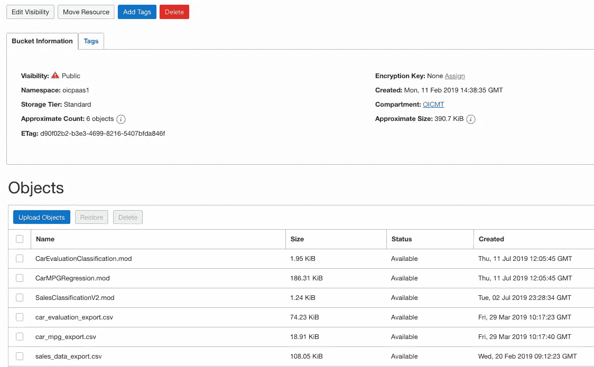

Machine Learning Models stored as objects in Object Storage bucket (.mod files)

为了在集成云中使用 ML 模型，您必须首先将模型下载到本地文件系统，这可以很容易地从对象存储中完成，如下图所示。

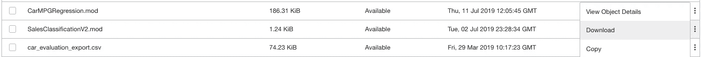

Download SalesClassificationV2.mod to a local file system

> 在集成云的下一个版本中，我们添加了一个用户界面，允许直接使用对象存储中的 ML 模型。目前，它们必须先下载到本地文件系统。

接下来，我们可以转到 Process Applications 中的机器学习调色板，并开始在您的应用程序中使用 ML 模型。这将在下面的屏幕中打开，您可以在其中管理流程应用程序中使用的机器学习模型和服务。

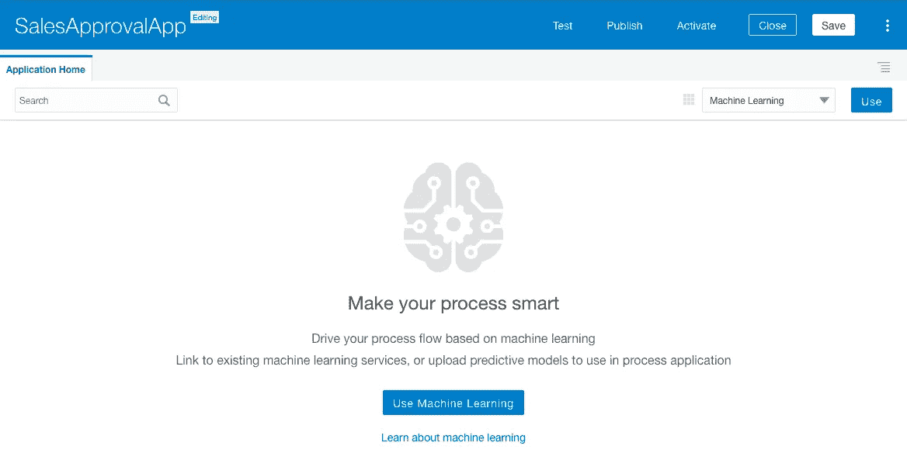

点击**使用**按钮并选择 ***添加*** 向应用添加一个新的 ML 模型。

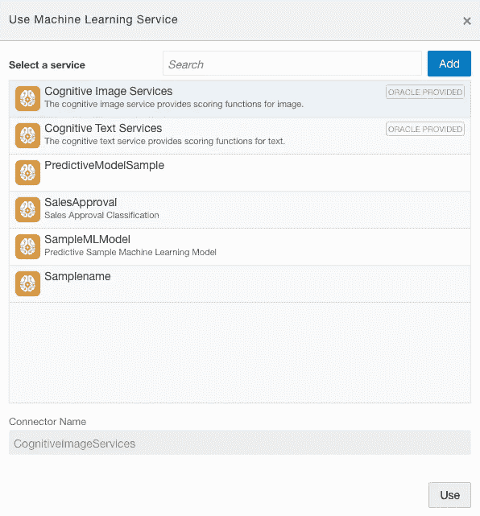

Available ML Services to use in Process Applications

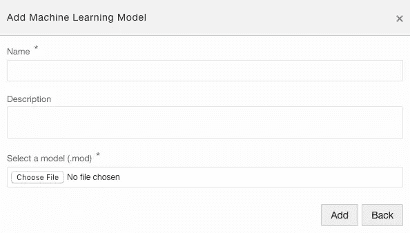

Adding a new Machine Learning Model from local file system

然后选择下载的。本地文件系统中的 mod 文件

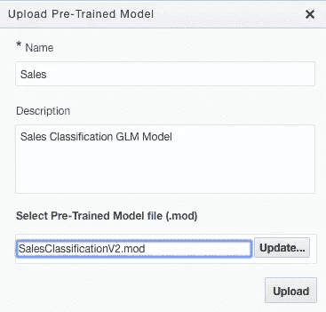

Choose File from the local filesystem

添加后，您可以点击 ***使用*** 按钮，选择在您的应用中使用该模型。

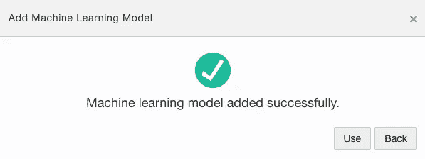

就这样，您新添加的 ML 模型就可以在流程应用程序中使用了。

## 在流程应用中使用 ML 服务

既然我们已经将 ML 模型上传到 OML 存储库服务，并在 OML 部署服务中将它激活为 ML 服务，我们可以使用该服务根据 ML 模型进行评分。

下图显示了销售审批动态流程中的审批阶段示例。现在，我们将展示如何在流程中使用 ML 服务，在下一部分，我们将对流程进行端到端建模，并详细解释每个步骤。

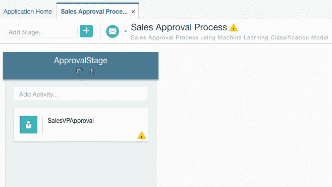

Sample Approval Stage with a SalesVPApproval Task

我们希望销售副总裁在对销售分类模型评分的结果是“*否”*的概率大于 80%的情况下批准订单。这很容易建模:在流程中选择 *SalesVPApproval* 活动，然后为任务添加一个*数据驱动的激活条件*。

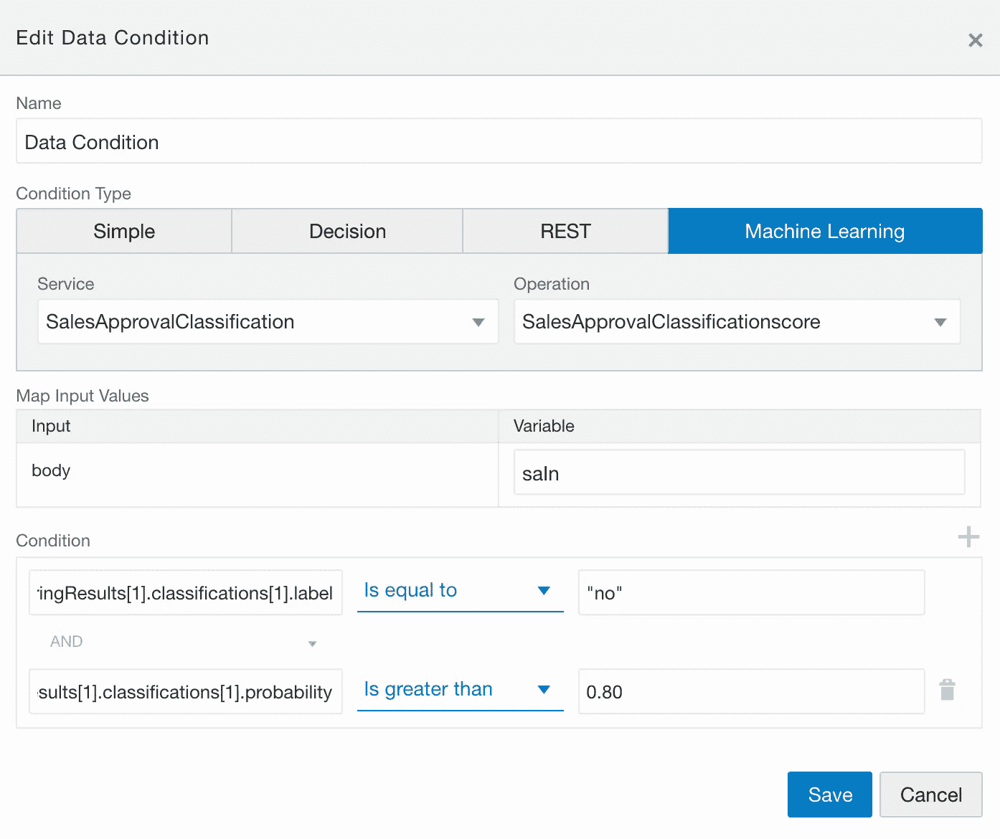

Configuring a Data-Driven Activation Condition for a Task using ML Services.

在您配置了您可能想要保存的数据条件之后，该任务就会像这样显示在您的流程图中

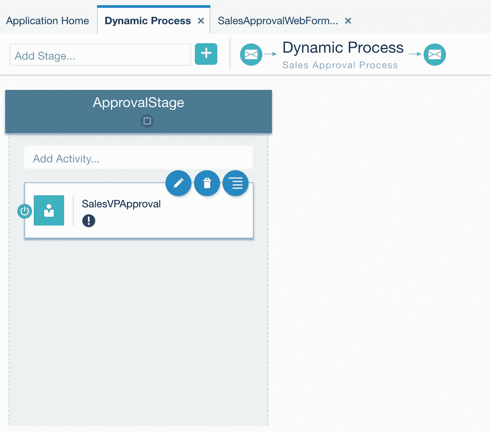

SalesVPApproval task with Data-Driven Activation Condition consuming an ML Service

对于上面的任务配置，在运行时有许多事情发生，所以这里需要一点解释

*   作为*销售审批* *流程的执行语义的一部分，*流程运行时将在阶段*批准阶段*被激活的时刻激活任务*销售审批*。
*   作为激活任务 *SalesVPApproval* 的一部分，会发生以下情况
*   *SalesVPApproval* 有一个*激活条件*，所以在执行任务之前，必须对激活条件进行评估。只有当激活条件评估为真时，任务才会被执行
*   作为评估任务 *SalesVPApproval* 的激活条件的一部分，机器学习服务*SalesApprovalClassification*将被调用，以利用建模的输入和输出进行评分
*   在机器学习服务返回结果之后，将评估建模的条件。在上面的例子中，如果 label == "no "并且概率>为 0.80 ，则条件类似于
*   *如果条件评估为真，将执行任务(在本例中为用户任务)，否则不执行。*

*在流程自动化中使用机器学习服务的另一种方式是在流程中使用机器学习活动，如下所示。我们将 ML 活动添加为流程中的一级活动。可以把它们看作是接受输入、执行 ML 服务并创建输出的服务任务*

*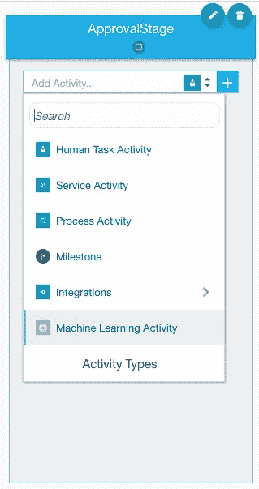*

*Using a Machine Learning Activity in the Process*

*选择 ML 活动后，点击“ **+** ”按钮，在流程模型中创建活动。*

*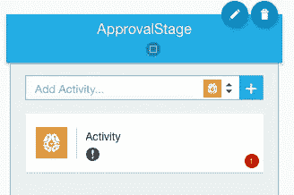*

*Machine Learning Activity in-process model.*

*然后，可以像流程中的任何其他活动一样编辑该活动。对于机器学习活动，这包括*

*   *选择用于此活动的机器学习服务。*
*   *要使用的机器学习操作的规范。对于定制的 ML 服务，唯一可用的操作是根据 ML 模型进行评分。对于认知图像和文本服务，多种操作是可用的。*

*要完成活动，必须配置输入和输出的数据关联。*

*对于所需的数据映射，我们仍在努力通过完全自动完成和可视化支持来改善用户体验。现在，这里是数据需要被映射的方式。当为流程应用程序创建 ML 服务时，会创建与配置的 ML 服务的输入和输出相对应的新业务类型。*

***输入数据映射***

*对于输入部分，必须创建一个类型为 ***OracleMLModels 的数据对象。< MLServiceName >。<MLServiceName>_ INPUT _ TYPE****

*并且该数据对象可以在过程中被赋值，并用作 ML 服务的输入。在上面的例子中，数据对象 ***saIn*** 就是这样的类型，并被分配给所选 ML 服务的(input) ***主体*** 。在一个机器学习任务的流程中，数据对象可以用于任务的输入数据关联。*

***输出数据映射***

*对于输出，要看输出用在什么地方。当在数据条件中使用输出时，会自动创建一个隐式(output) ***body*** 元素，该元素对应于所选 ML 服务的输出。body 元素属于复杂类型，在上面的示例中，它包含以下用于映射的元素*

```
*body.scoringResults[1].classifications[1].label 
body.scoringResults[1].classifications[1].probability*
```

*当输出用于机器学习任务时，必须创建类型为的数据对象*

****OracleMLModels。< MLServiceName >。<MLServiceName>_ OUTPUT _ TYPE****

*并且该数据对象然后可以在机器学习任务的输出数据关联中使用*

*输出的结构取决于机器学习模型的类型。对于分类模型，这包括标签的**标签**和**概率**。其他类型的机器学习模型创建不同的输出。这方面的详细描述将在以后的文章中讨论。*

*就这样，很简单，不是吗？这种能力大大增强了流程自动化，在本系列的后续文章中，我们将研究一些更复杂的例子以及 ML 服务在集成云中的其他用途。*

# *结论*

*我们已经从头到尾展示了机器学习模型在数字过程自动化中的应用。虽然本系列的前两部分给出了一个基本的概述，但我们将在接下来的两篇文章中关注更多的 ML 用例。前两篇文章的目标是介绍自主数据仓库，以及我们如何使用 OML 笔记本电脑来训练 ML 模型并将其存储在对象存储上，然后将这些模型引入集成云，使其成为服务，并将这些 ML 服务用于流程自动化。*

*感谢您一路阅读，敬请关注面向集成云的机器学习系列的更多文章。*