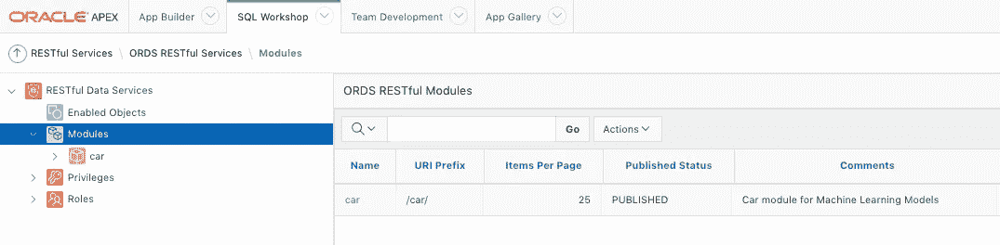

# 数字过程自动化中的机器学习——第三部分

> 原文：<https://medium.com/oracledevs/machine-learning-in-digital-process-automation-part-iii-a65df5ad055?source=collection_archive---------5----------------------->

自从本系列文章的第二部分出版以来，发生了很多事情。[自主数据仓库](https://cloud.oracle.com/en_US/datawarehouse) (ADW)已经取得进展，在流程方面，我们正在致力于真正的多租户、OCI 本地产品。作为其中的一部分，我们正在为数字过程自动化重新设计部分[机器学习](https://www.oracle.com/data-science/machine-learning/what-is-machine-learning/)功能，我们将在后面的文章中讨论这一点。然而在本文中，我们将展示如何使用 ADW 和 [Oracle REST 数据服务](https://docs.oracle.com/en/database/oracle/oracle-rest-data-services/19.4/aelig/developing-REST-applications.html#GUID-A1CD111F-724B-4E91-8202-FA899EE521F1)来消费业务流程中的机器学习模型或任何其他支持 RESTful 服务的组件。

Trees. (Image © Ralf Mueller)

# 用例

对于本文，我们考虑一个租车用例。我们选择这个用例有多种原因:

*   租车是很多人都知道的，几乎我们所有人在租车时都经历过一些伟大或悲惨的经历。
*   我们以 [EU Rent](https://core.ac.uk/download/pdf/81570875.pdf) 的形式对该案例进行了很好的正式描述，它最初是作为业务规则实现的一个挑战而开发的。
*   顺便提一下，有两个公共数据集可供我们用于机器学习
    ——一个[汽车评估](https://archive.ics.uci.edu/ml/datasets/Car+Evaluation)数据集用于预测汽车安全性。这可用于建立预测汽车安全性的分类模型。
    -一个[汽车每加仑行驶里程](https://archive.ics.uci.edu/ml/datasets/Auto+MPG) (MPG)数据集，用于预测汽车每加仑行驶里程。这个数据集可以用来建立回归模型。
*   我们可以在数字过程自动化或机器学习的未来文章中构建用例。

我们不打算详细讨论如何在 ADW 建造 ML 模型，而是参考本系列的第一部分。为这个用例构建 ML 模型的主要步骤是

*   将两个数据集(它们以 CSV 文件的形式出现)上传到 OCI 对象存储。
*   在 ADW 创建一个 ML 笔记本。
*   在 ADW 中创建两个表，反映相应数据集的结构
*   使用 [DBMS_CLOUD 将数据集从对象存储导入 ADW 的数据库表。COPY_DATA](https://docs.oracle.com/en/cloud/paas/autonomous-data-warehouse-cloud/user/dbmscloud-reference.html#GUID-9428EA51-5DDD-43C2-B1F5-CD348C156122) 程序。
*   建立汽车评估的 ML 分类模型和汽车每加仑行驶里程的回归模型。具体使用的算法在这里起着次要的作用，但是可以在 ADW 随意试验不同的 ML 算法。

# 在 ADW 将 ML 模型公开为 RESTful 服务

这篇文章有趣的部分是我们如何将在 ADW 创建的 ML 模型作为 RESTful 服务公开，这样我们就可以在业务流程或其他组件中使用它们，如 [Oracle Integration Cloud](https://cloud.oracle.com/OIC) 中的集成。

## ML 模型评分的包装 PL/SQL 过程

为了将在 ADW 创建的机器学习模型作为 RESTful 服务公开，我们首先必须创建一些包装器 PL/SQL 代码，这些代码接受所需的输入参数，用给定的输入对 ML 模型进行评分，并将结果作为 PL/SQL 过程的输出返回。下面的 PL/SQL 过程为汽车评估 ML 模型执行此操作。人们可以添加一个**%脚本**段落来在 ML 笔记本中创建这个过程。

score_car_evaluation PL/SQL procedure

在本例中，汽车评估的 ML 模型被命名为 CAR_EVALUATION_CLASSIFICATION，我们使用 SQL 函数 [PREDICTION](https://docs.oracle.com/en/database/oracle/oracle-database/20/dmapi/PREDICTION.html#GUID-9054DFB4-4067-45AC-A5C0-7292BCEB11F0) 和 [PREDICTION_PROBABILITY](https://docs.oracle.com/en/database/oracle/oracle-database/20/dmapi/PREDICTION_PROBABILITY.html#GUID-C72129BD-D80E-4646-8BB9-DC7646F5898E) 对 ML 分类模型进行评分，并将分类及其概率作为函数结果返回。

## REST 支持

下一步是在自治数据仓库中启用函数 **score_car_evaluation** 。为此，我们登录 ADW 并打开服务控制台。

Autonomous Data Warehouse Instance

从服务控制台中，选择*开发*，然后选择 Oracle APEX。

Autonomous Data Warehouse Service Console

登录 Oracle APEX workspace

Oracle Application Express Login screen

然后选择 *SQL Workshop* 并打开 *RESTful Services。* Oracle APEX 为整个应用程序的开发提供了丰富的功能。有关详细信息，请参见[Oracle Applications Express 19.2 版](https://docs.oracle.com/en/database/oracle/application-express/19.2/buildapplications.html)。在本文中，我们将重点关注 ORDS RESTful 服务部分。有关 ORDS 的详细信息，请参见[开发 Oracle REST 数据服务应用](https://docs.oracle.com/en/database/oracle/oracle-rest-data-services/19.4/aelig/developing-REST-applications.html#GUID-A1CD111F-724B-4E91-8202-FA899EE521F1)。

Oracle APEX

SQL Workshop RESTful Services in Oracle APEX

展开*模块*并为 ML 服务创建一个新模块。在下面的例子中，创建了一个带有 URI 前缀/car/的模块“car”。

ORDS RESTful Modules

ORDS Module Definition

在下一步中，我们将为汽车评估创建一个*模板定义*,并为其余操作创建一个处理程序

ORDS Template Definition

ORDS Handler Definition

请注意 POST 处理程序定义的**源**。这里我们使用我们之前创建的 PL/SQL 过程 **score_car_evaluation** 。输入参数被指定为绑定参数，PL/SQL 过程的输出必须映射到处理程序的参数部分。在这种情况下，我们需要映射两个输出参数

*   **预测:字符串**，针对 ML 模型 CAR_CLASSIFICATION_MODEL 评分的预测结果
*   **概率:双倍**，预测的概率

这就完成了机器学习模型 CAR_EVALUATION_CLASSIFICATION 的 RESTful 服务的创建。对于回归模型来说，这也是一个简单的练习。

## RESTful 服务安全性

在我们公开这个新创建的 REST 服务以供消费之前，我们可能希望为它增加一些安全性。Oracle ORDS 提供了丰富的安全特性，参见[配置对 RESTful 服务的安全访问](https://docs.oracle.com/en/database/oracle/oracle-rest-data-services/19.4/aelig/developing-REST-applications.html#GUID-95B4FE68-391F-4212-93CE-5C8F14FD0D1F)。

在我们的示例中，我们将添加基本的身份验证安全性。为此，从左侧打开*权限*菜单

RESTful Services Privileges

并为我们的模块创建一个新的特权，如下所示

ORDS Privileges Definition

确保指定正确的安全模式，在我们的示例中是 **/oml/*** 。对于角色，我们从角色列表中选择了 *SQL Developer* ，其他选项参见 [Oracle REST 数据服务用户角色](https://docs.oracle.com/en/database/oracle/oracle-rest-data-services/19.4/aelig/developing-REST-applications.html#GUID-EF5FCA28-5DE3-4A9D-8570-2893243DBEFB)。

# 附赠曲目

在上一节中，我们展示了如何使用 Oracle APEX 和 Oracle REST 数据服务来支持 ADW 机器学习模型。虽然 Oracle APEX 为应用程序的开发提供了非常好的用户界面和 IDE，但作为一名数据科学家，我们真的不想离开 ML 笔记本体验。所以问题是我们是否能达到同样的结果，即从 ML 笔记本本身，也就是我们最初创建 ML 模型的地方，将 ML 模型公开为 REST 服务。

嗯，答案是**是的**！

O RDS 提供了一组丰富的 PL/SQL API，以编程方式实现相同的结果。有关可用的 ORDS PL/SQL 包的详细信息，请参见 [Oracle REST 数据服务 PL/SQL 包参考](https://docs.oracle.com/en/database/oracle/oracle-rest-data-services/19.4/aelig/ORDS-reference.html#GUID-E4476C14-01B1-4EA4-94D3-73B92C8C9AB3)和 [Oracle REST 数据服务管理 PL/SQL 包参考](https://docs.oracle.com/en/database/oracle/oracle-rest-data-services/19.4/aelig/oracle-rest-data-services-administration-pl-sql-package-reference.html#GUID-7066858A-6CB8-48C8-9557-27CAD67FB3D0)。

因此，我们在上一节中所做的所有工作实际上都可以通过下面的 PL/SQL 代码来实现

Enable ML model as REST Service using ORDS PL/SQL packages

然后可以作为脚本方便地添加到您在 ADW 的 ML 笔记本中

Script paragraph in ML notebook

## Swagger 文档生成

如今有多种开发工具支持 [Swagger](https://swagger.io/) 标准。为此，可以从 *ORDS 模块定义*页面创建相应的 Swagger 文档(见上文)。只需点击“生成 Swagger Doc ”,就会创建一个 Swagger JSON，它可以保存到一个文件中，并在您选择的开发工具中使用。下面的 Swagger 文档代表了我们在本文中创建的 ORDS REST 服务

Swagger Document for car Module

# **租车数字化流程自动化**

既然我们已经将 ML 模型公开为 REST 服务，那么就很容易将它们用于数字流程自动化。下面的动态流程图显示了一个非常简化的租车用例

Rental Car Process

活动*汽车验收分类*和*每加仑汽车里程预测*使用 REST 连接器调用 ADW 相应 ML 车型的 ORDS REST 服务。关于如何为流程中的消费创建 REST 连接的更多信息，请参见[创建 REST 和 Web 服务连接器](https://docs.oracle.com/en/cloud/paas/process-cloud/user/creating-rest-and-web-service-connectors.html#GUID-4C9A115B-412D-40A6-A74F-ED55B3C89FAF)。

# 结论

我们展示了如何使用 Oracle REST 数据服务在 ADW 的 ML 笔记本电脑中构建 REST 支持机器学习模型。我们进一步展示了如何使用 ORDS PL/SQL 包以编程方式实现 REST 支持。这对于数据科学家来说尤其方便，因为她/他不需要离开 ML 笔记本环境，只需在笔记本中添加一个段落来处理 REST 启用。

我们要感谢克里斯·赖斯🏒🍺🚴🏻关于使用 ORDS PL/SQL 包以编程方式创建 RESTful 服务的宝贵意见。