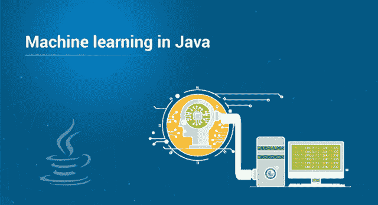

# Java 中的机器学习是什么，如何实现？

> 原文：<https://medium.com/edureka/machine-learning-in-java-db872998f368?source=collection_archive---------0----------------------->

Machine Learning in Java — Edureka

当我们谈到机器学习或人工智能时，我们会自然而然地想到 Python 或 R 是用于后续实现的编程语言。然而，大多数人不知道的是，它也可以用于同样的目的。在本文中，我们将揭示 Java 中的机器学习和实现它的各种库。本教程涵盖了以下主题:

*   什么是机器学习？
*   Java 在机器学习中是如何使用的？
*   用 Java 实现机器学习的库

让我们开始吧。:-)

# 什么是机器学习？

机器学习正以指数速度蓬勃发展。从谷歌地图、自动驾驶汽车、谷歌翻译等众多应用到欺诈检测，它无处不在。但是你知道机器学习到底是什么或者是怎么实现的吗？

我来简化一下这个概念。机器学习是一种从例子和经验中学习的强大技术。它是一种人工智能，允许软件应用程序从数据中学习，并在预测结果时变得更加准确，而无需人工干预或显式编程。因此，你不必编写完整的代码，只需输入数据，算法就会根据你的数据构建逻辑。由于其高需求，一名 ML 工程师的期望工资为 **₹719,646** (IND)或 **$111，490** (US)。

来到第二个问题，**是如何实现的？**

机器学习算法是常规算法的一种进化。它让你的程序“*”更聪明，通过允许它们自动从提供的数据中学习。该算法主要分为两个阶段:**训练**和**测试**。*

*说到算法，它分为三种类型:*

*   ***监督学习**:这是一个训练过程，你可以考虑在老师的指导下学习。这是一个算法从训练数据集学习的过程。它生成输入变量和输出变量之间的映射函数。一旦模型被训练，当新数据被提供给它时，它可以开始做出预测/决策。属于监督学习的算法很少——线性回归、逻辑回归、决策树等。*
*   ***无监督学习:**这是一个使用一条没有标记的信息来训练模型的过程。此过程可用于根据输入数据的统计属性对其进行分类。它通常被称为聚类分析，这意味着根据数据中的信息对对象进行分组，描述对象或它们之间的关系。这里，目标是一个组中的对象应该彼此相似，但不同于另一个组中的对象。属于无监督学习的算法很少，包括 K-means 聚类、层次聚类等。*
*   ***强化学习:**强化学习遵循试凑的概念。它是通过与空间或环境的互动来学习。RL 代理从其行为的结果中学习，而不是从被明确教导中学习。它是一个代理与环境互动并找出最佳结果的能力。*

*接下来，让我们继续了解机器学习在 Java 中是如何使用的。*

# *Java 在机器学习中是如何使用的？*

*在编程领域，Java 是最古老、最可靠的编程语言之一。由于它的高度普及性、需求性和易用性，全球有超过 900 万开发人员在使用 Java。说到机器学习，你可能会想到其他编程语言，如 Python、R 等，但让我告诉你，java 也不远了。java 在这个领域并不是领先的编程语言，但是在第三方开源库的帮助下，任何 Java 开发人员都可以实现机器学习并进入数据科学领域。*

*让我列出一些使用 Java 编程语言的更多优点-*

*   *Java 是可移植的和通用的*
*   *Java 开发工具*
*   *Java 是一种面向对象的编程语言*
*   *需求:Java 无处不在*
*   *Java 应用程序*
*   *大量资源和社区支持*
*   *Java EE 及其丰富的 API*

*接下来，让我们看看 Java 中用于机器学习的最流行的库。*

# *用 Java 实现机器学习的库*

*为了实现机器学习，Java 中有各种开源的第三方库。最常见的列举如下:*

*1. **ADAMS:** 代表高级数据挖掘和机器学习系统。它是一个灵活的工作流引擎，旨在快速构建和维护数据驱动，执行数据的检索、处理、挖掘和可视化。ADAMS 使用树状结构，遵循“少即是多”的哲学。它提供了一些功能，例如:*

*   *机器学习/数据挖掘*
*   *数据处理*
*   *流动*
*   *数据库*
*   *可视化，*
*   *脚本*
*   *文件等*

*2.JavaML: 它是一个机器学习算法的集合，其中每种算法都有一个公共接口。它有很好的文档，界面清晰。你也可以收集大量针对软件工程师或程序员的代码和教程。它的一些特点是:*

*   *数据操作*
*   *使聚集*
*   *分类*
*   *数据库*
*   *特征选择*
*   *文件等*

*3. **Mahaut:** Apache Mahaut 是一个分布式框架，为 Apache Hadoop 平台提供机器算法的实现。它由易于使用的各种组件组成，面向数学家、统计学家、数据分析师、数据科学家或分析专业人士。它主要集中在:*

*   *使聚集*
*   *分类*
*   *推荐系统*
*   *可扩展的高性能机器学习应用*

*4.**deep learning 4j**:deep learning 4j，顾名思义就是我们用 Java 编写的，兼容 Java 虚拟机语言，比如 Kotlin，Scala 等。它是一个开源的分布式深度学习库，具有 Apache Spark 和 Hadoop 等最新分布式计算框架的优势。它的一些特点是:*

*   *商业级和开源*
*   *将人工智能带入商业环境*
*   *详细的 API 文档*
*   *多语言的示例项目*
*   *与 Hadoop 和 Apache Spark 集成*

*5.WEKA: Weka 是一个免费、简单、开源的 Java 机器学习库。它的名字灵感来自于新西兰岛上发现的一种不会飞的鸟。Weka 是 ML 算法的集合，它也支持深度学习。它主要侧重于:*

*   *数据挖掘技术*
*   *数据准备工具*
*   *分类*
*   *回归*
*   *使聚集*
*   *可视化等*

*这就把我们带到了本文的结尾，在这里我们讨论了 Java 中的机器学习以及如何实现它。希望你清楚本教程中与你分享的所有内容。*

*如果你想查看更多关于人工智能、DevOps、道德黑客等市场最热门技术的文章，那么你可以参考 [Edureka 的官方网站。](https://www.edureka.co/blog/?utm_source=medium&utm_medium=content-link&utm_campaign=machine-learning-in-java)*

*请留意本系列中的其他文章，它们将解释 Java 的各个方面。*

> *1.[面向对象编程](/edureka/object-oriented-programming-b29cfd50eca0)*
> 
> *2.[Java 中的继承](/edureka/inheritance-in-java-f638d3ed559e)*
> 
> *3.[Java 中的多态性](/edureka/polymorphism-in-java-9559e3641b9b)*
> 
> *4.[Java 中的抽象](/edureka/java-abstraction-d2d790c09037)*
> 
> *5. [Java 字符串](/edureka/java-string-68e5d0ca331f)*
> 
> *6. [Java 数组](/edureka/java-array-tutorial-50299ef85e5)*
> 
> *7. [Java 集合](/edureka/java-collections-6d50b013aef8)*
> 
> *8. [Java 线程](/edureka/java-thread-bfb08e4eb691)*
> 
> *9.[Java servlet 简介](/edureka/java-servlets-62f583d69c7e)*
> 
> *10. [Servlet 和 JSP 教程](/edureka/servlet-and-jsp-tutorial-ef2e2ab9ee2a)*
> 
> *11.[Java 中的异常处理](/edureka/java-exception-handling-7bd07435508c)*
> 
> *12.[高级 Java 教程](/edureka/advanced-java-tutorial-f6ebac5175ec)*
> 
> *13. [Java 面试问题](/edureka/java-interview-questions-1d59b9c53973)*
> 
> *14. [Java 程序](/edureka/java-programs-1e3220df2e76)*
> 
> *15. [Kotlin vs Java](/edureka/kotlin-vs-java-4f8653f38c04)*
> 
> *16.[依赖注入使用 Spring Boot](/edureka/what-is-dependency-injection-5006b53af782)*
> 
> *17.[Java 中的可比](/edureka/comparable-in-java-e9cfa7be7ff7)*
> 
> *18.[十大 Java 框架](/edureka/java-frameworks-5d52f3211f39)*
> 
> *19. [Java 反射 API](/edureka/java-reflection-api-d38f3f5513fc)*
> 
> *20.[Java 中的 30 大模式](/edureka/pattern-programs-in-java-f33186c711c8)*
> 
> *21.[核心 Java 备忘单](/edureka/java-cheat-sheet-3ad4d174012c)*
> 
> *22.[Java 中的套接字编程](/edureka/socket-programming-in-java-f09b82facd0)*
> 
> *23. [Java OOP 备忘单](/edureka/java-oop-cheat-sheet-9c6ebb5e1175)*
> 
> *24.[Java 中的注释](/edureka/annotations-in-java-9847d531d2bb)*
> 
> *25.[Java 中的图书管理系统项目](/edureka/library-management-system-project-in-java-b003acba7f17)*
> 
> *26.[Java 中的树](/edureka/java-binary-tree-caede8dfada5)*
> 
> *27. [Java 教程](/edureka/java-tutorial-bbdd28a2acd7)*
> 
> *28.[Java 中的顶级数据结构&算法](/edureka/data-structures-algorithms-in-java-d27e915db1c5)*
> 
> *29. [Java 开发者技能](/edureka/java-developer-skills-83983e3d3b92)*
> 
> *30.[前 55 个 Servlet 面试问题](/edureka/servlet-interview-questions-266b8fbb4b2d)*
> 
> *31.  [顶级 Java 项目](/edureka/java-projects-db51097281e3)*
> 
> *32. [Java 字符串备忘单](/edureka/java-string-cheat-sheet-9a91a6b46540)*
> 
> *33.[Java 中的嵌套类](/edureka/nested-classes-java-f1987805e7e3)*
> 
> *34. [Java 集合面试问答](/edureka/java-collections-interview-questions-162c5d7ef078)*
> 
> *35.[Java 中如何处理死锁？](/edureka/deadlock-in-java-5d1e4f0338d5)*
> 
> *36.[你需要知道的 50 大 Java 集合面试问题](/edureka/java-collections-interview-questions-6d20f552773e)*
> 
> *37.[Java 中的字符串池是什么概念？](/edureka/java-string-pool-5b5b3b327bdf)*
> 
> *38.[C、C++和 Java 有什么区别？](/edureka/difference-between-c-cpp-and-java-625c4e91fb95)*
> 
> *39.[Java 中的回文——如何检查一个数字或字符串？](/edureka/palindrome-in-java-5d116eb8755a)*
> 
> *40.[你需要知道的顶级 MVC 面试问答](/edureka/mvc-interview-questions-cd568f6d7c2e)*
> 
> *41.[Java 编程语言的十大应用](/edureka/applications-of-java-11e64f9588b0)*
> 
> *42.[Java 中的死锁](/edureka/deadlock-in-java-5d1e4f0338d5)*
> 
> *43.[Java 中的平方和平方根](/edureka/java-sqrt-method-59354a700571)*
> 
> *44.[Java 中的类型转换](/edureka/type-casting-in-java-ac4cd7e0bbe1)*
> 
> *45.[Java 中的运算符及其类型](/edureka/operators-in-java-fd05a7445c0a)*
> 
> *46.[Java 中的析构函数](/edureka/destructor-in-java-21cc46ed48fc)*
> 
> *47.[Java 中的二分搜索法](/edureka/binary-search-in-java-cf40e927a8d3)*
> 
> *48.[Java 中的 MVC 架构](/edureka/mvc-architecture-in-java-a85952ae2684)*
> 
> *49. [Hibernate 面试问答](/edureka/hibernate-interview-questions-78b45ec5cce8)*

> *最初发表于 2019 年 8 月 2 日*https://www.edureka.co。**