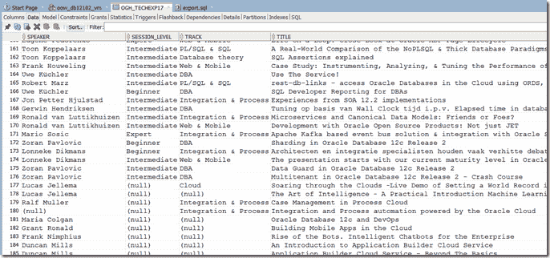
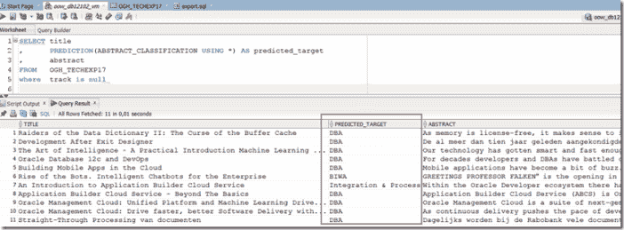
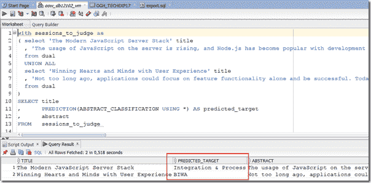
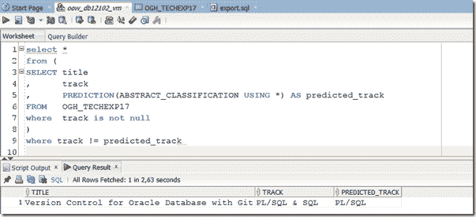

# Oracle 数据库中的机器学习——基于文本分析的会议摘要分类

> 原文：<https://medium.com/oracledevs/machine-learning-in-oracle-database-classification-of-conference-abstracts-based-on-text-analysis-72ae52af7569?source=collection_archive---------0----------------------->

机器学习很热。让一个自动化系统预测、分类、推荐甚至基于从过去经验中获得的模型做出决定的能力是非常吸引人的。随着机器学习的明显应用数量的增加——网飞和亚马逊的推荐、智能聊天机器人、停车场的车牌识别、电子邮件服务器的垃圾邮件过滤器——人们的兴趣进一步增长。谁不想应用机器学习？

这篇文章展示了 Oracle 数据库(平台)—带有高级分析选项—完全能够进行“机器学习”。并且已经能够做这样的学习很多年了。在 SQL & PL/SQL 专区中，数据库开发人员可以扮演数据科学家。挑战如下:

> *对于 nlOUG Tech Experience 2017 大会，我们的表格中有一组大约 90 个摘要(标题和描述)。这些摘要中有 80 篇被归类到会议专题中，如 DBA、开发、BI &仓储、Web &移动、集成&流程。对于大约 10 个摘要，这种分类还没有完成-他们目前没有指定的轨道。我们希望使用机器学习来确定这些未分配摘要的轨迹。*

我们将采取以下步骤来应对这一挑战:

*   创建一个包含会议摘要的数据库表——至少包含标题、摘要和跟踪三列
*   创建 Oracle 文本策略对象
*   指定模型配置设置
*   使用`DBMS_DATA_MINING.CREATE_MODEL`的模型设置和文本转换指令创建模型。
*   测试模型/尝试模型——在我们的案例中，针对当前未分配的会议摘要

这样做所需的代码量非常小(不到 30 行 PL/SQL)。经历这一过程所需的时间也非常有限。让我们看看这是如何工作的。注意:代码在一个 GitHub 库中:[https://github.com/lucasjellema/theArtOfMachineLearning](https://github.com/lucasjellema/theArtOfMachineLearning)。

注意:来自关于文本挖掘的 Oracle 数据库文档:

> *文本挖掘是将数据挖掘技术应用于文本术语的过程，也称为文本特征或标记。文本术语是从文本文档中提取并分配了数字权重的单词或词组。文本术语是可以操作和分析的文本的基本单位。*
> 
> *Oracle Text 是一种数据库技术，提供术语提取、单词和主题搜索以及其他用于查询文本的实用程序。当定型数据中存在文本列时，Oracle 数据挖掘使用 Oracle Text 实用程序和术语加权策略来转换文本以进行挖掘。Oracle 数据挖掘将您提供的配置信息传递给 Oracle Text，并在模型创建过程中使用结果。*

# 用会议摘要创建一个数据库表

我收到了 Excel 电子表格中的数据。我使用 SQL Developer 导入该文件并从中创建一个表。然后，我用 DDL 和 DML 语句将该表导出到一个 SQL 文件中。



# 创建 Oracle 文本策略对象

Oracle 文本策略指定了必须如何解释文本内容。您可以提供一个文本策略来管理一个模型、一个属性或者模型和单个属性。

```
DECLARE 
  l_policy VARCHAR2(30):='conf_abstrct_mine_policy';
  l_preference VARCHAR2(30):='conference_abstract_lexer'; 
BEGIN 
  ctx_ddl.create_preference(l_preference, 'BASIC_LEXER');  
  ctx_ddl.create_policy(l_policy, lexer => l_preference); 
END;
```

注意:您用于此目的的数据库用户需要 DBA 的两个系统权限: *grant execute on ctx_ddl* 和 *grant create mining model*

# 指定文本挖掘模型配置设置

当使用 PL/SQL 命令创建数据挖掘模型时，我们需要指定一个表的名称，该表包含键-值对(列 setting_name 和 setting value)以及应该应用的设置。

创建此设置表。

```
CREATE TABLE text_mining_settings 
( setting_name VARCHAR2(30)
, setting_value VARCHAR2(4000) 
);
```

选择用于分类的算法-在本例中为朴素贝叶斯。通过 INSERT 语句指示要使用的 Oracle Text 策略，在本例中为 conf_abstrct_mine_policy。

```
DECLARE 
  l_policy VARCHAR2(30):='conf_abstrct_mine_policy'; 
BEGIN 
-- Populate settings table 
  INSERT INTO text_mining_settings 
  VALUES ( dbms_data_mining.algo_name
         , dbms_data_mining.algo_naive_bayes ); 
  INSERT INTO text_mining_settings 
  VALUES ( dbms_data_mining.prep_auto
         , dbms_data_mining.prep_auto_on ); 
  INSERT INTO text_mining_settings 
  VALUES ( dbms_data_mining.odms_text_policy_name
         , l_policy ); 
  COMMIT; 
END;
```

# 将模型设置和文本转换指令传递给`DBMS_DATA_MINING.CREATE_MODEL`

我不喜欢创建模型所需的复杂、不直观的语法。我不喜欢关于这一点的 Oracle 官方文档。它不像应该的那样自然流动，各个部分没有很好地结合在一起。这感觉有点像 SQL Model 子句——对我来说从来都不太对劲。

嗯，事情就是这样。要指定哪些列必须被视为文本(配置文本属性),或者为各个属性提供文本转换指令，我们需要使用 dbms_data_mining_transform。TRANSFORM_LIST 对象保存有助于标识每条记录的所有列和/或 SQL 表达式。属性规范是转换记录(transform_rec)中的一个字段(attribute_spec)。转换记录是转换列表(xform_list)的组成部分，可以传递给 CREATE_MODEL。您可以在数据字典视图 ALL_MINING_MODEL_ATTRIBUTES 中查看属性规范。

下面是我们如何指定文本属性 abstract:

> dbms _ 数据 _ 挖掘 _ 转换。SET_TRANSFORM
> ( xformlist，' abstract '，NULL，' abstract '，NULL，' TEXT(TOKEN _ TYPE:NORMAL)')；

其中 xformlist 是 dbms_data_mining_transform 类型的本地 PL/SQL 变量。转换 _ 列表。

在对 create_model 的调用中，我们指定了新模型的名称、要针对其构建模型的表(视图)、模型应预测其值的目标列名、包含模型设置的键值对的数据库表的名称以及文本属性列表:

```
DECLARE 
  xformlist dbms_data_mining_transform.TRANSFORM_LIST; 
BEGIN -- add abstract as column to parse and use for text mining 
  dbms_data_mining_transform.SET_TRANSFORM( xformlist, 'abstract',
                NULL, 'abstract', NULL, 'TEXT(TOKEN_TYPE:NORMAL)');  
  dbms_data_mining_transform.SET_TRANSFORM( xformlist, 'title',
                   NULL, 'title', NULL, 'TEXT(TOKEN_TYPE:NORMAL)'); 
  DBMS_DATA_MINING.CREATE_MODEL
  ( model_name => 'ABSTRACT_CLASSIFICATION' 
  , mining_function => dbms_data_mining.classification 
  , data_table_name => 'OGH_TECHEXP17' 
  , case_id_column_name => 'title' 
  , target_column_name => 'track'
  , settings_table_name => 'text_mining_settings' 
  , xform_list => xformlist
  ); 
END;
```

Oracle Data Miner 需要有一个属性来标识每条记录；用于此目的的列的名称作为案例 id 传递。

# 测试模型/尝试模型——在我们的案例中，针对当前未分配的会议摘要

既然已经创建了模型，我们可以利用它来预测所选记录的目标列的值。

首先，让模型对摘要进行无轨迹分类:

```
SELECT title 
,      PREDICTION(ABSTRACT_CLASSIFICATION USING *) AS predicted_target 
,      abstract 
FROM OGH_TECHEXP17 
where track is null
```



我们还可以使用该模型对数据进行动态分类，就像这样(使用来自不同会议的两份摘要，它们根本没有存储在数据库中):

```
with sessions_to_judge as 
( select 'The Modern JavaScript Server Stack' title , 'The usage of JavaScript on the server is rising, and Node.js has become popular with development shops, from startups to big corporations. With its asynchronous nature, JavaScript provides the ability to scale dramatically as well as the ability to drive server-side applications. There are a number of tools that help with all aspects of browser development: testing, packaging, and deployment. In this session learn about these tools and discover how you can incorporate them into your environment.' abstract 
from dual 
UNION ALL 
select 'Winning Hearts and Minds with User Experience' title , 'Not too long ago, applications could focus on feature functionality alone and be successful. Today, they must also be beautiful, responsive, and intuitive. In other words, applications must be designed for user experience (UX) because when they are, users are far more productive, more forgiving, and generally happier. Who doesnt want that? In this session learn about the psychology behind what makes a great UX, discuss the key principles of good design, and learn how to apply them to your own projects. Examples are from Oracle Application Express, but these principles are valid for any technology or platform. Together, we can make user experience a priority, and by doing so, win the hearts and minds of our users. We will use Oracle JET as well as ADF and some mobile devices and Java' abstract 
from dual 
) 
SELECT title 
, PREDICTION(ABSTRACT_CLASSIFICATION USING *) AS predicted_target
, abstract 
FROM sessions_to_judge
```



两个抽象都被分配了模型边界内的轨迹。如果这些摘要提交给 2017 年科技体验大会，它们会被这样分类。看看对用户体验的第二个摘要做什么样的改变会很有意思，以便把它分配到更合适的网络和移动领域。

最后一个测试:找出所有模型预测的音轨与实际分配的音轨不同的摘要:

```
select * 
from ( SELECT title 
       ,      track 
       , PREDICTION(ABSTRACT_CLASSIFICATION USING *) AS predicted_track 
       FROM OGH_TECHEXP17 
       where track is not null ) 
where track != predicted_track
```



看起来有第二次看这个轨道分配不是不合理的。

# 资源

GitHub 中的源代码:[https://github.com/lucasjellema/theArtOfMachineLearning](https://github.com/lucasjellema/theArtOfMachineLearning)

Oracle 高级分析数据库选项:[https://www . Oracle . com/Database/Advanced-Analytics/index . html](https://www.oracle.com/database/advanced-analytics/index.html)

我对这篇文章的最大启发是:Alex Gorbachev 的《Oracle 数据库专业人员机器学习入门》——[https://www . slide share . net/alexgorbachev/Introduction-to-Machine-Learning-for-Oracle 数据库专业人员](https://www.slideshare.net/alexgorbachev/introduction-to-machine-learning-for-oracle-database-professionals)

关于文本挖掘的 Oracle 文档:[https://docs . Oracle . com/database/122/DMP rg/creating-model-that-includes-Text-Mining . htm # DMP rg 604](https://docs.oracle.com/database/122/DMPRG/creating-model-that-includes-text-mining.htm#DMPRG604)

Toad World 关于使用 SQL 和 PL/SQL 的显式语义分析设置的文章:[https://www . toad World . com/platforms/Oracle/b/weblog/archive/2017/01/16/Explicit-Semantic-Analysis-setup-using-SQL-and-PL-SQL](https://www.toadworld.com/platforms/oracle/b/weblog/archive/2017/01/16/explicit-semantic-analysis-setup-using-sql-and-pl-sql)

使用 Oracle Data Miner 进行情绪分析—OTN Brendan tier ney 的文章—[http://www . Oracle . com/tech network/articles/bi/ODM-perspective-Analysis-tier ney-2416652 . html](http://www.oracle.com/technetwork/articles/bi/odm-sentiment-analysis-tierney-2416652.html)

我自己关于从 PL/SQL 中进行 Oracle 数据库数据挖掘的博客—来自很久很久以前:[从 SQL 和 PL/SQL 中进行 Oracle 数据挖掘](https://technology.amis.nl/2006/06/29/oracle-data-mining-from-sql-and-plsql/)和[10g 中隐藏的 PL/SQL Gem:DBMS _ frequency _ items et for PL/SQL 基于数据挖掘](https://technology.amis.nl/2004/10/16/hidden-plsql-gem-in-10g-dbms_frequent_itemset-for-plsql-based-data-mining/) [分类](https://technology.amis.nl/tag/classification/) [数据挖掘](https://technology.amis.nl/tag/data-mining/) [机器学习](https://technology.amis.nl/tag/machine-learning/)[plsql](https://technology.amis.nl/tag/plsql/)[SQL](https://technology.amis.nl/tag/sql/)[文本挖掘](https://technology.amis.nl/tag/text-mining/)

*原载于 2017 年 7 月 18 日*[*technology . amis . nl*](https://technology.amis.nl/2017/07/18/machine-learning-in-oracle-database-classification-of-conference-abstracts-based-on-text-analysis/)*。*