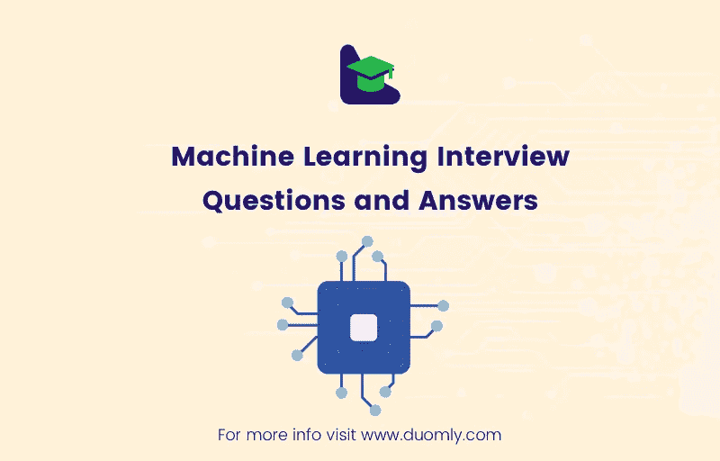

# 机器学习面试问答

> 原文：<https://medium.com/duomly-blockchain-online-courses/machine-learning-interview-questions-and-answers-bfa65341208?source=collection_archive---------2----------------------->

[Duomly — programming online courses](https://www.duomly.com)

本文原载:
[https://www . blog . duomly . com/how-to-pass-machine-learning-interview/](https://www.blog.duomly.com/how-to-pass-machine-learning-interview/)

机器学习是一个新兴的领域。它提供了许多有趣的高薪工作和机会。要开始从事机器学习，您应该熟悉:

数学基础——线性代数、微积分、最优化、概率和统计等。,

*   机器学习基础——准备数据、验证和改进结果、解释结果、识别和避免过度拟合等。,
*   常用的 ML 算法和方法——线性回归，决策树，支持向量机， *k* 最近邻，神经网络，*k*——均值聚类，主成分分析等等
*   编程——最好掌握一些 Python 和/或 R 知识，并且能够使用这些库进行机器学习(如 NumPy、Pandas、scikit-learn、Matplotlib、Tensorflow 等)等。

以上每一项以及其他一些内容都可能会在 ML 访谈中涉及到。有大量可能的问题和主题。

本文提出了 12 个主要适用于初学者和中级用户的一般性问题(以及简短的回答)。这些问题与任何特定的机器学习算法或方法无关。它们是关于一些基本的机器学习主题。

*1。机器学习算法有哪些类型？*

有三种主要类型的 ML 算法:

*   **监督学习** —对给定输入数据(特征)和输出数据之间的数学依赖关系(映射)进行建模。主要解决回归和分类问题。回归问题有连续的和数字的输出，而分类处理离散的，通常是分类的输出。
*   **无监督学习** —在没有提供任何输出的情况下，在输入数据中寻找结构、规则和模式。无监督学习方法有几类，如聚类分析、关联规则学习、异常检测等。
*   **强化学习** —采取行动以获得最大回报，并在过去经验的基础上不断学习和提高。

还有就是**半监督学习**。它介于监督学习和非监督学习之间。

*2。什么是数据标准化和规范化？*

在 ML 中标准化数据集能够比较不同单元的特征，并且是许多 ML 方法(如支持向量机、神经网络、*k*-均值聚类、线性判别分析等等)的要求。

**标准化**通常意味着重新调整要素的比例，使其均值为零，标准差为一。

在某些情况下，可以使用**最小-最大归一化**来代替。它会重新调整要素的比例，以便最小值映射到零，最大值映射到一，而所有其他值在零和一之间线性分布。

*3。什么是 R2？*

*R* 2 或**决定系数**是一个数字值，代表可以由输入解释的输出变化。它用作拟合优度的度量，即回归问题中实际输出和预测输出的接近程度。值越大越好，R*2 = 1 表示最合适。*

*4。解释第一类和第二类错误*

一个**类型 I 错误** ( **假阳性错误**)代表对真零假设的不正确拒绝。第二类错误 ( **假阴性错误**)是对假零假设的不正确接受。(阳性结果与拒绝无效假设有关。)

*5。解释条件概率*

**条件概率**是在其他事件已经发生的情况下，某个事件将会发生的概率。假设事件 *F* 已经发生，事件 *E* 发生的概率为:*P*(*E*|*F*)=*P*(*EF*)/*P*(*F*)，其中 *P* ( *EF* )

*6。什么是训练、验证和测试数据集？*

**训练集**是数据集的一部分，用于训练模型，即拟合其参数。**验证集**是超参数调整期间使用的数据集的另一部分。最后，**测试集**是数据集的第三部分，用于评估所选模型的性能。数据集的这三个部分通常是独立的，随机选择的。

*7。什么是过度拟合？*

**过度拟合**发生在模型很好地学习现有数据时。在这种情况下，它不仅学习数据之间现有的相关性，还学习随机波动(噪声)。

过度拟合的模型通常在训练数据上表现良好，但在应用于看不见的(测试)数据时表现不佳。

复杂或灵活的模型更容易过度拟合。

*8。什么是降维？*

**降维**是一套减少机器学习模型特征(输入变量)数量的技术。有两种主要的降维方法:

*   特征选择—选择最重要特征的子集，
*   特征提取-用一组新的、更小的派生特征替换所有特征，以最大限度地减少冗余。

*9。内核绝招是什么？*

**内核技巧**与将数据映射到一个更高维度的空间相关，以使其明显可分。它避免了计算该空间中数据点的新坐标。核技巧对于支持向量机和主成分分析很重要。

10。解释梯度下降法

**梯度下降**是一种快速、迭代、近似、基于梯度的优化方法，旨在找到函数的局部最小值。它从起始点向最陡下降的方向迭代移动。使用函数的负梯度计算方向和步长。

如果函数是凸的，梯度下降搜索全局最小值。

*11。什么是集群？*

**聚类**或**聚类分析**是根据特征之间的相似性将数据点(观察值)分组为两个或多个组(簇)的过程。相似的点应该在同一组。

一些聚类方法有*k*-均值聚类、均值偏移聚类、凝聚聚类、谱聚类、相似传播、DBSCAN 等。

*12。解释偏差-方差权衡*

**偏差**是模型预测的输出和实际输出之间的差值。**方差**是不同训练集的模型预测可变性的度量。简单模型可能不足，并且具有高偏差和低方差。相反，复杂的模型(有许多参数)有时会遭受低偏差和高方差的过度拟合。我们想要的是偏差和方差的最低可能值。为了实现这一点，我们必须找到一个适当复杂的模型。

当然，工作面试不仅仅是问和回答与领域相关的问题。你还应该遵循一些准备工作面试的一般性建议，比如:

*   对公司做一个很好的调查，
*   准备好解释你在这个领域的经验，你的兴趣，以及你想要这份工作的原因，
*   能够强调你的优势并解释为什么你是这份工作的好候选人，
*   穿着得体，举止得体，
*   问一些关于兴趣和公司的角色等聪明的问题。

希望这篇文章能帮到你，为你的机器学习面试做准备。请记住，这些问题有许多变体，以及更多可能的面试主题。

[Duomly — programming online courses](https://www.duomly.com)

感谢您的阅读！

这篇文章是我们的队友米尔科准备的。