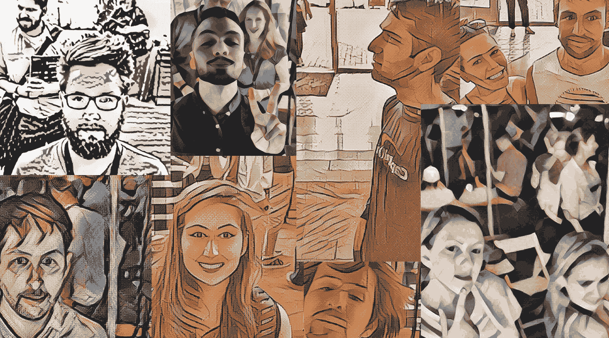
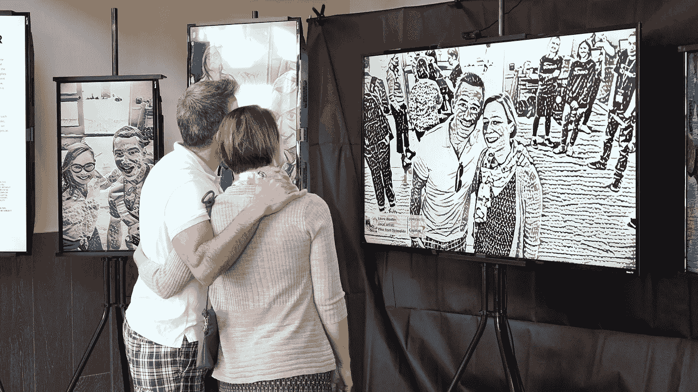

# 机器学习遇到艺术来反映更广泛的社区

> 原文：<https://medium.com/capital-one-tech/machine-learning-meets-local-art-to-reflect-a-broader-community-2a1b70a70b11?source=collection_archive---------1----------------------->

*设计经理 Ripon DeLeon&高级软件工程师 Jason Wittenbach，Capital One*

上个月，我们有机会在 2018 年[汤姆·汤姆创始人节](https://tomtomfest.com/)上沉浸在夏洛茨维尔，弗吉尼亚州领先的公民组织者、企业家、技术创新者和未来主义者之中。作为该节日的应用机器学习峰会的联合主办方，我们在 Capital One 的团队希望做的不仅仅是谈论机器学习——我们试图创造一种互动的体验，以一种引人入胜的参与式方式展示该技术的真实例子，同时还突出了该地区一些令人惊叹的当地艺术家。

汤姆·汤姆的一个中心主题是“学会以新的方式看待你的世界。”我们从这种风气中获得灵感，创建了一个弹出式美术馆，进一步探索从一个新的角度看待世界的想法，由一种叫做风格转移的机器学习技术提供动力。

进入我们的风格转移画廊，在那里，节日参与者被邀请拍照，然后照片被叠加到每个特色艺术家的风格和技巧中——[劳拉·伍登](https://www.instagram.com/laurawootenstudio/)、[西奥多·泰勒](https://www.instagram.com/tedikuma/?hl=en)、[香农·赖特](https://www.instagram.com/shannondrewthis/?hl=en)和[布兰登·罗伯森](https://www.instagram.com/kingkazma/)——并在一系列数字屏幕中放映。这创造了参与者的实时、视觉挂毯，同时也保存了以前节日游客的历史，并为社区提供了独特的视角。

> 在引擎盖下，我们使用了一种叫做“神经风格转移”的机器学习技术这个模型从我们所知道的人类大脑如何处理视觉信息中获得灵感，以便教会算法如何以特定艺术作品的风格创建图像。

在引擎盖下，我们使用了一种叫做“神经风格转移”的机器学习技术这个模型从我们所知道的人类大脑如何处理视觉信息中获得灵感，以便教会算法如何以特定艺术作品的风格创建图像。训练一幅画的风格需要几个小时，但一旦完成，该模型可以在几分之一秒内将新图像转换为该风格。这使我们能够实时处理从摄像机收集的视频，因此参与者可以看到自己在移动和互动，就像他们在画中一样，然后拍摄一张自画像添加到画廊。

> 在 Capital One，我们相信利用机器学习的力量可以帮助我们以更自然、无缝和可访问的方式与客户互动——从我们如何关注我们的客户和他们的财务，到我们不断增强他们的数字体验的能力——而 Style Transfer Gallery 是这种观点的进一步体现。

在 Capital One，我们相信利用机器学习的力量可以帮助我们以更自然、无缝和可访问的方式与客户互动——从我们如何关注我们的客户和他们的财务，到我们不断增强他们的数字体验的能力——而 Style Transfer Gallery 是这种观点的进一步体现。画廊将参观者作为艺术品和艺术家来庆祝和提升，对于我们来说，创造一个能够展示和相应对待这些作品的空间是至关重要的。

我们的希望是，通过收集这件艺术品，一个新的窗口进入汤姆汤姆社区出现。

这些是作者的观点。除非本帖中另有说明，否则 Capital One 不属于所提及的任何公司，也不被其认可。使用或展示的所有商标和其他知识产权都是其各自所有者的所有权。本文为 2018 首都一。