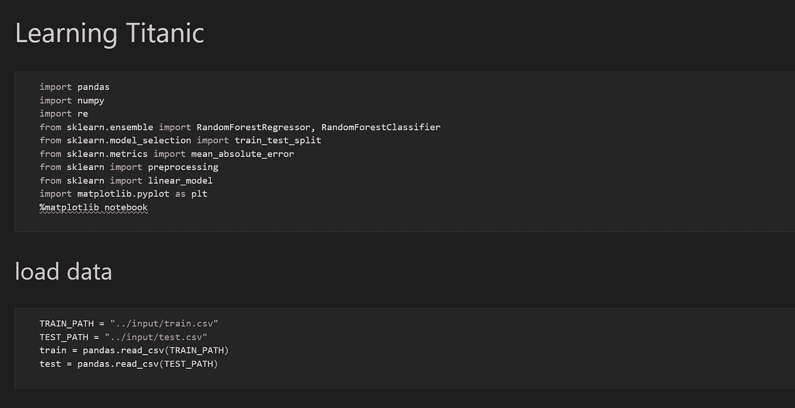
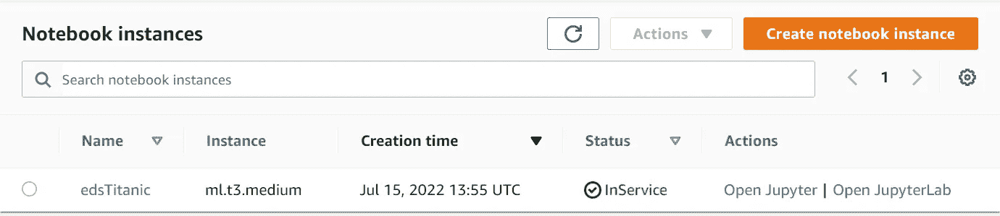
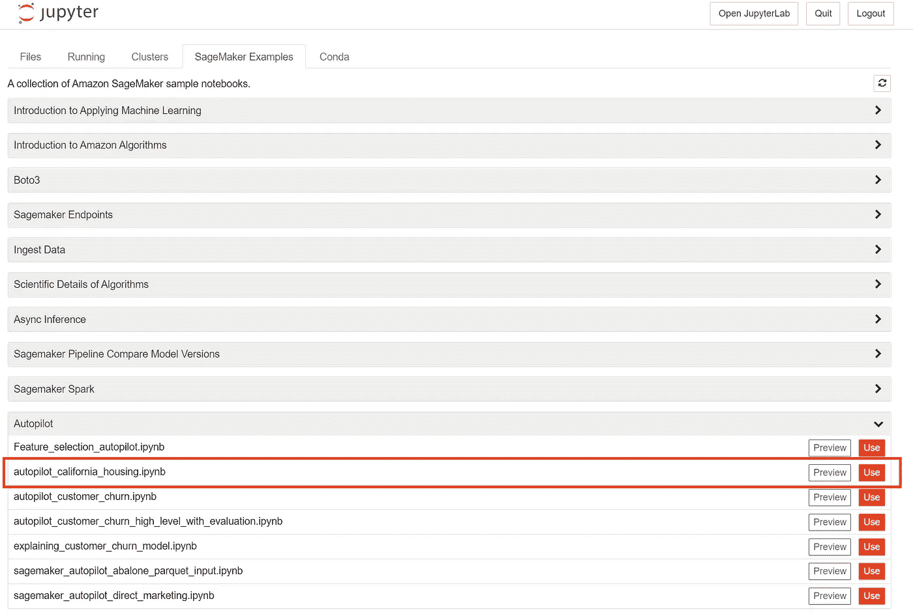
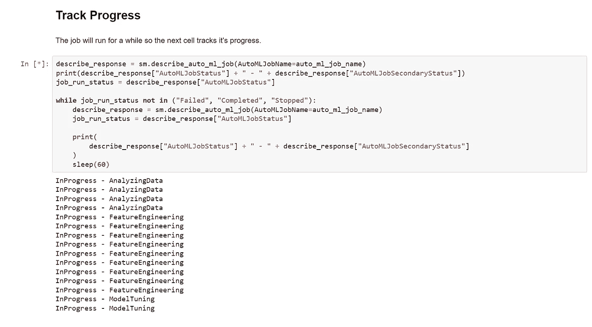

# AWS 上的机器学习:SageMaker vs. DIY

> 原文：<https://medium.com/version-1/machine-learning-on-aws-sagemaker-vs-diy-ff5158b45183?source=collection_archive---------0----------------------->

自从 2015 年在 Coursera 上参加吴恩达的机器学习课程以来，我就对机器学习感兴趣。遗憾的是，这门课程不面向新注册者，但是如果你感兴趣的话，深度学习专业也很值得一看。

我是一个螺母和螺栓类型的人，喜欢了解一切是如何工作的。Coursera 的课程在这方面非常棒，即使我对一些数学知识感到力不从心。当我开始涉猎 [Kaggle](https://www.kaggle.com/) 比赛来实践我所学到的东西时，这种心态让我陷入了 Python、scikit-learn、TensorFlow 和 Spark 的 DIY 兔子洞(加入一点 Scala 只是为了保持有趣)。

我花了几周时间学习细节，完善我的模型，准备参加 Kaggle 的[泰坦尼克号](https://www.kaggle.com/c/titanic)比赛。我和一个同事讨论了这个项目。那天晚上，他回到家，把训练数据输入 AWS 的 SageMaker，得出了一个我一直无法超越的分数。我私下认为，他可能运气好，或者投入了比他透露的更多的工作，但即便如此，这也显示了可用工具的力量。

如果你不熟悉 SageMaker，AWS 将其描述为:

> 一项完全托管的服务，通过完全托管的基础架构、工具和工作流，为任何使用情形构建、培训和部署机器学习(ML)模型。

除此之外，它还提供了一个托管笔记本，您可以使用它来构建模型和进行预测。它还提供了自动驾驶功能，可以处理几乎所有的困难工作。上传您的数据，配置作业，它会为您进行功能工程、算法选择和超参数调整。

近年来，我花在 AWS 上的时间比花在机器学习上的时间要多得多，因此，看看我在 SageMaker 的 Kaggle 挑战中能做得多好似乎早就应该看到了。也许现在是时候了——在我第一次提交 Kaggle 的五年后——赶上我以前工作的 Will 了…

# 什么是泰坦尼克号挑战

Kaggle 是一个开始机器学习的好地方。有大量的实际挑战，包括数据集和社区讨论他们解决每个问题的方法。巨大的挑战是他们的入门比赛，有点像数据科学的“Hello World”。

> 比赛很简单:使用机器学习创建一个模型，预测哪些乘客在泰坦尼克号沉船中幸存。

挑战赛的训练数据很小:900 条记录只有 61KB，所以建立一个模型应该不需要太多的计算能力。这些数据有助于几种算法，包括逻辑回归和随机森林分类，这两种算法对于机器学习算法来说都是相对直观的。

# DIY 方法

我开始在我的笔记本电脑上安装 [Jupyter notebook](https://jupyter.org/install) ，因为我已经安装并运行了 Python。然后我安装了我需要的库: [numpy](https://numpy.org/) 、 [pandas](https://pandas.pydata.org/) 和 [scikit-learn](https://scikit-learn.org/stable/index.html) 。接下来，我跳进笔记本，构建了我的解决方案:

1.  将数据加载到数据框中。
2.  将数据拆分为定型数据集和测试数据集。
3.  准备数据，例如，填补空白，获得额外的功能。
4.  构建随机森林模型。
5.  使用该模型来预测 Kaggle 保留的“秘密”记录的结果。

如果你想仔细看看，完整的代码在 GitHub 上。它给了我 0.77990 的合理分数(78%的准确率)。

# AWS 选项

## 费用

如果你关注这个博客，请注意 AWS 资源是收费的。免费层有助于实验，但是如果超出这个范围，来自大型实例的账单会迅速增加。

免费层每月覆盖多达 250 小时的中型工作室或笔记本电脑实例。一个月有 744 个小时，所以不使用的时候别忘了关掉它们！它还涵盖了长达 50 小时的超大型实例的培训，但有了自动驾驶仪，你很可能会超出这个范围，并使用更大的实例，所以要留意成本。我本应该知道得更清楚，但上个月才明白这一点。

检查 [SageMaker 定价](https://aws.amazon.com/sagemaker/pricing/)并考虑设置[计费警报](https://docs.aws.amazon.com/AmazonCloudWatch/latest/monitoring/monitor_estimated_charges_with_cloudwatch.html)以给你安装成本的早期警告。完成后，不要忘记关闭实例并清理资源。

## DIY 笔记本

可以从我的 DIY 笔记本中取出代码，粘贴到 SageMaker 托管的笔记本中，更改几行代码从 S3 存储桶而不是本地目录中加载数据，并获得相同的结果。事实上，这比 DIY 更容易，因为不需要安装依赖项。除了更容易，你还可以访问强大的云基础设施来训练你的模型。在笔记本电脑上运行 1000 条记录的随机森林不成问题，但你可能要等待比喝咖啡休息时间更长的时间，才能在庞大的数据集上训练神经网络。

## 自动驾驶仪

对于本文，我想充分利用 SageMaker 来演示这个过程有多简单。这也是我决定使用 SageMaker [自动驾驶](https://aws.amazon.com/sagemaker/autopilot/)的原因。我接下来描述的步骤是为了比较不同的方法。如果您正在寻找教程或详细的解释，有更好的资源:

*   这个 AWS 视频:[用亚马逊 SageMaker 自动驾驶仪](https://youtu.be/Ra4pDxbIK2M)自动构建、训练、调优 ML 模型
*   [AWS 博客](https://aws.amazon.com/blogs/aws/amazon-sagemaker-autopilot-fully-managed-automatic-machine-learning/)宣布自动驾驶
*   Jupyter 笔记本附带的 SageMaker 示例

笔记本中的高级步骤包括:

*   导入所需的库。
*   我们训练数据的快速回顾。
*   配置 AutoML 作业。
*   运行 AutoML 作业。
*   用性能最佳的候选模型进行预测。

运行 AutoML 作业是最困难的工作。Autopilot 分析训练数据，运行功能工程作业，并自动调整模型。

这项工作花费了 75 分钟多一点:4 分钟用于分析数据，9 分钟用于特性工程，48 分钟用于调整模型，8 分钟用于创建一个可解释性和洞察力报告。这比我预期的时间要长，我会在以后研究这个问题。我希望这项工作可以优化，以减少时间和费用。

这里有一个[链接](https://github.com/edeastwood/kaggleTitanic/blob/main/autoTitanic.ipynb)到我的 GitHub 中的笔记本供参考，但如果你有兴趣自己做这件事，你最好从[自动驾驶加州房屋笔记本示例](https://sagemaker-examples.readthedocs.io/en/latest/sagemaker-pipelines/tabular/tensorflow2-california-housing-sagemaker-pipelines-deploy-endpoint/tensorflow2-california-housing-sagemaker-pipelines-deploy-endpoint.html)开始。这就是我所做的，所以最好从原来的开始。

仍然有相当数量的代码，但是仔细观察，您会发现绝大多数都是样板文件。更改示例中的数据源，就可以开始了。我没有做过任何分析或特性工程，SageMaker 做了一切。一旦您理解了该工具的工作原理，您就可以放入一个新的数据集，只需几分钟的工作和对自动调优的短暂等待，就可以调优一个完全不同的模型。Autopilot 还提出了改进数据的方法；这些可通过 SageMaker studio 在每个作业创建的笔记本中获得。之前链接的[视频](https://youtu.be/Ra4pDxbIK2M)展示了如何使用这些。

## 结果

我没有部署端点，因为这是一次性工作。相反，我运行了一个转换，通过相同的管道(特征工程等)运行输入数据。)作为我们的训练数据并从那里推断出来。我从 S3 下载了预测，手动添加了标题和乘客 ID 列，以适应 Kaggle 预期的格式，并提交了数据。结果是略令人失望的 0.77511 分(准确率 77.5%)。令人失望，因为它比我的 DIY 工作差 0.4%，但这仍然令人印象深刻，因为我不必做任何功能工程，算法选择或超参数调整。随着更多的时间、努力和对工具集理解的加深，我有信心再提高几个百分点。

# 结论

我在 Autopilot 上看到的最终结果和我自己动手分析的结果相似。我的 DIY 分析计算是免费的，而自动驾驶仪花费了我大约 20 美元。最大的好处是，虽然 Autopilot 花了我一个晚上的时间来编写我并不完全理解的示例代码，但 DIY 方法花了我许多个晚上和周末的时间来学习，进行大量的数据分析和准备，以及数小时的实验。不需要了解数据科学，您可以通过了解如何使用一点 python 来使用该工具，从而获得良好的结果。

对于 DIY 方法，一个合适的从业者可以在更短的时间内做得比我好得多。但是如果有 SageMaker 这样的工具，他们可以做得更好，用更少的时间。

如果我这样做是为了工作，Autopilot 会是正确的选择。节省的时间很容易就值 20 美元。作为业余爱好，我会坚持用笔记本。通过这种方式，我学到了更多，并享受了这一旅程。

# SageMaker 还能做什么？

目前为止我只用过 SageMaker 的一部分。这是一个比带有一些智能库的托管笔记本更强大的工具。

*   Studio 为你的机器学习工作提供了一个完整的环境。
*   Ground Truth 允许您外包数据的手动标记，使收集训练数据变得更容易。电子表格的机械土耳其人。
*   模型可以部署到托管端点，允许通过 API 调用进行预测。这些可以被配置为高可用性和高性能，正如您对云服务的期望，并成为您应用程序的一部分。
*   工作流可用于软件工程管道，具有版本控制、批准和自动化部署。
*   通过 [AWS Neuron](https://aws.amazon.com/machine-learning/neuron/) 和 SageMaker [Neo](https://docs.aws.amazon.com/sagemaker/latest/dg/neo.html) 等工具访问为模型训练优化的硬件，这些工具将优化不同平台上的推理模型。

# 更多要学习的

如果你想了解更多，网上有很多有用的资源。到目前为止，我最喜欢的是:

*   [Kaggle](https://www.kaggle.com/) :实用的数据科学挑战，有趣的数据集实验，以及一个知识丰富、支持性强的社区来讨论解决方案。
*   [AWS AI/ML 专业](https://aws.amazon.com/certification/certified-machine-learning-specialty/):专注于将数据部署、操作和流式传输到 AWS 机器学习资源的专业认证。在云中生产机器学习工作负载时特别有用。
*   [开放 AI 深度学习专业化](https://www.coursera.org/specializations/deep-learning):对深度学习的深入研究，包括其背后的理论和使用它的最佳实践。比 AWS 专业更深入，更理论化。学术多于实践。

**关于作者:**
Ed Eastwood 是这里版本 1 的 AWS 架构师。