# 基于机器学习的 Airbnb 体验搜索排名

> 原文：<https://medium.com/airbnb-engineering/machine-learning-powered-search-ranking-of-airbnb-experiences-110b4b1a0789?source=collection_archive---------0----------------------->

## 我们如何为一个新的双边市场构建和迭代一个机器学习搜索排名平台，以及我们如何帮助它增长。

作者:Mihajlo Grbovic，，Pai Liu，Chun How Tan，，，Alex Tian

Airbnb 体验是由专业主持人设计和领导的手工活动，提供独特的当地场景和文化。每一次体验都要经过一个编辑团队的质量审查，然后才能发布到平台上。

我们在 2016 年 11 月推出了 Airbnb Experiences，在全球 12 个城市提供 500 次体验。2017 年，我们将业务扩展到 60 个城市的 5，000 个体验。2018 年，快速增长仍在继续，我们设法将体验带到了 1000 多个目的地，包括复活节岛、塔斯马尼亚岛和冰岛等独特的地方。我们以超过 20，000 次的活跃体验强势结束了这一年。

随着体验数量的增长，搜索和可发现性以及个性化已经成为市场增长和成功的非常重要的因素。

在这篇博文中，我们描述了我们在市场的不同增长阶段使用机器学习进行经验排名发展的阶段，从小型到中型和大型。

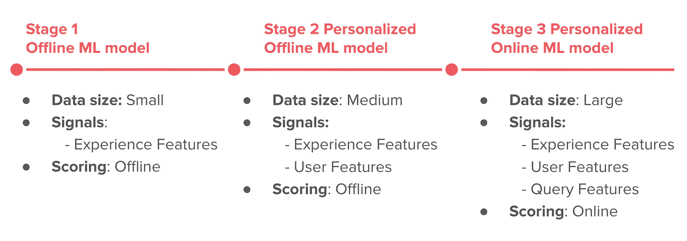

The first three stages of our Search Ranking Machine Learning model

主要的收获是，基于机器学习的搜索排名在每个阶段都有效，因为我们针对可用的数据量和需要排名的库存规模，选择了具有适当复杂程度的模型和基础设施。当用少量数据训练时，非常复杂的模型将不能很好地工作，并且当大量训练数据可用时，简单的基线是次优的。

# 阶段 1:建立一个强大的基线

当 Airbnb Experiences 推出时，需要在搜索中排名的体验量很小，我们刚刚开始收集用户与体验的交互数据(印象、点击和预订)。此时，最好的选择是每天随机重新排列经验，直到收集到一个小数据集用于开发阶段 1 ML 模型。

**收集训练数据:**为了训练我们的第一个用于对体验进行排名的机器学习模型，我们收集了最终进行预订的用户的搜索日志(即点击)。

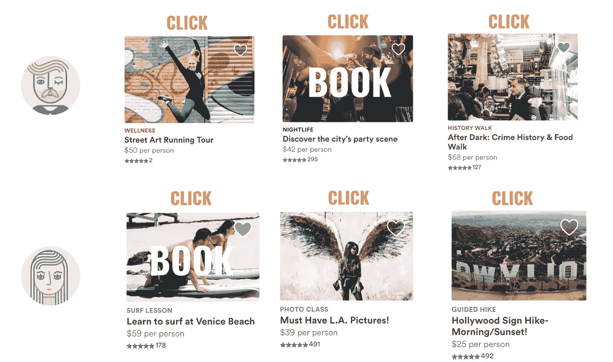

**Training Data Collection:** Search session clicks from users who eventually made bookings

**标注训练数据:**在标注训练数据的时候，我们主要对两个标签感兴趣:*被预订的体验*(我们将其视为正面标签)和*被点击但未预订的体验*(我们将其视为负面标签)。通过这种方式，我们收集了一个包含 **50，000 个示例**的训练数据集。

**构建我们将根据其进行排名的信号**:在我们的 ML 模型的第一阶段，我们决定仅根据*经验特征进行排名。*我们总共构建了 25 项功能，其中包括:

*   **体验时长**(如 1h、2h、3h 等。)
*   **价格**和**每小时价格**
*   **类别**(例如烹饪课、音乐、冲浪等。)
*   **评论**(评级，评论数量)
*   **预订数量**(过去 7 天，过去 30 天)
*   **过去和未来实例的占用率**(例如 60%)
*   **最大座位数**(例如最多可有 5 人参加)
*   **点击率**

**训练排名模型:**给定训练数据、标签和特征，我们使用 [**梯度提升决策树**](https://github.com/yarny/gbdt)【GBDT】模型。在这一点上，我们用*对数损失函数*将问题视为*二元分类*。

使用 GBDT 时，不需要太担心缩放特征值或丢失值(它们可以保持原样)。然而，要考虑的一个重要因素是，与线性模型不同，在基于树的模型中使用原始计数作为特征来做出树遍历决策可能会有问题，因为这些计数在快速增长的市场中容易快速变化。在这种情况下，最好使用分数比。例如，不使用最近 7 天的预订计数(例如 10 次预订)，而是使用预订的分数更好，例如相对于眼球数量(例如每 1000 名观众 12 次预订)。

**测试排名模型:**为了执行离线超参数调整并与生产中的随机重新排名进行比较，我们使用了培训中未使用的保留数据。我们选择的指标是 [AUC](https://en.wikipedia.org/wiki/Receiver_operating_characteristic#Area_under_the_curve) 和 [NDCG](https://en.wikipedia.org/wiki/Discounted_cumulative_gain) ，这是标准的排名指标。具体来说，我们根据模型得分(预订的概率)对体验进行了重新排名，并测试了预订的体验在用户点击的所有体验中的排名(越高越好)。

此外，为了了解一个经过训练的模型学到了什么，我们为几个最重要的体验特征绘制了部分依赖图。这些图显示了如果我们固定除了一个特征(我们正在检查的那个)之外的所有特征的值，具体的体验排名分数会发生什么。从下面的图中可以看出，该模型学会了以下列方式利用这些功能:

*   每 1000 名观众中有更多预订的体验排名会更高
*   平均评价较高的体验排名会更高
*   价格较低的体验排名会更高

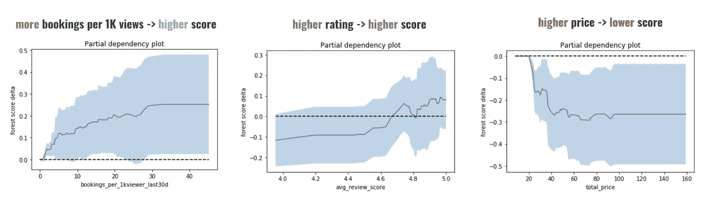

由于离线测试通常有太多的假设，例如，在我们的情况下，它仅限于对用户点击的内容进行重新排序，而不是对整个库存进行重新排序，我们进行了一个在线实验，即 A/B 测试，作为我们的下一步。我们将阶段 1 ML 模型与基于规则的随机排名在预订数量方面进行了比较。结果非常令人鼓舞，因为我们能够利用阶段 1 ML 排名模型**将预订量提高+13%** 。

**实施细节:**在这个阶段，我们的 ML 模型仅限于使用*体验特征，*因此，所有用户的体验排名是相同的。此外，所有查询参数(客人数量、日期、位置等。)仅用作检索的过滤器(例如，获取下周可用于两个客人的巴黎体验)，并且体验的排名不会基于这些输入而改变。

鉴于这样一个简单的设置，整个排名管道，包括培训和评分，都是离线实现的，每天在[气流](https://airflow.apache.org)中运行。输出只是所有体验的完整排序，即有序列表，它被上传到生产机器，并在每次进行搜索时用于对满足搜索标准的体验子集进行排序。

# 第二阶段:个性化

我们搜索排名发展的下一步是将*个性化*功能添加到我们的 ML 排名模型中。

从一开始，我们就知道个性化将在体验排名中发挥重要作用，因为商品和顾客兴趣都是多样化的。

不像我们的家庭生意，在同一城市的两个*私人房间*价格相似，两个随机选择的体验可能非常不同，例如一个*烹饪课*对一个*冲浪课*。与此同时，客人可能对他们的旅行有不同的兴趣和想法，我们的目标是快速捕捉这种兴趣，并在搜索结果中提供更高的正确内容。

我们引入了两种不同类型的个性化，主要是通过给定收集的用户数据进行特征工程。

## 1.基于预订的 Airbnb 房屋进行个性化

很大一部分体验预订来自已经预订了 Airbnb 房屋的客人。因此，我们有相当多的信息可以用来构建个性化功能:

*   **预定的家庭所在地**
*   **行程日期**
*   **行程长度**
*   **嘉宾人数**
*   **行程价格**(低于/高于市场)
*   旅行类型:家庭、商务
*   **第一次行程或返回位置**
*   **国内/国际旅行**
*   **领先几天**

为了举例说明可以用来指导排名的功能，我们演示了两个重要的功能:

*   *订了家和体验之间的距离。*知道预定的家的位置(纬度和经度)以及体验会议的位置，我们可以计算他们的距离(以英里为单位)。数据显示，用户喜欢便利，即大部分预订的 Airbnb 体验都接近预订的 Airbnb Home。
*   *预订旅行期间的体验。*给定入住和退房日期，我们知道客人希望在哪些日期预订体验，并可以在这些日期将体验标记为*可用*或*不可用*。

这两个特征(以及其他特征)在训练新的 ML 排名模型时被使用。下面我们展示了它们的部分依赖图。

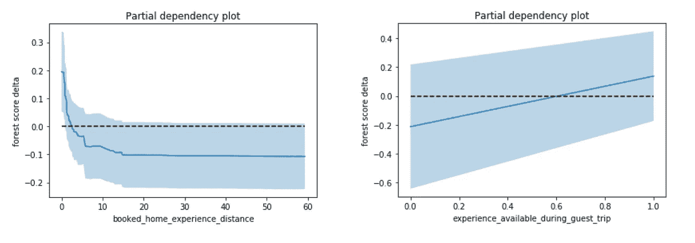

这些图证实了特征行为与我们直观预期的模型将学习的内容相匹配，即，离预订的家越近的体验排名越高(得分越高)，可用于预订的旅行日期的体验排名越高(这非常方便，因为即使在无日期搜索中，我们也可以利用旅行日期)。

## 2.基于用户的点击进行个性化

给定用户的短期搜索历史，我们可以推断出有用的信息，这些信息可以帮助我们个性化未来的搜索:

*   **推断用户对某些类别的兴趣:**例如，如果用户主要点击*音乐*体验，我们可以推断用户对*音乐*感兴趣
*   **推断用户一天中的时间可用性:**例如，如果用户主要点击*晚间*体验，我们可以推断用户在一天中的那个时间是有空的

当它们被发布到平台上时，每一次体验都被手动标记上类别(例如，徒步旅行、滑雪、骑马等)。).这种结构化数据让我们能够区分不同类型的体验。它还让我们能够通过汇总用户对不同类别的点击，在每个类别中创建用户兴趣档案。

为此，我们从用户点击和点击体验的类别中计算出两个特征:

**类别强度:**对具有该特定类别的体验的用户点击的加权总和，

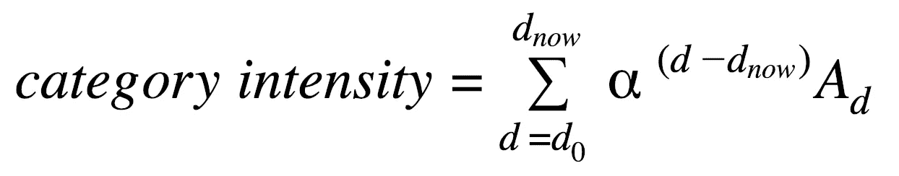

其中总和是过去 15 天(d_0 到 d_now)的总和， *A* 是在第 *d.* 天对某个类别的操作数(在这种情况下是点击数)

**类别新近度:**自从用户最后一次点击该类别中的体验以来已经过去的天数。

注意，用户可能已经点击了具有不同强度和新近度的许多不同类别，但是当针对需要排序的特定体验计算特征时，我们使用该体验类别的强度和新近度。

为了说明我们的模型从这两个特性中学到了什么，我们展示了下面的部分依赖图。如可以在左侧观察到的，用户具有高强度的类别中的体验将排名**更高。**与此同时，拥有最近特征(右侧)可以让模型随着时间的推移忘记历史，用户在很久以前最后一次点击的类别中的体验会将**排名降低。**

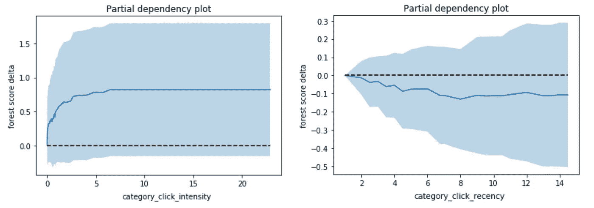

我们为几种不同的用户行为构建了相同类型的功能(强度和最近度)，包括愿望列表和预订某个类别。

**一天中的时间个性化:**在一天中的不同时间(例如清晨、傍晚等)举行不同的体验。).类似于我们如何跟踪不同类别的点击，我们也可以跟踪一天中不同时间的点击，并计算用户时间百分比和体验时间之间的*时间拟合*，如下所述。

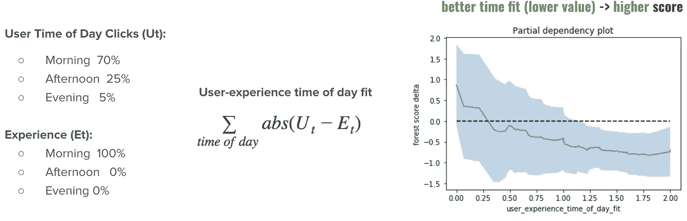

正如可以观察到的，该模型学会了以一种方式使用该特征，该方式将在一天中用户更喜欢的时间举行的体验排序为更高。

**训练排名模型:**为了训练具有*个性化*特征的模型，我们首先通过基于搜索日志重建过去来生成包含那些特征的训练数据。到那时，我们已经有了一个更大的库存(4000 个经验)，并能够收集更多的训练数据(250，000 个标记的例子)和近 50 个排名特征。

创建个性化特征时，*非常重要的一点是*不要“*泄露标签，”*即暴露用于创建标签的事件之后发生的一些信息。因此，我们只使用预订前发生的用户点击。此外，为了进一步减少泄漏，当创建训练数据时，我们仅在用户与多个体验和类别交互时计算个性化特征(以避免用户仅点击一个体验/类别的情况，例如*冲浪*，并最终预订该类别)。

另一个需要考虑的重要方面是，我们的搜索流量包含由*登录的*和*注销的*用户进行的搜索。考虑到这一点，我们发现为**培训两种型号**更合适，一种具有个性化功能，用于*登录的*用户，另一种没有个性化功能，用于*注销的*流量。主要原因是使用个性化功能训练的*登录*模型过于依赖这些功能的存在，因此不适合在*注销*流量上使用。

**测试排名模型:**我们进行了 A/B 测试，将带有个性化功能的 2 个模型的新设置与第 1 阶段的模型进行比较。结果显示，个性化很重要，因为与第一阶段模型相比，我们能够**将预订量提高+7.9%** 。

**实现细节:**为了在生产中实现阶段 2 模型的服务，我们选择了一个需要最少实现时间的简单解决方案。我们创建了一个以用户 id 为关键字的查找表，其中包含该用户所有体验的个性化排名，并使用关键字 0 对已注销的用户进行排名。

这需要每天离线计算所有这些在[气流](https://airflow.apache.org)中的排名，通过计算最新的特征和对两个模型评分来产生排名。由于预先计算所有用户的个性化排名所涉及的高成本( *O* ( *NM* )，其中 *N* 是用户数量， *M* 是体验数量)，我们将 *N* 限制为仅 100 万最活跃用户。

在这一点上，个性化功能只是每天计算一次，这意味着我们有长达一天的延迟(这也是一个可以通过增加基础设施投资来大大改善的因素)。

第 2 阶段实施是一个临时解决方案，用于在我们投入更多资源在第 3 阶段构建*在线评分基础设施之前验证个性化收益，这是必需的，因为 *N* 和 *M* 预计将增长更多。*

# *第 3 阶段:转向在线评分*

*在我们通过迭代 ML 排名模型展示了显著的预订收益之后，在库存和训练数据增长到可以训练更复杂模型的程度之后，我们准备投入更多的工程资源来构建*在线评分基础设施*，并瞄准更多的预订收益。*

*移动到*在线评分*也解锁了一套全新的可以使用的功能:*查询功能*(下图高亮显示)。*

*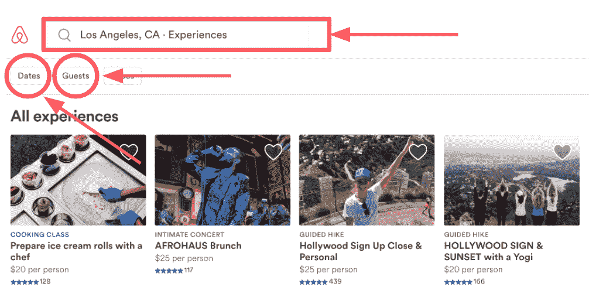*

*这意味着我们将能够使用输入的*地点*、*客人数量*和*日期*来设计更多的功能。*

*例如，我们可以使用输入的*位置*，如城市、街区或名胜，来计算体验和输入位置之间的*距离。这一功能有助于我们将越接近输入位置的体验排名越高。**

*此外，我们可以使用输入的*客人数量*(单人、情侣、大型团体)来计算它与需要排名的平均预订体验中的客人数量的关系。此功能有助于我们将更好的健身体验排名更高。*

*在在线设置中，我们还能够利用用户的*浏览器语言*设置来即时进行语言个性化。有些体验被翻译成多种语言。如果浏览器设置语言翻译可用，则显示该语言翻译。借助在线世界的排名，我们可以更进一步，通过设计一个功能来确定是否以浏览器语言提供*体验，从而提高语言匹配体验的排名。在下图中，我们展示了当浏览器语言为俄语时，以俄语提供的 Stage 3 ML 模型排名体验的示例。**

**

*最后，在在线设置中，我们也知道用户搜索的国家。我们可以使用国家信息，根据这些国家的用户偏好的类别来个性化体验排名。比如，历史资料告诉我们，去巴黎*的时候，日本旅行者*更喜欢*学习班&作坊(如香水制作)*，*的美国旅行者*更喜欢*美食&饮品体验*，而*法国旅行者*更喜欢*历史&志愿服务*。我们利用这些信息在始发地和目的地设计了几个个性化特征。*

***训练排名模型:**为了用*查询特征*训练模型，我们首先将它们添加到我们的历史训练数据中。当时的库存是 16，000 次体验，我们有超过 200 万个带标签的示例用于培训，共有 90 个排名特征。如前所述，我们训练了两个 GBDT 模型:*

*   ***为已登录用户***其中使用*体验功能**查询功能*和*用户(个性化)功能***
*   ****注销流量的模型**，其中使用*经验&查询特性，*使用登录用户的数据(点击&预订)训练，但不考虑*个性化特性***

**拥有在线评分基础设施的优势在于，我们可以使用*登录的*模型来获得比以前多得多的**使用**，因为不需要像我们在第二阶段那样预先计算个性化排名。每当个性化信号对特定用户 id 可用时，我们就使用*登录*模型，否则我们就退回到使用*注销*模型。**

****测试排名模型:**我们进行了 A/B 测试来比较阶段 3 模型和阶段 2 模型。我们再次实现了**预订量的增长，这次增长了+5.1%** 。**

****实现细节:**为了实时实现数千个列表的在线评分，我们已经在我们的搜索服务的上下文中构建了自己的 ML infra。基础架构主要有三个部分，1)从各个地方实时获取模型输入，2)模型部署到生产，3)模型评分。**

**该模型需要三种信号进行评分:*体验特征*、*查询特征、*和*用户特征*。不同的信号根据它们的大小、更新频率等被不同地存储。具体来说，由于其庞大的规模(上亿个用户密钥)，*用户特征*被存储在*在线键值存储*和搜索服务器框中，当用户进行搜索时可以查找它们。另一方面,*体验特征*并不太大(成千上万次体验),因此可以存储在搜索服务器的内存中并直接从那里读取。最后，*查询特性*根本没有被存储，它们只是在从前端进来时被读取。**

***随着气流管道特征生成作业的完成，体验和用户特征*每天都会更新。我们正在努力将一些功能转移到网络世界，通过使用一个具有读写能力的键值存储，这将允许我们在更多数据到来时立即更新功能(例如，新的体验评论、新的用户点击等)。).**

**在模型部署过程中，我们将 GBDT 模型文件(最初来自 JSON 格式的培训管道)转换为内部 Java GBDT 结构，并在搜索服务应用程序启动时将其加载到其中。**

**在评分阶段，我们首先从各自的位置引入所有的特征(*用户、体验和查询特征*)，并将它们连接成一个向量，用作模型的输入。接下来，根据*用户特征*是否为空，我们决定使用哪个模型，即*注销*或*登录*模型。最后，我们返回所有体验的模型分数，并在页面上按分数降序排列。**

# **阶段 4:处理业务规则**

**到目前为止，我们排名模型的目标是增加预订量。然而，像 Airbnb Experiences 这样的市场可能还有其他几个次要目标，我们称之为*商业规则*，我们可以通过机器学习*来帮助实现这些目标。***

**一个如此重要的商业规则是**提升质量**。从一开始，我们就相信，如果客人有一个非常好的体验，他们会回来，并在不久的将来再次预订体验。出于这个原因，我们开始从用户那里收集反馈，1)星级，范围从 1 到 5，以及 2)关于体验是否*独特、比预期更好、吸引人等的额外结构化多回复反馈。***

**随着越来越多的数据支持我们的重新预订假说，趋势变得更加清晰。从下图左侧可以看出，与体验不佳的客人(评价为 4 星或更低)相比，体验良好的客人(评价为 5 星)在未来 90 天内重新预订其他体验的可能性是前者的 1.5 倍。**

**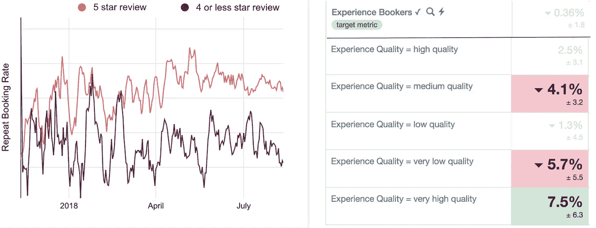**

**这促使我们对我们的目标函数进行实验，其中我们改变了我们的二进制分类(+1 =预订，-1 =点击&未预订)，以在不同质量等级的训练数据中引入权重(例如，对于非常高质量的预订最高，对于非常低质量的预订最低)。质量等级由我们的质量团队通过数据分析确定。例如:**

*   ***非常高质量的*体验是指有> 50 条评论、> 4.95 条评论评级以及> 55%的客人说体验是*独特的*并且*比预期的要好。***
*   ***极低质量*体验与> 10 条评论，< 4.7 条评论评级。**

**当测试以这种方式训练的模型时，A/B 测试结果(在上图右侧)显示，我们可以利用机器学习排名来获得更多高质量的预订和更少低质量的预订，同时保持整体预订中立。**

**同样，我们成功实现了其他几个次要目标:**

*   ****利用冷启动信号发现并提升潜在的*新* *热门***早期热门【这导致***新热门*** 和中性总体预订量增加了 14%**
*   ****在**前 8 名结果**中实施多元化**，这样我们就可以展示多元化的类别集合，这对低意向流量尤为重要(这导致 **+2.3%的整体预订收益**)。**
*   ****优化不带可点击位置的搜索**对于*低意向*登陆我们网页但不在指定位置搜索的用户，我们认为应该使用不同的目标。我们的第一次尝试是根据我们的排名模型分数从*所有地点*中选择*前 18 名*，然后**根据**点击率**重新排名**(这导致 **+2.2%的整体预订收益**，相比之下，我们没有根据点击率重新排名)。**

# **监控和解释排名**

**对于任何双边市场来说，能够解释为什么某些项目会有这样的排名是非常重要的。**

**对我们来说，它很有价值，因为我们可以:**

*   **给主持人具体的反馈，哪些因素导致排名提高，哪些因素导致排名下降。**
*   **跟踪排名算法实施的总体趋势，以确保这是我们希望在市场中出现的行为。**

**为了构建这一功能，我们使用了 [Apache 超集](https://superset.incubator.apache.org)和[气流](https://airflow.apache.org)来创建两个仪表板:**

*   **跟踪特定体验在一段时间内的市场排名的仪表板，以及 ML 模型使用的特征值。**
*   **显示不同体验组总体排名趋势的仪表板(例如，五星级体验在其市场中的排名)。**

**为了说明这些类型的仪表板为什么有用，我们在下面的图中给出了几个例子。**

**在下图中，我们展示了一个体验的示例，其排名(左图)**从第 30 位提高到第 1 位(排名最高)。为了解释原因，我们可以查看跟踪该体验的各种统计数据的图(右图)，这些统计数据要么直接用作 ML 模型中的特征，要么用于导出特征。****

**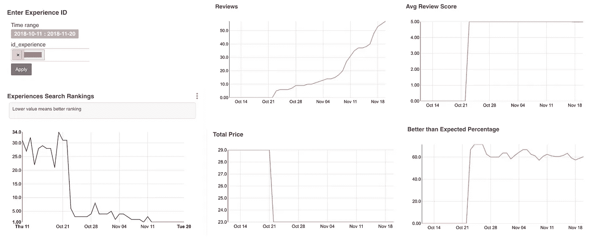**

**Example explaining why the ranking of a particular Experience improved over time**

**可以清楚地观察到，由于评论数量从 0 增加到 60，排名有所提高，同时保持了 5.0 的评论评级，并且超过 60%的用户表示体验好于预期。此外，主持人降低了价格，这也可能导致排名的提高。**

**在下图中，我们展示了一个排名**从第 4 位下降到第 94 位的体验示例。排名模型用作输入的信号再次说明了问题。****

**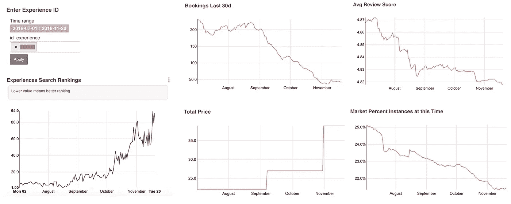**

**Example explaining why the ranking of a particular Experience degraded over time**

**体验开始得到差评(平均。评分从 4.87 降至 4.82)，主机将价格提高了 20 美元，整体预订数量下降。此外，在该市场中，一天中举行体验时间(清晨)变得越来越不受欢迎(轻微的季节性效应)。所有这些因素综合起来导致排名下降。**

**这个仪表板对我们的市场经理特别有用，他们经常与东道主接触。**

**此外，为了能够跟踪我们正在实施的排名行为，我们可以看看某些群体的体验在他们的市场中是如何排名的。在下图中，我们展示了仪表板的快照，我们可以在其中跟踪不同维度的平均排名(越低越好)。**

**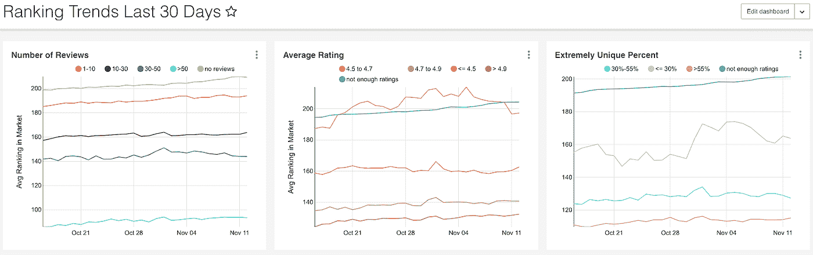**

**例如，左边的图显示，拥有超过 50 条评论的体验比拥有 10-30 条评论的体验排名更高。看一下另外两个图，我们可以看到评论评分> 4.9 的平均体验是最好的(比那些平均评分较低的体验好得多)，超过 55%的用户说他们的体验是独特的体验比非独特的体验好得多。**

**这种类型的仪表板对于制定业务决策和修改排名算法以实施更好的行为非常有用。例如，根据显示不同价格区间组排名趋势的图表(如下所示)，我们注意到非常低的价格体验在排名中具有太大的优势。我们决定通过取消价格作为排名模型使用的信号之一来减少这种优势。**

**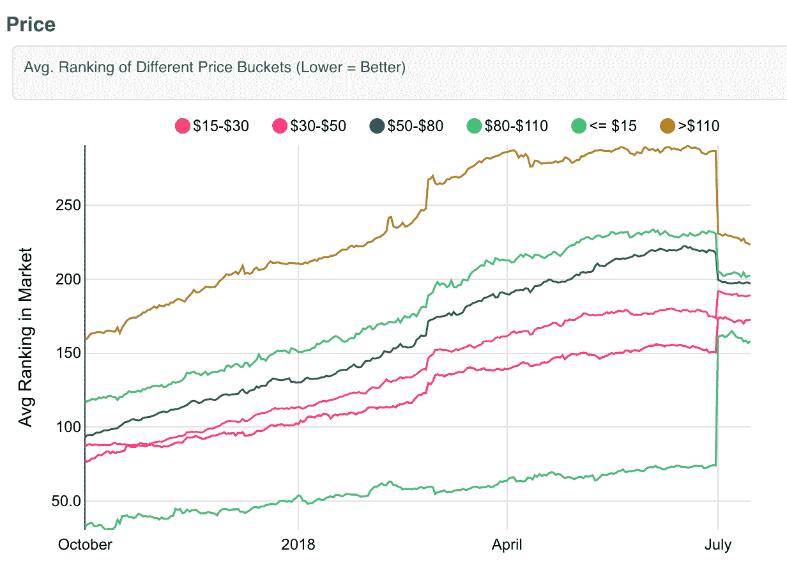**

**去除价格和重新训练模型的结果是排名的差异减少了(7 月 1 日之后)，而没有损害整体预订量。这展示了报告的有用性以及如何使用机器学习来操纵排名以实现期望的排名行为。**

# **当前和未来的工作**

**在我们正在进行的和未来的工作中，我们将不断迭代**

*   ****训练数据构建**(通过记录评分时的特征值，而不是根据当天的最佳猜测来重建它们)**
*   ****损失函数**(例如，通过使用成对损失，我们将预订的体验与排名更高但未预订的体验进行比较，这种设置更适合于排名)**
*   ****训练标签**(例如，通过使用实用程序而不是二进制标签，即，为不同的用户动作分配不同的值，例如:印象 0，点击 0.1，具有选定日期的点击 0.2&时间，预订 1.0，高质量预订 1.2)**
*   ****增加更多实时信号**(例如，能够基于即时用户活动进行个性化，即 10 分钟前而不是 1 天前发生的点击)**
*   ****明确询问用户他们希望在旅行中做什么类型的活动**(这样我们就可以根据声明的兴趣和推断的兴趣进行个性化)**
*   **解决我们在训练中使用的数据中存在的位置偏差**
*   ****为额外的次要目标**进行优化，例如帮助那些接待频率低于其他人(例如，每月 1-2 次)的主机，以及去度假并回来的主机**
*   ****测试 GBDT 以外的不同车型****
*   ****通过利用排名模型的预测，寻找更多在特定市场运作良好的供应类型**。**
*   ****探索/利用框架****
*   ****测试人在回路方法**(例如员工挑选)**

**当我们继续推动经验排名的极限来发展我们的市场时，我们将向读者更新什么有效，什么无效。**

# **迄今为止的业务影响摘要**

**我们将总结一下我们的团队迄今为止通过博客帖子中讨论的实验所产生的预订影响。**

**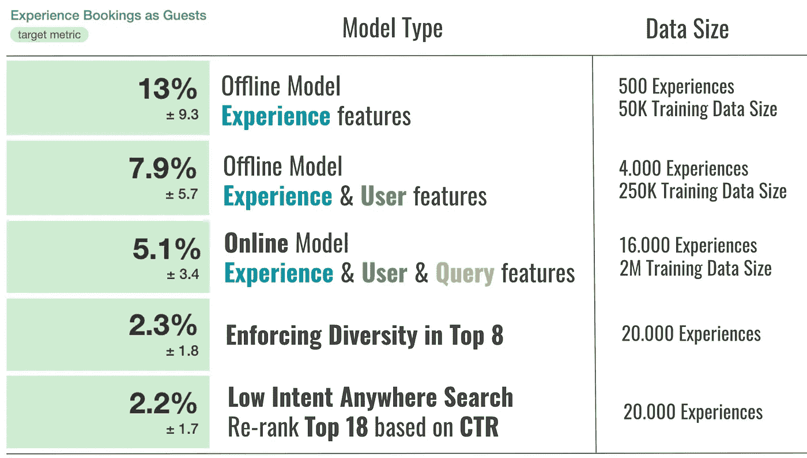**

**主要的收获是:“*不要等到你有了大数据，你可以用小数据做相当多的事情来帮助增长和改善你的业务。***

**对这类工作感兴趣？我们一直在寻找 [*有才华的人加入我们的数据科学和分析团队*](https://www.airbnb.com/careers/departments/data-science-analytics) *！***

**非常感谢整个体验搜索排名团队为这个项目做出的贡献。**