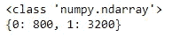

# 2021 年尝试的最新机器学习项目

> 原文：<https://medium.com/edureka/machine-learning-projects-cb0130d0606f?source=collection_archive---------2----------------------->


Machine Learning Projects — Edureka

很明显，机器学习是一个在过去几年里取得疯狂进步的领域。这一趋势和进步为该行业创造了大量就业机会。对机器学习工程师的需求很高，这种激增是由于不断发展的技术和大量数据(即大数据)的产生。因此，在这篇文章中，我将讨论人们绝对应该了解和使用的最令人惊叹的机器学习项目，顺序如下:

*   什么是机器学习？
*   机器学习步骤
*   机器学习的类型
*   行业使用案例
*   2019 年开源机器学习项目

# 什么是机器学习？

机器学习是一个概念，它允许机器从例子和经验中学习，并且不需要显式编程。因此，你要做的不是编写代码，而是向通用算法提供数据，算法/机器根据给定的数据构建逻辑。


# 机器学习步骤

任何机器学习算法都遵循一个共同的模式或步骤。


> **收集数据:**这一阶段包括从各种来源收集所有相关数据
> 
> **数据角力:**它是将“原始数据”清理并转换成一种便于使用的格式的过程
> 
> **分析数据:**对数据进行分析，以选择和过滤准备模型所需的数据
> 
> **训练算法:**在训练数据集上训练算法，算法通过训练数据集理解管理数据的模式和规则
> 
> **测试模型:**测试数据集决定了我们模型的准确性。
> 
> **部署:**如果模型的速度和准确性是可以接受的，那么这个模型应该部署在真实的系统中。在模型基于其性能被部署之后，模型被更新和改进，如果性能下降，模型被重新训练。

# 机器学习的类型

机器学习被细分为三种类型:


**监督学习:**有输入变量(x)和输出变量(Y)，使用算法学习从输入到输出的映射函数。


**无监督学习:**有时候给定的数据是非结构化的，无标签的。因此很难将这些数据分成不同的类别。无监督学习有助于解决这个问题。这种学习用于根据输入数据的统计属性将输入数据分类。


**强化学习:**这是关于采取适当的行动，以便在特定的情况下获得最大的回报。
说到强化学习，是没有预期输出的。强化代理决定采取什么行动来执行给定的任务。在没有训练数据集的情况下，它必然会从自己的经验中学习。

现在，让我们来看看几个可以帮助公司创造利润的现实生活中的机器学习项目。

# 行业使用案例

## **1。动作工作室**

**域:**媒体

**重点:**优化选拔流程


**商业挑战:** Motion Studio 是欧洲最大的广播制作公司。收入超过十亿美元，该公司决定推出一档新的真人秀节目: **RJ 之星。该节目反响空前，公司收到了大量语音剪辑。作为一名人工智能专家，你必须将声音分为男性/女性，这样第一级过滤会更快。**

**关键问题:**语音样本是跨口音的。

**商业利益:**由于 **RJ 之星**是一档真人秀节目，挑选候选人的时间很短。整个演出的成功和利润取决于快速和顺利的执行

```
import pandas as pd
import numpy as np
import matplotlib.pyplot as plt
import seaborn as sns
%matplotlib inline
import warnings
warnings.filterwarnings('ignore')

df = pd.read_csv('voice-classification.csv')
df.head()
```


```
# Check the no. of records
df.info()

df.describe()

df.isnull().sum()
```


```
print ( "Shape of Data:" , df.shape)
print("Total number of labels: {}".format(df.shape[0]))
print("Number of male: {}".format(df[df.label == 'male'].shape[0]))
print("Number of female: {}".format(df[df.label == 'female'].shape[0]))
```


```
X=df.iloc[:, :-1]
print (df.shape)
print (X.shape)
```


```
from sklearn.preprocessing import LabelEncoder
y=df.iloc[:,-1]

gender_encoder = LabelEncoder()
y = gender_encoder.fit_transform(y)
y

from sklearn.preprocessing import StandardScaler
scaler = StandardScaler()
scaler.fit(X)
X = scaler.transform(X)

from sklearn.model_selection import train_test_split
X_train, X_test, y_train, y_test = train_test_split(X, y, test_size=0.3, random_state=100)

from sklearn.svm import SVC
from sklearn import metrics
from sklearn.metrics import classification_report,confusion_matrix

svc_model=SVC()
svc_model.fit(X_train,y_train)
y_pred=svc_model.predict(X_test)

print('Accuracy Score:')
print(metrics.accuracy_score(y_test,y_pred))
```


```
print(confusion_matrix(y_test,y_pred))
```


## **2。锂动力**

**领域:**汽车

**重点:**激励司机


**业务挑战:** Lithionpower 是最大的电动汽车(e-vehicle)电池供应商。司机通常租用电池一天，然后用公司的充电电池更换。Lithionpower 有一个基于驾驶员驾驶历史的可变定价模型。因为电池的寿命取决于超速、每天行驶的距离等因素。作为一名 ML 专家，您必须创建一个聚类模型，在该模型中，可以根据驾驶数据将驾驶员分组在一起。

**关键问题:**将基于集群激励驾驶员，因此分组必须准确。

**商业利益:**利润增加，高达 15–20 %,因为历史记录不佳的司机将被收取更多费用。

```
import pandas as pd
import numpy as np
import matplotlib.pyplot as plt
import seaborn as sns
sns.set() # for plot styling
%matplotlib inline
import warnings
warnings.filterwarnings('ignore')
import matplotlib.pyplot as plt
plt.rcParams['figure.figsize'] = (12, 6)

df=pd.read_csv('driver-data.csv')
df.head()
```


```
df.info() 
df.describe()
```


```
from sklearn.cluster import KMeans

#Taking 2 clusters
kmeans = KMeans(n_clusters=2)
df_analyze = df.drop('id',axis=1)

kmeans.fit(df_analyze)
```


```
kmeans.cluster_centers_
```


```
print (kmeans.labels_) 
print (len(kmeans.labels_))
```


```
print (type(kmeans.labels_))
unique, counts = np.unique(kmeans.labels_, return_counts=True)
print(dict(zip(unique, counts)))
```



```
df_analyze['cluster'] = kmeans.labels_
sns.set_style('whitegrid')
sns.lmplot('mean_dist_day','mean_over_speed_perc',data=df_analyze, hue='cluster',
palette='coolwarm',size=6,aspect=1,fit_reg=False)
```


```
#Now, Let's check the clusters, when n=4
kmeans_4 = KMeans(n_clusters=4)
kmeans_4.fit(df.drop('id',axis=1))
kmeans_4.fit(df.drop('id',axis=1))
print(kmeans_4.cluster_centers_)
unique, counts = np.unique(kmeans_4.labels_, return_counts=True)

kmeans_4.cluster_centers_
print(dict(zip(unique, counts)))
```


```
df_analyze['cluster'] = kmeans_4.labels_
sns.set_style('whitegrid')
sns.lmplot('mean_dist_day','mean_over_speed_perc',data=df_analyze, hue='cluster',
palette='coolwarm',size=6,aspect=1,fit_reg=False)
```


## **3。BluEx**

**域:**物流

**焦点:**最佳路径


商业挑战:BluEx 是印度一家领先的物流公司。它以高效地向顾客递送包裹而闻名。然而，BluEx 正面临着一个挑战，其货车司机正在采取一种次优的交付方式。这导致了延误和更高的燃料成本。作为 ML 专家，您必须使用强化学习来创建 ML 模型，以便通过程序找到有效的路径。

**关键问题:**数据有许多属性，分类可能会很棘手。

**商业利益:**采用最佳路径可以节省高达 15%的燃料成本。

```
import numpy as np
import pylab as plt
import networkx as nx

#Initializing points
points_list = [(0,1), (1,5), (5,6), (5,4), (1,2), (2,3), (2,7)]

goal = 7
mapping={0:'Start', 1:'1', 2:'2', 3:'3', 4:'4', 5:'5', 6:'6', 7:'7-Destination'}
G=nx.Graph()
G.add_edges_from(points_list)
pos = nx.spring_layout(G,k=.5,center=points_list[2])
nx.draw_networkx_nodes(G,pos,node_color='g')
nx.draw_networkx_edges(G,pos,edge_color='b')
nx.draw_networkx_labels(G,pos)
plt.show()
```


```
NO_OF_POINTS = 8

#Inititlaizing R Matrix
R = np.matrix(np.ones(shape=(NO_OF_POINTS, NO_OF_POINTS)))
R *= -1

for point in points_list:
print(point)
if point[1] == goal:
R[point] = 150
else:
R[point] = 0

if point[0] == goal:
R[point[::-1]] = 150
else:
# reverse of point
R[point[::-1]]= 0
```


```
R[goal,goal]= 150 
R
```


```
Q = np.matrix(np.zeros([NO_OF_POINTS,NO_OF_POINTS]))

# The learning parameter
gamma = 0.8

initial_state = 1

def available_actions(state):
current_state_row = R[state,]
av_act = np.where(current_state_row &amp;amp;amp;gt;= 0)[1]
return av_act

available_act = available_actions(initial_state)

def sample_next_action(available_actions_range):
next_action = int(np.random.choice(available_act,1))
return next_action

action = sample_next_action(available_act)

def update(current_state, action, gamma):

max_index = np.where(Q[action,] == np.max(Q[action,]))[1]

if max_index.shape[0] &amp;amp;amp;gt; 1:
max_index = int(np.random.choice(max_index, size = 1))
else:
max_index = int(max_index)
max_value = Q[action, max_index]

Q[current_state, action] = R[current_state, action] + gamma * max_value
print('max_value', R[current_state, action] + gamma * max_value)

if (np.max(Q) &amp;amp;amp;gt; 0):
return(np.sum(Q/np.max(Q)*100))
else:
return (0)

update(initial_state, action, gamma)
```


```
scores = []
for i in range(700):
current_state = np.random.randint(0, int(Q.shape[0]))
available_act = available_actions(current_state)
action = sample_next_action(available_act)
score = update(current_state,action,gamma)
scores.append(score)
print ('Score:', str(score))

print("Trained Q matrix:")
print(Q/np.max(Q)*100)

# Testing
current_state = 0
steps = [current_state]

while current_state != 7:

next_step_index = np.where(Q[current_state,] == np.max(Q[current_state,]))[1]

if next_step_index.shape[0] &amp;amp;amp;gt; 1:
next_step_index = int(np.random.choice(next_step_index, size = 1))
else:
next_step_index = int(next_step_index)

steps.append(next_step_index)
current_state = next_step_index
```


```
print("Most efficient path:")
print(steps)

plt.plot(scores)
plt.show()
```


# 2019 年开源机器学习项目

[**Detectron**](https://github.com/facebookresearch/Detectron)**:**Detectron 是脸书 AI Research 的软件系统，实现了最先进的物体检测算法。它是用 Python 编写的，由 Caffe2 深度学习框架提供支持。


Detectron 的目标是为对象检测研究提供高质量、高性能的代码库。它被设计得很灵活，以支持新研究的快速实施和评估。它包含 50 多个预先训练好的模型。

[**密集姿态**](https://github.com/facebookresearch/DensePose) **:** 密集人体姿态估计的目的是将一幅 RGB 图像的所有人体像素映射到人体的 3D 表面。DensePose-RCNN 是在 Detectron 框架中实现的。


[**tensor flow . js**](https://github.com/tensorflow/tfjs)**:**是一个开发和训练 ML 模型并在浏览器中部署的库。自从今年早些时候发布以来，它已经成为一个非常受欢迎版本，并继续以其灵活性令人惊叹。有了这个你可以


*   **在浏览器中开发 ML:**使用灵活直观的 API，使用低级 JavaScript 线性代数库或高级 layers API 从头构建模型。
*   **运行现有模型**:使用 TensorFlow.js 模型转换器在浏览器中运行预先存在的 TensorFlow 模型。
*   **重新训练现有模型:**使用连接到浏览器的传感器数据或其他客户端数据来重新训练预先存在的 ML 模型。

[**Waveglow:**](https://github.com/NVIDIA/waveglow) 机器学习在音频处理方面也取得了重大进展，它不仅仅是生成音乐或分类。WaveGlow 是 NVIDIA 基于流的语音合成生成网络。研究人员还列出了如果你想从头开始训练自己的模型可以遵循的步骤。


[**Image Outpainting**](https://github.com/bendangnuksung/Image-OutPainting)**:**想象一下，你有一个场景的一半图像，你想要完整的场景，这就是 Image out painting 可以为你做的。这个项目是斯坦福大学图像打印论文的 Keras 实现。该模型使用 **3500** 废弃的海滩数据进行训练，总共有 **10500** 张图像用于 **25 个时期**。


这是一篇了不起的论文，有详细的一步一步的解释。所有机器学习爱好者必须尝试的例子。就我个人而言，这是我最喜欢的机器学习项目。

[**深沉的画风调和**](https://github.com/luanfujun/deep-painterly-harmonization) **:** 好吧，说到影像，这一张是杰作。这种算法的作用是，将一幅图像作为输入，然后如果你给图像添加一个外部元素，它会将该元素融入周围环境，就好像它是其中的一部分一样。


你能看出区别吗？不是吧？嗯，这向我们展示了我们在机器学习方面已经走了多远。

[](https://github.com/xbpeng/DeepMimic)**现在，仔细看看这里的图片，你会看到一个简笔画在做旋踢、后空翻和侧手翻。我的朋友正在进行强化学习。DeepMimic 是一个基于物理的角色技能的示例引导的深度强化学习。**

****

**[**Magenta**](https://github.com/tensorflow/magenta)**:**Magenta 是探索机器学习在艺术和音乐创作过程中的作用的研究项目。这主要涉及开发新的深度学习和强化学习算法，用于生成歌曲、图像、绘图和其他材料。**

****

**这也是在构建智能工具和界面方面的探索，让艺术家和音乐人能够扩展(**而不是取代！**)他们的流程使用了这些模型。展开你的翅膀，为 Instagram 或 Soundcloud 创建你独特的内容，成为有影响力的人。**

**伙计们，我们就此结束这篇令人惊叹的机器学习项目文章。如果你想查看更多关于人工智能、DevOps、道德黑客等市场最热门技术的文章，你可以参考 [Edureka 的官方网站。](https://www.edureka.co/blog/?utm_source=medium&utm_medium=content-link&utm_campaign=machine-learning-projects)**

**请留意本系列中的其他文章，它们将解释数据科学的各个方面。**

> ***1。* [*数据科学教程*](/edureka/data-science-tutorial-484da1ff952b)**
> 
> ***2。* [*数据科学的数学与统计*](/edureka/math-and-statistics-for-data-science-1152e30cee73)**
> 
> ***3。*[*R 中的线性回归*](/edureka/linear-regression-in-r-da3e42f16dd3)**
> 
> ***4。* [*数据科学教程*](/edureka/data-science-tutorial-484da1ff952b)**
> 
> ***5。*[*R 中的逻辑回归*](/edureka/logistic-regression-in-r-2d08ac51cd4f)**
> 
> ***6。* [*分类算法*](/edureka/classification-algorithms-ba27044f28f1)**
> 
> ***7。* [*随机森林中的 R*](/edureka/random-forest-classifier-92123fd2b5f9)**
> 
> ***8。* [*决策树中的 R*](/edureka/a-complete-guide-on-decision-tree-algorithm-3245e269ece)**
> 
> ***9。* [*机器学习入门*](/edureka/introduction-to-machine-learning-97973c43e776)**
> 
> ***10。* [*朴素贝叶斯在 R*](/edureka/naive-bayes-in-r-37ca73f3e85c)**
> 
> ***11。* [*统计与概率*](/edureka/statistics-and-probability-cf736d703703)**
> 
> ***12。* [*如何创建一个完美的决策树？*](/edureka/decision-trees-b00348e0ac89)**
> 
> ***13。* [*关于数据科学家角色的十大神话*](/edureka/data-scientists-myths-14acade1f6f7)**
> 
> ***14。* [*顶级数据科学项目*](/edureka/data-science-projects-b32f1328eed8)**
> 
> ***15。* [*数据分析师 vs 数据工程师 vs 数据科学家*](/edureka/data-analyst-vs-data-engineer-vs-data-scientist-27aacdcaffa5)**
> 
> ***16。* [*人工智能的种类*](/edureka/types-of-artificial-intelligence-4c40a35f784)**
> 
> ***17。*[*R vs Python*](/edureka/r-vs-python-48eb86b7b40f)**
> 
> **18。 [*人工智能 vs 机器学习 vs 深度学习*](/edureka/ai-vs-machine-learning-vs-deep-learning-1725e8b30b2e)**
> 
> **19。[*5 大机器学习算法*](/edureka/machine-learning-algorithms-29eea8b69a54)**
> 
> ***二十。* [*数据分析师面试问答*](/edureka/data-analyst-interview-questions-867756f37e3d)**
> 
> ***21。* [*面向非程序员的数据科学和机器学习工具*](/edureka/data-science-and-machine-learning-for-non-programmers-c9366f4ac3fb)**
> 
> **22。 [*十大机器学习框架*](/edureka/top-10-machine-learning-frameworks-72459e902ebb)**
> 
> ***23。* [*用于机器学习的统计*](/edureka/statistics-for-machine-learning-c8bc158bb3c8)**
> 
> ***二十四。* [*随机森林中的 R*](/edureka/random-forest-classifier-92123fd2b5f9)**
> 
> ***25。* [*广度优先搜索算法*](/edureka/breadth-first-search-algorithm-17d2c72f0eaa)**
> 
> ***26。*[*R 中的线性判别分析*](/edureka/linear-discriminant-analysis-88fa8ad59d0f)**
> 
> ***27。* [*机器学习的先决条件*](/edureka/prerequisites-for-machine-learning-68430f467427)**
> 
> ***28。* [*互动 WebApps 使用 R 闪亮*](/edureka/r-shiny-tutorial-47b050927bd2)**
> 
> ***29。* [*机器学习十大书籍*](/edureka/top-10-machine-learning-books-541f011d824e)**
> 
> ***三十。* [*无监督学习*](/edureka/unsupervised-learning-40a82b0bac64)**
> 
> ***31.1* [*0 最佳数据科学书籍*](/edureka/10-best-books-data-science-9161f8e82aca)**
> 
> ***32。* [*监督学习*](/edureka/supervised-learning-5a72987484d0)**

***原载于 2019 年 4 月 5 日*[*https://www.edureka.co*](https://www.edureka.co/blog/machine-learning-projects/)*。***